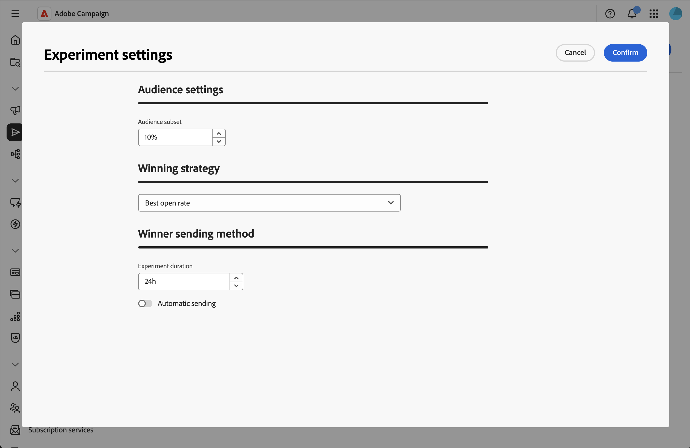
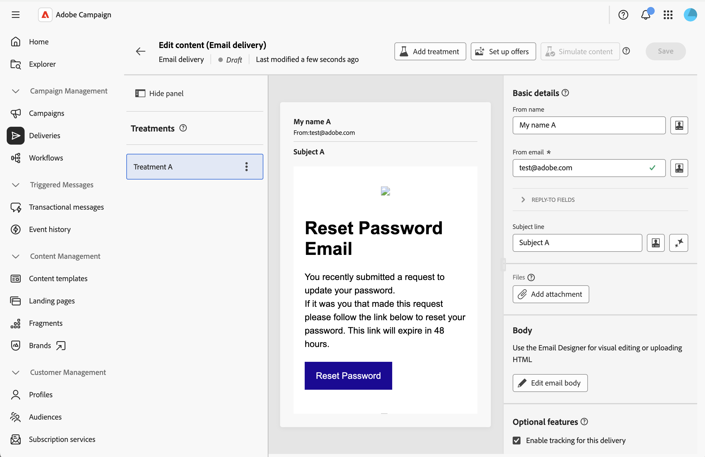
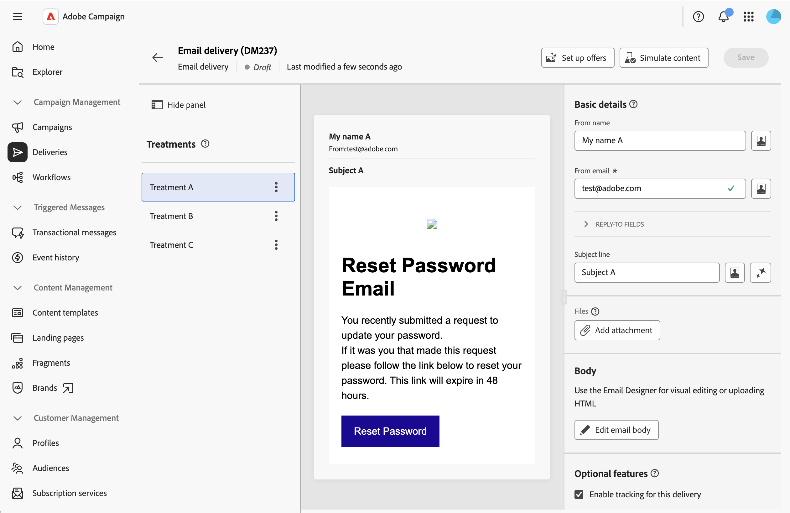
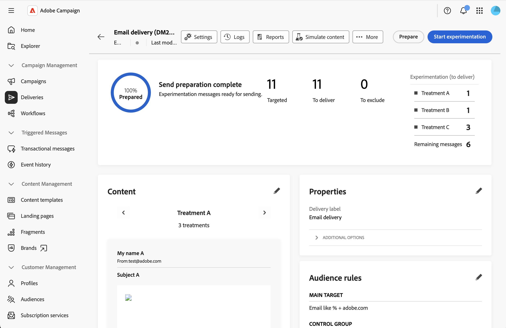

# 建立內容實驗 {#content-experiment}

>[!CONTEXTUALHELP]
>id="acw_homepage_welcome_rn4"
>title="內容實驗 - A/B 測試"
>abstract="您現在可以定義多個傳遞變化版本，測試哪個版本的績效最佳。變更電子郵件元素的內容、主旨或寄件者，決定最佳結果。"
>additional-url="https://experienceleague.adobe.com/docs/campaign-web/v8/release-notes/release-notes.html?lang=zh-hant" text="請參閱發行說明"

## 關於內容實驗 {#about-content-experiment}

Adobe Campaign網站中的內容實驗可讓您定義多個A/B測試傳送變體，以測量哪些變體最適合您的目標對象。 您可以變更傳遞內容、主旨或寄件者，以測試不同版本並判斷哪個變體產生最佳結果。

您可以對各種電子郵件元素執行A/B測試，例如：

* **主旨列**：測試不同的電子郵件主旨列，以檢視哪一行產生最高的開啟率
* **寄件者名稱**：實驗不同的寄件者組合
* **電子郵件內文內容**：建立多個內容版本，以識別哪些磁碟機具有最佳的點進率

>[!NOTE]
>
>* 內容實驗目前僅適用於電子郵件頻道。
>* 異動訊息不支援A/B測試。
>* 每個實驗最多3個處理（變體）。

## 建立內容實驗 {#create-content-experiment}

若要將內容實驗新增至您的電子郵件傳送，請遵循下列步驟：

1. 建立電子郵件傳遞或開啟現有的草稿傳遞。 [瞭解如何建立電子郵件](create-email.md)

1. 從電子郵件傳遞屬性頁面，按一下位於&#x200B;**[!UICONTROL 內容]**&#x200B;區段中的&#x200B;**[!UICONTROL 建立實驗]**&#x200B;按鈕。

   ![在電子郵件屬性中顯示[建立實驗]按鈕的熒幕擷圖](assets/ab-testing-1.png){zoomable="yes"}

## 設定實驗設定 {#configure-experiment}

使用下列章節設定您的實驗：

{zoomable="yes"}

### 對象設定 {#audience-settings}

定義將接收實驗變體的目標母體百分比。

輸入值以設定對象規模。 這代表在測試階段將接收其中一個實驗變體的收件者比例。

* **最小**： 1%
* **最大值**： 100%
* **預設**： 10%

一旦實驗結束後，其他對象（預設為90%）將收到成功變體。

例如，如果目標對象為10,000位收件者以及對象人數為10%，則會隨機選取1,000位收件者參與實驗。 實驗結束後，其餘9,000位收件者將收到成功變體。

### 成功策略 {#winning-strategy}

選取將用於決定成功變體的量度：

* **[!UICONTROL 最佳開啟率]** （預設）：電子郵件開啟百分比最高的變體獲勝
* **[!UICONTROL 最佳點進率]**：電子郵件中點按百分比最高的變體會獲勝
* **[!UICONTROL 最弱的取消訂閱率]**：取消訂閱百分比最低的變體會獲勝

系統在實驗期間自動追蹤這些量度，並根據您選取的條件計算哪個變體表現最佳。

### 獲勝者傳送方法 {#sending-method}

定義實驗應執行多久並選取傳送方法：

1. 輸入持續時間值（小時）。 實驗將在確定成功變體之前執行此期間。

   * **最少**： 3小時
   * **上限**： 240小時（10天）
   * **預設**： 24小時

   >[!NOTE]
   >
   >確保您的實驗持續時間足以收集有意義的資料。 持續時間短可能無法提供足夠的統計顯著性，尤其是對於點進率等可能需要更長時間才能累積的量度。

1. 選擇將成功變體傳送至剩餘母體的方式：

   * **[!UICONTROL 自動傳送]**&#x200B;已啟用：實驗結束後，系統會自動將成功變體傳送給剩餘的對象。
   * **[!UICONTROL 自動傳送]**&#x200B;已停用：檢閱實驗結果後，您必須手動按一下&#x200B;**[!UICONTROL 傳送]**&#x200B;按鈕以傳送成功變體。

如果到實驗結束時，沒有變體取得比其他變體明顯更好的結果，則系統會將第一個變體傳送至剩餘母體。 請參閱本[章節](#send-deliveries)。

## 定義內容處理 {#define-content}

儲存實驗設定後，系統會依預設建立第一個處理。 您現在需要新增其他處理（最多三個）並定義其特定內容。

1. 在傳遞屬性中，按一下&#x200B;**[!UICONTROL 編輯內容]**。 處理方式會顯示在左側。

   {zoomable="yes"}

1. 按一下&#x200B;**[!UICONTROL 新增處理]**&#x200B;按鈕並定義其名稱。 針對您需要新增的所有處理重複此作業。 然後，您可以變更其名稱、複製及移除它們。

1. 按一下每個處理方式並自訂以下專案：

   * **寄件者名稱**：自訂電子郵件的寄件者
   * **主旨列**：為每個處理撰寫唯一的主旨列
   * **電子郵件內文**：使用電子郵件Designer設計不同的內容版本

   {zoomable="yes"}

1. 按一下處理，然後按一下&#x200B;**[!UICONTROL 模擬內容]**，預覽每個處理。

## 開始實驗並監視結果 {#validate-start}

定義所有內容處理方式後，您就可以驗證並開始實驗。

1. 從傳遞內容中，按一下&#x200B;**[!UICONTROL 檢閱並傳送]**，然後按一下&#x200B;**[!UICONTROL 準備]**。

1. 然後按一下&#x200B;**[!UICONTROL 開始實驗]**&#x200B;以開始A/B測試。

   {zoomable="yes"}

1. 實驗執行後，請監視傳送控制面板中顯示的不同量度。

當實驗執行時，您可以按一下&#x200B;**[!UICONTROL 停止傳送]**&#x200B;以結束實驗。 您也可以按一下&#x200B;**[!UICONTROL 選取並傳送給獲勝者]**，決定在實驗結束前手動傳送。

>[!NOTE]
>
>收件者與您的電子郵件互動時，結果會近乎即時更新。 然而，早期結果可能沒有統計意義 — 建議等到實驗期間完成再做出最終決定。

## 傳送傳遞 {#send-deliveries}

根據您在&#x200B;**[!UICONTROL 獲勝者傳送方法]**&#x200B;設定中選擇的內容，可自動或手動執行傳送。 請參閱本[章節](#sending-method)。

### 自動傳送 {#automatic-sending}

對於自動傳送，系統會根據您的成功策略分析結果，並決定成功處理。 成功處理會自動傳送給剩餘的對象。 如果沒有明確的獲勝者出現，則選擇第一個變體。

### 手動傳送 {#manual-sending}

如果您已設定手動傳送，請在實驗結束時檢閱結果，然後按一下&#x200B;**[!UICONTROL 傳送]**&#x200B;以傳送成功處理。 如果沒有明確的獲勝者出現，預設會選取第一個處理方式，但您可以選擇不同的處理方式。

## 檢視最終結果 {#final-results}

在您的實驗完成並完全傳送傳遞後，您可以存取全面的報告：

1. 從傳遞儀表板，按一下&#x200B;**[!UICONTROL 報表]**。

1. 瀏覽至&#x200B;**[!UICONTROL 實驗]**&#x200B;報告標籤，以顯示每個處理的關鍵績效量度。

## 最佳實務 {#best-practices}

建立內容實驗時，請考慮下列建議：

* **一次測試一個元素**：為了取得最明確的結果，請測試單一元素的變異（例如，僅限主旨行或僅限內容），而不是同時測試多個元素。

* **選擇適當的持續時間**：留出足夠的時間進行統計顯著性：
   * 對於開放率測試：12-24小時通常就足夠了
   * 點進率測試：可能需要24到48小時或更長時間
   * 較大的對象可能需要較短的時間；較小的對象可能需要較長的時間

* **適當調整您的對象大小**：
   * 確保您的實驗對象（分配給測試的百分比）足夠大，足以產生有意義的結果
   * 一般指引：每個治療至少1,000位收件者，以獲得可靠結果

* **定期測試，但不要過度測試**：進行重要行銷活動的實驗，但避免測試每個傳送，將資源集中在具影響力的決定上。

* **記錄您的學習**：保留實驗結果的記錄，以利未來行銷活動策略時使用。

## 相關主題 {#related-topics}

* [建立您的第一個電子郵件](create-email.md)
* [設定電子郵件內容](edit-content.md)
* [預覽和傳送電子郵件](../monitor/prepare-send.md)
* [以電子郵件傳送報告](../reporting/email-report.md)
