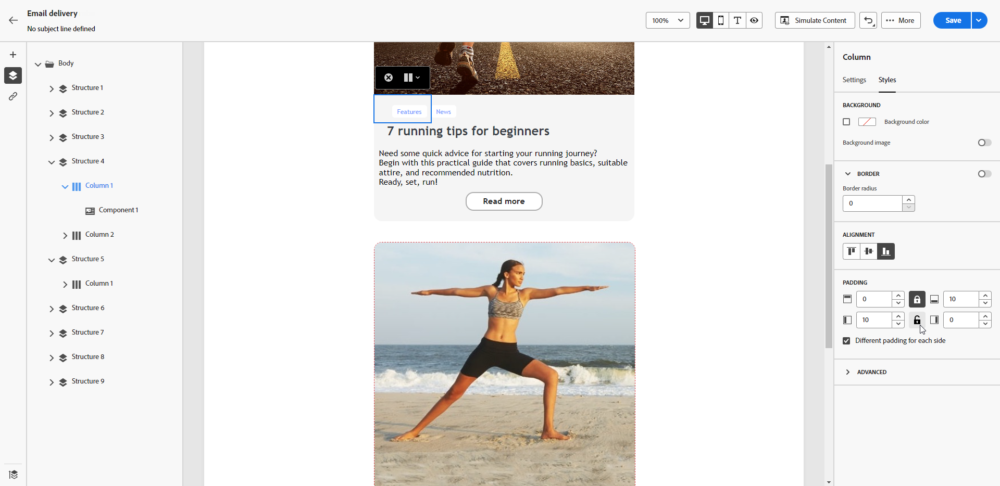

# 調整垂直對齊方式和邊框間距 {#alignment-and-padding}

在此範例中，調整由三欄組成的結構元件內的邊框間距和垂直對齊方式。

1. 直接在電子郵件中選取結構元件，或使用左側窗格中可用的&#x200B;**[!UICONTROL 導覽樹狀結構]**。

   {zoomable="yes"}

1. 從內容工具列，按一下&#x200B;**[!UICONTROL 選取資料行]**，然後選擇您要編輯的資料行。 您也可以從左側的結構樹選取欄。

   {zoomable="yes"}

1. 所選欄的可編輯引數會顯示在&#x200B;**[!UICONTROL 樣式]**&#x200B;索引標籤中。 使用專屬區段調整&#x200B;**[!UICONTROL 對齊方式]**。

   ![熒幕擷圖顯示[樣式]索引標籤中的對齊調整選項](assets/alignment_3.png){zoomable="yes"}

   例如，選取「**[!UICONTROL 底部]**」。內容元件會移至欄的底部。

1. 在&#x200B;**[!UICONTROL 邊框間距]**&#x200B;下，定義欄內的上邊框間距，並為該欄設定左和右邊框間距。

   >[!NOTE]
   >
   >按一下鎖定圖示，中斷頂端與底部或左側與右側內距之間的同步化。

   {zoomable="yes"}

1. 以相同方式調整其他欄的對齊與邊框間距。

1. 儲存變更。