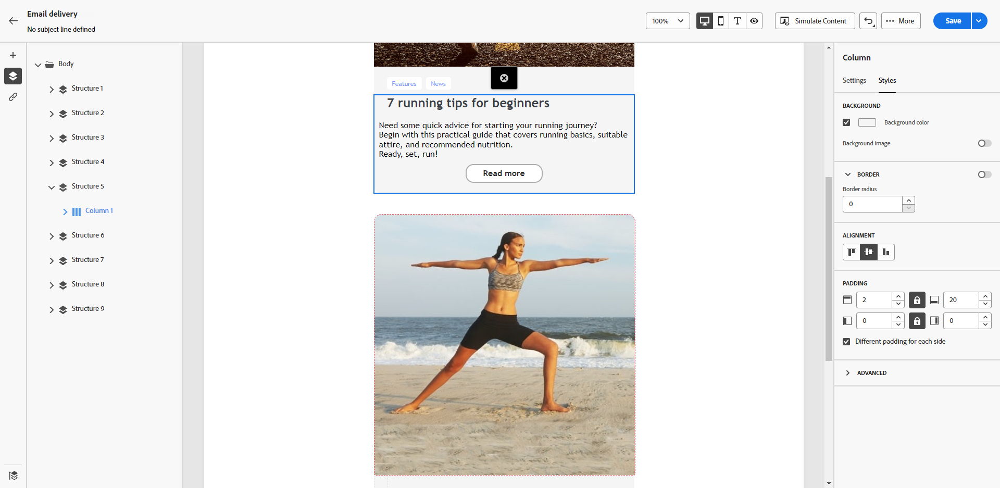

# 個人化您的電子郵件背景 {#backgrounds}

>[!CONTEXTUALHELP]
>id="ac_edition_backgroundimage"
>title="背景設定"
>abstract="您可以將內容的背景顏色或背景影像個人化。請注意，並非所有的電子郵件用戶端都支援背景影像。"

在使用電子郵件設計工具設定背景時，Adobe 建議以下做法：

1. 為您的電子郵件內文套用背景顏色 (如果您的設計需要)。
1. 通常，在欄層級設定背景顏色。
1. 盡量不要在影像或文字元件上使用背景顏色，因為難以管理。

以下是您可以使用的可用背景設定。

* 設定整個電子郵件的&#x200B;**[!UICONTROL 背景顏色]**。確保在左窗格的導覽樹狀目錄中選取內文設定。

  

* 選取「**[!UICONTROL 檢視區背景顏色]**」為所有結構元件設定相同的背景顏色。此選項可讓您從背景顏色中選取不同的設定。

  

* 為每個結構元件設定不同的背景顏色。在左窗格的導覽樹狀目錄中選取結構，以僅將特定背景顏色套用到該結構。

  

  >[!NOTE]
  >
  >確保您沒有設定檢視區的背景顏色，因為它可能會隱藏結構背景顏色。

* 為結構元件的內容設定&#x200B;**[!UICONTROL 背景影像]**。

  

  >[!NOTE]
  >
  >某些電子郵件程式不支援背景影像。如果不支援，則改用列背景顏色。確保選取合適的後備背景顏色，以防影像無法顯示。

* 在欄層級設定背景顏色。

  

  >[!NOTE]
  >
  >這是最常見的使用案例。Adobe 建議在欄層級設定背景顏色，因為這樣可以在編輯整個電子郵件內容時具有更大的彈性。

  您也可以在欄層級設定背景影像，但這很少使用。
