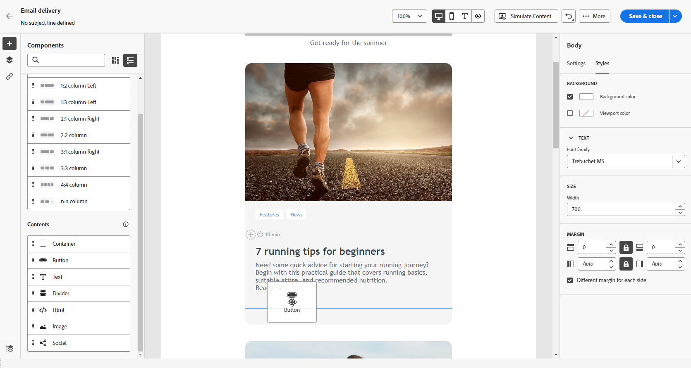
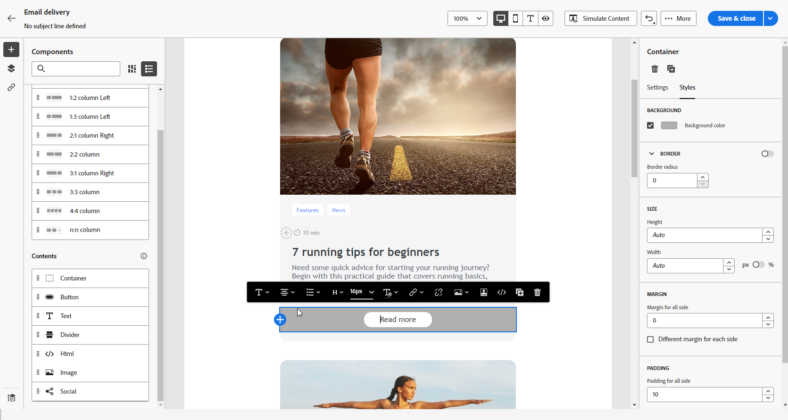
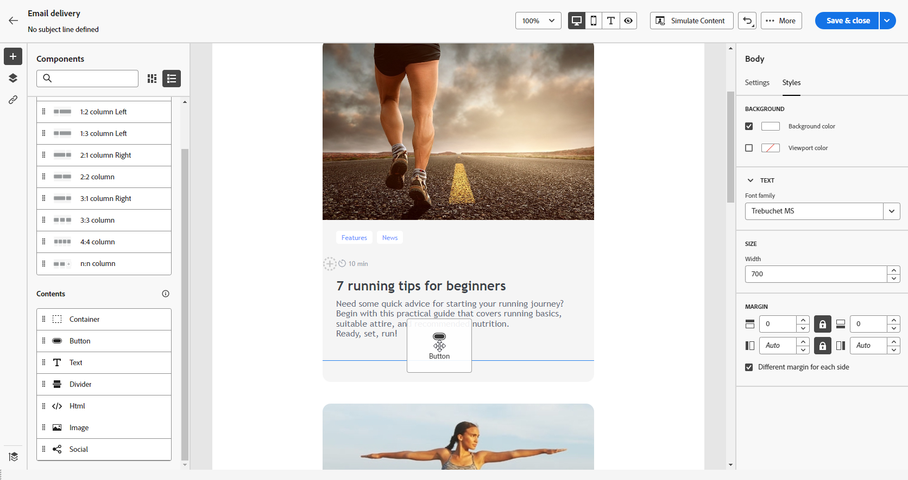
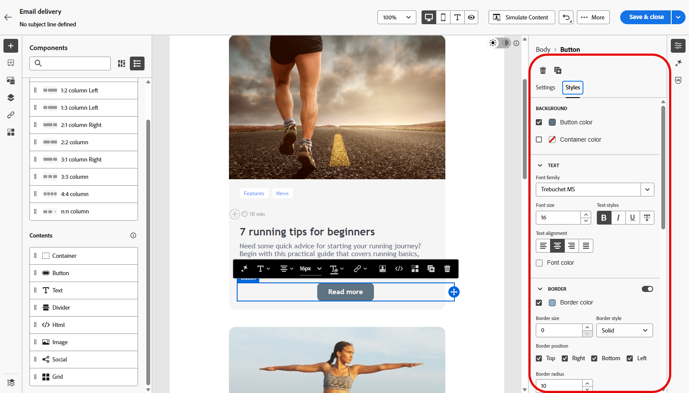
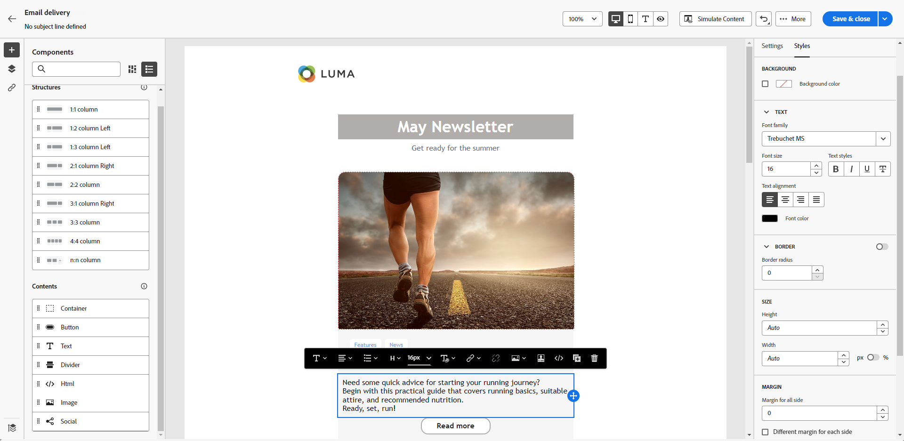
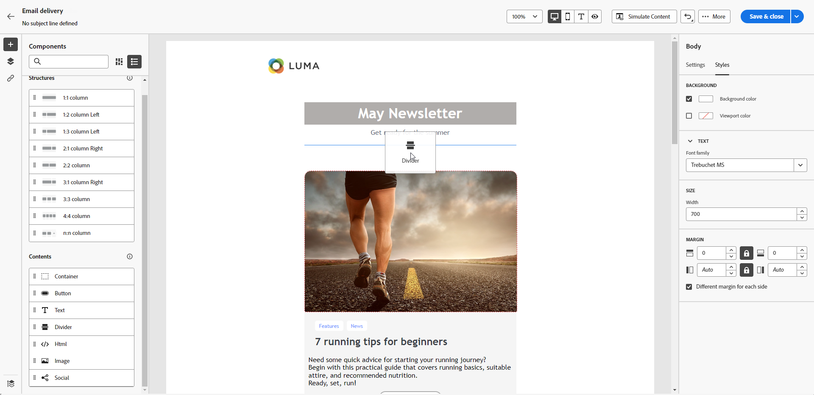
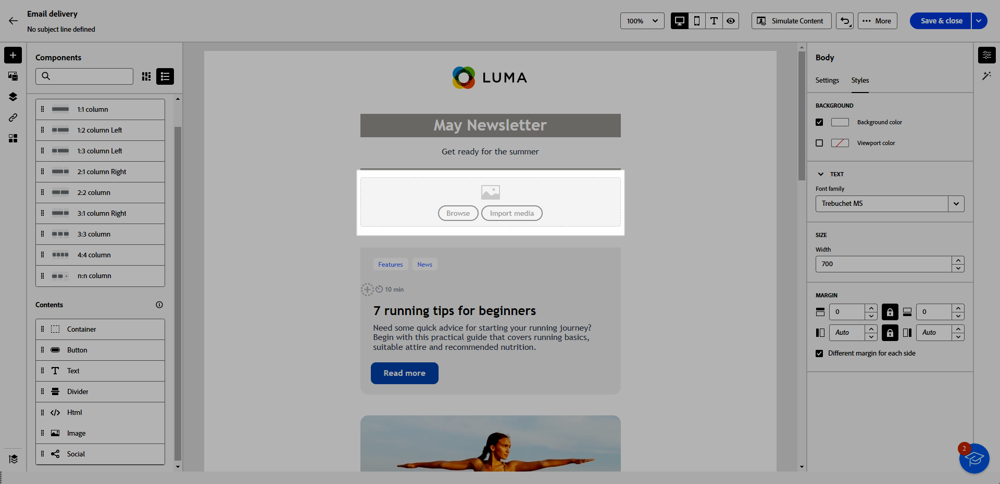
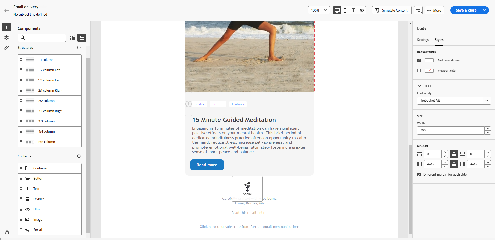
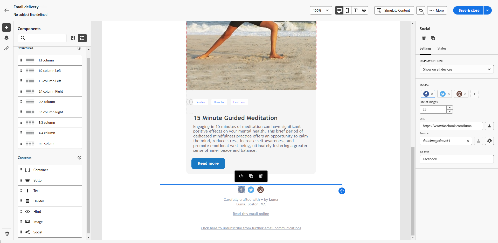

# 使用內容元件 {#content-components}

>[!CONTEXTUALHELP]
>id="ac_content_components_email"
>title="關於內容"
>abstract="內容元件是可用於建立電子郵件版面的空白內容預留位置。"

>[!CONTEXTUALHELP]
>id="ac_content_components_landing_page"
>title="關於內容"
>abstract="內容元件是可以用來建立登陸頁面版面的空白內容預留位置。"

>[!CONTEXTUALHELP]
>id="ac_content_components_fragment"
>title="關於內容"
>abstract="內容元件指可用於建立內容片段版面的空白內容預留位置。"

>[!CONTEXTUALHELP]
>id="ac_content_components_template"
>title="關於內容"
>abstract="內容元件指可用於建立範本版面的空白內容預留位置。"

建立電子郵件內容時，**[!UICONTROL 內容]**&#x200B;元件可讓您使用原始的空白元件來個人化電子郵件，這些元件一旦放入電子郵件中即可使用。

您可以視需要在&#x200B;**[!UICONTROL 結構]**&#x200B;中新增最多&#x200B;**[!UICONTROL 內容]**，這會定義您電子郵件的配置。

## 新增內容元件 {#add-content-components}

若要將內容元件新增到電子郵件並根據您的需要進行調整，請依照以下步驟進行。

1. 在電子郵件Designer中，使用[現有內容](existing-content.md)或將&#x200B;**[!UICONTROL 結構]**&#x200B;拖放至您的空白內容中，以定義電子郵件的配置。 [了解做法](create-email-content.md)

1. 將您選擇的&#x200B;**[!UICONTROL 內容]**&#x200B;拖放到相關結構內。

   {zoomable="yes"}

   >[!NOTE]
   >
   >您可以將數個元件新增至單一結構以及結構的每個欄中。

1. 使用內容&#x200B;**[!UICONTROL 設定]**&#x200B;索引標籤調整每個元件的選項。 例如，選擇僅在桌上型電腦或行動裝置上顯示，或兩者同時顯示。 您也可以從此標籤管理連結選項。 [進一步瞭解管理連結](message-tracking.md)

1. 使用&#x200B;**[!UICONTROL 樣式]**&#x200B;索引標籤調整每個元件的樣式屬性。 例如，變更每個元件的文字樣式、邊框間距或邊界。 [了解對齊方式和邊框間距的詳細資訊](alignment-and-padding.md)

   {zoomable="yes"}

1. 從右窗格上&#x200B;**[!UICONTROL Content]**&#x200B;的進階功能表，視需要刪除或複製任何內容元件。

## 容器 {#container}

您可以新增一個簡單容器，在其中新增另一個內容元件。這可讓您將特定樣式套用至容器，這與容器內使用的元件不同。

例如，新增&#x200B;**[!UICONTROL 容器]**&#x200B;元件，然後在該容器內部新增[按鈕](#button)元件。為容器使用特定背景，為按鈕使用另一個背景。

{zoomable="yes"}

## 按鈕 {#buttons}

使用&#x200B;**[!UICONTROL 按鈕]**&#x200B;元件將一個或多個按鈕插入您的電子郵件，並將您的電子郵件客群重新導向到另一個頁面。

1. 從&#x200B;**[!UICONTROL 內容]**&#x200B;清單，將&#x200B;**[!UICONTROL 按鈕]**&#x200B;元件拖放到&#x200B;**[!UICONTROL 結構]**&#x200B;元件中。

   {zoomable="yes"}

1. 按一下您新新增的按鈕以個人化文字，並存取&#x200B;**[!UICONTROL 設定]**&#x200B;和&#x200B;**[!UICONTROL 樣式]**&#x200B;索引標籤。

   {zoomable="yes"}

1. 從&#x200B;**[!UICONTROL 設定]**&#x200B;索引標籤，在&#x200B;**[!UICONTROL URL]**&#x200B;欄位中，新增當按一下按鈕時重新導向到的URL。

1. 使用&#x200B;**[!UICONTROL Target]**&#x200B;下拉式清單選擇內容的顯示方式：

   * **[!UICONTROL 無]**：當框架被點按時在相同框架中開啟連結 (預設)。
   * **[!UICONTROL 空白]**：在新的視窗或索引標籤中開啟連結。
   * **[!UICONTROL 自我]**：當框架被點按時在相同框架中開啟連結。
   * **[!UICONTROL 父系]**：在父框架中開啟連結。
   * **[!UICONTROL 頂端]**：在視窗的完整內文中開啟連結。

   {zoomable="yes"}

1. 從&#x200B;**[!UICONTROL 樣式]**&#x200B;索引標籤變更樣式屬性，例如&#x200B;**[!UICONTROL Border]**、**[!UICONTROL Size]**、**[!UICONTROL Margin]**&#x200B;和其他等，以進一步個人化您的按鈕。

## 文字 {#text}

使用&#x200B;**[!UICONTROL Text]**&#x200B;元件將文字插入您的電子郵件，並使用&#x200B;**[!UICONTROL 設定]**&#x200B;和&#x200B;**[!UICONTROL 樣式]**&#x200B;索引標籤調整樣式（邊框、大小、邊框間距等）。

1. 從&#x200B;**[!UICONTROL 內容]**&#x200B;功能表，將&#x200B;**[!UICONTROL 文字]**&#x200B;拖放到&#x200B;**[!UICONTROL 結構]**&#x200B;元件中。

   {zoomable="yes"}

1. 按一下您新新增的元件，以個人化文字並存取&#x200B;**[!UICONTROL 設定]**&#x200B;和&#x200B;**[!UICONTROL 樣式]**&#x200B;索引標籤。

1. 使用內容工具列中的下列選項變更文字：

   {zoomable="yes"}

   * **[!UICONTROL 變更文字樣式]**：將粗體、斜體、底線或刪除線套用至您的文字。
   * **變更對齊方式**：選擇文字的靠左、靠右、置中或左右對齊。
   * **[!UICONTROL 建立清單]**：新增專案符號或數字清單至您的文字。
   * **[!UICONTROL 設定標題]**：為文字新增標題，最多六層。
   * **字型大小**：選取文字的字型大小 (以像素為單位)。
   * **[!UICONTROL 編輯影像]**：將影像或資產新增到文字元件。
   * **[!UICONTROL 顯示原始碼]**：顯示文字的原始碼。原始碼無法變更。
   * **[!UICONTROL 複製]**：新增文字元件的副本。
   * **[!UICONTROL 刪除]**：從電子郵件刪除選取的文字元件。
   * **[!UICONTROL 新增個人化]**：新增個人化欄位以從輪廓資料自訂內容。
   * **[!UICONTROL 啟用條件式內容]**：新增條件式內容，以將元件的內容調整至目標設定檔。

1. 從&#x200B;**[!UICONTROL 樣式]**&#x200B;索引標籤調整其他樣式屬性，例如文字顏色、字型系列、邊框、邊框間距、邊界等。

   {zoomable="yes"}

## 分隔線 {#divider}

使用&#x200B;**[!UICONTROL 分隔線]**&#x200B;元件以插入分隔線來組織電子郵件的版面和內容。

您可以從&#x200B;**[!UICONTROL 樣式]**&#x200B;索引標籤調整樣式屬性，例如線條顏色、樣式和高度。

{zoomable="yes"}

## HTML {#HTML}

使用&#x200B;**[!UICONTROL HTML]**&#x200B;元件來複製和貼上現有HTML的一部分。 這可讓您建立免費的模組化HTML元件，以重複使用外部內容。

1. 從&#x200B;**[!UICONTROL 元件]**，將 **[!UICONTROL HTML]** 元件拖放到&#x200B;**[!UICONTROL 結構]**&#x200B;元件中。

   {zoomable="yes"}

1. 按一下您新增的元件，然後選取「**[!UICONTROL 顯示原始碼]**」從內容關聯式工具列新增至 HTML。

   {zoomable="yes"}

>[!NOTE]
>
>若要讓外部內容符合電子郵件Designer，Adobe建議[從草稿建立訊息](create-email-content.md)，並將現有電子郵件的內容複製到元件中。

## 影像 {#image}

>[!IMPORTANT]
>
>Assets功能表的存取權僅限具有有效Adobe Experience Manager as a Cloud Service授權的使用者使用。 如果您未擁有此授權，將無法使用「資產」選單。

使用&#x200B;**[!UICONTROL Image]**&#x200B;元件，將電腦中的影像檔案插入電子郵件中。

1. 從&#x200B;**[!UICONTROL Content]**&#x200B;功能表，將&#x200B;**[!UICONTROL Image]**&#x200B;拖放到&#x200B;**[!UICONTROL Structure]**&#x200B;元件中。

   {zoomable="yes"}

1. 按一下&#x200B;**[!UICONTROL 瀏覽]**，從您的資產中選擇影像檔案。 您也可以選擇&#x200B;**[!UICONTROL 匯入您的媒體]**。

   若要進一步瞭解如何在Adobe Experience Manager中上傳和新增資產，請參閱[Adobe Experience Manager as a Cloud Service檔案](https://experienceleague.adobe.com/docs/experience-manager-cloud-service/content/assets/manage/add-assets.html?lang=zh-Hant)。

   {zoomable="yes"}

1. 瀏覽資料夾以找出所需的特定資產，或使用搜尋列有效率地尋找資產。

   找到您要尋找的資產後，請按一下&#x200B;**[!UICONTROL 選取]**。

   {zoomable="yes"}

1. 按一下您新新增的元件，並使用&#x200B;**[!UICONTROL 設定]**&#x200B;索引標籤來設定影像屬性：

   * **[!UICONTROL 影像標題]**&#x200B;可讓您定義影像的標題。
   * **[!UICONTROL 替代文字]**&#x200B;可讓您定義連結到影像的註解。這對應於替代 HTML 屬性。

   ![顯示[電子郵件Designer]中影像元件之設定索引標籤的熒幕擷圖。](assets/email_designer_10.png){zoomable="yes"}

1. 新增連結，將您的對象重新導向至其他內容。 [了解更多](message-tracking.md)

1. 使用&#x200B;**[!UICONTROL 樣式]**&#x200B;索引標籤調整其他樣式屬性，例如邊界、邊框和其他樣式。

## 社交 {#social}

使用&#x200B;**[!UICONTROL 社交]**&#x200B;元件將社交媒體頁面連結插入到電子郵件內容中。

1. 從「**[!UICONTROL 元件]**」選單，將&#x200B;**[!UICONTROL 社交]**&#x200B;元件拖放到&#x200B;**[!UICONTROL 結構]**&#x200B;元件中。

1. 按一下您新增的元件。

1. 在「**[!UICONTROL 設定]**」索引標籤的「**[!UICONTROL 社交]**」欄位中，選擇要新增或移除的社交媒體。

   {zoomable="yes"}

1. 在「**[!UICONTROL 影像大小]**」欄位中，選擇圖示大小。

1. 按一下每個社交媒體的圖示以設定客群將被重新導向到的 **[!UICONTROL URL]**。

   {zoomable="yes"}

1. 視需要在&#x200B;**[!UICONTROL Source]**&#x200B;欄位中變更每個社群媒體的圖示。

1. 從&#x200B;**[!UICONTROL 樣式]**&#x200B;索引標籤調整其他樣式屬性，例如樣式、邊界、邊框等。