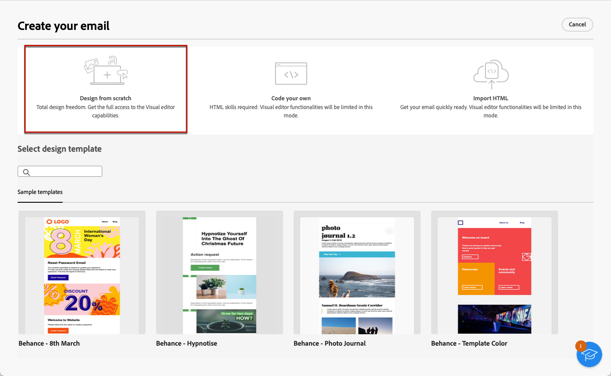

# 從頭開始您的電子郵件內容 {#create-email-content}

>[!CONTEXTUALHELP]
>id="ac_structure_components_email"
>title="新增結構"
>abstract="結構會定義電子郵件的版面。將&#x200B;**結構**&#x200B;元件拖放到畫布中開始設計您的電子郵件內容。"

>[!CONTEXTUALHELP]
>id="ac_structure_components_landing_page"
>title="新增結構"
>abstract="結構會定義登陸頁面的版面。將&#x200B;**結構**&#x200B;元件拖放到畫布中開始設計您的登陸頁面。"

>[!CONTEXTUALHELP]
>id="ac_structure_components_fragment"
>title="新增結構"
>abstract="結構會定義內容片段的版面。將&#x200B;**結構**&#x200B;元件拖放到畫布中開始設計您的片段內容。"

>[!CONTEXTUALHELP]
>id="ac_structure_components_template"
>title="新增結構"
>abstract="結構會定義範本的版面。將&#x200B;**結構**&#x200B;元件拖放到畫布中開始設計您的範本內容。"

>[!CONTEXTUALHELP]
>id="ac_edition_columns_email"
>title="定義電子郵件欄"
>abstract="電子郵件設計工具可讓您透過定義欄結構輕鬆定義電子郵件的版面。"

>[!CONTEXTUALHELP]
>id="ac_edition_columns_landing_page"
>title="定義登陸頁面欄"
>abstract="電子郵件設計工具可讓您透過定義欄結構輕鬆定義登陸頁面的版面。"

>[!CONTEXTUALHELP]
>id="ac_edition_columns_fragment"
>title="定義內容片段欄"
>abstract="電子郵件設計工具可讓您透過定義欄結構輕鬆定義內容片段的版面。"

>[!CONTEXTUALHELP]
>id="ac_edition_columns_template"
>title="定義範本欄"
>abstract="電子郵件設計工具可讓您透過定義欄結構輕鬆定義範本的版面。"

電子郵件設計工具可讓您輕鬆定義電子郵件的結構。透過使用簡單的拖放動作新增和移動結構元素，您可以在數秒內設計電子郵件的內文。

➡️ [在影片中探索此功能](#video)

若要開始建立您的電子郵件內容，請遵循下列步驟。

1. 從[電子郵件Designer](get-started-email-designer.md#start-authoring)首頁，選取&#x200B;**[!UICONTROL 從草稿開始設計]**&#x200B;選項。

   {zoomable="yes"}

1. 將&#x200B;**[!UICONTROL 結構]**&#x200B;拖放至畫布以定義電子郵件的配置，開始設計電子郵件內容。

   >[!NOTE]
   >
   >堆疊欄與所有電子郵件程式都不相容。不支援時，不會堆疊欄。

1. 視需要新增多個&#x200B;**[!UICONTROL 結構]**，並在右側的專用窗格中編輯其設定。

   {zoomable="yes"}

1. 選取&#x200B;**[!UICONTROL n:n資料行]**&#x200B;元件以定義您所選擇的資料行數目（介於3到10之間）。 移動每欄底部的箭頭，以定義每欄的寬度。

   >[!NOTE]
   >
   >每個欄的大小不能小於結構元件總寬度的 10%。如果欄不是空的，則無法移除。

1. 從&#x200B;**[!UICONTROL 元件]**&#x200B;區段，視需要拖放多個元素至一或多個結構。 [進一步了解內容元件](content-components.md)

1. 使用右側的&#x200B;**[!UICONTROL 設定]**&#x200B;或&#x200B;**[!UICONTROL 樣式]**&#x200B;標籤自訂每個元件。 例如，變更每個元件的文字樣式、邊框間距或邊界。 [了解對齊方式和邊框間距的詳細資訊](alignment-and-padding.md)

   {zoomable="yes"}

1. 插入個人化欄位，以根據設定檔資料自訂您的電子郵件內容。 [進一步了解內容個人化](../personalization/personalize.md)

1. 將連結新增至您的內容。

   從左窗格按一下&#x200B;**[!UICONTROL 連結]**&#x200B;索引標籤，以顯示您要追蹤之內容的所有URL。 修改其&#x200B;**[!UICONTROL 追蹤型別]**&#x200B;或&#x200B;**[!UICONTROL 標籤]**，並視需要新增&#x200B;**[!UICONTROL 類別]**。

[進一步瞭解連結和訊息追蹤](message-tracking.md)

   ![顯示[電子郵件Designer]中[連結]索引標籤的熒幕擷圖。](assets/email_designer-links.png){zoomable="yes"}

1. 如有需要，請按一下進階功能表中的&#x200B;**[!UICONTROL 切換至程式碼編輯器]**，以進一步個人化您的電子郵件。 這可讓您編輯電子郵件原始碼，例如新增追蹤或自訂HTML標籤。 [進一步了解程式碼編輯器](code-content.md)

   >[!CAUTION]
   >
   >切換到程式碼編輯器後，您無法恢復到此電子郵件的視覺化設計工具。

1. 當您的內容備就緒時，按一下「**[!UICONTROL 模擬內容]**」檢查您的電子郵件轉譯。選擇案頭或行動檢視。 [進一步了解如何預覽您的電子郵件](../preview-test/preview-test.md)

   {zoomable="yes"}

1. 您也可以驗證內容品質，以評估可讀性、CTA效益、主旨行品質等。 [進一步瞭解內容品質驗證](../content/brands-score.md#validate-quality)

1. 當您的電子郵件準備就緒時，按一下「**[!UICONTROL 儲存]**」。

## 操作說明影片 {#video}

了解如何導覽電子郵件設計工具。瞭解如何從草稿開始架構和設計電子郵件、個人化並測試您的電子郵件。

>[!VIDEO](https://video.tv.adobe.com/v/3425867/?quality=12)