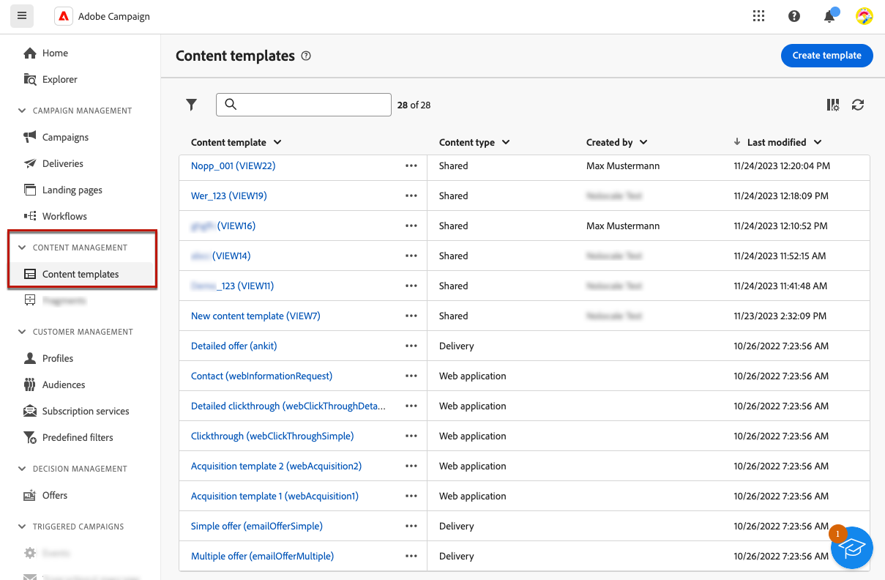
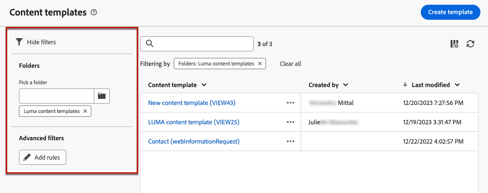
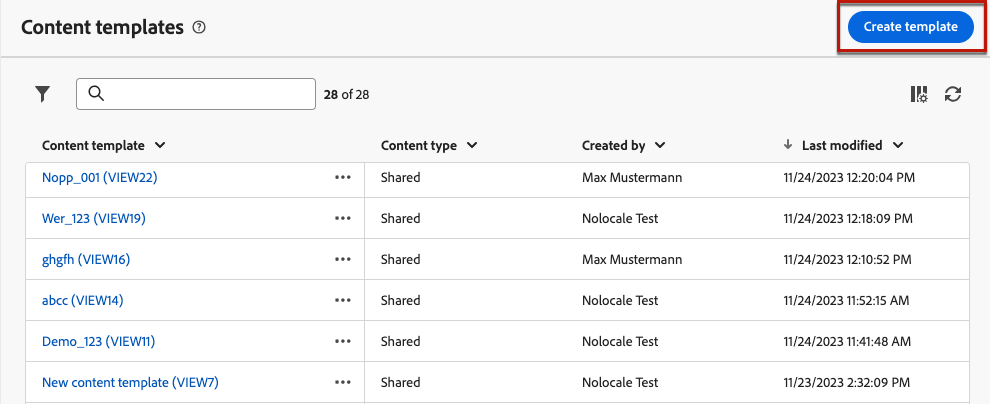
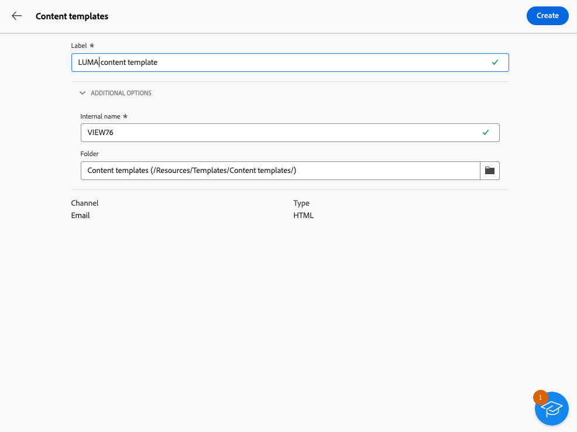
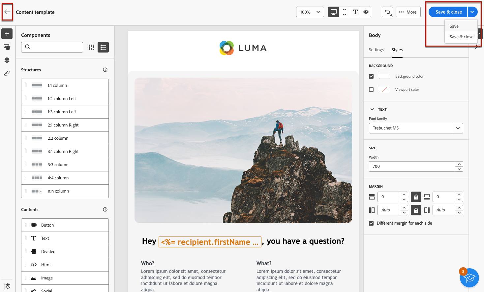
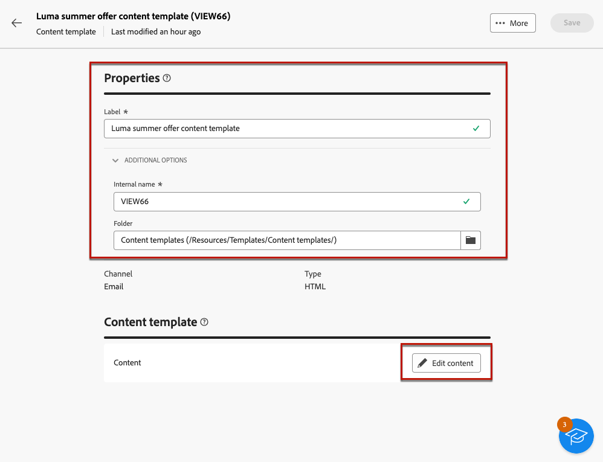
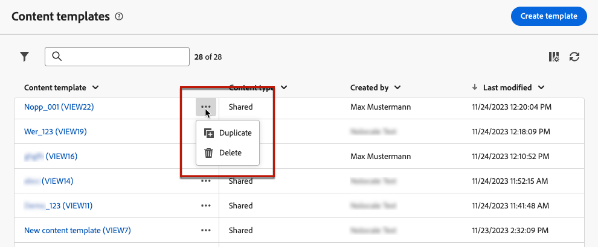

# 使用內容範本 {#content-templates}

>[!CONTEXTUALHELP]
>id="acw_contenttemplate_menu"
>title="內容範本"
>abstract="為了加速及改善設計流程，您可以建立獨立的電子郵件範本，以輕鬆地在Adobe Campaign中重複使用自訂內容。 這些內容範本可根據內建或自訂範本、從現有內容建立或在內容範本編輯器中匯入，從頭開始設計。"

為了加快和改進設計流程，您可以建立獨立的範本，以輕鬆地重複使用中的自訂內容 [!DNL Adobe Campaign]. 這些內容範本可根據內建或自訂範本、從現有內容建立或在內容範本編輯器中匯入，從頭開始設計。

此功能可讓內容導向的使用者使用獨立的範本，以便行銷使用者可以重複使用並在其自己的電子郵件行銷活動中調整它們。

>[!NOTE]
>
>目前僅適用 **電子郵件** 支援內容範本。

## 存取內容範本 {#access-templates}

>[!CONTEXTUALHELP]
>id="acw_contenttemplate_edition"
>title="編輯您的範本內容"
>abstract="按一下「**編輯內容**」按鈕可使用電子郵件設計工具更新您的內容。"

若要存取內容範本清單，請瀏覽至 **[!UICONTROL 內容管理]** > **[!UICONTROL 內容範本]** 功能表。

{zoomable=&quot;yes&quot;}

此儀表板會將所有可用的內容範本顯示為清單。 您可以篩選特定 [資料夾](../get-started/permissions.md#folders) 使用下拉式清單，或使用新增規則 [查詢模型工具](../query/query-modeler-overview.md).

{zoomable=&quot;yes&quot;}

您可以從清單中編輯、複製或刪除現有的內容範本。 使用上半區段的按鈕來建立內容範本。

## 建立內容範本 {#create-content-templates}

>[!CONTEXTUALHELP]
>id="acw_contenttemplate_design"
>title="內容範本設計"
>abstract="內容範本設計"

>[!CONTEXTUALHELP]
>id="acw_contenttemplate_selection"
>title="內容範本選擇"
>abstract="內容範本選擇"

內容範本可由以下人員建立： [將現有電子郵件儲存為範本](#save-as-template)，或從電子郵件範本清單中，透過 **建立內容範本** 按鈕， [如下所述](#create-template-from-scratch).

儲存後，您現在便可在建立任何範本時使用此範本 [電子郵件](../email/create-email.md) 範圍 [!DNL Adobe Campaign]. [了解做法](use-email-templates.md)

>[!NOTE]
>
>* 對內容範本所做的變更不會傳播至電子郵件。
>
>* 同樣地，在電子郵件中使用範本時，您對電子郵件內容所做的任何編輯都不會影響先前使用的內容範本。

### 建立新的內容範本 {#create-template-from-scratch}

>[!CONTEXTUALHELP]
>id="acw_contenttemplate_properties"
>title="定義您的範本屬性"
>abstract="需要時可輕鬆定義要擷取的電子郵件內容範本屬性。"

若要從內容範本控制面板建立新的內容範本，請執行下列步驟：

1. 瀏覽至內容範本清單，從 **[!UICONTROL 內容管理]** > **[!UICONTROL 內容範本]** 左側欄。

1. 選取 **[!UICONTROL 建立範本]**.

   {zoomable=&quot;yes&quot;}

1. 輸入範本標籤和屬性。 您可以選取要儲存範本的資料夾。 依預設，內容範本儲存在Adobe Campaign階層的專用資料夾中： **[!UICONTROL 瀏覽器]** > **[!UICONTROL 資源]** > **[!UICONTROL 範本]** > **[!UICONTROL 內容範本]**. 進一步瞭解中的資料夾 [此頁面](../get-started/permissions.md#folders)

   {zoomable=&quot;yes&quot;}

1. 按一下 **[!UICONTROL 建立]** 並從不同選項中選擇要如何設計範本：

   * [從頭開始設計內容](create-email-content.md) 透過電子郵件設計工具的介面。

   * [程式碼或複製貼上原始HTML](code-content.md) 直接放入電子郵件設計工具。

   * [匯入現有的HTML內容](existing-content.md) 檔案或.zip資料夾中的檔案。

   * 使用內建或自訂範本清單中的現有內容。 在電子郵件中使用內容範本的步驟已說明，請參閱 [本節](use-email-templates.md).

   {zoomable=&quot;yes&quot;}

1. 電子郵件設計工具隨即顯示。 視需要編輯您的內容，就像根據您選取的選項對任何電子郵件所做的那樣。 瞭解如何在中使用電子郵件設計工具 [本節](get-started-email-designer.md).

   <!--You can test your content if needed. [Learn how](#test-template)-->

1. 範本準備就緒後，按一下 **[!UICONTROL 儲存]**.

   如有需要，請按一下範本名稱旁的箭頭，以返回 **[!UICONTROL 詳細資料]** 畫面並編輯您的範本。

   {zoomable=&quot;yes&quot;}

範本可在 **[!UICONTROL 內容範本]** 清單。 [了解更多](#access-templates)

您現在可以使用此範本建立新內容：此範本位於 **[!UICONTROL 已儲存的範本]** 電子郵件設計工具的索引標籤。 [了解做法](use-email-templates.md)

### 將電子郵件內容另存為範本 {#save-as-template}

一旦您 [設計電子郵件](create-email-content.md)，您可以將此內容儲存為範本以供日後重複使用。 儲存的範本可供 Adobe Campaign 環境的所有使用者使用。

若要將電子郵件內容另存為範本，請依照以下步驟操作：

1. 在電子郵件設計工具中，按一下 **[!UICONTROL 更多]** 按鈕。

1. 選取 **[!UICONTROL 另存為內容範本]** （從下拉式功能表）。

   {zoomable=&quot;yes&quot;}

1. 輸入此範本的名稱，然後儲存。

   {zoomable=&quot;yes&quot;}

範本會儲存並顯示在 **[!UICONTROL 內容範本]** 清單。 它會變成獨立的內容範本，可以像該清單上的任何其他專案一樣加以存取、編輯及刪除。 [了解更多](#access-manage-templates)

您現在可以使用此範本建立新內容：此範本位於 **[!UICONTROL 已儲存的範本]** 電子郵件設計工具的索引標籤。 [了解做法](use-email-templates.md)

{zoomable=&quot;yes&quot;}

>[!NOTE]
>
>對該新範本所做的任何變更都不會傳播到該範本來自的電子郵件。 同樣地，在該電子郵件中編輯原始內容時，不會修改新範本。

<!--

Test your content template {#test-template}

You can test the rendering of any email content template, whether created from scratch or from an email. To do so, follow the steps below.

1. Access the content template list.

1. Click **[!UICONTROL Edit content]** from the **[!UICONTROL Template properties]**.

1. Click **[!UICONTROL Simulate Content]** and select a test profile to check your email rendering. You can choose the desktop or mobile view.

1. You can send a proof to test your content and have it approved by some internal users before using it. To do so, click the **[!UICONTROL Send proof]** button and follow the steps described in .

-->

## 修改內容範本 {#modify-delete}

若要更新現有的內容範本，請遵循下列步驟：

1. 從內容範本清單中，按一下要修改的範本標籤以進行編輯。

1. 按一下 **[!UICONTROL 編輯內容]** 按鈕以使用更新您的內容 [電子郵件設計工具](get-started-email-designer.md).

{zoomable=&quot;yes&quot;}

>[!NOTE]
>
>使用此內容範本時，對內容範本所做的變更不會傳播至電子郵件。

## 刪除內容範本 {#content-delete}

刪除內容範本有兩個方法：

* 從內容範本清單中，按一下省略符號按鈕，然後選取 **刪除**

  

* 從內容範本本身，按一下 **更多** 按鈕，然後選取 **刪除**

>[!NOTE]
>
>刪除內容範本不會影響使用此範本建立的傳送。

## 複製內容範本 {#content-duplicate}

複製內容範本有兩個方法：

* 從內容範本清單中，按一下省略符號按鈕，然後選取 **複製**

* 從內容範本本身，按一下 **更多** 按鈕，然後選取 **複製**

在這兩種情況下，請確認複製以建立新的內容範本。 新內容範本的標籤為 **副本`<label of the initial campaign`**. 瀏覽至範本設定以更新此標籤。

