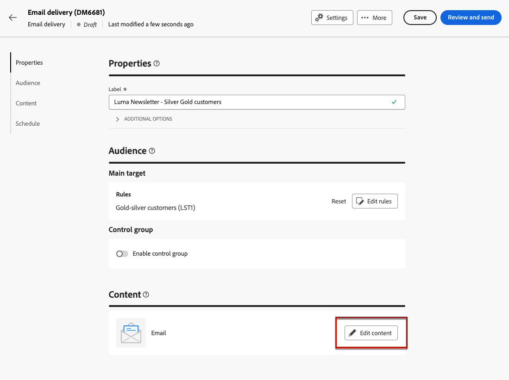
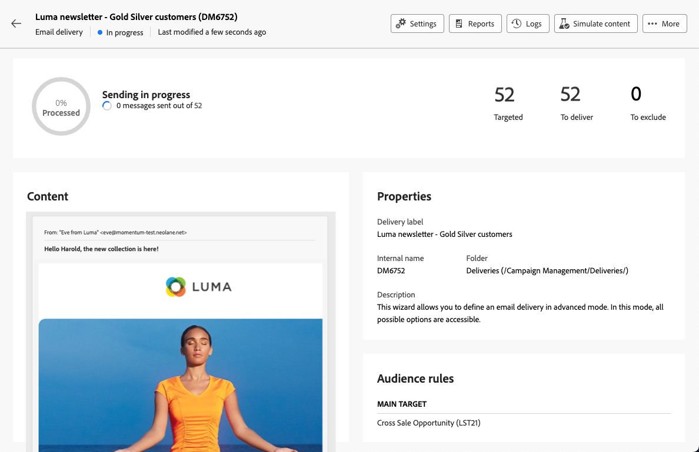

# 建立您的第一個電子郵件 {#first-email}

>[!CONTEXTUALHELP]
>id="acw_homepage_learning_card3"
>title="開始使用電子郵件"
>abstract="您可以建立獨立的電子郵件傳遞，或在行銷活動工作流程的環境中建立電子郵件。了解如何建立傳遞、選取客群以及設計電子郵件內容。"

了解如何建立您的第一個目標電子郵件。在此使用案例，您排程在特定日期傳送電子郵件給銀級和金級忠誠會員。

根據預先定義的[設計範本](../email/create-email-templates.md)，電子郵件也會根據客戶設定檔屬性提供個人化內容。

➡️[在影片中探索此功能](#video)

## 建立電子郵件傳遞 {#create-email}

>[!CONTEXTUALHELP]
>id="acw_deliveries_email_template_selection"
>title="選擇電子郵件範本"
>abstract="電子郵件範本是一種特定的傳遞設定，其中包含預先定義的設定，例如類型規則、個人化或路由參數。範本在 Campaign 用戶端主控台中定義。"

>[!CONTEXTUALHELP]
>id="acw_deliveries_email_properties"
>title="定義電子郵件屬性"
>abstract="這些屬性是常見的傳遞參數，可幫助您對傳遞進行命名和分類。附加設定是選擇性的。如果您的傳遞是根據 Adobe Campaign v8 主控台中定義的擴充結構描述，則可使用某些特定&#x200B;**自訂選項**&#x200B;欄位。"

您可以建立獨立的電子郵件傳遞，或在行銷活動工作流程的環境中建立電子郵件。以下步驟詳細說明獨立（一次性）電子郵件傳送的程式。 在[此頁面](../msg/gs-deliveries.md)中進一步瞭解Adobe Campaign的傳遞建立步驟。

若要建立新的獨立電子郵件傳送，請遵循下列步驟。

1. 瀏覽至左側邊欄上的&#x200B;**[!UICONTROL 傳遞]**&#x200B;功能表，然後按一下&#x200B;**[!UICONTROL 建立傳遞]**&#x200B;按鈕。

   

1. 選取&#x200B;**[!UICONTROL 電子郵件]**&#x200B;作為頻道，並從清單中選擇電子郵件傳遞範本。

   >[!NOTE]
   >
   >範本是預先設定的傳遞設定，儲存供未來使用。[了解更多](../msg/delivery-template.md)

   {zoomable="yes"}

1. 按一下「**[!UICONTROL 建立傳遞]**」按鈕以確認。
1. 輸入傳遞的標籤並根據您的需要設定其他選項：

   * **[!UICONTROL 內部名稱]**：指派唯一識別碼給傳遞。
   * **[!UICONTROL 資料夾]**：將傳遞儲存在特定資料夾中。
   * **[!UICONTROL 傳遞代碼]**：使用此欄位，根據您自己的命名慣例來組織您的傳遞。
   * **[!UICONTROL 描述]**：指定傳遞的描述。
   * **[!UICONTROL 性質]**：指定電子郵件的性質以進行分類。<!--The content of the list is defined in the delivery template selected when creating the email.-->

   >[!NOTE]
   >
   >如果您使用特定自訂欄位擴展結構描述，則可以在「**[!UICONTROL 自訂選項]**」區段存取它們。

   {zoomable="yes"}

1. 此外，進階設定（例如型別規則與目標對應）可透過熒幕右上角的&#x200B;**[!UICONTROL 設定]**&#x200B;按鈕存取。 這些設定已在選取的範本中預先設定，但可視需要為此特定電子郵件進行編輯。 [了解更多](../advanced-settings/delivery-settings.md)

## 定義客群 {#define-audience}

>[!CONTEXTUALHELP]
>id="acw_deliveries_email_audience"
>title="選取傳遞客群"
>abstract="為您的行銷訊息選取最佳客群。您可以選擇現有客群 (已在 Campaign v8 執行個體中定義或來自 Adobe Experience Platform)、使用查詢建模工具建立新客群，或上傳包含您客群的檔案。「**從檔案中選取**」選項未啟用控制組，反之亦然。"
>additional-url="https://experienceleague.adobe.com/docs/campaign-web/v8/audiences/target-audiences/add-audience.html?lang=zh-hant" text="選取主要客群"
>additional-url="https://experienceleague.adobe.com/docs/campaign-web/v8/audiences/target-audiences/control-group.html?lang=zh-hant" text="設定控制組"

在此使用案例中，您會傳送電子郵件給現有的對象。

有關如何使用客群的其他說明，請參閱[本章節](../audience/about-recipients.md)。

1. 若要選取電子郵件的客群，請按一下「**[!UICONTROL 選取客群]**」按鈕，然後從清單選擇一個現有客群。

   在此範例中，我們希望使用的現有客群，目標為銀級和金級忠誠積分層級的客戶。

   {zoomable="yes"}

   >[!NOTE]
   >
   >清單中可用的對象源自您的Campaign v8執行個體，或若已在您的執行個體上設定目的地/Source整合，則源自Adobe Experience Platform。 此整合可讓您將Experience Platform區段傳送至Adobe Campaign，並將Campaign傳送和追蹤記錄傳送至Adobe Experience Platform。 在[Campaign v8 （使用者端主控台）檔案](https://experienceleague.adobe.com/docs/campaign/campaign-v8/connect/ac-aep/ac-aep.html){target="_blank"}中瞭解如何使用Campaign和Adobe Experience Platform。

1. 選取客群後，您可以套用其他規則進一步調整目標。

   {zoomable="yes"}

1. 您也可以設定控制組來分析電子郵件收件者與非目標收件者相比的行為。[了解如何使用控制組](../audience/control-group.md)

## 定義電子郵件內容 {#create-content}

若要開始建立您的電子郵件內容，請遵循下列步驟。 在此使用案例中，您使用預先定義的電子郵件[傳遞範本](../msg/delivery-template.md)來設計您的電子郵件。<!--TBC delivery template or email content template?-->

<!--Detailed instructions on how to configure the email content are available in [this section](../email/edit-content.md).-->

1. 在電子郵件傳遞控制面板中，按一下&#x200B;**[!UICONTROL 編輯內容]**&#x200B;按鈕。

   {zoomable="yes"}

   這會將您帶到專用介面，您可以在其中設定電子郵件內容並存取電子郵件Designer。 [了解更多](edit-content.md)

   {zoomable="yes"}

1. 輸入電子郵件的主旨行並使用運算式編輯器加以個人化。[了解如何個人化您的內容](../personalization/personalize.md)

   {zoomable="yes"}

1. 若要設計電子郵件的內容，按一下「**[!UICONTROL 編輯電子郵件內文]**」按鈕。

   選擇用於建立電子郵件內容的方法。在此範例中，使用[預先定義的內容範本](create-email-templates.md)。

   {zoomable="yes"}

1. 選取範本後，範本會顯示在[電子郵件Designer](create-email-content.md)中，您可於其中進行任何必要的編輯並新增個人化。

   例如，若要為電子郵件標題新增個人化，請選取元件區塊，然後按一下「**[!UICONTROL 新增個人化]**」。

   {zoomable="yes"}

1. 一旦您對內容感到滿意，請儲存並關閉您的設計。按一下「**[!UICONTROL 儲存]**」回到電子郵件建立畫面。

   {zoomable="yes"}

## 排程傳送 {#schedule}

在工作流程內容中傳送傳遞時，您必須使用&#x200B;**排程器**&#x200B;活動。 在[此頁面](../workflows/activities/scheduler.md)瞭解更多資訊。 下列步驟僅適用於獨立傳送。

1. 瀏覽至傳遞屬性的&#x200B;**[!UICONTROL 排程]**&#x200B;區段。

1. 使用&#x200B;**[!UICONTROL 啟用排程]**&#x200B;切換以啟動它。

1. 設定所要的傳送日期和時間。

   {zoomable="yes"}

傳送傳遞後，實際傳送將從您定義的聯絡日期開始。

在[本節](../msg/gs-deliveries.md#schedule-the-delivery-sending)中進一步瞭解傳遞排程。

## 預覽電子郵件並傳送校樣 {#preview-test}

在傳送電子郵件之前，您可以預覽和測試以確保它符合您的期望。

在此使用案例中，您會預覽電子郵件並傳送校樣到特定電子郵件地址，同時模擬一些目標設定檔。

有關如何預覽電子郵件和傳送校樣的其他資訊，請參閱[本節](../preview-test/preview-test.md)。

1. 若要檢閱您的電子郵件，請按一下「**[!UICONTROL 檢閱並傳送]**」。這將顯示您的電子郵件的預覽，以及所有已設定的屬性、客群和排程。您可以按一下修改按鈕來編輯任何其中一個元素。

1. 若要預覽電子郵件並傳送校樣，請按一下&#x200B;**[!UICONTROL 模擬內容]**&#x200B;按鈕。

   {zoomable="yes"}

1. 在左側，選取要用於預覽電子郵件的設定檔。

   右窗格顯示根據所選設定檔的電子郵件預覽。如果您已新增多個設定檔，您可以切換設定檔以預覽對應的電子郵件。

   {zoomable="yes"}

   <!--Additionally, the **[!UICONTROL Render email]** button allows you to preview the email using mutiple devices or mail providers. Learn on how to preview email rendering
    -->

1. 若要傳送校樣，請按一下&#x200B;**[!UICONTROL 傳送校樣]**&#x200B;按鈕，然後選擇您要使用的模式。

   在此範例中，使用主要目標&#x200B;]**模式的**[!UICONTROL &#x200B;替代，會傳送校樣到特定電子郵件地址，同時類比電子郵件所定位的部分設定檔。

   {zoomable="yes"}

1. 按一下&#x200B;**[!UICONTROL 新增地址]**&#x200B;並指定接收校樣的電子郵件地址。

   對於每個電子郵件地址，選取要模擬的設定檔。您也可以讓 Adobe Campaign 從目標中選取隨機設定檔。

   {zoomable="yes"}

1. 按一下&#x200B;**[!UICONTROL 傳送證明]**&#x200B;並確認傳送。

   使用帶有&#x200B;**[校樣x]**&#x200B;首碼的所選設定檔，將校樣傳送至指定的電子郵件地址。

   {zoomable="yes"}

   您可以隨時按一下模擬內容畫面中的&#x200B;**[!UICONTROL 檢視校樣]**&#x200B;按鈕，以檢查傳送的狀態並存取傳送的校樣。

## 傳送並監控電子郵件 {#prepare-send}

檢閱並測試電子郵件後，您可以啟動準備作業並傳送。

1. 若要開始準備電子郵件，按一下「**[!UICONTROL 準備]**」。[了解如何準備電子郵件](../monitor/prepare-send.md)

   {zoomable="yes"}

1. 準備好傳送電子郵件後，按一下「**[!UICONTROL 傳送]**」按鈕 (或 **[!UICONTROL 依排程傳送]**，如果您已排程傳送)，然後確認傳送。

1. 在傳送程序期間，您可以直接在此畫面即時追蹤其進度並檢視統計資料。

   {zoomable="yes"}

   <!--
    {zoomable="yes"}-->

   您也可以按一下「**[!UICONTROL 記錄]**」按鈕存取傳送作業的詳細資訊。[了解如何監控傳遞記錄](../monitor/delivery-logs.md)

1. 傳送電子郵件後，您可以按一下「**[!UICONTROL 報告]**」按鈕存取專屬報告以進一步分析。

{zoomable="yes"}

## 操作說明影片 {#video}

瞭解如何從草稿開始建立電子郵件傳遞、定義客群、設計內容、模擬預覽，以及傳送校訂。

>[!VIDEO](https://video.tv.adobe.com/v/3425866/?quality=12)
