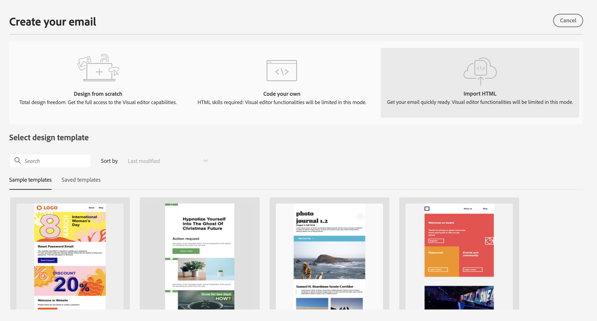
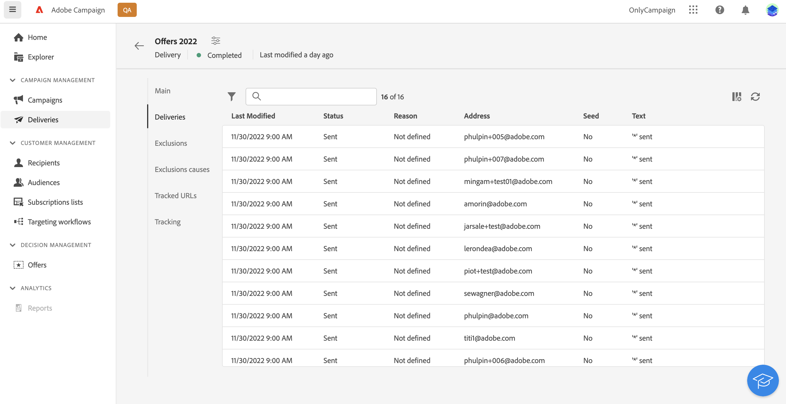

# 傳送您的第一封電子郵件 {#first-email}

此使用案例說明如何建立您的第一封電子郵件。 我們將排程在特定日期傳送電子郵件給銀級和金級忠誠客戶。 此電子郵件將使用預先定義的範本設計，並包含使用設定檔屬性的個人化。

## 建立電子郵件 {#create-email}

>[!CONTEXTUALHELP]
>id="acw_deliveries_email_template_selection"
>title="選取電子郵件範本"
>abstract="範本是在Adobe Campaign v8主控台中定義。 這是特定的傳送設定，包含預先定義的參數，例如類型規則、個人化或路由參數。"

>[!CONTEXTUALHELP]
>id="acw_deliveries_email_properties"
>title="電子郵件屬性"
>abstract="屬性是常見的傳送參數，可協助您為傳送命名並分類。 如果您的傳送是以Adobe Campaign v8主控台中定義的延伸架構為基礎，則某些特定 **自訂選項** 欄位。"

1. 從 **[!UICONTROL 傳遞]** 功能表。

1. 選取 **[!UICONTROL 電子郵件]** 管道和範本，然後按一下 **[!UICONTROL 建立]**.

   >[!NOTE]
   >
   >範本是已儲存為範本以供重複使用的特定傳送設定。 傳送範本是由Adobe Campaign Console的管理員使用者設定。 [了解如何使用傳遞範本](https://experienceleague.adobe.com/docs/campaign/campaign-v8/campaigns/send/create-templates.html){target="_blank"}.

   

1. 提供電子郵件的標籤，並根據您的需求設定其他選項：

   * **[!UICONTROL 內部名稱]**:為傳送指派唯一識別碼，
   * **[!UICONTROL 資料夾]**:將傳遞儲存在特定資料夾中，
   * **[!UICONTROL 傳送代碼]**:使用此欄位，根據您自己的命名慣例來組織傳送，
   * **[!UICONTROL 說明]**:指定傳送的說明，
   * **[!UICONTROL 自然]**:為分類目的指定電子郵件的性質。<!--The content of the list is defined in the delivery template selected when creating the email.-->

   >[!NOTE]
   >
   >如果您已使用特定自訂欄位擴充架構，則可從 **[!UICONTROL 自訂選項]** 區段。

   

   此外，進階設定（類型規則、目標對應等） 可從傳送名稱旁的按鈕使用。 它們會在建立電子郵件時選取的範本中預先定義。 您可以視需要加以編輯。

## 建立電子郵件內容 {#create-content}

>[!CONTEXTUALHELP]
>id="acw_homepage_card3"
>title="了解如何使用電子郵件設計工具來設計您的電子郵件內容。"
>abstract="了解如何設計您的內容"

在此使用案例中，我們將使用預先定義的範本來設計電子郵件。 有關如何配置電子郵件內容的詳細資訊，請參閱 [本節](../content/edit-content.md).

1. 按一下 **[!UICONTROL 編輯內容]** 按鈕，開始建立電子郵件的內容。

   此畫面可讓您設定電子郵件內容，並使用電子郵件設計工具進行設計。

   

1. 指定電子郵件的主旨，並使用運算式編輯器將其個人化。 [了解如何個人化您的內容](../personalization/personalize.md)

   

1. 按一下 **[!UICONTROL 編輯電子郵件內文]** 按鈕來建立和設計電子郵件內容。

   選擇用來建立電子郵件內容的方法。 在此範例中，我們想使用現有的設計範本。

   

<!--1. Select the HTML or ZIP file to import then click **[!UICONTROL Next]**.

    If your folder contains assets, choose the instance and folder where they should be stored then click **[!UICONTROL Import]**. (+ link to doc on assets?)

    -->

1. 選取範本後，範本會顯示在電子郵件設計工具中，讓您視需要加以編輯，並新增個人化。

   在此範例中，我們想在電子郵件標題中新增個人化。 若要這麼做，請選取元件區塊，然後按一下 **[!UICONTROL 新增個人化]**.

   

1. 內容準備就緒後，請儲存內容，然後按一下箭頭返回電子郵件建立畫面。

   

## 定義對象 {#define-audience}

>[!CONTEXTUALHELP]
>id="acw_deliveries_email_audience"
>title="定義對象"
>abstract="選取行銷訊息的最佳對象。 您可以選擇已在Campaign v8例項中定義的現有對象，或從Adobe Experience Platform中選擇，或選擇使用規則產生器建立新對象。"

在此使用案例中，我們將傳送電子郵件給現有對象。 有關如何使用對象的其他資訊，請參閱 [本節](../audience/about-audiences.md).

1. 按一下 **[!UICONTROL 選取對象]** 按鈕，然後選擇要定位的現有對象。

   在此範例中，我們想使用現有的對象來鎖定屬於銀級和金級忠誠度點數等級的客戶。

   

   >[!NOTE]
   >
   >清單中可用的對象來自您的Campaign V8執行個體，或來自Adobe Experience Platform（如果已在執行個體上設定目的地/來源整合）。
   >
   >目的地/來源整合可讓您將Experience Platform區段傳送至Adobe Campaign，以及將促銷活動傳送和追蹤記錄檔傳送至Adobe Experience Platform。 [了解如何搭配Campaign和Adobe Experience Platform使用](https://experienceleague.adobe.com/docs/campaign/campaign-v8/connect/ac-aep.html){target="_blank"}.

1. 選取對象後，您可以使用其他規則來調整目標。

   您也可以設定控制組，以比較未鎖定目標之設定檔的行為，分析電子郵件收件者的行為。 [了解如何使用控制組](../audience/control-group.md)

## 排程傳送 {#schedule}

>[!CONTEXTUALHELP]
>id="acw_deliveries_email_schedule"
>title="排程傳送"
>abstract="定義傳送的日期和確切時間。 選擇最適合您的行銷訊息的時間，即可將開放率最大化。"

若要排程電子郵件的傳送，請按一下 **[!UICONTROL 啟用]** 然後指定傳送的所需日期和時間。

依預設， **[!UICONTROL 傳送前確認]** 選項，表示您需要確認傳送，以允許在指定的日期和時間傳送電子郵件。 停用此選項可允許在排程的日期和時間傳送電子郵件，而不需要確認。

## 預覽並測試電子郵件 {#preview-test}

在您的電子郵件準備就緒後，您可以先預覽並測試它，再啟動其傳送。

在此使用案例中，我們將預覽電子郵件，並使用現有設定檔傳送校樣。

有關如何預覽和測試電子郵件的其他資訊，請參閱 [本節](../preview-test/preview-test.md).

1. 按一下 **[!UICONTROL 審核以發送]**. 隨即顯示您電子郵件的預覽，以及所有已設定的屬性、對象和排程。 您可以使用修改按鈕來編輯其中的任何元素。

1. 按一下 **[!UICONTROL 模擬內容]** 按鈕來預覽電子郵件並傳送校樣。

   

1. 在左側區域，選取要用來預覽電子郵件的設定檔。

1. 電子郵件的預覽會根據選取的設定檔顯示在右窗格中。 如果您已新增多個設定檔，則可以在每個設定檔之間切換，以預覽對應的電子郵件。

   

   <!-- !NOTE
    >
    >Additionally, the **[!UICONTROL Render email]** button allows you to preview the email using mutiple devices or mail providers. Learn on how to preview email rendering-->

1. 若要傳送電子郵件的校樣，請按一下 **[!UICONTROL 測試]** 按鈕，然後選取將接收校樣的設定檔。

   <!--TO REPLACE WITH SUBSTITUTION PROFILE-->In this example, we want to send the proofs to a specific test profile, which is a seed address that is not part of the target. [Learn how to work with seed addresses](https://experienceleague.adobe.com/docs/campaign-classic/using/sending-messages/using-seed-addresses/about-seed-addresses.html){target="_blank"}.

   

   >[!NOTE]
   >
   >您也可以模擬部分目標設定檔並將證明訊息傳送至您所選擇的電子郵件地址，以測試您的訊息。 [了解如何傳送校樣](../preview-test/preview-test.md)

1. 按一下 **[!UICONTROL 傳送測試電子郵件]** 然後確認傳送。

   傳送校樣後，您就可以按一下 **[!UICONTROL 檢視測試電子郵件記錄]** 按鈕。

## 傳送及監視電子郵件 {#prepare-send}

檢閱並測試您的電子郵件後，即可啟動其準備工作並傳送。

1. 按一下 **[!UICONTROL 準備]** 啟動訊息準備。 [了解如何準備電子郵件](../monitor/prepare-send.md)

   

1. 在您的電子郵件準備就緒後，按一下 **[!UICONTROL 傳送]** 然後確認傳送。

   您可以即時追蹤傳送以及統計資料。 此外， **[!UICONTROL 記錄檔]** 按鈕可讓您存取電子郵件傳送的詳細資訊。 [了解如何監視傳送記錄](../monitor/delivery-logs.md)
   

1. 傳送電子郵件後，您可以存取專用 [報告](../reporting/reports.md) 供進一步分析之用。

   
