# Send your first email {#first-email}

Learn how to create your first targeted email. In this use case, you schedule the sending of an email to Silver and Gold loyalty members on a specific date.

Based on a predefined design template, the email also features personalized content based on customer profile attributes.

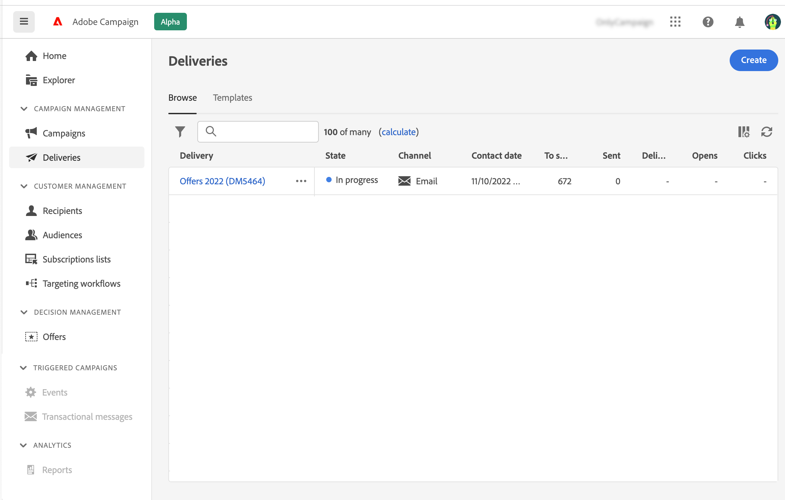

## Create the email {#create-email}

>[!CONTEXTUALHELP]
>id="acw_deliveries_email_template_selection"
>title="Select an email template"
>abstract="An email template is a specific delivery configuration that contains predefined settings, such as typology rules, personnalization or routing parameters. Templates are defined in the Campaign client console."

>[!CONTEXTUALHELP]
>id="acw_deliveries_email_properties"
>title="Email Properties"
>abstract="The properties are the common delivery parameters that helps you to name and classify your delivery. If your delivery is based on an extended schema defined in the Adobe Campaign v8 console, some specific **Custom Options** fields are available."

1. To create a new delivery, go to the **[!UICONTROL Deliveries]** menu and select **[!UICONTROL Email]** as the channel.

1. Select the template you want to use and click **[!UICONTROL Create delivery]**.

    >[!NOTE]
    >
    >Templates are pre-configured delivery settings saved for future use. They can be created by admin users in Adobe Campaign console. [Learn how to work with delivery templates](https://experienceleague.adobe.com/docs/campaign/campaign-v8/campaigns/send/create-templates.html){target="_blank"}.

    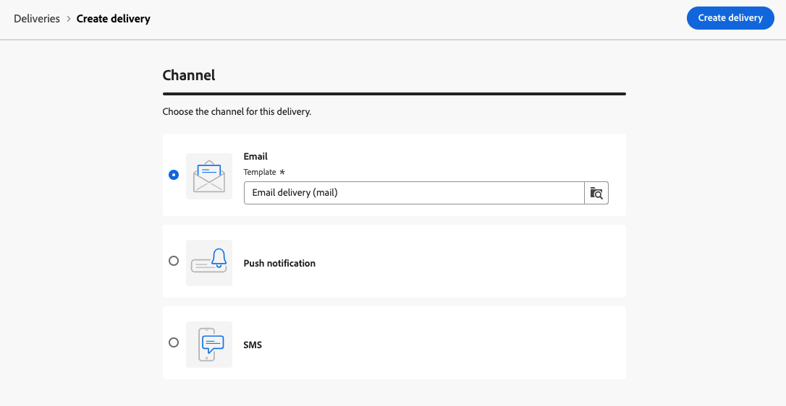

1. Provide a label for the email and configure additional options based on your needs:

    * **[!UICONTROL Internal name]**: assign a unique identifier to the delivery,
    * **[!UICONTROL Folder]**: store the delivery in a specific folder,
    * **[!UICONTROL Delivery code]**: use this field to organize your deliveries based on your own naming convention,
    * **[!UICONTROL Description]**: specify a description for the delivery,
    * **[!UICONTROL Nature]**: specify the nature of the email for classification purposes.<!--The content of the list is defined in the delivery template selected when creating the email.-->

    >[!NOTE]
    >
    >If you have extended your schema with specific custom fields, you can access them in the **[!UICONTROL Custom options]** section.

    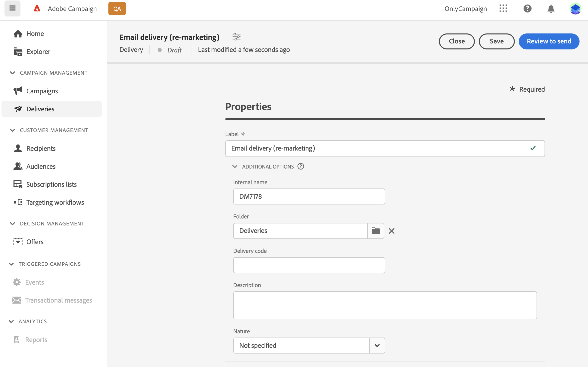

    Additionally, advanced settings, such as typology rules and target mappings, can be accessed by clicking the button located next to the delivery name. These settings are pre-configured in the selected template, but can be edited as needed for this specific email.

## Create the email content {#create-content}

>[!CONTEXTUALHELP]
>id="acw_homepage_card3"
>title="Learn how to design your email content"
>abstract="Learn how to use the Email Designer."

In this use case, you use a predefined template to design our email.

Detailed instructions on how to configure the email content are available in [this section](../content/edit-content.md).

1. To start creating the email content, click the **[!UICONTROL Edit content]** button. 

   This brings you to a dedicated interface where you can configure the email content and design it using the Email Designer. 

    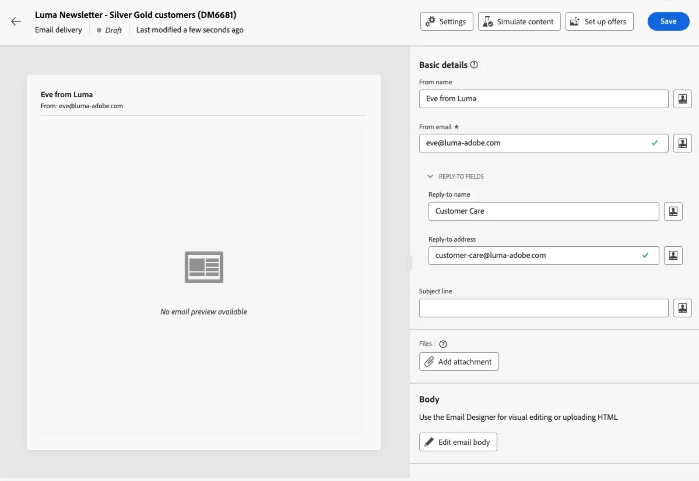

1. Enter the subject line of your email and personalize it using the Expression Editor. [Learn how to personalize your content](../personalization/personalize.md)

    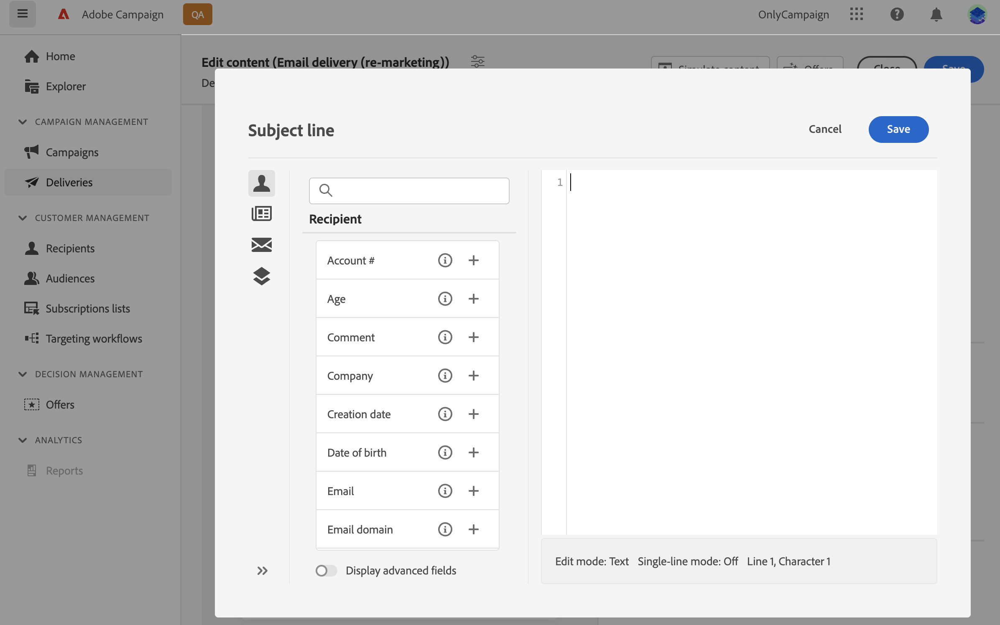

1. To design the body of the email, click the **[!UICONTROL Edit email body]** button.

    Choose the method to use to create your email content. In this example, use a predefined design template.

    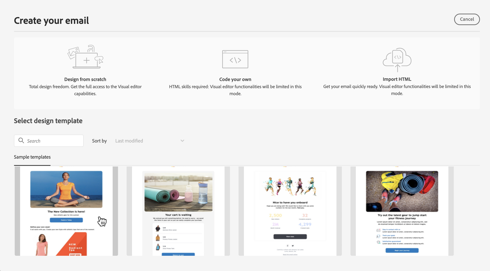

<!--1. Select the HTML or ZIP file to import then click **[!UICONTROL Next]**.

    If your folder contains assets, choose the instance and folder where they should be stored then click **[!UICONTROL Import]**. (+ link to doc on assets?)

    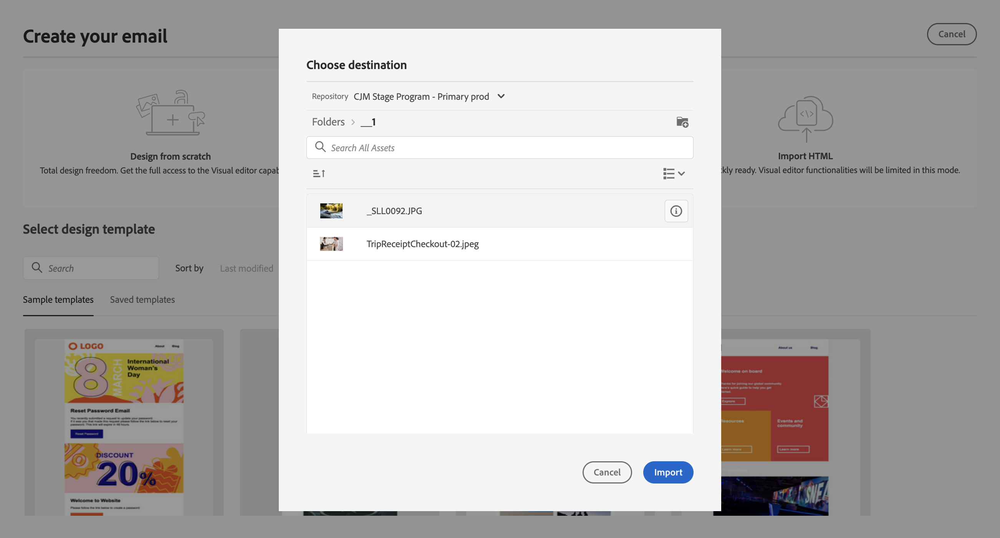-->

1. Once you have selected the template, it is displayed in the Email Designer, where you can make any necessary edits and add personalization.

    For example, to add personalization to the email title, select the component block and click **[!UICONTROL Add Personalization]**.

    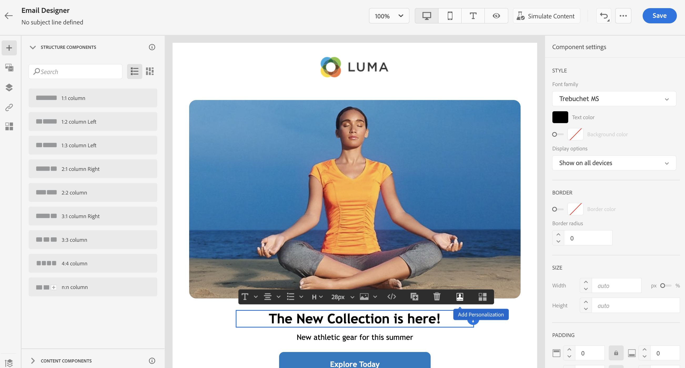

1. Once you are satisfied with the content, save and close your design. Click **[!UICONTROL Save]** to return to the email creation screen.

    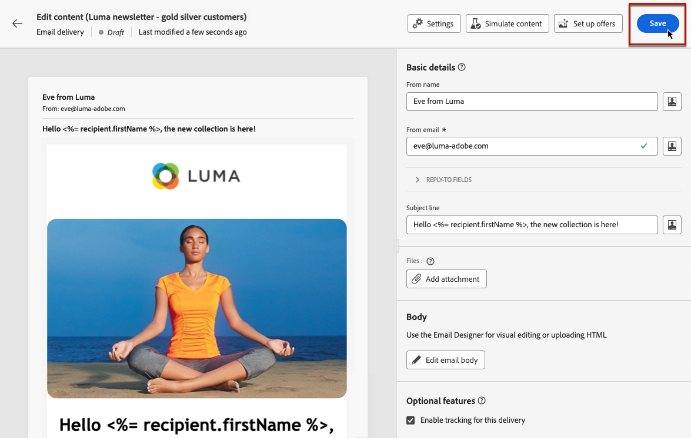

## Define the audience {#define-audience}

>[!CONTEXTUALHELP]
>id="acw_deliveries_email_audience"
>title="Define the audience"
>abstract="Select the best audience for your marketing message. You can choose an existing audience already defined in a Campaign v8 instance or from Adobe Experience Platform, or you can create a new audience with the rule builder."

In this use case, you send the email to an existing audience. Additional instructions on how to work with audiences are available in [this section](../audience/about-audiences.md).

1. To select the audience for the email, click the **[!UICONTROL Select audience]** button and choose an existing audience from the list.

    In this example, we want to use an existing audience targeting customers belonging to the silver and gold loyalty points levels.

    

    >[!NOTE]
    >
    >Audiences available in the list originate either from your Campaign v8 instance or from Adobe Experience Platform if the Destination / Sources integration has been configured on your instance.
    >
    >The Destination / Sources integration allows you to send Experience Platform segments to Adobe Campaign, and to send Campaign delivery and tracking logs over to Adobe Experience Platform. [Learn how work with Campaign and Adobe Experience Platform](https://experienceleague.adobe.com/docs/campaign/campaign-v8/connect/ac-aep.html){target="_blank"}.

1. Once the audience is selected, you can further refine the target by applying additional rules.

    You can also set a control group to analyze the behavior of the email recipients compared to those who were not targeted. [Learn how to work with control groups](../audience/control-group.md)

    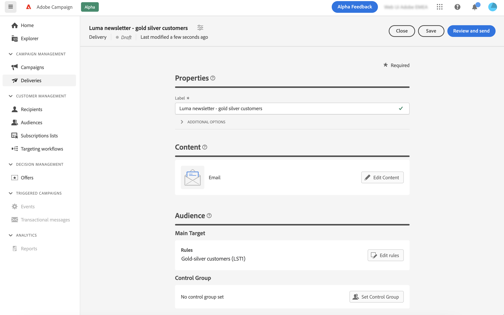

## Schedule the sending {#schedule}

>[!CONTEXTUALHELP]
>id="acw_deliveries_email_schedule"
>title="Schedule the sending"
>abstract="Define the date and the exact time for your sending. By choosing the most appropriate time for your marketing message, you can maximise open rates."

To schedule the sending of the email, click **[!UICONTROL Enable]** and set the desired date and time for sending. 

By default, the **[!UICONTROL Confirm before sending]** option is enabled, requiring you to confirm the sending before the email is sent at the scheduled date and time. If you wish to send the email automatically on the scheduled date and time, you can disable this option.

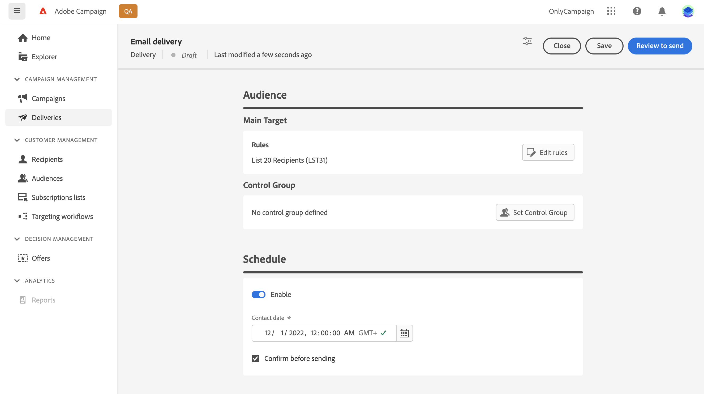

## Preview and test the email {#preview-test}

Before sending your email, you can preview and test it to ensure it meets your expectations.

In this use case, you preview the email and send test versions to specific email addresses while impersonating some of the targeted profiles.

Additional information on how to preview and test emails are available in [this section](../preview-test/preview-test.md).

1. To review and send the email, click **[!UICONTROL Review and send]**. This displays a preview of your email, along with al the configured properties, audience and schedule. You can edit any of these elements by clicking the modify button.

1. To preview the email and send test verrsions, click the **[!UICONTROL Simulate content]** button. 

    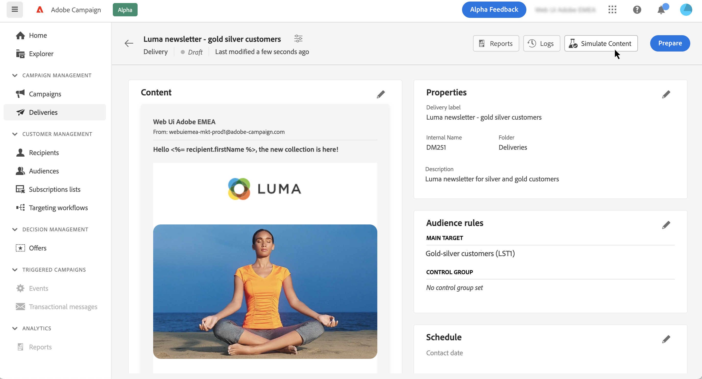

1. On the left-hand side, select the profile(s) you want to use to preview the email.

    The right pane displays a preview of the email based on the selected profile. If you have added multiple profiles, you can switch between them to preview the corresponding email.

    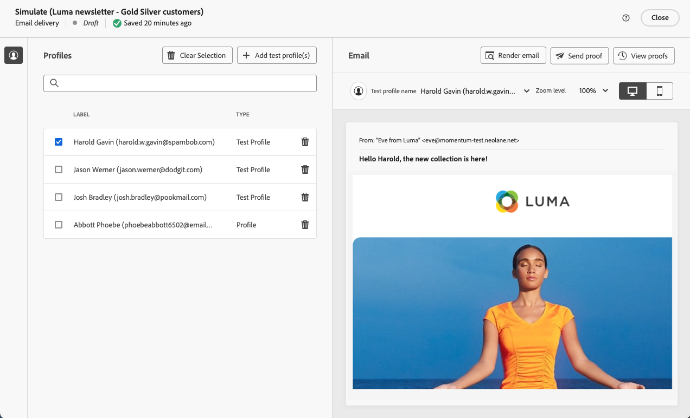

   <!-- !NOTE
    >
    >Additionally, the **[!UICONTROL Render email]** button allows you to preview the email using mutiple devices or mail providers. Learn on how to preview email rendering-->

1. To send test versions of your email, click the **[!UICONTROL Test]** button then choose the mode you want to use.

    In this example, use the **[!UICONTROL Substitute from main target]** mode, which sends test versions to specific email addresses while impersonating some of the profiles targeted by the email.

    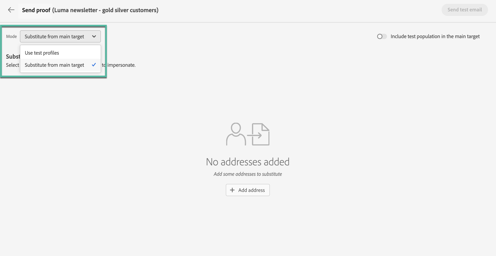

1. Click **[!UICONTROL Add address]** and specify the email address(es) which receive the test versions.

    For each email address, select the profile to impersonate. You can also let Adobe Campaign select a random profile from the target.

    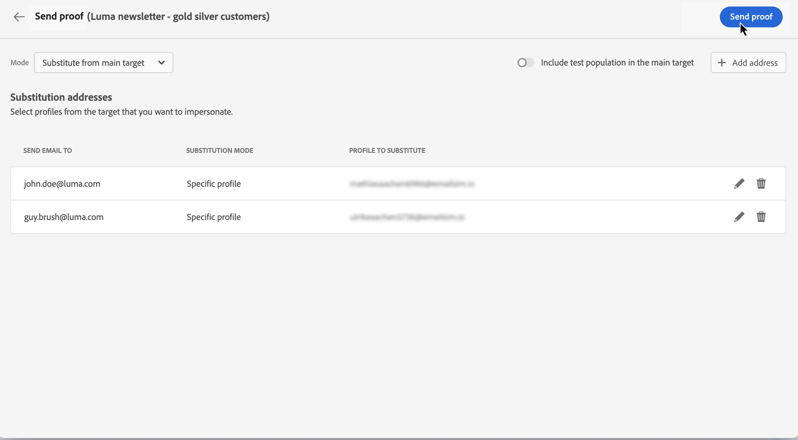

1. Click **[!UICONTROL Send test email ]** and confirm the sending.

    Test versions are sent to the specified email addresses using the selected profile with the **[Proof x]** prefix.

    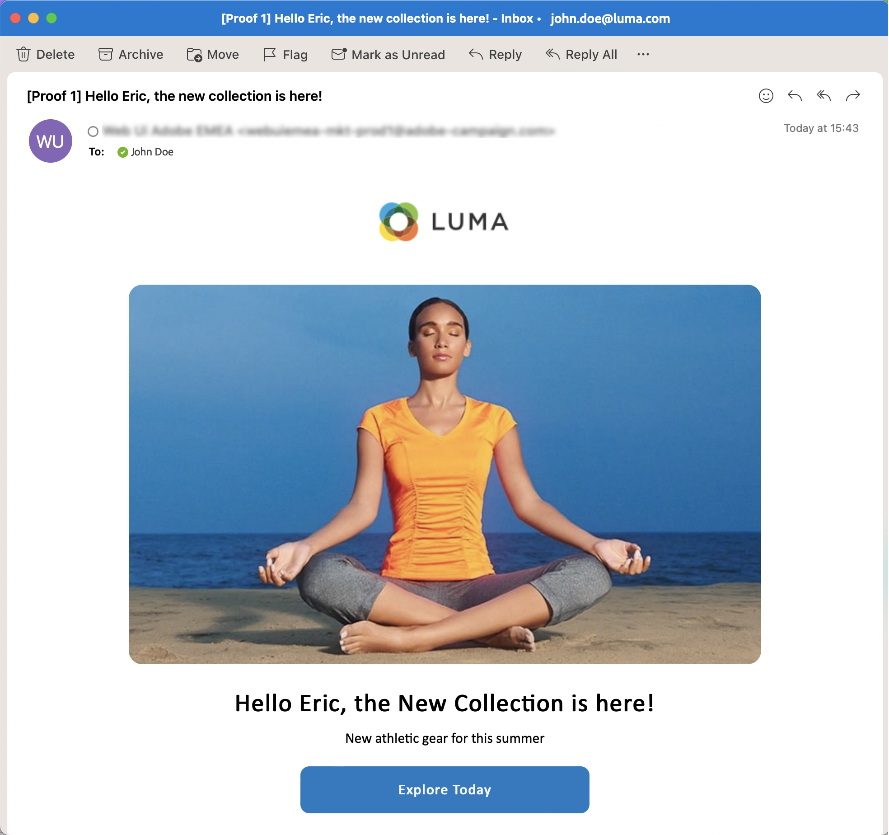

    You can check the status of the sending and access the sent test emails at any time by clicking the **[!UICONTROL View test email log]** button in the simulate content screen.

## Send and monitor the email {#prepare-send}

After reviewing and testing your email, you can launch its preparation and send it.

1. To launch the preparation of the email, click **[!UICONTROL Prepare]**. [Learn how to prepare an email](../monitor/prepare-send.md)

    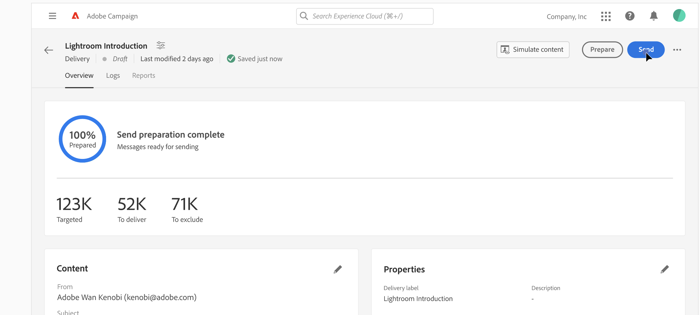
 
1. Once your email is ready to be sent, click the **[!UICONTROL Send]** button (or **[!UICONTROL Send as scheduled]** if you have scheduled its sending) and confirm the sending.

1. During the sending process, you can track its progress and view statistics in real-time directly in this screen.

    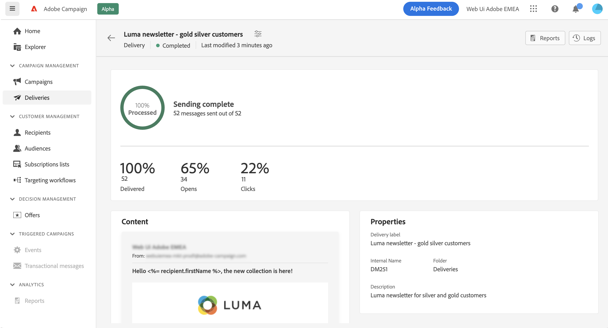

    You can also access detailed information on the sending by clicking the **[!UICONTROL Logs]** button. [Learn how to monitor delivery logs](../monitor/delivery-logs.md)     

1. After the email has been sent, you can access dedicated reports for further analysis by clicking the **[!UICONTROL Reporting]** button.

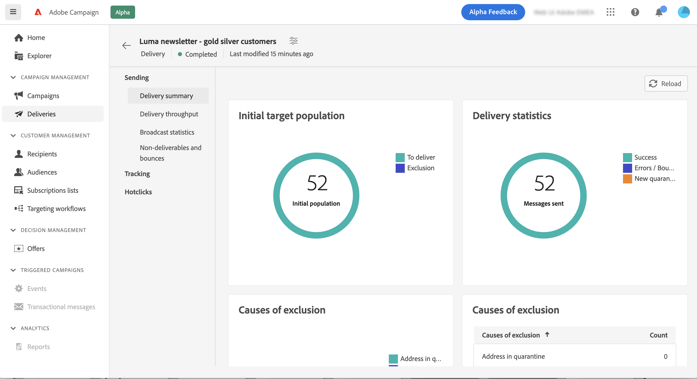
