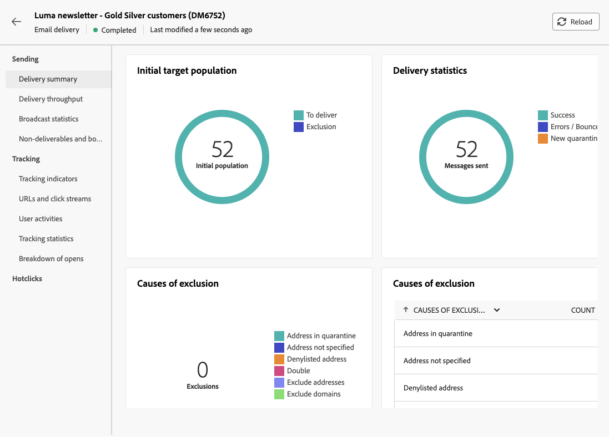

# 傳送您的第一封電子郵件 {#first-email}

>[!NOTE]
>
>本檔案正在建置中，且經常更新。 此內容的最終版本將於2023年1月推出。

此使用案例說明如何建立您的第一封電子郵件

在此範例中，我們會排程在特定日期傳送電子郵件給銀級和金級忠誠客戶。 此電子郵件將使用ZIP檔案中預先定義的HTML範本來設計，並將包含使用設定檔屬性的個人化。

## 建立電子郵件 {#create-email}

1. 從 **[!UICONTROL 傳遞]** 功能表。
1. 選取 **[!UICONTROL 電子郵件]** 管道和範本，然後按一下 **[!UICONTROL 建立]**.

   >[!NOTE]
   >
   >範本的資訊。 V7文檔中的檢查資訊

   

1. 提供傳送的標籤，並根據您的需求設定其他選項：

   * 內部名稱:
   * 資料夾:
   * 傳遞代碼:
   * 說明:
   * 性質:

   檢查範本中定義哪些設定並提及它們(說明？ 資料夾，自然？)

   

   >[!NOTE]
   >
   >傳遞設定按鈕的資訊+doc連結

## 建立電子郵件內容 {#create-content}

>[!CONTEXTUALHELP]
>id="acw_homepage_card3"
>title="使用電子郵件設計工具建立您的第一個電子郵件內容。"
>abstract="建立您的第一個電子郵件內容"

>[!CONTEXTUALHELP]
>id="acw_deliveries_email_content"
>title="建立電子郵件內容"
>abstract="TBC"

1. 按一下 **[!UICONTROL 編輯內容]** 按鈕，開始建立電子郵件的內容。

   此畫面可讓您設定電子郵件內容，並使用電子郵件設計工具進行設計。

   

   >[!NOTE]
   >
   >「寄件者」名稱和「寄件者」電子郵件資訊會在選取的電子郵件範本中預先定義。
   >
   >依預設，會針對開啟和點按啟用電子郵件追蹤。 要禁用這些選項，請從「可選功能」部分中取消選擇它們。

1. 使用運算式編輯器指定電子郵件的主旨。 [了解如何個人化您的內容](../personalization/personalize.md)

   在此範例中，我們想使用設定檔的名字來個人化主旨行。

   

1. 視需要將附加的檔案新增至您的電子郵件。 了解如何編輯電子郵件內容

1. 按一下 **[!UICONTROL 編輯電子郵件內文]** 按鈕來建立和設計電子郵件內容。

   選擇用來建立電子郵件內容的方法。 在此範例中，我們要匯入現有的HTML內容。

   

1. 選取要匯入的HTML或ZIP檔案，然後按一下 **[!UICONTROL 下一個]**.

   如果您的資料夾包含資產，請選擇應儲存資產的例項和資料夾，然後按一下 **[!UICONTROL 匯入]**. （+連結至資產上的doc？）

   

1. 匯入內容後，內容會顯示在電子郵件設計工具中，讓您可以視需要加以編輯，並新增個人化內容。

   在此範例中，我們想在電子郵件標題中新增個人化。 若要這麼做，請選取元件區塊，然後按一下 **[!UICONTROL 新增個人化]**.

   

1. 內容準備就緒後，請儲存內容，然後按一下箭頭返回電子郵件建立畫面。

   

## 定義對象 {#define-audience}

>[!CONTEXTUALHELP]
>id="acw_deliveries_email_audience"
>title="定義對象"
>abstract="TBC"

1. 按一下 **[!UICONTROL 選取對象]** 按鈕，然後選擇現有對象或建立新對象。

   在此範例中，我們想使用現有的對象來鎖定屬於銀級和金級忠誠度點數等級的客戶。

   

   >[!NOTE]
   >
   >清單中可用的對象來自您的Campaign V8執行個體，或來自Adobe Experience Platform（如果已在執行個體上實作「目的地/來源」整合）。 了解如何選取電子郵件對象

1. 選取對象後，您就可以視需要編輯規則。 您也可以設定控制組，以比較未鎖定目標之設定檔的行為，分析電子郵件收件者的行為。 了解如何使用控制組

## 排程傳送 {#schedule}

>[!CONTEXTUALHELP]
>id="acw_deliveries_email_schedule"
>title="排程傳送"
>abstract="TBC"

若要排程電子郵件的傳送，請按一下「啟用」，然後指定所需的日期和時間。

=在傳送前確認選項：排程日期發生的事項：確認訊息傳送的通知？

## 預覽並測試電子郵件 {#preview-test}

在您的電子郵件準備就緒後，您可以先預覽並測試它，再啟動其傳送。

1. 按一下 **[!UICONTROL 審核以發送]**. 隨即顯示您電子郵件的預覽，以及所有已設定的屬性、對象和排程。 您可以使用修改按鈕來編輯其中的任何元素。

   

1. 按一下 **[!UICONTROL 模擬內容]** 按鈕來預覽電子郵件並傳送校樣。

1. 在左側區域，選取要用來預覽電子郵件的設定檔。 您可以使用目標設定檔或專用的測試設定檔。

1. 電子郵件的預覽會根據選取的設定檔顯示在右側區域。 如果您已新增多個設定檔，則可以在每個設定檔之間切換，以預覽對應的電子郵件。

   

   >[!NOTE]
   >
   >此外， **[!UICONTROL 呈現電子郵件]** 按鈕可讓您使用多個裝置或郵件提供者來預覽電子郵件。 了解如何預覽電子郵件呈現

1. 若要傳送電子郵件的校樣，請按一下 **[!UICONTROL 測試]** 按鈕，然後選取將接收校樣的設定檔。 在此範例中，我們想將校樣傳送至特定測試設定檔。

   

   >[!NOTE]
   >
   >您也可以模擬部分目標設定檔並將證明訊息傳送至您所選擇的電子郵件地址，以測試您的訊息。 了解如何使用「從目標模式取代」

1. 按一下 **[!UICONTROL 傳送測試電子郵件]** 然後確認傳送。

   傳送校樣後，您就可以按一下 **[!UICONTROL 檢視測試電子郵件記錄]** 按鈕。

## 傳送及監視電子郵件 {#prepare-send}

檢閱並測試您的電子郵件後，即可啟動其準備工作並傳送。

1. 按一下 **[!UICONTROL 準備]** 啟動訊息準備。

   您可以即時追蹤準備進度以及統計資料。 準備完成後，您可以存取詳細記錄以進行進一步分析。 了解如何監視傳遞

   

1. 在您的電子郵件準備就緒後，按一下 **[!UICONTROL 傳送]** 然後確認傳送。

   您可以即時追蹤傳送以及統計資料。 此外， **[!UICONTROL 記錄檔]** 按鈕可讓您存取電子郵件傳送的詳細資訊。 了解如何監視傳遞

   

1. 傳送電子郵件後，您可以存取專用的報表以供進一步分析之用。

   
