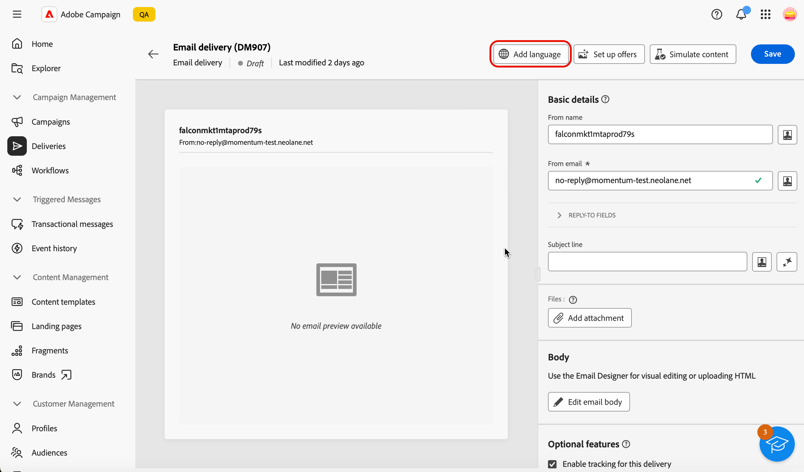
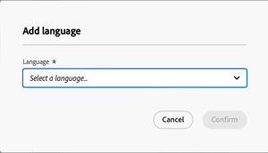
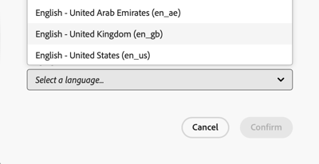
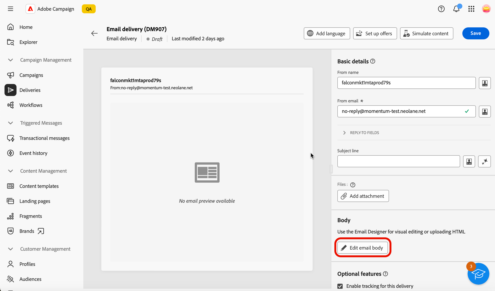
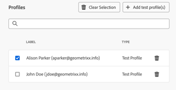
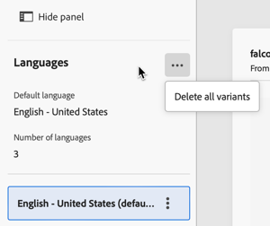

# 設定電子郵件內容 {#edit-content}

>[!CONTEXTUALHELP]
>id="acw_deliveries_email_content"
>title="定義電子郵件內容"
>abstract="您可以透過「**編輯內容**」畫面定義訊息的基本元素 (例如寄件者地址和主旨行)、執行其他操作 (例如新增附件或產品建議)，以及存取電子郵件設計工具來美化訊息的外觀。"

>[!CONTEXTUALHELP]
>id="acw_deliveries_email_header"
>title="設定電子郵件屬性"
>abstract="「**基本詳細資料**」區段可讓您更新寄件者地址和回覆地址，並使用運算式編輯器定義主旨行。"

>[!CONTEXTUALHELP]
>id="acw_deliveries_email_attachment"
>title="將檔案附加到電子郵件"
>abstract="選取一個或多個檔案插入訊息中。為避免出現效能問題，建議每封電子郵件不要包含多個附件。"

>[!CONTEXTUALHELP]
>id="acw_deliveries_email_options"
>title="編輯追蹤"
>abstract="預設會啟用傳遞追蹤，這表示系統會追蹤訊息內容中包含的所有連結。您可以從此處停用此選項。"
>additional-url="https://experienceleague.adobe.com/zh-hant/docs/campaign-web/v8/content/email-design/design-content/message-tracking" text="新增連結和追蹤訊息"

>[!CONTEXTUALHELP]
>id="acw_deliveries_email_multilingual"
>title="新增語言"
>abstract="在此索引標籤中，您將找到要用來傳遞內容的語言清單。您可以按一下「新增語言」按鈕，或透過此索引標籤複製其他語言來新增更多語言。"

電子郵件&#x200B;**[!UICONTROL 編輯內容]**&#x200B;畫面可讓您：

* 定義訊息的基本元素，例如寄件者的地址和主旨列
* 執行其他動作，例如新增附件或設定優惠方案
* 存取[電子郵件Designer](get-started-email-designer.md#start-authoring)以開始建立您電子郵件的適當內容
* 將語言變體新增至傳遞。

>[!NOTE]
>
>此畫面的所有可編輯文字欄位都可使用個人化欄位填入。 [了解如何個人化內容](../personalization/personalize.md)

## 設定傳遞

若要設定或編輯電子郵件內容，請遵循下列步驟。

1. 從&#x200B;**[!UICONTROL 電子郵件傳遞儀表板]**&#x200B;畫面按一下[編輯內容](../email/create-email.md)按鈕。

   ![在電子郵件傳遞控制面板上顯示[編輯內容]按鈕的熒幕擷圖。](assets/email-edit-content-button.png){zoomable="yes"}

1. 電子郵件內容版本畫面隨即開啟。

   {zoomable="yes"}

   >[!NOTE]
   >
   >如果您正在設定新電子郵件，已填入&#x200B;**[!UICONTROL 寄件者姓名]**&#x200B;和&#x200B;**[!UICONTROL 寄件者電子郵件]**&#x200B;欄位。

1. **[!UICONTROL 寄件者名稱]**&#x200B;欄位已在電子郵件範本中定義。 若要修改它，請使用收件者可輕鬆辨識的名稱（例如您的品牌名稱），以提高傳遞的開頭率。

   >[!NOTE]
   >
   >若要進一步改善收件者的體驗，您可以新增個人名稱，例如「Eve from Luma」。

1. **[!UICONTROL 寄件者電子郵件]**&#x200B;位址列位也定義在電子郵件範本中。 請確定位址網域符合您委派給Adobe的子網域。

   >[!NOTE]
   >
   >您可以變更&#39;@&#39;之前的部分，但無法變更網域位址。

1. 展開&#x200B;**[!UICONTROL 回覆欄位]**&#x200B;區段。 預設會使用寄件者的姓名和地址進行回覆。 不過，Adobe建議使用現有的實際地址，例如您品牌的客戶服務。 在此情況下，如果收件者傳送回覆，客戶服務團隊將能處理。

   ![在電子郵件內容編輯器中顯示[回覆欄位]區段的熒幕擷圖。](assets/email-edit-content-reply-to.png){zoomable="yes"}

1. 定義電子郵件 **[!UICONTROL 主旨行]**。直接在專用欄位中輸入您的主旨，或開啟運算式編輯器以使用各種屬性、運算式片段或選件來新增[個人化](../personalization/personalize.md)。

1. 如果要將檔案附加至電子郵件，請按一下&#x200B;**[!UICONTROL 新增附件]**&#x200B;按鈕，然後選取一或多個檔案。

   >[!NOTE]
   >
   >為避免出現效能問題，建議每封電子郵件不要包含多個附件。

   <!--limitation on size + number of files?-->

1. 如果您要以電子郵件傳送優惠方案，請使用&#x200B;**[!UICONTROL 設定優惠方案]**&#x200B;按鈕來選取優惠方案。

   然後，您可以使用個人化欄位將它們插入電子郵件中。 [了解如何傳送產品建議](../msg/offers.md)

## 編輯電子郵件內文

1. 按一下&#x200B;**[!UICONTROL 編輯電子郵件內文]**&#x200B;按鈕，使用[電子郵件Designer](get-started-email-designer.md#start-authoring)來建構和設計電子郵件內容。

   >[!NOTE]
   >
   >您也可以暫留在電子郵件預覽上，並選取&#x200B;**[!UICONTROL 開啟電子郵件設計工具]**。

   以下章節提供如何設計電子郵件內容的詳細資訊：

   * [從頭開始撰寫電子郵件](create-email-content.md)
   * [設定內容樣式](get-started-email-style.md)

1. 依預設，傳遞追蹤會啟用。您可以從「**[!UICONTROL 選擇性功能]**」區段停用此選項。[了解如何新增連結和管理追蹤](message-tracking.md)

1. 定義好電子郵件內容後，請使用「**[!UICONTROL 模擬內容]**」按鈕在傳送前檢查其如何顯示。[瞭解如何預覽和測試您的電子郵件](../preview-test/preview-test.md)。

## 設定多語言傳遞 {#multilingual-delivery}

在Campaign網頁使用者介面中，您可以將電子郵件傳送設定為多語言，這可讓您根據設定檔的偏好語言傳送訊息。 未定義偏好設定時，訊息會以預設語言傳送。

在多語言傳遞中，語言管理會根據變體。 每個變體代表一種語言。

在傳遞建立期間，您可以在訊息中新增與所需語言數目相對應的變體數目。 您也可以定義新增語言時的預設語言。

### 新增語言變體

若要建立語言變體，請依照下列步驟進行：

1. 按一下電子郵件設定畫面上方的&#x200B;**[!UICONTROL 新增語言]**&#x200B;按鈕。

   >[!IMPORTANT]
   >
   >**[!UICONTROL 新增語言]**&#x200B;按鈕只有在目標維度包含語言結構描述時才可用。 若要進一步瞭解結構描述和Target維度，請參閱[詳細檔案](https://experienceleague.adobe.com/en/docs/campaign-web/v8/audiences/targeting-dimensions){target=_blank}。

   {zoomable="yes"}

1. 選取要在&#x200B;**[!UICONTROL 語言]**&#x200B;下拉式清單中新增的語言。 新增第一種語言時，它會設定為預設語言，而目前內容是預設內容。 當您新增語言時，內容會以預設內容為基礎。

   >[!NOTE]
   >
   >此清單提供的語言取決於語言屬性所定義的值（例如：system、user、dbenum等） 在此[區段](https://experienceleague.adobe.com/en/docs/campaign-web/v8/conf/enumerations){target=_blank}中進一步瞭解列舉管理。

   {zoomable="yes"}

   舉例來說，英文（美國）：

   {zoomable="yes"}

1. 重複此程式以新增其他語言。 **[!UICONTROL 語言]**&#x200B;面板會顯示您已選擇的語言清單、不同語言的數目以及預設語言。

   例如，如果您已選擇英文、法文和瑞典文，您可以看到下列3種語言：

   {zoomable="yes"}

   您可以按一下右上角的展開按鈕以刪除所有語言。

### 定義每個變體的電子郵件內容

設定語言後，定義將傳送至設定檔的電子郵件內容（具有此偏好語言）。

若要定義電子郵件內容，請執行下列步驟：

1. 按一下[編輯電子郵件內文](get-started-email-designer.md#start-authoring)按鈕，開啟&#x200B;**[!UICONTROL 電子郵件Designer]**。

   >[!NOTE]
   >
   >您也可以暫留在電子郵件預覽上，並選取&#x200B;**[!UICONTROL 開啟電子郵件設計工具]**。

   {zoomable="yes"}

1. 您可以按一下&#x200B;**[!UICONTROL 模擬內容]**&#x200B;按鈕，並選擇電子郵件顯示的設定檔和語言，以預覽傳遞。

1. 在「模擬內容」視窗中，您可以切換設定檔以預覽對應於該設定檔已設定之語言的電子郵件內容。

   {zoomable="yes"}

### 複製或移除語言變體

您可以按一下右上角的展開按鈕，然後按一下&#x200B;**[!UICONTROL 刪除所有變體]**&#x200B;按鈕，刪除所有語言。

{zoomable="yes"}

若要移除語言變體，請按一下標籤右側的三個點，然後選取「移除」。

若要複製語言變體，請按一下標籤右側的三個點，然後選取「複製」。 如果您選擇複製預設語言以外的語言，則複製的內容將根據您選擇複製的語言而定。

1. 定義好電子郵件內容後，請使用「**[!UICONTROL 模擬內容]**」按鈕在傳送前檢查其如何顯示。[瞭解如何預覽和測試您的電子郵件](../preview-test/preview-test.md)。