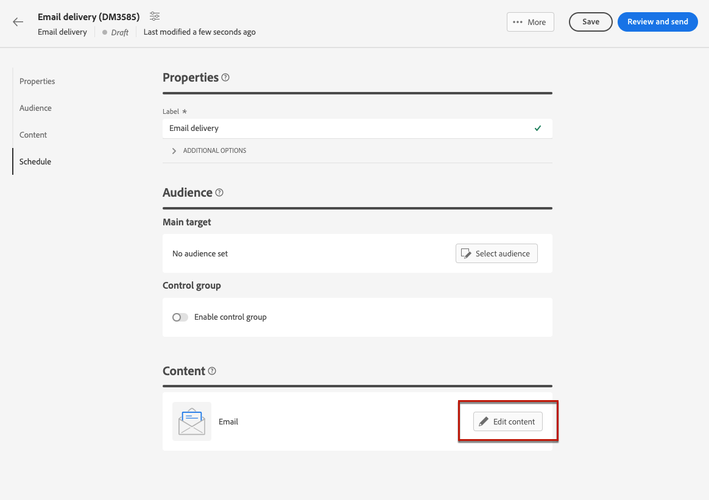
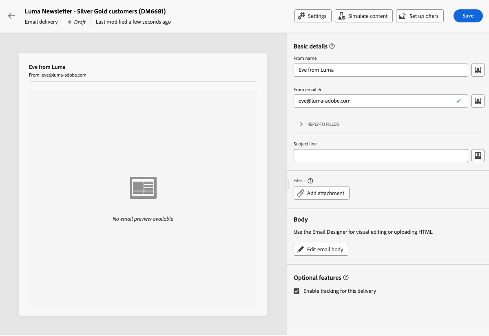
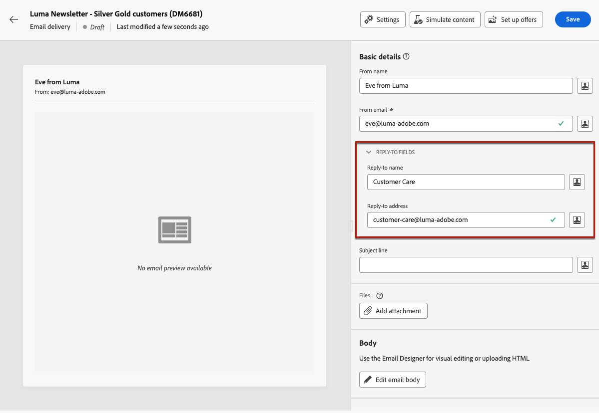

# 設定電子郵件內容 {#edit-content}

>[!CONTEXTUALHELP]
>id="acw_deliveries_email_content"
>title="定義電子郵件內容"
>abstract="「**編輯內容**」畫面可讓您定義訊息的基本元素 (例如寄件者地址和主旨行)、執行其他操作 (例如新增附件或優惠)，以及存取電子郵件設計工具來美化訊息的外觀。"

>[!CONTEXTUALHELP]
>id="acw_deliveries_email_header"
>title="設定電子郵件屬性"
>abstract="「**基本詳細資料**」區段可讓您更新寄件者地址和回覆地址，並使用運算式編輯器定義主旨行。"

>[!CONTEXTUALHELP]
>id="acw_deliveries_email_attachment"
>title="將檔案附加到電子郵件"
>abstract="選取一個或多個檔案來插入訊息中。為避免出現效能問題，建議每封電子郵件不要包含多個附件。"

>[!CONTEXTUALHELP]
>id="acw_deliveries_email_options"
>title="編輯追蹤"
>abstract="預設會啟用傳遞追蹤，這表示系統會追蹤訊息內容中包含的所有連結。您可以從此處停用此選項。"
>additional-url="https://experienceleague.adobe.com/docs/campaign-web/v8/msg/email/content/design-content/message-tracking.html" text="新增連結和追蹤訊息"

電子郵件 **[!UICONTROL 編輯內容]** 畫面可讓您：

* 定義訊息的基本元素，例如寄件者的地址和主旨列
* 執行其他動作，例如新增附件或設定優惠方案
* 存取 [電子郵件設計工具](get-started-email-designer.md#start-authoring) 以開始建立電子郵件的適當內容

>[!NOTE]
>
>此畫面的所有可編輯文字欄位都可使用個人化欄位填入。 [了解如何個人化內容](../personalization/personalize.md)

若要設定或編輯電子郵件內容，請遵循下列步驟。

1. 按一下 **[!UICONTROL 編輯內容]** 按鈕來自 [電子郵件傳遞儀表板](../email/create-email.md) 畫面。

   

1. 電子郵件內容版本畫面隨即開啟。

   

   >[!NOTE]
   >
   >如果您正在設定新電子郵件，請 **[!UICONTROL 寄件者姓名]** 和 **[!UICONTROL 來自電子郵件]** 欄位已填入。

1. 此 **[!UICONTROL 寄件者姓名]** 欄位定義於電子郵件範本中。 若要修改它，請使用收件者可輕鬆辨識的名稱（例如您的品牌名稱），以提高傳遞的開頭率。

   >[!NOTE]
   >
   >若要進一步改善收件者的體驗，您可以新增個人名稱，例如「Eve from Luma」。

1. 此 **[!UICONTROL 來自電子郵件]** 位址列位也定義在電子郵件範本中。 確定位址網域與您委派給Adobe的子網域相同。

   >[!NOTE]
   >
   >您可以變更&#39;@&#39;之前的部分，但無法變更網域位址。

1. 展開 **[!UICONTROL 回覆欄位]** 區段。 預設會使用寄件者的姓名和地址進行回覆。 不過，Adobe建議使用現有的實際地址，例如您品牌的客戶服務。 在此情況下，如果收件者傳送回覆，客戶服務將能夠處理。

   

1. 定義電子郵件 **[!UICONTROL 主旨行]**。在專用欄位中直接輸入主旨，或開啟運算式編輯器以新增 [個人化](../personalization/personalize.md) 使用各種屬性和內容區塊或選件。

1. 如果想要將檔案附加到電子郵件，請按一下「**[!UICONTROL 新增附件]**」按鈕然後選取一個或多個檔案。

   >[!NOTE]
   >
   >    為避免出現效能問題，建議每封電子郵件不要包含多個附件。

   <!--limitation on size + number of files?-->

1. 如果您想要透過電子郵件傳送優惠方案，請使用 **[!UICONTROL 設定優惠方案]** 按鈕。

   然後您可以使用個人化欄位將它們插入到電子郵件中。[了解如何傳送優惠](../msg/offers.md)

1. 按一下 **[!UICONTROL 編輯電子郵件內文]** 按鈕，使用來建構及設計電子郵件內容 [電子郵件設計工具](get-started-email-designer.md#start-authoring). 以下章節提供如何設計電子郵件內容的詳細資訊：

   * [從頭開始撰寫電子郵件](create-email-content.md)
   * [建立內容樣式](get-started-email-style.md)

   >[!NOTE]
   >
   >您也可以將滑鼠移至電子郵件預覽並選取「 」 **[!UICONTROL 開啟電子郵件設計工具]**.

1. 依預設，傳遞追蹤會啟用。您可以從「**[!UICONTROL 選擇性功能]**」區段停用此選項。[了解如何新增連結和管理追蹤](message-tracking.md)

1. 定義好電子郵件內容後，請使用「**[!UICONTROL 模擬內容]**」按鈕在傳送前檢查其如何顯示。[了解如何預覽和測試您的電子郵件](../preview-test/preview-test.md)

