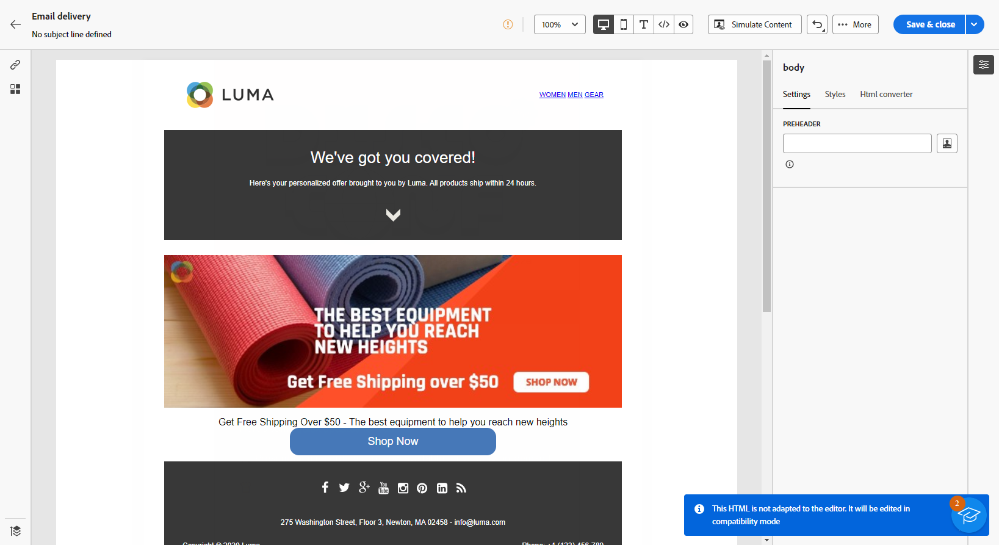
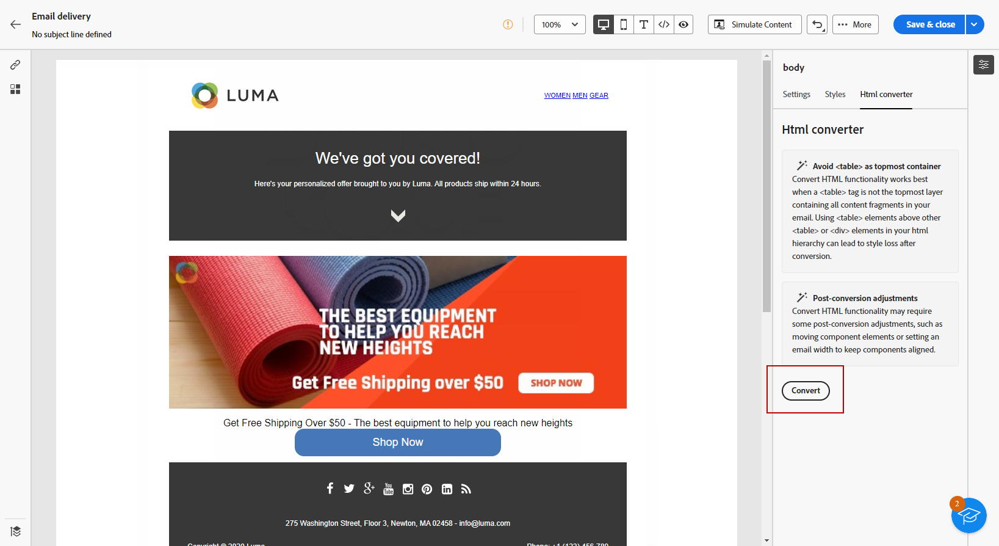

# 匯入您的電子郵件內容 {#existing-content}

>[!CONTEXTUALHELP]
>id="acw_deliveries_email_import_content"
>title="使用現有的電子郵件內容"
>abstract="電子郵件設計工具可讓您匯入現有的 HTML 內容。此內容可以是附有整合樣式表的 HTML 檔案，或是附有 HTML 檔案、樣式表 (.css) 和影像的 .zip 資料夾。"

您可以在電子郵件Designer中匯入現有的HTML內容。 此內容可以是：

* **HTML 檔案**，內含整合的樣式表，
* 含有HTML檔案、樣式表(.css)和影像的&#x200B;**.zip資料夾**。

>[!NOTE]
>
>.zip 檔案結構沒有限制。不過，參照必須是相對參照，而且能放在.zip資料夾的樹狀結構內。

➡️ [在影片中探索此功能](#video)

若要匯入包含HTML內容的檔案，請遵循下列步驟。

1. 在[電子郵件Designer](get-started-email-designer.md)首頁上，選取&#x200B;**[!UICONTROL 匯入HTML]**。

   ![熒幕擷圖顯示[電子郵件Designer]首頁中的[匯入HTML]選項。](assets/html-import.png){zoomable="yes"}

1. 拖放包含HTML內容的HTML或.zip檔案，然後按一下&#x200B;**[!UICONTROL 匯入]**。

1. 上傳HTML內容後，您的內容將處於&#x200B;**[!UICONTROL 相容性模式]**。

   在此模式中，您可以將文字個人化、新增連結或包含資產至您的內容。

   {zoomable="yes"}

1. 若要利用電子郵件Designer內容元件，請存取&#x200B;**[!UICONTROL HTML轉換工具]**&#x200B;標籤，然後按一下&#x200B;**[!UICONTROL 轉換]**。

   {zoomable="yes"}

>[!NOTE]
>
>在HTML檔案中使用`<table>`標籤做為第一個圖層可能會造成樣式遺失，包括上層圖層標籤中的背景和寬度設定。

1. 使用電子郵件Designer功能，視需要個人化您匯入的檔案。 [了解更多](content-components.md)

## 操作說明影片 {#video}

瞭解如何透過上傳HTML建立電子郵件、使其與電子郵件Designer相容，並將其轉換為範本。

>[!VIDEO](https://video.tv.adobe.com/v/3447043/?captions=chi_hant&quality=12)