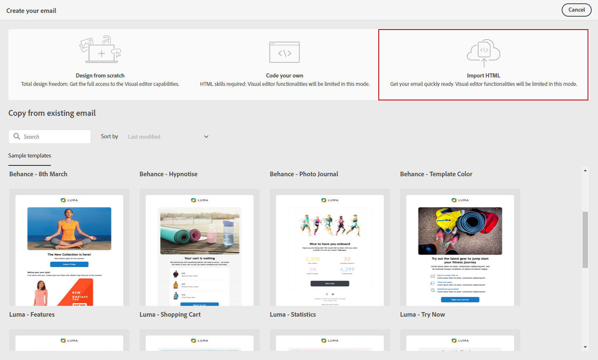

# 匯入您的電子郵件內容 {#existing-content}

>[!CONTEXTUALHELP]
>id="acw_deliveries_email_import_content"
>title="使用現有的電子郵件內容"
>abstract="電子郵件設計工具可讓您匯入現有的 HTML 內容。此內容可以是附有整合樣式表的 HTML 檔案，或是附有 HTML 檔案、樣式表 (.css) 和影像的 .zip 資料夾。"

您可以在電子郵件設計工具中匯入現有的HTML內容。 此內容可以是：

* **HTML 檔案**，內含整合的樣式表，
* **.zip 資料夾**，內含 HTML 檔案、樣式表 (.css) 和影像。

  >[!NOTE]
  >
  >.zip 檔案結構沒有限制。不過，參照必須是相對參照，而且能放在.zip資料夾的樹狀結構內。

➡️ [在影片中探索此功能](#video)

若要匯入包含HTML內容的檔案，請遵循下列步驟。

1. 在 [電子郵件設計工具](get-started-email-designer.md) 首頁，選取 **[!UICONTROL 匯入HTML]**.

   {zoomable=&quot;yes&quot;}

1. 拖放包含 HTML 內容的 HTML 或 .zip 檔案，然後按一下「**[!UICONTROL 匯入]**」。

1. 上傳HTML內容後，您的內容將會進入 **[!UICONTROL 相容性模式]**.

   在此模式中，您只能個人化您的文字、新增連結或包含資產至您的內容。

   {zoomable=&quot;yes&quot;}

1. 若要善用電子郵件設計工具內容元件，請存取 **[!UICONTROL HTML轉換工具]** 標籤並按一下 **[!UICONTROL 轉換]**.

   {zoomable=&quot;yes&quot;}

   >[!NOTE]
   >
   > 使用 `<table>` 標籤作為HTML檔案中的第一個圖層可能會造成樣式遺失，包括頂層圖層標籤中的背景和寬度設定。

1. 您現在可以根據需要使用電子郵件設計工具功能個人化匯入的檔案 [瞭解更多](content-components.md).

## 操作說明影片 {#video}

瞭解如何透過上傳HTML來建立電子郵件、如何使其與電子郵件設計工具相容以及如何將其轉換為範本。

>[!VIDEO](https://video.tv.adobe.com/v/3427633/?quality=12)
