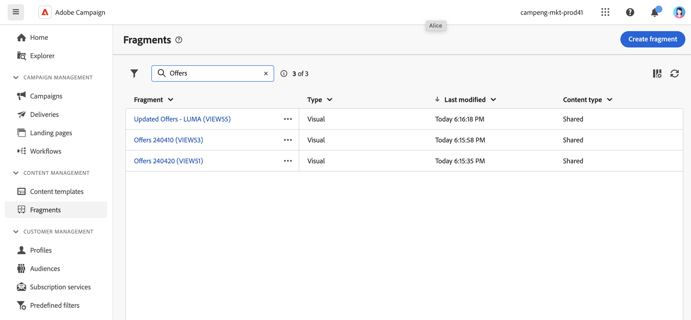
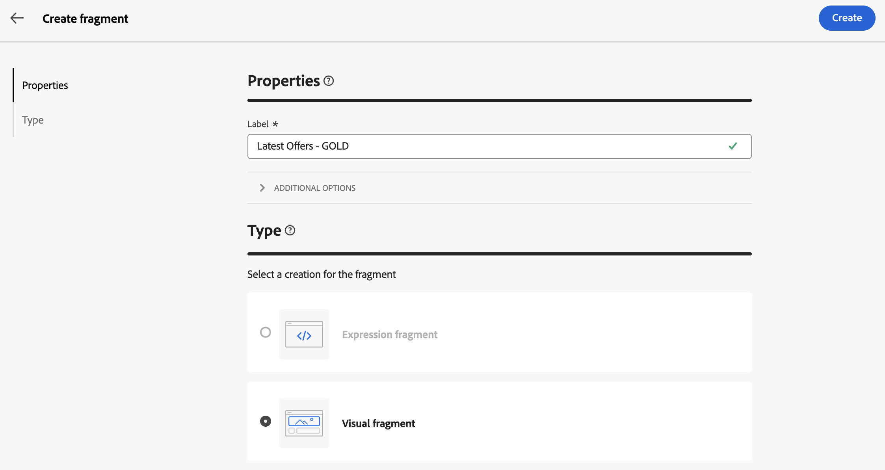
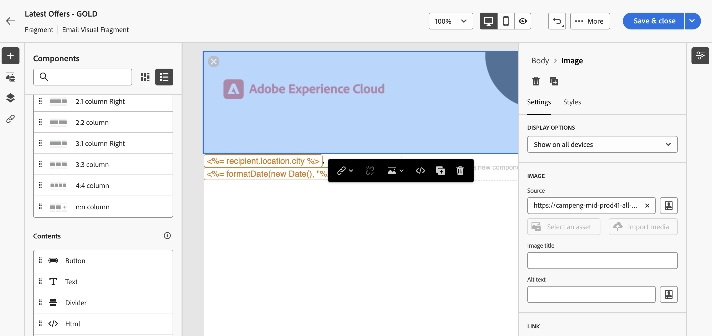
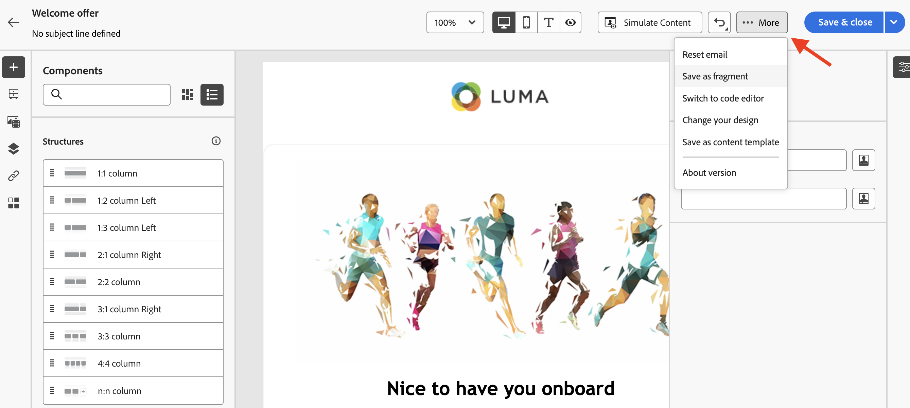
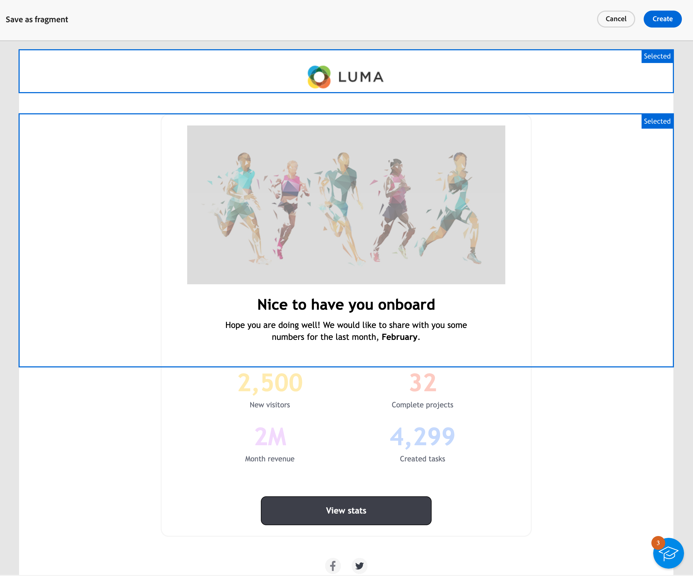
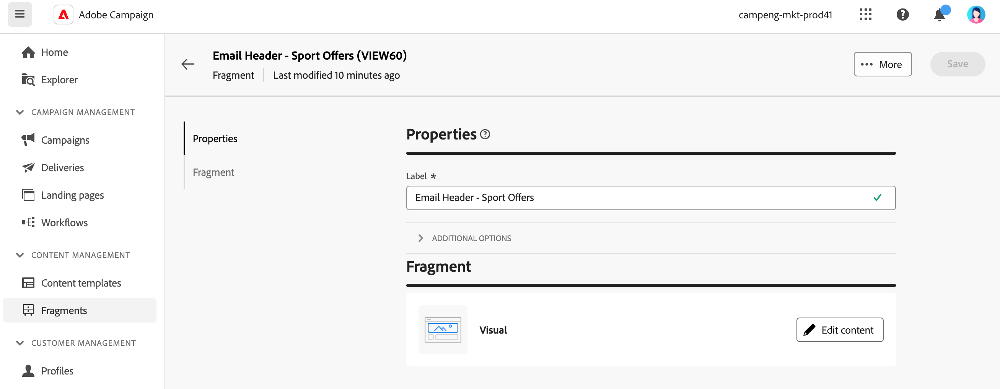

# 使用片段 {#fragments}

>[!CONTEXTUALHELP]
>id="acw_fragments_menu"
>title="定義你專屬的內容片段"
>abstract="片段是可重複使用的元件，可在跨行銷活動的一封或多封電子郵件中參考。"

>[!CONTEXTUALHELP]
>id="acw_fragments_save"
>title="片段儲存"
>abstract="片段儲存"

>[!CONTEXTUALHELP]
>id="acw_fragments_create"
>title="定義你專屬的內容片段"
>abstract="片段是可重複使用的元件，可在跨行銷活動的一封或多封電子郵件中參考。"

>[!CONTEXTUALHELP]
>id="acw_fragments_properties"
>title="片段屬性"
>abstract="片段屬性"

>[!CONTEXTUALHELP]
>id="acw_fragments_type"
>title="片段型別"
>abstract="選取片段型別。 目前，僅提供電子郵件的視覺片段。"

>[!CONTEXTUALHELP]
>id="acw_fragments_list"
>title="定義你專屬的內容片段"
>abstract="片段是可重複使用的元件，可在跨行銷活動的一封或多封電子郵件中參考。 您也可以在電子郵件範本中使用片段。 目前，僅視覺片段可用。"

>[!CONTEXTUALHELP]
>id="acw_fragments_details"
>title="片段詳細資料"
>abstract="片段詳細資料"

>[!CONTEXTUALHELP]
>id="acw_create_fragment"
>title="定義你專屬的內容片段"
>abstract="片段是可重複使用的元件，可在跨行銷活動的一封或多封電子郵件中參考。"

片段是可重複使用的元件，可在跨行銷活動的一封或多封電子郵件中參考。 修改片段時，使用該片段的每個內容都會更新。

此功能允許預先建置多個自訂內容區塊，可供行銷使用者在改良的設計流程中快速組合電子郵件內容。

若要充分利用片段：

* 建立您自己的視覺化片段，如下所述。
* 透過電子郵件設計工具，視需要在您的內容中多次使用。 另請參閱 [將視覺化片段新增至您的電子郵件](../email/use-visual-fragments.md).

## 建立視覺片段 {#create-fragments}

建立片段的方式有兩種：

* 使用，從頭開始建立片段 **[!UICONTROL 片段]** 專用功能表。 [了解做法](#create-from-scratch)

* 設計內容時，請將部分內容儲存為片段。 [了解做法](#save-as-fragment)

儲存後，您的片段即可用於電子郵件或電子郵件範本。 無論是從頭建立還是從現有內容建立，您現在都可以在在Campaign中建立任何內容時使用此片段。 另請參閱 [新增視覺片段](../email/use-visual-fragments.md).

### 從頭開始建立片段 {#create-from-scratch}

若要從頭開始建立片段，請遵循下列步驟。

1. [存取片段清單](#access-manage-fragments) 透過 **[!UICONTROL 內容管理]** > **[!UICONTROL 片段]** 左側功能表。

   

1. 選取 **[!UICONTROL 建立片段]**.

1. 輸入片段的標籤。

   

1. 如有需要，您可以定義其他選項，例如片段內部名稱、其資料夾和說明。

   >[!NOTE]
   >
   >目前，您只能建立視覺片段。

1. 按一下 **建立** 按鈕以設定片段的內容。

1. 此 [電子郵件設計工具](../email/get-started-email-designer.md) 顯示。 視需要編輯您的內容，就像處理行銷活動內的任何電子郵件一樣。 您可以新增影像、連結、個人化欄位和動態內容。

   

1. 片段準備就緒後，請按一下 **[!UICONTROL 儲存並關閉]**. 它會新增至 [片段清單](#access-manage-fragments).

此片段現在已準備好用於建立任何 [電子郵件](../email/get-started-email-designer.md) 或 [內容範本](use-email-templates.md) 在Campaign中。 [了解做法](../email/use-visual-fragments.md)

### 將內容另存為片段 {#save-as-fragment}

任何電子郵件內容都可以儲存為片段以供日後重複使用。 設計時 [內容範本](use-email-templates.md) 或 [電子郵件](../email/get-started-email-designer.md) 傳送時，您可以將部分內容儲存為視覺片段。 要執行此操作，請遵循下列步驟：

1. 在 [電子郵件設計工具](../email/get-started-email-designer.md)，按一下 **更多** 按鈕。

1. 選取 **[!UICONTROL 另存為片段]** （從下拉式功能表）。

   

1. 此 **[!UICONTROL 另存為片段]** 熒幕顯示。 在該處選取您要納入片段中的元素，包括個人化欄位和動態內容。

   >[!CAUTION]
   >
   >您只能選取彼此相鄰的截面。 您無法選取空的結構或其他片段。

   

1. 按一下 **[!UICONTROL 建立]**。填寫片段名稱並儲存。

   

   此內容現在是獨立的片段，已新增到 [片段清單](#manage-fragments)，並可從專用功能表存取。 您現在可以在建置任何 [電子郵件](../email/get-started-email-designer.md) 或 [內容範本](use-email-templates.md) 在Campaign中。 [了解做法](../email/use-visual-fragments.md)

>[!NOTE]
>
>對該新片段所做的任何變更都不會傳播到該新片段來自的電子郵件或範本。 同樣地，在該電子郵件或範本中編輯原始內容時，不會修改新片段。

## 管理您的片段 {#manage-fragments}

您可以從片段清單中編輯、更新、複製或刪除片段。

### 編輯和更新片段 {#edit-fragments}

若要編輯片段，請遵循以下步驟。

1. 從按一下要編輯的片段名稱 **[!UICONTROL 片段]** 清單。
1. 按一下 **編輯內容** 按鈕以開啟此片段的內容。

   

1. 進行必要的變更並儲存您的修改。

>[!CAUTION]
>
>對片段所做的任何變更都會傳播至使用此片段的電子郵件傳遞或範本。

### 刪除片段 {#delete-fragments}

要刪除片段，請執行以下步驟：

1. 瀏覽至片段清單，然後按一下 **[!UICONTROL 更多動作]** 要刪除的片段旁的按鈕。
1. 按一下 **刪除** 並確認。

   

>[!CAUTION]
>
>刪除內容片段時，會更新電子郵件傳遞和使用它的範本，並從其訊息內容中移除片段。 您可以視需要中斷繼承。 [了解更多](use-visual-fragments.md#break-inheritance)
>

### 復製片段 {#duplicate-fragments}

您可以輕鬆復製片段以建立新片段。 若要複製現有片段，請執行以下步驟：

1. 瀏覽至片段清單，然後按一下 **[!UICONTROL 更多動作]** 要刪除的片段旁的按鈕。
1. 按一下 **複製** 並確認。
1. 輸入新片段的標籤並儲存您的變更。

   片段會新增至片段清單。 您可以視需要編輯和設定它。
