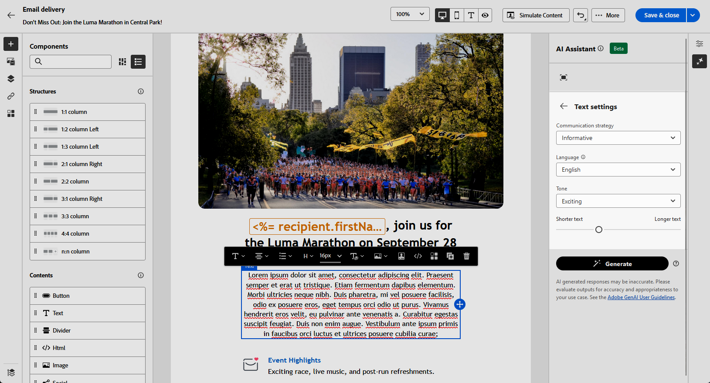

# 使用內容助理產生文字 {#generative-content}

建立電子郵件並將其個人化後，請使用創作AI所支援的內容助理將您的內容提升到新的境界。

內容助理可以建議更可能引起觀眾共鳴的不同內容，協助您最佳化傳送的影響。

>[!NOTE]
>
>在開始使用此功能之前，請先閱讀相關的 [護欄和限制](generative-gs.md#guardrails-and-limitations).

若要使用內容助理產生和改善電子郵件內容，請遵循下列步驟。 您也可以使用內容助理建立完整的HTML內容，如中所述 [此頁面](generative-email.md).

1. 建立及設定電子郵件傳遞後，請按一下 **[!UICONTROL 編輯內容]**.

   有關如何設定電子郵件傳送的詳細資訊，請參閱 [此頁面](../email/create-email-content.md).

1. 填入 **[!UICONTROL 基本詳細資訊]** 您的傳遞內容。 完成後，按一下 **[!UICONTROL 編輯電子郵件內容]**.

1. 視需要個人化您的電子郵件。

1. 選取 **[!UICONTROL 文字元件]** 您要更新並存取體驗產生功能表。

   {zoomable=&quot;yes&quot;}

1. 描述您要產生的內容，以微調內容。

   啟用 **[!UICONTROL 使用目前內容增強]** 「內容助理」的選項，用來根據您的傳遞、傳遞名稱和選取的對象來個人化新內容。

   {zoomable=&quot;yes&quot;}

1. 選取 **[!UICONTROL 上傳檔案]** 新增任何品牌資產，其中包含可在「內容助理」中提供額外內容的內容。

   您也可以按一下 **[!UICONTROL 上傳的內容]** 以尋找先前更新的檔案。 請注意，上傳的內容僅供目前使用者重複使用。

1. 選取 **[!UICONTROL 溝通策略]** 最符合您需求的產品。 這會影響產生文字的色調和樣式。

1. 選擇 **[!UICONTROL 語言]** 和 **[!UICONTROL 色調]** 您想要產生的文字所具有的屬性。 這將確保文字適合您的對象和目的。

   {zoomable=&quot;yes&quot;}

1. 使用滑桿控制項來設定產生文字的長度。

1. 提示就緒後，按一下 **[!UICONTROL 產生]**.

1. 瀏覽產生的專案 **[!UICONTROL 變數]** 並按一下 **[!UICONTROL 套用]** 找到適當的內容之後。

   {zoomable=&quot;yes&quot;}

1. 插入個人化欄位，以根據設定檔資料自訂您的電子郵件內容。 [進一步了解內容個人化](../personalization/personalize.md)

   {zoomable=&quot;yes&quot;}

1. 定義訊息內容後，按一下 **[!UICONTROL 模擬內容]** 按鈕來控制呈現，並使用測試設定檔檢查個人化設定。 [了解更多](../preview-test/preview-content.md)

   {zoomable=&quot;yes&quot;}

1. 當您定義內容、對象和排程時，就能準備電子郵件傳送。 [了解更多](../monitor/prepare-send.md)
