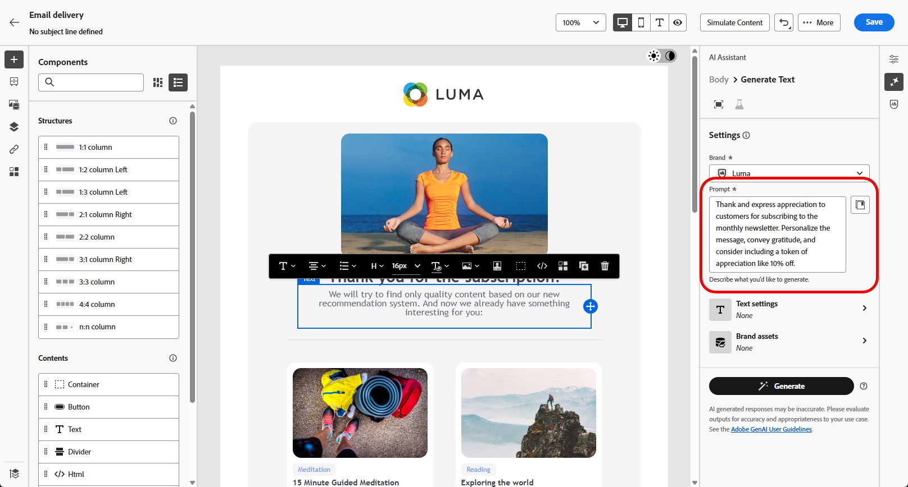

# 使用AI助理產生電子郵件 {#generative-content}

>[!BEGINSHADEBOX]

**目錄**

* [開始使用 AI 助理](generative-gs.md)
* **[使用AI助理產生電子郵件](generative-content.md)**
* [使用AI助理產生簡訊](generative-sms.md)
* [使用AI助理產生推播通知](generative-push.md)

>[!ENDSHADEBOX]

在您建立並個人化電子郵件後，請使用Campaign中由創作AI提供支援的Journey Optimizer AI Assistant，將您的內容提升到新的境界。

AI Assistant可以建議更可能引起觀眾共鳴的不同內容，協助您最佳化傳送的影響。

>[!NOTE]
>
>在開始使用此功能之前，請先閱讀相關的 [護欄和限制](generative-gs.md#guardrails-and-limitations).

## 使用AI助理產生內容 {#generative-text}

1. 建立及設定電子郵件傳遞後，請按一下 **[!UICONTROL 編輯內容]**.

   有關如何設定電子郵件傳送的詳細資訊，請參閱 [此頁面](../email/create-email-content.md).

1. 填入 **[!UICONTROL 基本詳細資訊]** 您的傳遞內容。 完成後，按一下 **[!UICONTROL 編輯內容]**.

1. 視需要個人化您的電子郵件。 [了解更多](content-components.md)

1. 存取 **[!UICONTROL AI助理]** 功能表。

   您也可以選取 **[!UICONTROL 文字元件]** 以僅鎖定特定內容。

   {zoomable=&quot;yes&quot;}

1. 描述您要在中產生的內容，以微調內容。 **[!UICONTROL 提示]** 欄位。

   如果您在製作提示時尋求協助，請存取 **[!UICONTROL 提示程式庫]** 其中會提供各式各樣的提示概念，以改善您的傳送作業。

   {zoomable=&quot;yes&quot;}

1. 切換 **[!UICONTROL 主旨列]** 或 **[!UICONTROL 預覽文字]** 以將它們包含在變體生成中。

1. 在「內容」功能表中，啟用 **[!UICONTROL 使用目前內容增強]** AI助理的選項，用來根據您的傳遞、傳遞名稱和選取的對象來個人化新內容。

   >[!IMPORTANT]
   >
   > 您的提示必須一律透過上傳品牌資產或啟用 **[!UICONTROL 增強目前的內容]** 選項。

1. 按一下 **[!UICONTROL 上傳品牌資產]** 新增任何品牌資產，其中包含可為AI助理提供額外內容的內容。

   {zoomable=&quot;yes&quot;}

1. 選取 **[!UICONTROL 溝通策略]** 最符合您需求的產品。 這會影響產生文字的色調和樣式。

1. 選擇 **[!UICONTROL 語言]** 和 **[!UICONTROL 色調]** 您想要產生的文字所具有的屬性。 這將確保文字適合您的對象和目的。

   {zoomable=&quot;yes&quot;}

1. 提示就緒後，按一下 **[!UICONTROL 產生]**.

1. 瀏覽產生的專案 **[!UICONTROL 變數]** 並按一下 **[!UICONTROL 套用]** 找到適當的內容之後。

   按一下 **[!UICONTROL 預覽]** 以檢視所選變數的全熒幕版本。

   {zoomable=&quot;yes&quot;}

1. 插入個人化欄位，以根據設定檔資料自訂您的電子郵件內容。 [進一步了解內容個人化](../personalization/personalize.md)

   {zoomable=&quot;yes&quot;}

1. 定義訊息內容後，按一下 **[!UICONTROL 模擬內容]** 按鈕來控制呈現，並使用測試設定檔檢查個人化設定。 [了解更多](../preview-test/preview-content.md)

   {zoomable=&quot;yes&quot;}

1. 當您定義內容、對象和排程時，就能準備電子郵件傳送。 [了解更多](../monitor/prepare-send.md)

## 使用AI助理產生影像 {#generative-image}

在以下範例中，瞭解如何運用AI Assistant來最佳化和改善您的內容，確保更方便使用者的體驗。 請依照下列步驟操作：

1. 建立及設定電子郵件傳遞後，請按一下 **[!UICONTROL 編輯內容]**.

   有關如何設定電子郵件傳送的詳細資訊，請參閱 [此頁面](../email/create-email-content.md).

1. 填入 **[!UICONTROL 基本詳細資訊]** 您的傳遞內容。 完成後，按一下 **[!UICONTROL 編輯電子郵件內容]**.

1. 選取您要使用AI助理變更的資產。

1. 從右側功能表中選取 **[!UICONTROL AI助理]**.

   {zoomable=&quot;yes&quot;}

1. 描述您要在中產生的內容，以微調內容。 **[!UICONTROL 提示]** 欄位。

   如果您在製作提示時尋求協助，請存取 **[!UICONTROL 提示程式庫]** 其中會提供各式各樣的提示概念，以改善您的傳送作業。

   {zoomable=&quot;yes&quot;}

1. 按一下 **[!UICONTROL 上傳品牌資產]** 新增任何品牌資產，其中包含可為AI助理提供額外內容的內容。

   >[!IMPORTANT]
   >
   > 您的提示必須一律繫結至特定內容。

1. 選取 **[!UICONTROL 外觀比例]** ，則不會產生任何影響。 這會決定資產的寬度和高度。

   您可以選擇一般比例，例如16:9、4:3、3:2或1:1，或者輸入自訂大小。

1. 自訂 **[!UICONTROL 色彩和色調]**， **[!UICONTROL 內容型別]**， **[!UICONTROL 照明]** 和 **[!UICONTROL 組合]** 設定以符合您所需的資產特性。

   {zoomable=&quot;yes&quot;}

1. 在您滿意提示設定後，請按一下 **[!UICONTROL 產生]**.

1. 瀏覽 **[!UICONTROL 變數建議]** 以尋找所需的資產。

   按一下 **[!UICONTROL 預覽]** 以檢視所選變數的全熒幕版本。

   {zoomable=&quot;yes&quot;}

1. 選擇 **[!UICONTROL 顯示類似專案]** 如果您想要檢視與此變體相關的影像。

1. 按一下 **[!UICONTROL 選取]** 找到適當的內容之後。

   {zoomable=&quot;yes&quot;}

1. 定義訊息內容後，按一下 **[!UICONTROL 模擬內容]** 按鈕來控制呈現，並使用測試設定檔檢查個人化設定。  [了解更多](../preview-test/preview-content.md)

   {zoomable=&quot;yes&quot;}

1. 當您定義內容、對象和排程時，就能準備電子郵件傳送。 [了解更多](../monitor/prepare-send.md)
