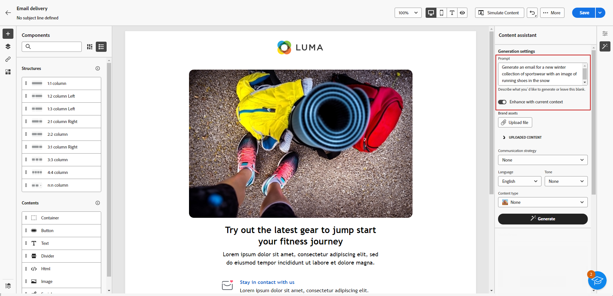

# 使用內容助理產生電子郵件 {#generative-email}

「內容小幫手」可自動產生完整的電子郵件內容，為您節省時間並確保品質的一致性，因此可增強您通訊的影響。 使用Generative AI，您可以輕鬆製作吸引人的電子郵件，引起觀眾的共鳴，讓您的溝通更有效率。

>[!NOTE]
>
>在開始使用此功能之前，請先閱讀相關的 [護欄和限制](generative-gs.md#guardrails-and-limitations).

若要使用內容助理產生電子郵件內容，請遵循下列步驟。 您也可以使用內容助理來改善現有內容，如中所述 [此頁面](generative-content.md).

1. 建立及設定電子郵件傳遞後，請按一下 **[!UICONTROL 建立內容]**.

   有關如何設定電子郵件傳送的詳細資訊，請參閱 [此頁面](../email/create-email-content.md).

1. 填入 **[!UICONTROL 基本詳細資訊]** 您的傳遞內容。 完成後，按一下 **[!UICONTROL 編輯電子郵件內文]**.

1. 選擇您希望「內容助理」作為產生電子郵件基礎的設計範本。

   您也可以匯入HTML檔案。

1. 從右側功能表中選取 **[!UICONTROL 體驗產生]**.

   

1. 描述您要產生的內容，以微調內容。

   以下是一些提示範例：

   * 新聞稿：每月產生新聞稿，其中提供旅遊文章、目的地重點提示和專屬訂閱者優惠。
   * 意見回饋與調查：建立電子郵件，邀請客戶就其最近的軟體體驗提供意見回饋，並參與產品改進調查。
   * 針對週年或生日電子郵件：產生生日電子郵件、慶祝客戶的特殊日子並提供生日折扣。

   

1. 選取 **[!UICONTROL 上傳檔案]** 如果您想要新增任何品牌資產，其中包含的內容可向內容助理提供其他內容。

   您也可以按一下 **[!UICONTROL 上傳的內容]** 以尋找先前更新的檔案。 請注意，上傳的內容僅供目前使用者重複使用。

1. 選取 **[!UICONTROL 溝通策略]** 最符合您需求的產品。 這會影響產生之電子郵件的語調和風格。

1. 選擇 **[!UICONTROL 語言]** 和 **[!UICONTROL 色調]** 您想要產生的文字所具有的屬性。 這將確保文字適合您的對象和目的。

   

1. 自訂 **[!UICONTROL 內容型別]** 資產設定以符合您所需的資產特性。

1. 提示就緒後，按一下 **[!UICONTROL 產生]**.

1. 瀏覽 **[!UICONTROL 變數建議]** 以尋找所需的電子郵件。 按一下 **[!UICONTROL 預覽]** 以檢視所選變數的全熒幕版本。

   

1. 按一下 **[!UICONTROL 選取]** 找到適當的內容之後。

   

1. 插入個人化欄位，以根據設定檔資料自訂電子郵件內容，或視需要進一步個人化您的內容。 [進一步了解內容個人化](../personalization/personalize.md)

1. 定義電子郵件內容後，按一下 **[!UICONTROL 模擬內容]** 按鈕來控制呈現，並使用測試設定檔檢查個人化設定。  [了解更多](../preview-test/preview-content.md)

   

1. 當您定義內容、對象和排程時，就能準備電子郵件傳送。 [了解更多](../monitor/prepare-send.md)
