# 使用 AI 助理產生登陸頁面{#generative-lp}

>[!IMPORTANT]
>
>開始使用此功能之前，請先閱讀相關的[護欄和限制](generative-gs.md#generative-guardrails)。
> 
>
>您必須先同意[使用者合約](https://www.adobe.com/tw/legal/licenses-terms/adobe-dx-gen-ai-user-guidelines.html)，才能在Adobe Campaign網頁中使用AI小幫手。 如需詳細資訊，請聯絡您的 Adobe 代表。

使用Adobe Campaign Web中的AI助理來轉換您的登入頁面，該助理由創作AI提供技術支援。

輕鬆建立具影響力的內容，包括完整頁面、量身打造的文字片段，以及可引起觀眾共鳴的自訂視覺效果，進而促進參與度和互動。

探索以下標籤，瞭解如何在Adobe Campaign網頁中使用AI助理。

>[!BEGINTABS]

>[!TAB 產生完整登陸頁面]

在以下範例中，瞭解如何運用AI助理來調整現有的登入頁面範本。

1. 建立及設定您的登入頁面後，請按一下[編輯內容]。**&#x200B;**

   如需如何設定登入頁面的詳細資訊，請參閱[此頁面](../landing-pages/create-lp.md)。

1. 視需要個人化您的版面，並存取&#x200B;**[!UICONTROL AI小幫手]**&#x200B;功能表。

   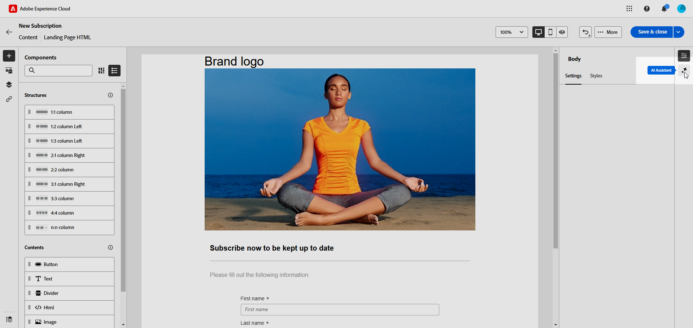{zoomable="yes"}

1. 啟用AI助理的&#x200B;**[!UICONTROL 使用原始內容]**&#x200B;選項，以根據選取的內容個人化新內容。

1. 描述您要在&#x200B;**[!UICONTROL 提示]**&#x200B;欄位中產生的內容，以微調內容。

   如果您在製作提示時需要協助，請存取&#x200B;**[!UICONTROL 提示程式庫]**，它提供各種提示概念，以改善您的登入頁面。

   ![顯示[提示程式庫]介面的熒幕擷圖。](assets/lp_full_gen_2.png){zoomable="yes"}

1. 使用&#x200B;**[!UICONTROL 文字設定]**&#x200B;選項量身打造您的提示：

   * **[!UICONTROL 通訊策略]**：選擇最適合您產生文字的通訊樣式。
   * **[!UICONTROL 膚色]**：登陸頁面的膚色應該會對您的對象產生共鳴。 無論您是要提供豐富資訊、好玩或有說服力，AI Assistant都能據以調整訊息。

   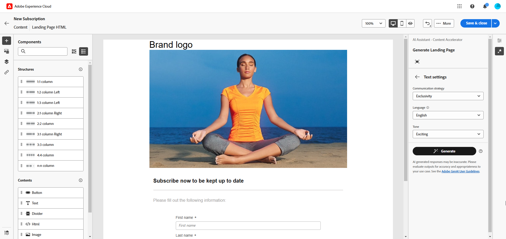{zoomable="yes"}

1. 選擇您的&#x200B;**[!UICONTROL 影像設定]**：

   * **[!UICONTROL 內容型別]**：將視覺元素的本質分類，區分不同的視覺呈現形式，例如像片、圖形或藝術品。
   * **[!UICONTROL 視覺強度]**：調整影像的強度，控制影像的影響。 較低的設定(2)可建立較柔和的外觀，而較高的設定(10)則使影像更鮮豔。
   * **[!UICONTROL 色彩和色調]**：調整影像中顏色的整體外觀及其傳達的氣氛或氣氛。
   * **[!UICONTROL 光線]**：修改影像中的光線，以調整其氣氛並反白顯示特定元素。
   * **[!UICONTROL 構成]**：在影像框架中排列元素。

   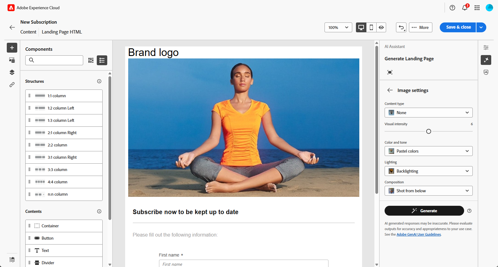{zoomable="yes"}

1. 從&#x200B;**[!UICONTROL 品牌資產]**&#x200B;功能表，按一下&#x200B;**[!UICONTROL 上傳品牌資產]**&#x200B;以新增任何為AI助理提供額外內容的品牌資產，或選取先前上傳的品牌資產。

   先前上傳的檔案可在&#x200B;**[!UICONTROL 已上傳的品牌資產]**&#x200B;下拉式清單中使用。 切換您要納入產生程式的資產。

   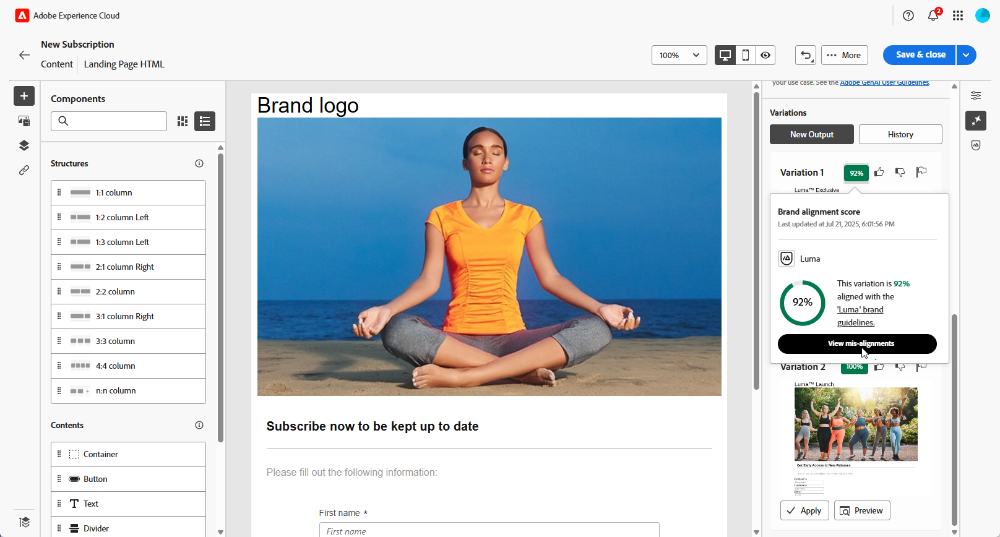{zoomable="yes"}

1. 提示就緒後，請按一下[產生]。**&#x200B;**

1. 瀏覽產生的&#x200B;**[!UICONTROL 變數]**，然後按一下&#x200B;**[!UICONTROL 預覽]**&#x200B;以檢視所選變數的全熒幕版本。

1. 導覽至&#x200B;**[!UICONTROL 預覽]**&#x200B;視窗中的&#x200B;**[!UICONTROL 調整]**&#x200B;選項，以存取其他自訂功能：

   * **[!UICONTROL 重述]**： AI Assistant可以不同的方式重述您的訊息，讓您的寫作保持新鮮，並吸引不同受眾。
   * **[!UICONTROL 使用較簡單的語言]**：簡化您的語言，確保更廣大的受眾能夠清楚無誤地使用。

   您也可以變更文字的&#x200B;**[!UICONTROL 音調]**&#x200B;和&#x200B;**[!UICONTROL 通訊策略]**。

   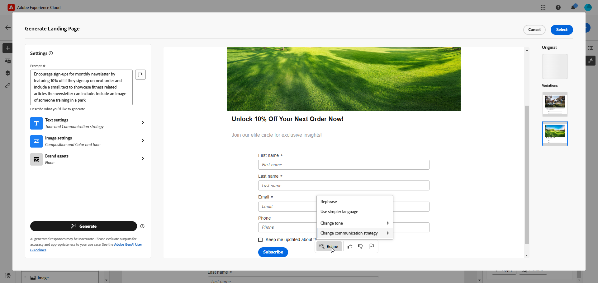{zoomable="yes"}

1. 找到適當的內容後，按一下&#x200B;**[!UICONTROL 選取]**。

1. 插入個人化欄位，以根據設定檔資料自訂您的登入頁面內容。 然後，按一下&#x200B;**[!UICONTROL 模擬內容]**&#x200B;按鈕以控制轉譯，並使用測試設定檔檢查個人化設定。 [了解更多](../landing-pages/create-lp.md#test-landing-page)。

一旦您的登入頁面準備就緒後，請發佈該頁面，使其可用於訊息中。 [了解更多](../landing-pages/create-lp.md#publish-landing-page)。

>[!TAB 只產生文字]

在以下範例中，瞭解如何運用AI助理來增強登入頁面的內容。

1. 建立及設定您的登入頁面後，請按一下[編輯內容]。**&#x200B;**

   如需如何設定登入頁面的詳細資訊，請參閱[此頁面](../landing-pages/create-lp.md)。

1. 選取&#x200B;**[!UICONTROL 文字元件]**&#x200B;以鎖定特定內容，並存取&#x200B;**[!UICONTROL AI助理]**&#x200B;功能表。

   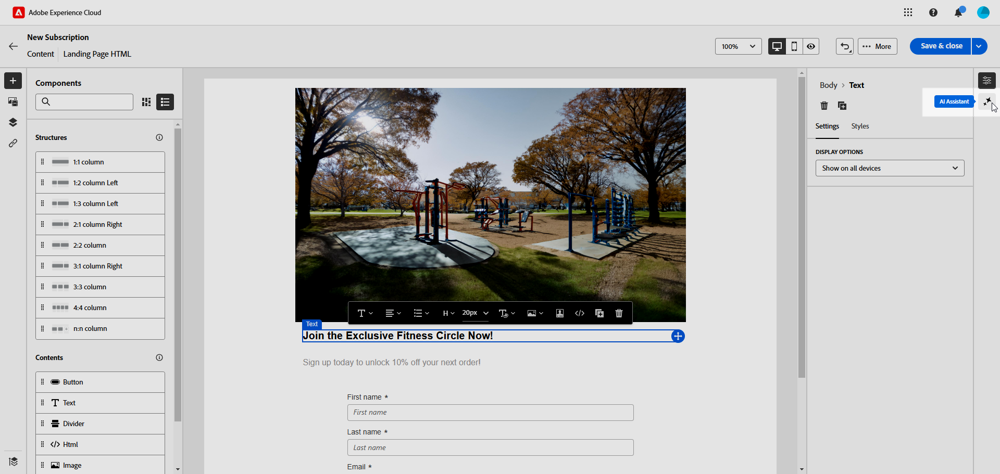{zoomable="yes"}

1. 啟用AI助理的&#x200B;**[!UICONTROL 使用原始內容]**&#x200B;選項，以根據選取的內容個人化新內容。

1. 描述您要在&#x200B;**[!UICONTROL 提示]**&#x200B;欄位中產生的內容，以微調內容。

   如果您在製作提示時需要協助，請存取&#x200B;**[!UICONTROL 提示程式庫]**，它提供各種提示概念，以改善您的登入頁面。

   ![顯示[提示程式庫]介面的熒幕擷圖。](assets/lp-text-genai-2.png){zoomable="yes"}

1. 使用&#x200B;**[!UICONTROL 文字設定]**&#x200B;選項量身打造您的提示：

   * **[!UICONTROL 通訊策略]**：選擇最適合您產生文字的通訊樣式。
   * **[!UICONTROL 膚色]**：登陸頁面的膚色應該會對您的對象產生共鳴。 無論您是要提供豐富資訊、好玩或有說服力，AI Assistant都能據以調整訊息。
   * **文字長度**：使用滑桿來選取所要的文字長度。

   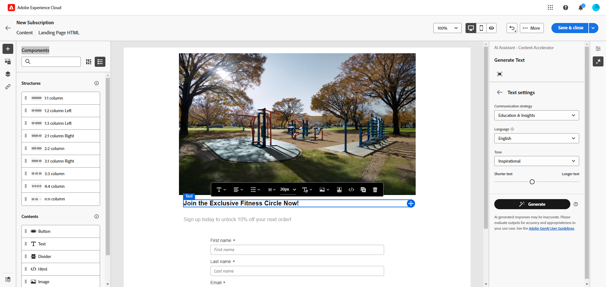{zoomable="yes"}

1. 從&#x200B;**[!UICONTROL 品牌資產]**&#x200B;功能表，按一下&#x200B;**[!UICONTROL 上傳品牌資產]**&#x200B;以新增任何為AI助理提供額外內容的品牌資產，或選取先前上傳的品牌資產。

   先前上傳的檔案可在&#x200B;**[!UICONTROL 已上傳的品牌資產]**&#x200B;下拉式清單中使用。 切換您要納入產生程式的資產。

   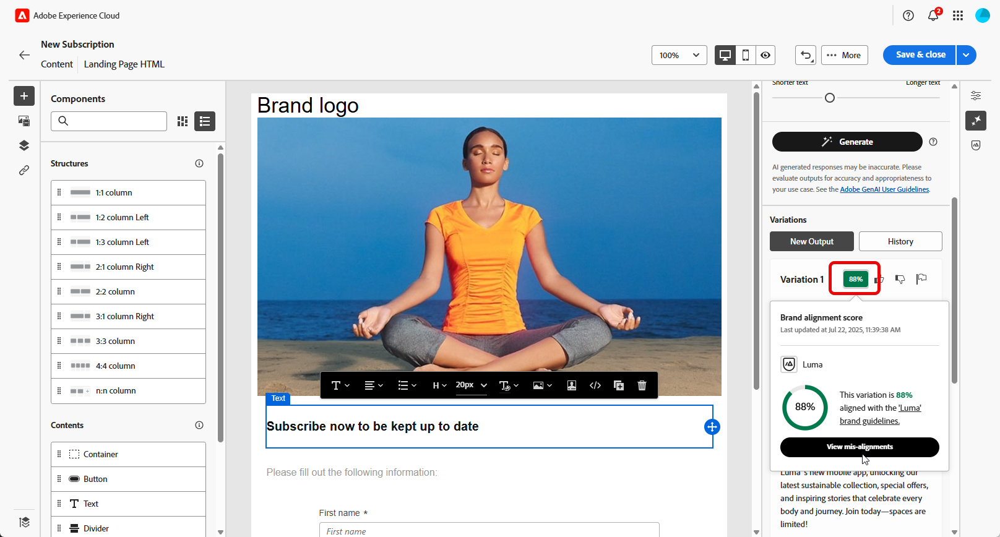{zoomable="yes"}

1. 提示就緒後，請按一下[產生]。**&#x200B;**

1. 瀏覽產生的&#x200B;**[!UICONTROL 變數]**，然後按一下&#x200B;**[!UICONTROL 預覽]**&#x200B;以檢視所選變數的全熒幕版本。

1. 導覽至&#x200B;**[!UICONTROL 預覽]**&#x200B;視窗中的&#x200B;**[!UICONTROL 調整]**&#x200B;選項，以存取其他自訂功能：

   * **[!UICONTROL 使用作為參考內容]**：選擇的變體將作為參考內容以產生其他結果。
   * **[!UICONTROL 精心設計]**：展開特定主題，提供更多詳細資訊，以增進瞭解與參與。
   * **[!UICONTROL 摘要]**：將冗長的資訊濃縮為清晰、簡潔的摘要，以吸引注意並鼓勵進一步閱讀。
   * **[!UICONTROL 重述]**：以不同的方式重述您的訊息，讓您的寫作保持新鮮，並吸引不同受眾。
   * **[!UICONTROL 使用較簡單的語言]**：簡化您的語言，確保更廣大的受眾能夠清楚無誤地使用。

   您也可以變更文字的&#x200B;**[!UICONTROL 音調]**&#x200B;和&#x200B;**[!UICONTROL 通訊策略]**。

   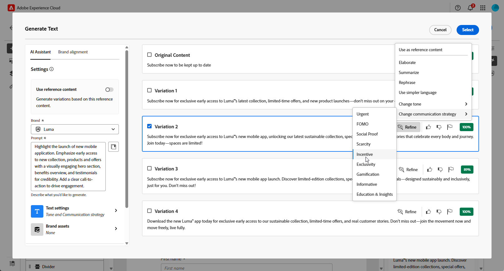{zoomable="yes"}

1. 找到適當的內容後，按一下&#x200B;**[!UICONTROL 選取]**。

1. 插入個人化欄位，以根據設定檔資料自訂您的登入頁面內容。 然後，按一下&#x200B;**[!UICONTROL 模擬內容]**&#x200B;按鈕以控制轉譯，並使用測試設定檔檢查個人化設定。 [了解更多](../landing-pages/create-lp.md#test-landing-page)。

一旦您的登入頁面準備就緒後，請發佈該頁面，使其可用於訊息中。 [了解更多](../landing-pages/create-lp.md#publish-landing-page)。

>[!TAB 只產生影像]

在以下範例中，瞭解如何運用AI Assistant來最佳化和改善您的資產，確保更方便使用者的體驗。

1. 建立及設定您的登入頁面後，請按一下[編輯內容]。**&#x200B;**

   如需如何設定登入頁面的詳細資訊，請參閱[此頁面](../landing-pages/create-lp.md)。

1. 選取您要使用AI助理變更的資產。

1. 從右側功能表選取&#x200B;**[!UICONTROL AI小幫手]**。

   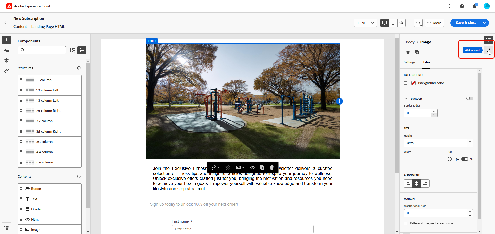{zoomable="yes"}

1. 啟用AI助理的&#x200B;**[!UICONTROL 參考樣式]**&#x200B;選項，以根據參考內容個人化新內容。 您也可以上傳影像以將內容新增至您的變數。

1. 描述您要在&#x200B;**[!UICONTROL 提示]**&#x200B;欄位中產生的內容，以微調內容。

   如果您在製作提示時需要協助，請存取&#x200B;**[!UICONTROL 提示程式庫]**，它提供各種提示概念，以改善您的登入頁面。

   ![顯示[提示程式庫]介面的熒幕擷圖。](assets/lp-image-gen-2.png){zoomable="yes"}

1. 使用&#x200B;**[!UICONTROL 影像設定]**&#x200B;選項量身打造您的提示：

   * **[!UICONTROL 外觀比例]**：決定資產的寬度和高度。 從常見比例（如16:9、4:3、3:2或1:1）中選擇，或輸入自訂大小。
   * **[!UICONTROL 內容型別]**：將視覺元素的本質分類，區分不同的視覺呈現形式，例如像片、圖形或藝術品。
   * **[!UICONTROL 視覺強度]**：調整影像的強度，控制影像的影響。 較低的設定(2)可建立較柔和的外觀，而較高的設定(10)則使影像更鮮豔。
   * **[!UICONTROL 色彩和色調]**：調整影像中顏色的整體外觀及其傳達的氣氛或氣氛。
   * **[!UICONTROL 光線]**：修改影像中的光線，以調整其氣氛並反白顯示特定元素。
   * **[!UICONTROL 構成]**：在影像框架中排列元素。

   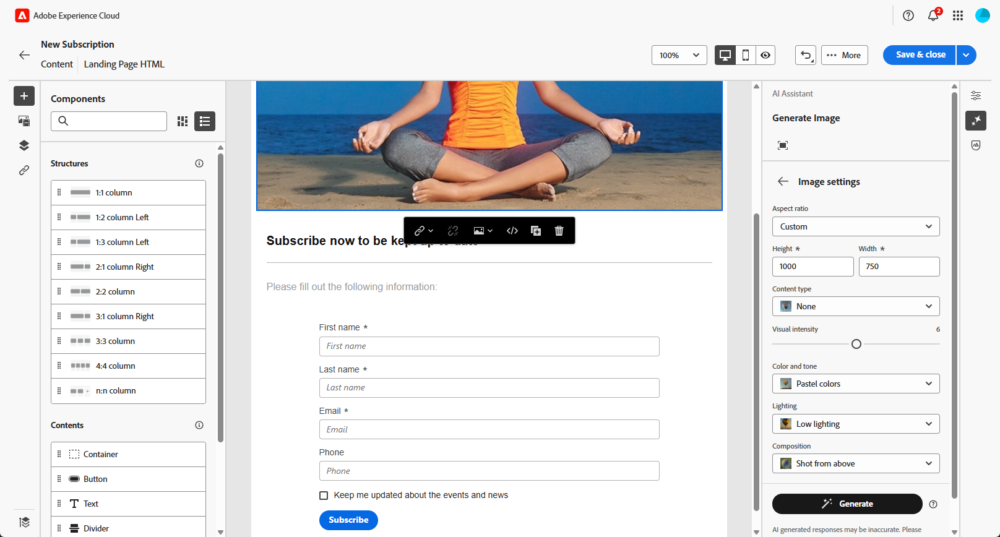{zoomable="yes"}

1. 從&#x200B;**[!UICONTROL 品牌資產]**&#x200B;功能表，按一下&#x200B;**[!UICONTROL 上傳品牌資產]**&#x200B;以新增任何為AI助理提供額外內容的品牌資產，或選取先前上傳的品牌資產。

   先前上傳的檔案可在&#x200B;**[!UICONTROL 已上傳的品牌資產]**&#x200B;下拉式清單中使用。 切換您要納入產生程式的資產。

1. 在您滿意提示組態之後，請按一下[產生]。**&#x200B;**

1. 瀏覽&#x200B;**[!UICONTROL 變數建議]**&#x200B;以尋找所需的資產。

   按一下&#x200B;**[!UICONTROL 預覽]**&#x200B;以檢視所選變數的全熒幕版本。

1. 如果要檢視與此變體相關的影像，請選擇&#x200B;**[!UICONTROL 產生類似專案]**。

   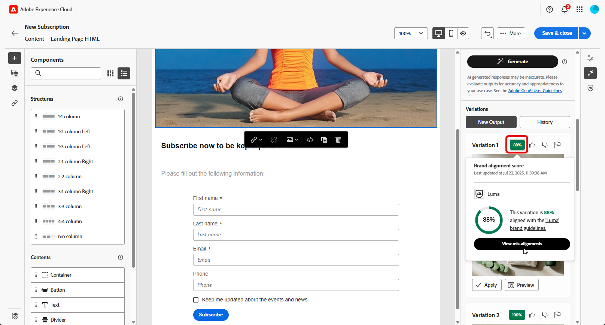{zoomable="yes"}

1. 找到適當的內容後，按一下&#x200B;**[!UICONTROL 選取]**。

1. 定義訊息內容後，按一下&#x200B;**[!UICONTROL 模擬內容]**&#x200B;按鈕以控制轉譯，並使用測試設定檔檢查個人化設定。 [了解更多](../landing-pages/create-lp.md#test-landing-page)。

一旦您的登入頁面準備就緒後，請發佈該頁面，使其可用於訊息中。 [了解更多](../landing-pages/create-lp.md#publish-landing-page)。

>[!ENDTABS]