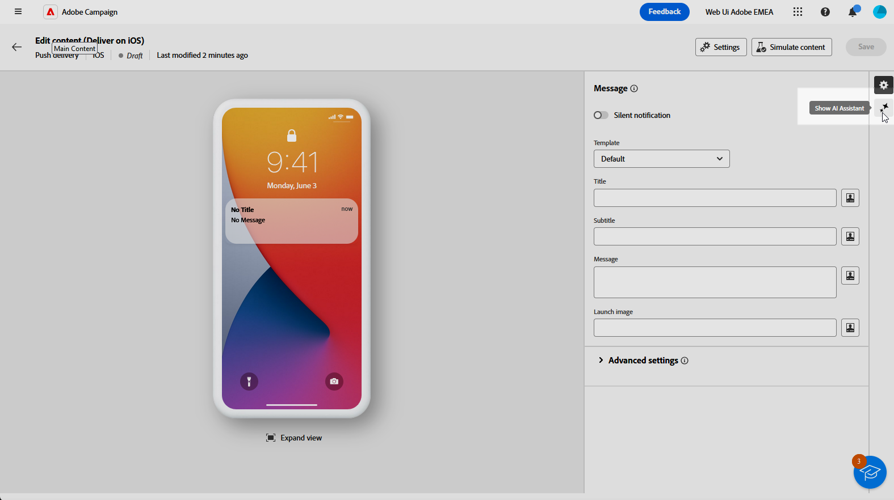
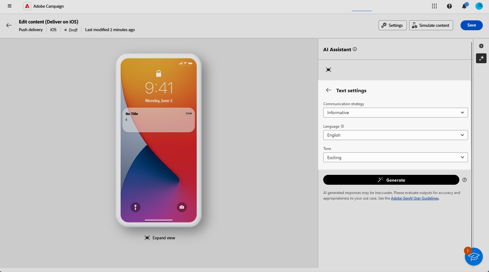
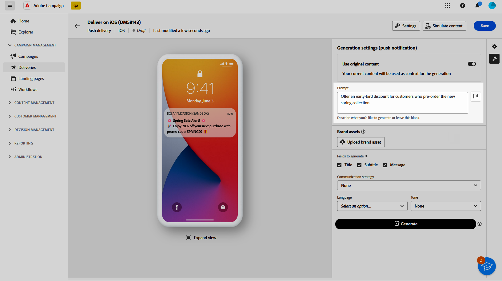
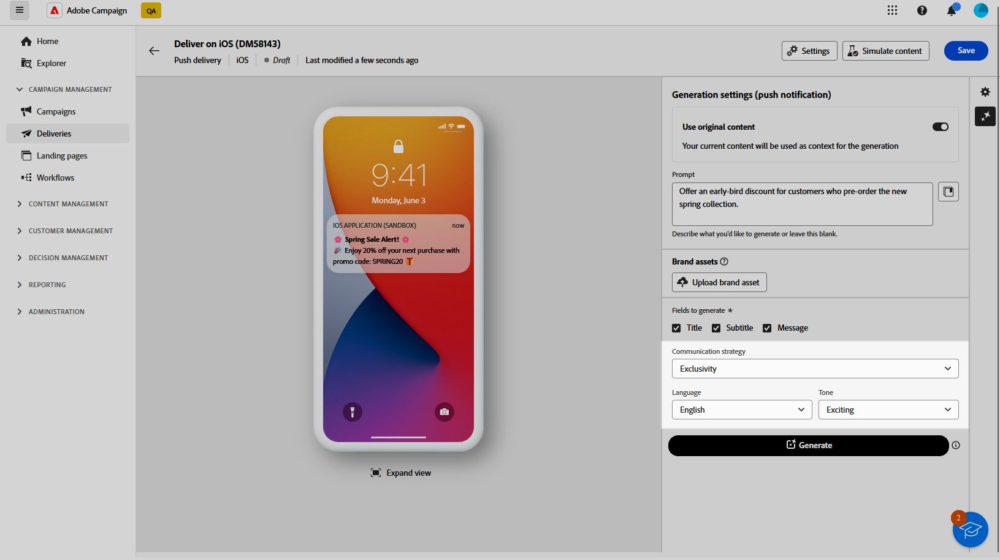
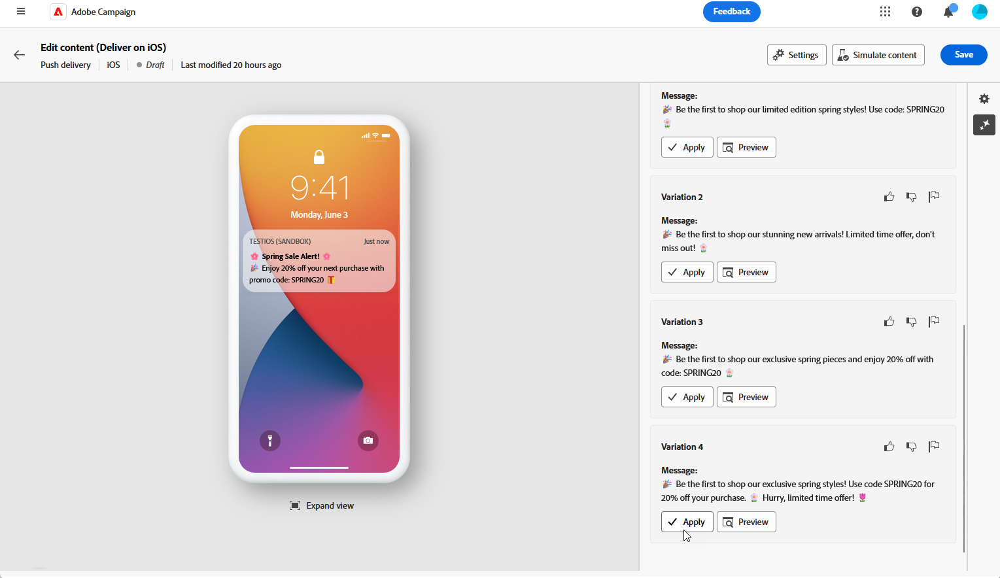
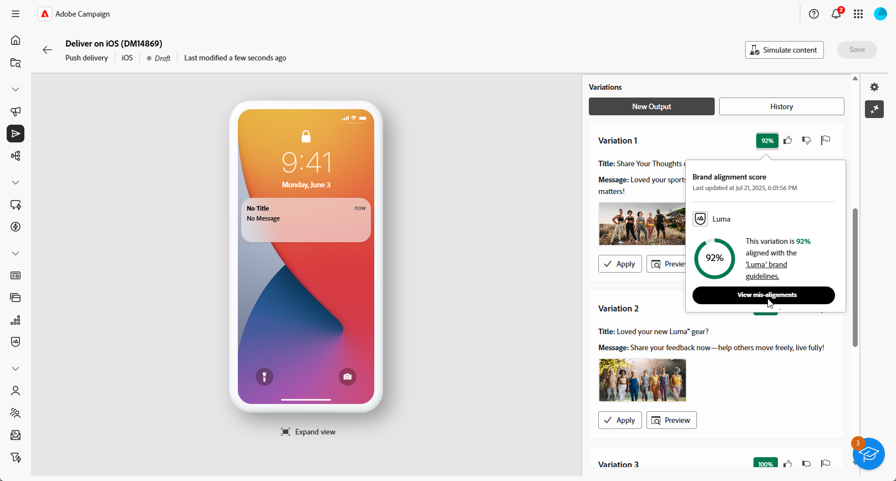

# 使用 AI 助理產生推播 {#generative-push}

>[!BEGINSHADEBOX]

**目錄**

* [開始使用 AI 助理](generative-gs.md)
* [使用 AI 助理產生電子郵件](generative-content.md)
* [使用 AI 助理產生簡訊](generative-sms.md)
* 使用 AI 助理產生推播

>[!ENDSHADEBOX]

AI Assistant可以建議更可能引起觀眾共鳴的不同內容，協助您最佳化傳送的影響。

>[!NOTE]
>
>在開始使用此功能之前，請先閱讀相關的 [護欄和限制](generative-gs.md#generative-guardrails).

在以下範例中，我們將利用AI助理製作吸引人的訊息，以打造更吸引人的客戶體驗。

1. 建立並設定推播通知傳送後，請按一下 **[!UICONTROL 編輯內容]**.

   有關如何設定推送傳送的詳細資訊，請參閱 [此頁面](../push/create-push.md).

1. 填入 **[!UICONTROL 基本詳細資訊]** 您的傳遞內容。 完成後，按一下 **[!UICONTROL 編輯內容]**.

1. 視需要個人化您的推播通知。 [了解更多](../push/content-push.md)

1. 存取 **[!UICONTROL 顯示AI助理]** 功能表。

   {zoomable=&quot;yes&quot;}

1. 啟用 **[!UICONTROL 使用原始內容]** AI助理的選項，用來根據您的傳遞、傳遞名稱和選取的對象來個人化新內容。

   >[!IMPORTANT]
   >
   > 您的提示必須一律繫結至您目前的內容。

   {zoomable=&quot;yes&quot;}

1. 描述您要在中產生的內容，以微調內容。 **[!UICONTROL 提示]** 欄位。

   如果您在製作提示時尋求協助，請存取 **[!UICONTROL 提示程式庫]** 其中會提供各式各樣的提示概念，以改善您的傳送作業。

   {zoomable=&quot;yes&quot;}

1. 選取 **[!UICONTROL 上傳品牌資產]** 新增任何品牌資產，其中包含可為AI助理提供額外內容的內容。

1. 選擇要產生的欄位： **[!UICONTROL 標題]**， **[!UICONTROL 子標題]** 或 **[!UICONTROL 訊息]**.

1. 使用不同的選項量身打造您的提示：

   * **[!UICONTROL 溝通策略]**：為您的產生文字選擇最合適的通訊樣式。
   * **[!UICONTROL 語言]**：選取您要產生內容的語言。
   * **[!UICONTROL 色調]**：您電子郵件的語調應該會引起您的聽眾的共鳴。 無論您是要提供豐富資訊、好玩或有說服力， AI Assistant都能據以調整訊息。

   {zoomable=&quot;yes&quot;}

1. 提示就緒後，按一下 **[!UICONTROL 產生]**.

1. 瀏覽產生的專案 **[!UICONTROL 變數]** 並按一下 **[!UICONTROL 預覽]** 以檢視所選變數的全熒幕版本。

1. 導覽至 **[!UICONTROL 細化]** 中的選項 **[!UICONTROL 預覽]** 視窗以存取其他自訂功能：

   * **[!UICONTROL 用作參考內容]**：選擇的變體將作為參考內容，用於產生其他結果。

   * **[!UICONTROL 重新片語]**： AI Assistant可以不同方式重新表述您的訊息，讓您的新撰寫保持新穎，並吸引不同受眾。

   * **[!UICONTROL 使用更簡單的語言]**：運用AI Assistant簡化您的語言，確保更廣大的受眾擁有清晰度和可存取性。

   {zoomable=&quot;yes&quot;}

1. 按一下 **[!UICONTROL 選取]** 找到適當的內容之後。

1. 插入個人化欄位，以根據設定檔資料自訂您的電子郵件內容。 然後，按一下 **[!UICONTROL 模擬內容]** 按鈕來控制呈現，並使用測試設定檔檢查個人化設定。 [了解更多](../preview-test/preview-content.md)

   {zoomable=&quot;yes&quot;}

定義內容、對象和排程後，您就可以準備推送傳送。 [了解更多](../monitor/prepare-send.md)

