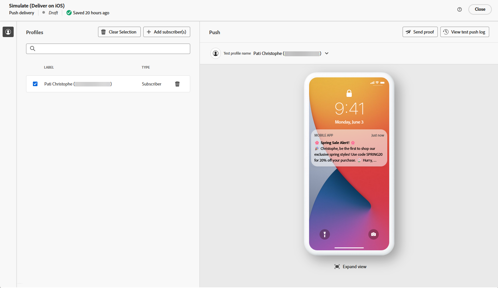

# 使用 AI 助理產生推播 {#generative-push}

>[!BEGINSHADEBOX]

**目錄**

* [開始使用 AI 助理](generative-gs.md)
* [使用 AI 助理產生電子郵件](generative-content.md)
* [使用 AI 助理產生簡訊](generative-sms.md)
* **[使用AI助理產生推播通知](generative-push.md)**

>[!ENDSHADEBOX]

AI Assistant可以建議更可能引起觀眾共鳴的不同內容，協助您最佳化傳送的影響。

有了AI助理，您的內容可以提升到新的高度。 例如，它可用於：

* **摘要**：將冗長的內容濃縮為推播通知的簡明摘要。 直接切入正題，確保收件者立即掌握關鍵訊息。
* **精緻**：展開推播通知中的主題，提供其他詳細資訊和內容，以便更清楚瞭解。
* **簡化語言**：使用簡潔明瞭的語言，讓更廣泛的對象都能存取您的推播通知。
* **重新片語**：讓AI助理以不同方式重新措辭您的訊息，以避免重複
* **變更色調**：變更推播通知的情緒基調。 無論您是要提供資訊、好玩或緊急，AI Assistant都能據以調整訊息。

>[!NOTE]
>
>在開始使用此功能之前，請先閱讀相關的 [護欄和限制](generative-gs.md#guardrails-and-limitations).

在以下範例中，我們將利用AI助理製作吸引人的訊息，以打造更吸引人的客戶體驗。

1. 建立並設定推播通知傳送後，請按一下 **[!UICONTROL 編輯內容]**.

   有關如何設定推送傳送的詳細資訊，請參閱 [此頁面](../push/create-push.md).

1. 填入 **[!UICONTROL 基本詳細資訊]** 您的傳遞內容。 完成後，按一下 **[!UICONTROL 編輯內容]**.

1. 視需要個人化您的推播通知。 [了解更多](../push/content-push.md)

1. 存取 **[!UICONTROL 顯示AI助理]** 功能表。

   {zoomable=&quot;yes&quot;}

1. 描述您要在中產生的內容，以微調內容。 **[!UICONTROL 提示]** 欄位。

   如果您在製作提示時尋求協助，請存取 **[!UICONTROL 提示程式庫]** 其中會提供各式各樣的提示概念，以改善您的傳送作業。

   {zoomable=&quot;yes&quot;}

1. 啟用 **[!UICONTROL 使用目前內容增強]** AI助理的選項，用來根據您的傳遞、傳遞名稱和選取的對象來個人化新內容。

   >[!IMPORTANT]
   >
   > 您的提示必須一律透過上傳品牌資產或啟用 **[!UICONTROL 增強目前的內容]** 選項。

   {zoomable=&quot;yes&quot;}

1. 選取 **[!UICONTROL 上傳品牌資產]** 新增任何品牌資產，其中包含可為AI助理提供額外內容的內容。

1. 選擇要產生的欄位： **[!UICONTROL 標題]**， **[!UICONTROL 子標題]** 或 **[!UICONTROL 訊息]**.

1. 選取 **[!UICONTROL 溝通策略]** 最符合您需求的產品。 這會影響產生文字的色調和樣式。

1. 選擇 **[!UICONTROL 語言]** 和 **[!UICONTROL 色調]** 您想要產生的文字所具有的屬性。 這將確保文字適合您的對象和目的。

   {zoomable=&quot;yes&quot;}

1. 提示就緒後，按一下 **[!UICONTROL 產生]**.

1. 瀏覽產生的專案 **[!UICONTROL 變數]** 並按一下 **[!UICONTROL 套用]** 找到適當的內容之後。

   按一下 **[!UICONTROL 預覽]** 以檢視所選變數的全熒幕版本。

   {zoomable=&quot;yes&quot;}

1. 插入個人化欄位，以根據設定檔資料自訂推播內容。 [進一步了解內容個人化](../personalization/personalize.md)

   {zoomable=&quot;yes&quot;}

1. 定義訊息內容後，按一下 **[!UICONTROL 模擬內容]** 按鈕來控制呈現，並使用測試設定檔檢查個人化設定。 [了解更多](../preview-test/preview-content.md)

   {zoomable=&quot;yes&quot;}

1. 定義內容、對象和排程後，您就可以準備推送傳送。 [了解更多](../monitor/prepare-send.md)

