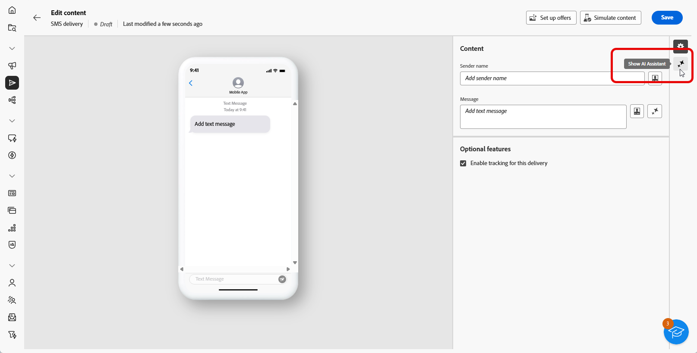
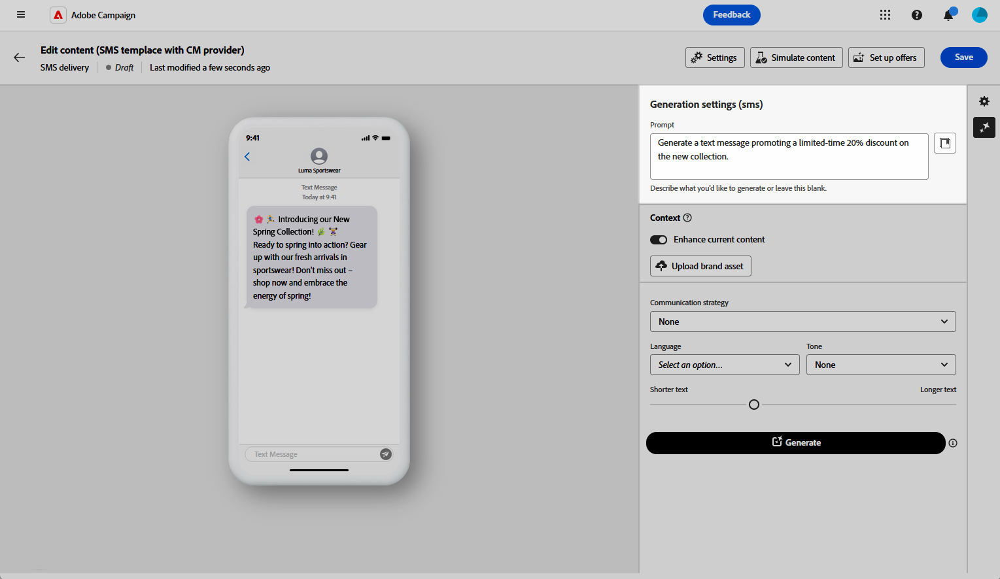
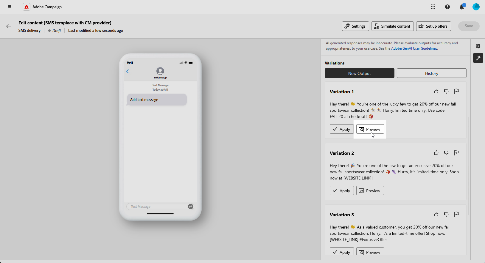
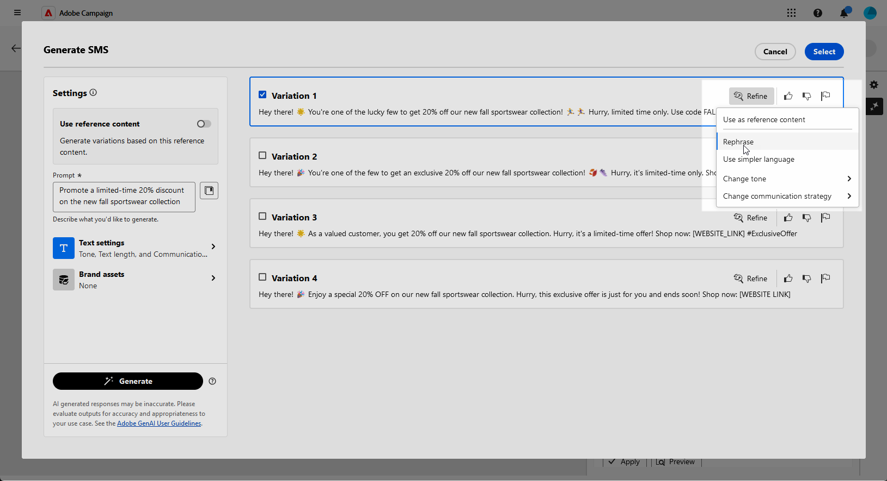
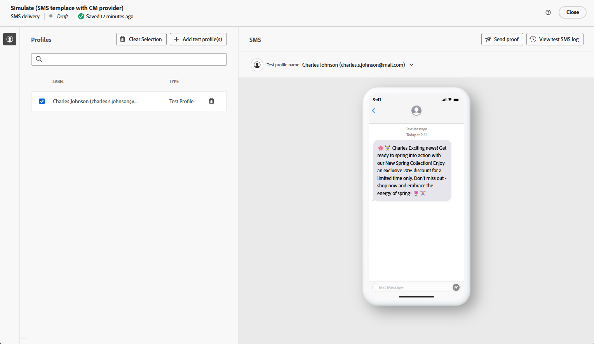

# 使用 AI 助理產生簡訊 {#generative-sms}

>[!BEGINSHADEBOX]

**目錄**

* [開始使用 AI 助理](generative-gs.md)
* [使用 AI 助理產生電子郵件](generative-content.md)
* **[使用AI助理產生簡訊](generative-sms.md)**
* [使用 AI 助理產生推播](generative-push.md)

>[!ENDSHADEBOX]

當您製作和個人化SMS訊息以符合對象需求後，請利用Campaign中由創新的AI技術支援的AI助理，將您的通訊提升到新的境界。

這個方便使用的工具提供智慧型建議，可精簡您的內容，確保您的訊息能有效地引起共鳴，並最大化參與度。

>[!NOTE]
>
>在開始使用此功能之前，請先閱讀相關的 [護欄和限制](generative-gs.md#guardrails-and-limitations).

1. 建立和設定簡訊傳送後，按一下 **[!UICONTROL 編輯內容]**.

   如需如何設定SMS傳送的詳細資訊，請參閱 [此頁面](../sms/create-sms.md).

1. 填入 **[!UICONTROL 基本詳細資訊]** 您的傳遞內容。 完成後，按一下 **[!UICONTROL 編輯內容]**.

1. 視需要個人化您的SMS訊息。 [了解更多](../sms/content-sms.md)

1. 存取 **[!UICONTROL 顯示AI助理]** 功能表。

   {zoomable=&quot;yes&quot;}

1. 啟用 **[!UICONTROL 使用原始內容]** AI助理的選項，用來根據您的傳遞、傳遞名稱和選取的對象來個人化新內容。

   >[!IMPORTANT]
   >
   > 您的提示必須一律透過上傳品牌資產或啟用 **[!UICONTROL 增強目前的內容]** 選項。

1. 描述您要在中產生的內容，以微調內容。 **[!UICONTROL 提示]** 欄位。

   如果您在製作提示時尋求協助，請存取 **[!UICONTROL 提示程式庫]** 其中會提供各式各樣的提示概念，以改善您的傳送作業。

   {zoomable=&quot;yes&quot;}

1. 選取 **[!UICONTROL 上傳品牌資產]** 新增任何品牌資產，其中包含可為AI助理提供額外內容的內容。

1. 使用不同的選項量身打造您的提示：

   * **[!UICONTROL 溝通策略]**：針對產生的文字選取所需的通訊方式。
   * **[!UICONTROL 語言]**：選擇變體內容的語言。
   * **[!UICONTROL 色調]**：確保文字適合您的對象和用途。
   * **[!UICONTROL 長度]**：使用範圍滑桿選取內容的長度。

   {zoomable=&quot;yes&quot;}

1. 提示就緒後，按一下 **[!UICONTROL 產生]**.

1. 瀏覽產生的專案 **[!UICONTROL 變數]** 並按一下 **[!UICONTROL 預覽]** 以檢視所選變數的全熒幕版本。

1. 導覽至 **[!UICONTROL 細化]** 中的選項 **[!UICONTROL 預覽]** 視窗以存取其他自訂功能並微調您的偏好設定變數：

   * **簡化語言**： AI助理可幫助您撰寫每個人都能理解的清晰、簡潔的訊息。

   * **重新片語**： AI Assistant會將您的訊息改寫，讓不同受眾的互動持續進行。

   {zoomable=&quot;yes&quot;}

1. 按一下 **[!UICONTROL 選取]** 找到適當的內容之後。

1. 插入個人化欄位，以根據設定檔資料自訂您的簡訊內容。 [進一步了解內容個人化](../personalization/personalize.md)

   {zoomable=&quot;yes&quot;}

1. 定義訊息內容後，按一下 **[!UICONTROL 模擬內容]** 按鈕來控制呈現，並使用測試設定檔檢查個人化設定。 [了解更多](../preview-test/preview-content.md)

   {zoomable=&quot;yes&quot;}

當您定義內容、對象和排程時，就能準備好SMS傳送。 [了解更多](../monitor/prepare-send.md)
