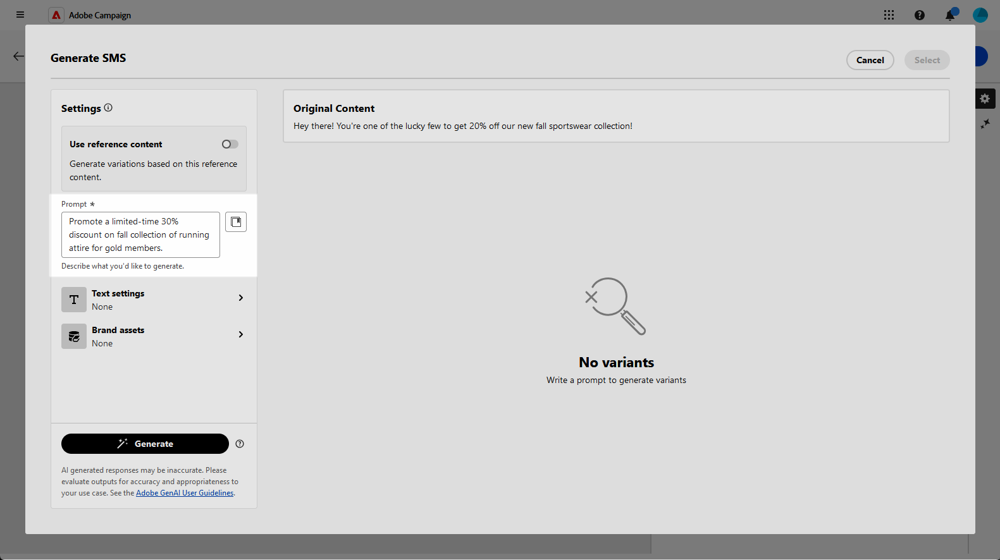
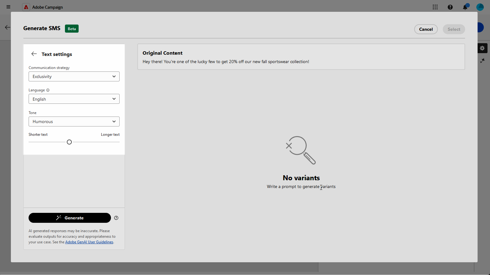
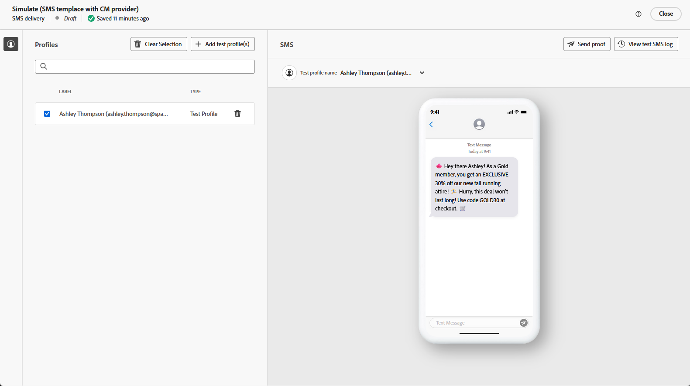

# 使用 AI 助理產生簡訊 {#generative-sms}

>[!IMPORTANT]
>
>開始使用此功能之前，請先閱讀相關的[護欄和限制](generative-gs.md#generative-guardrails)。
> 
>
>您必須先同意[使用者合約](https://www.adobe.com/tw/legal/licenses-terms/adobe-dx-gen-ai-user-guidelines.html)，才能在Adobe Campaign網頁中使用AI小幫手。 如需詳細資訊，請聯絡您的 Adobe 代表。

一旦您製作並個人化SMS訊息以符合您的受眾，利用創新的AI技術，在Adobe Campaign Web中使用AI助理提升您的通訊品質。

此工具提供智慧型建議，可精簡您的內容，確保您的訊息能有效地引起共鳴，並最大化參與度。

>[!BEGINTABS]

>[!TAB 產生完整簡訊]

1. 建立及設定簡訊傳遞之後，請按一下&#x200B;**[!UICONTROL 編輯內容]**。

   如需設定SMS傳送的詳細資訊，請參閱[此頁面](../sms/create-sms.md)。

1. 填寫傳遞的&#x200B;**[!UICONTROL 基本詳細資料]**。 完成後，按一下&#x200B;**[!UICONTROL 編輯內容]**。

1. 存取&#x200B;**[!UICONTROL 顯示AI助理]**&#x200B;功能表。

   ![顯示[顯示AI小幫手]功能表的熒幕擷圖](assets/sms-genai-1.png){zoomable="yes"}

1. 描述您要在&#x200B;**[!UICONTROL 提示]**&#x200B;欄位中產生的內容，以微調內容。

   如果您需要製作提示的協助，請存取&#x200B;**[!UICONTROL 提示程式庫]**，它提供各種不同的提示概念，以改進您的傳遞。

   {zoomable="yes"}

1. 使用&#x200B;**[!UICONTROL 文字設定]**&#x200B;選項量身打造您的提示：

   * **[!UICONTROL 通訊策略]**：選擇最適合您產生文字的通訊樣式。
   * **[!UICONTROL 語調]**：確定您的電子郵件語調可與您的對象產生共鳴。 無論您是要提供豐富資訊、好玩或有說服力， AI Assistant都會據以調整訊息。
   * **文字長度**：使用滑桿來選取所要的文字長度。

   {zoomable="yes"}

1. 從&#x200B;**[!UICONTROL 品牌資產]**&#x200B;功能表，按一下&#x200B;**[!UICONTROL 上傳品牌資產]**，新增任何包含為AI助理提供額外內容的品牌資產，或選取先前上傳的品牌資產。

   先前上傳的檔案可在&#x200B;**[!UICONTROL 已上傳的品牌資產]**&#x200B;下拉式清單中使用。 切換您要納入產生程式的資產。

1. 提示就緒後，請按一下[產生]。****

1. 瀏覽產生的&#x200B;**[!UICONTROL 變數]**，然後按一下&#x200B;**[!UICONTROL 預覽]**&#x200B;以檢視所選變數的全熒幕版本。

   {zoomable="yes"}

1. 瀏覽至&#x200B;**[!UICONTROL 預覽]**&#x200B;視窗中的&#x200B;**[!UICONTROL 調整]**&#x200B;選項，以存取其他自訂功能並微調您的偏好設定變化：

   * **[!UICONTROL 使用作為參考內容]**：選擇的變體作為參考內容以產生其他結果。
   * **[!UICONTROL 使用較簡單的語言]**： AI助理可以協助您撰寫清晰、簡明的訊息，讓每個人都能理解。
   * **[!UICONTROL 重述]**： AI助理將重述您的訊息，讓不同對象都能使用它。

   您也可以變更文字的&#x200B;**[!UICONTROL 音調]**&#x200B;和&#x200B;**[!UICONTROL 通訊策略]**。

   {zoomable="yes"}

1. 找到適當的內容後，按一下&#x200B;**[!UICONTROL 選取]**。

1. 插入個人化欄位，以根據設定檔資料自訂您的簡訊內容。 [進一步瞭解內容個人化](../personalization/personalize.md)。

   {zoomable="yes"}

1. 定義訊息內容後，按一下&#x200B;**[!UICONTROL 模擬內容]**&#x200B;按鈕以控制轉譯，並使用測試設定檔檢查個人化設定。 [了解更多](../preview-test/preview-content.md)。

   {zoomable="yes"}

當您定義內容、對象和排程時，請準備SMS傳送。 [了解更多](../monitor/prepare-send.md)。

>[!TAB 只產生文字]

1. 建立及設定簡訊傳遞之後，請按一下&#x200B;**[!UICONTROL 編輯內容]**。

   如需設定SMS傳送的詳細資訊，請參閱[此頁面](../sms/create-sms.md)。

1. 填寫傳遞的&#x200B;**[!UICONTROL 基本詳細資料]**。 完成後，按一下&#x200B;**[!UICONTROL 編輯內容]**。

1. 視需要個人化您的SMS訊息。 [了解更多](../sms/content-sms.md)。

1. 存取您&#x200B;**[!UICONTROL 訊息]**&#x200B;欄位旁的&#x200B;**[!UICONTROL AI助理]**&#x200B;功能表。

   {zoomable="yes"}

1. 啟用AI助理的&#x200B;**[!UICONTROL 使用參考內容]**&#x200B;選項，以根據選取的內容個人化新內容。

1. 描述您要在&#x200B;**[!UICONTROL 提示]**&#x200B;欄位中產生的內容，以微調內容。

   如果您需要製作提示的協助，請存取&#x200B;**[!UICONTROL 提示資料庫]**，其中會提供各種不同的提示概念，以改善您的行銷活動。

   {zoomable="yes"}

1. 使用&#x200B;**[!UICONTROL 文字設定]**&#x200B;選項量身打造您的提示：

   * **[!UICONTROL 通訊策略]**：針對產生的文字選取所要的通訊方式。
   * **[!UICONTROL 語言]**：選擇變體內容的語言。
   * **[!UICONTROL 音調]**：確定文字適合您的對象和目的。
   * **[!UICONTROL 長度]**：使用範圍滑桿選取內容的長度。

   {zoomable="yes"}

1. 從&#x200B;**[!UICONTROL 品牌資產]**&#x200B;功能表，按一下&#x200B;**[!UICONTROL 上傳品牌資產]**，新增任何包含為AI助理提供額外內容的品牌資產，或選取先前上傳的品牌資產。

   先前上傳的檔案可在&#x200B;**[!UICONTROL 已上傳的品牌資產]**&#x200B;下拉式清單中使用。 切換您要納入產生程式的資產。

1. 提示就緒後，請按一下[產生]。****

1. 瀏覽產生的&#x200B;**[!UICONTROL 變數]**，然後按一下&#x200B;**[!UICONTROL 預覽]**&#x200B;以檢視所選變數的全熒幕版本。

1. 瀏覽至&#x200B;**[!UICONTROL 預覽]**&#x200B;視窗中的&#x200B;**[!UICONTROL 調整]**&#x200B;選項，以存取其他自訂功能並微調您的偏好設定變化：

   * **[!UICONTROL 使用作為參考內容]**：選擇的變體作為參考內容以產生其他結果。
   * **[!UICONTROL 重述]**： AI助理可以不同的方式重述您的訊息，讓您的寫作保持新鮮，並吸引不同受眾。
   * **[!UICONTROL 使用較簡單的語言]**：利用AI助理簡化您的語言，確保更廣大的受眾擁有清晰度和可存取性。

   您也可以變更文字的&#x200B;**[!UICONTROL 音調]**&#x200B;和&#x200B;**[!UICONTROL 通訊策略]**。

   {zoomable="yes"}

1. 找到適當的內容後，按一下&#x200B;**[!UICONTROL 選取]**。

1. 插入個人化欄位，以根據設定檔資料自訂您的簡訊內容。 [進一步瞭解內容個人化](../personalization/personalize.md)。

1. 定義訊息內容後，按一下&#x200B;**[!UICONTROL 模擬內容]**&#x200B;按鈕以控制轉譯，並使用測試設定檔檢查個人化設定。 [了解更多](../preview-test/preview-content.md)。

   {zoomable="yes"}

當您定義內容、對象和排程時，請準備SMS傳送。 [了解更多](../monitor/prepare-send.md)。

>[!ENDTABS]