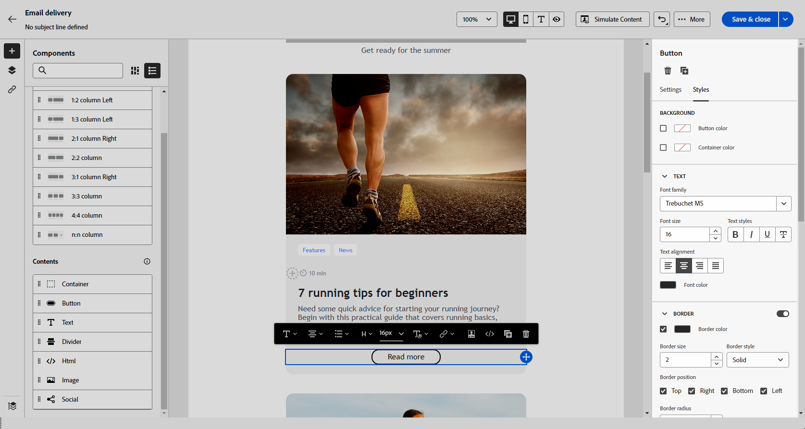

# 開始使用電子郵件樣式 {#get-started-email-style}

開始在[!DNL Adobe Campaign] 建立電子郵件內容後，您可以從電子郵件設計工具設定窗格調整多個樣式參數和屬性。

您可以將變更套用到電子郵件內文、結構元件或內容元件。

{zoomable=&quot;yes&quot;}

按照下方連結來了解如何調整您電子郵件中的一些樣式設定。

* 了解如何[個人化您的電子郵件背景](backgrounds.md)
* 了解如何[管理垂直對齊方式和邊框間距](alignment-and-padding.md)
* 了解如何[定義電子郵件中連結的樣式](styling-links.md)
* 了解如何[自訂內嵌樣式屬性](inline-styling.md)
