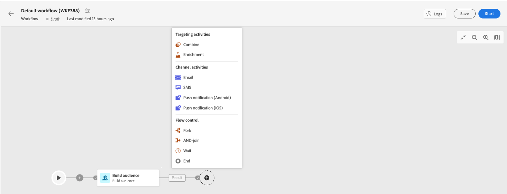

# 開始在 Campaign Web 中使用訊息 {#gs-messages}

透過Adobe Campaign，您可以傳送跨頻道行銷活動，包括電子郵件、簡訊和推播通知，並使用各種專用報告來衡量其成效。 這些訊息是透過傳遞進行設計和傳送，而且可針對每位收件者進行個人化。這些傳遞可以是獨立的，或包含在行銷活動內容中。

Adobe Campaign v8 提供下列傳送頻道：

* **電子郵件頻道**：電子郵件傳遞功能可讓您傳送個人化電子郵件給目標群體。瞭解如何在中建立和傳送電子郵件 [此頁面](../email/create-email.md).

* **簡訊頻道**：行動裝置頻道上的傳遞可讓您傳送個人化SMS給目標群體。  瞭解如何在中建立和傳送簡訊 [此頁面](../sms/create-sms.md).

* **行動應用程式頻道**：行動應用程式傳送可讓您傳送通知至 iOS 和 Android 系統。瞭解如何在中建立和傳送推播通知 [此頁面](../push/gs-push.md).

## 建立傳遞 {#create-delivery}

您可以從以下位置建立獨立傳送： **[!UICONTROL 傳遞]** 左側功能表，或在行銷活動內容中建立傳送，可從 **[!UICONTROL 行銷活動]** 左側功能表。

>[!BEGINTABS]

>[!TAB 建立獨立傳送]

若要建立獨立傳送，請遵循下列步驟：

1. 瀏覽至 **[!UICONTROL 傳遞]** 功能表，然後按一下 **[!UICONTROL 建立傳遞]** 按鈕。
1. 選擇傳遞的管道。 在以下章節中進一步瞭解傳遞管道以及如何定義傳遞內容：

   * [電子郵件通道](../email/create-email.md)
   * [推播通知頻道](../push/gs-push.md)
   * [SMS 頻道](../sms/create-sms.md)

1. 定義主要目標和控制組的傳送對象。 進一步瞭解中的對象 [本節](../audience/about-audiences.md).
1. 定義訊息內容。
1. （選用）定義傳遞排程。 如果未定義排程，則會在按一下 **[!UICONTROL 傳送]** 按鈕。
1. 按一下  **[!UICONTROL 檢閱並傳送]** 按鈕以檢查您的設定。
1. 使用  **[!UICONTROL 模擬內容]** 按鈕以測試您的傳遞和個人化設定。 進一步瞭解中的訊息模擬 [本節](../preview-test/preview-test.md).
1. 按一下  **[!UICONTROL 準備]** 按鈕以計算目標母體並產生訊息。 準備步驟可能需要幾分鐘的時間。 準備完成後，訊息即可傳送。 發生錯誤時，請瀏覽至 **記錄檔** 以檢查警示和警告。
1. 檢查結果，然後按一下  **[!UICONTROL 傳送]** 按鈕以開始傳送訊息。
1. 傳送訊息後，請瀏覽至 **報表** 區段來存取關鍵量度。 進一步瞭解中的傳遞報告 [本節](../reporting/reports.md).

>[!TAB 在行銷活動中建立傳遞]

若要在行銷活動中建立傳送，請遵循下列步驟：

1. 建立行銷活動或開啟現有的行銷活動。 進一步瞭解 [行銷活動](../campaigns/gs-campaigns.md).
1. 建立工作流程或開啟現有工作流程。
1. 新增並設定 **[!UICONTROL 建立對象]** 活動，然後按一下 `+`按鈕。

   

   此 **[!UICONTROL 建立對象]** 活動的詳細資訊，請參閱 [本節](../workflows/targeting-activities.md).

1. 選取傳遞活動： **[!UICONTROL 電子郵件]**， **[!UICONTROL 簡訊]**， **[!UICONTROL 推播通知(Android)]** 或 **[!UICONTROL 推播通知(iOS)]**. 進一步瞭解工作流程中的傳遞管道活動，以及如何在此定義傳遞內容 [區段](../workflows/channel-activities.md).
1. 啟動工作流程，並檢查記錄。

您也可以在行銷活動中新增傳遞，而不需要建立工作流程。 若要完成此操作，請瀏覽至 **[!UICONTROL 傳遞]** 標籤，然後按一下 **[!UICONTROL 建立傳遞]** 按鈕。

設定步驟類似於獨立傳送。

有關如何設定行銷活動及管理屬於行銷活動的傳送的詳細資訊，請參閱 [本節](../campaigns/gs-campaigns.md).

>[!ENDTABS]

## 新增個人化{#personalization}

Adobe Campaign 傳送的資訊可以透過多種方式實現個人化。[進一步瞭解個人化功能](../personalization/personalize.md).

使用Campaign建立動態內容並傳送個人化訊息。 可結合個人化功能來改善您的訊息並建立自訂使用者體驗。

您可以透過以下方式個人化訊息內容：

* 插入動態&#x200B;**個人化欄位**

   個人化欄位用於訊息的第一層個人化。您可以從個人化編輯器選取資料庫中的任何欄位。對於傳遞，您可以選取與收件者、訊息或傳遞相關的任何欄位。這些個人化屬性可以插入訊息的主旨行或內文中。[了解更多](../personalization/personalize.md)

* 插入預先定義的&#x200B;**內容區塊**

   Campaign 隨附一組個人化區塊，其中包含您可以插入到傳遞中的特定轉譯。例如，您可以新增標誌、問候訊息或訊息鏡像頁面的連結。內容區塊可從個人化編輯器的專屬項目取得。[了解更多](../personalization/personalize.md#ootb-content-blocks)

* 建立 **條件式內容**

   例如，設定條件式內容，以根據收件者的設定檔新增動態個人化。 當特定條件為true時，會插入文字區塊和/或影像。 [了解更多](../personalization/conditions.md)

* 新增 **個人化優惠**

   根據收件者位置、目前天氣或上次購買訂單，在您的訊息內容中插入個人化優惠。

## 預覽和測試您的傳遞

定義訊息內容後，您可以預覽它以控制訊息的呈現，並使用測試設定檔檢查個人化設定。 [了解更多](preview.md)

## 傳送和追蹤記錄{#gs-tracking-logs}

傳送傳遞後進行監視是確保行銷活動效率並與客戶溝通的關鍵步驟。 您可以在傳送傳遞後進行監視，並瞭解傳送失敗和隔離的管理方式。
