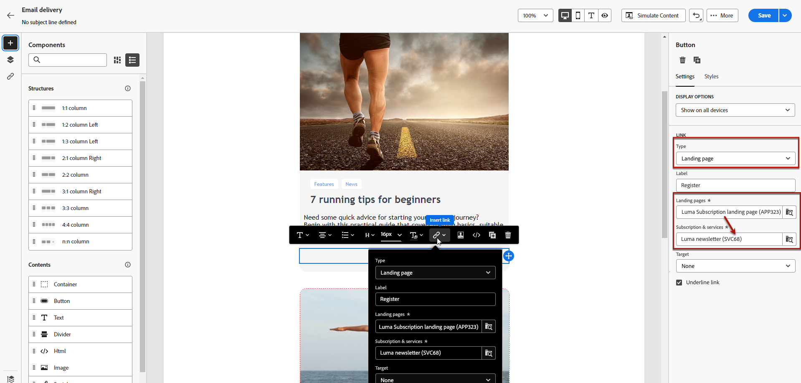
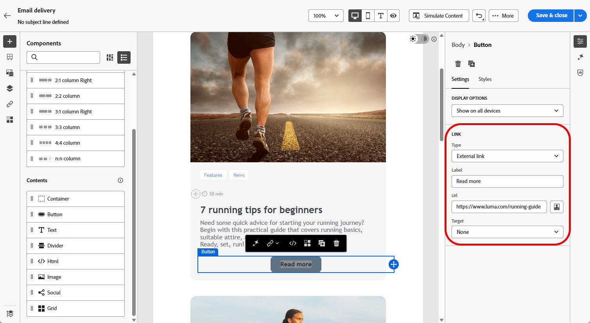
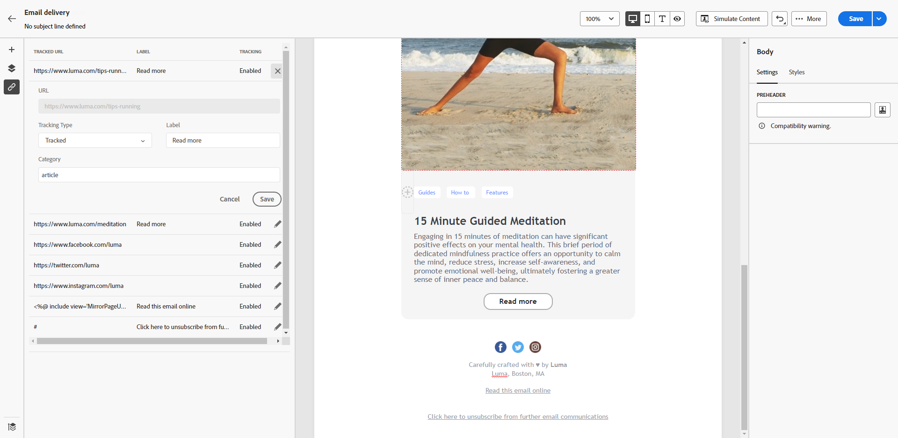

# 新增連結和追蹤訊息 {#tracking}

使用電子郵件Designer新增連結至您的內容並追蹤傳送的訊息，可讓您監控收件者的行為。

## 插入連結 {#insert-links}

設計訊息，您可以新增連結到您的內容。

>[!NOTE]
>
>啟用追蹤，將追蹤訊息內容包含的所有連結。

若要將連結插入您的電子郵件內容，請遵循下列步驟：

1. 選取專案，然後按一下內容工具列中的&#x200B;**[!UICONTROL 插入連結]**。

1. 選擇您要建立的連結型別：

   {zoomable="yes"}

   * **[!UICONTROL 外部連結]**：插入外部URL的連結。

   * **[!UICONTROL 登陸頁面]**：插入登陸頁面的連結。 如果您選取動態登入頁面（已選取&#x200B;**[!UICONTROL 來自URL的服務]**&#x200B;選項），則您可以從清單中選取任何服務。 [了解更多](../landing-pages/create-lp.md#define-actions-on-form-submission)

     {zoomable="yes"}

   * **[!UICONTROL 訂閱連結]**：插入訂閱服務的連結。 當使用者按一下連結時，系統會將他們導向至所選服務中參照的訂閱登入頁面。 [了解更多](../audience/manage-services.md#create-service)

     {zoomable="yes"}

   * **[!UICONTROL 取消訂閱連結]**：插入取消訂閱服務的連結。 當訂閱者按一下連結時，系統會將他們導向至所選服務中參照的取消訂閱登陸頁面。 [了解更多](../audience/manage-services.md#create-service)

   <!--* **[!UICONTROL Mirror page]**: Add a link to display the email content in a web browser. [Learn more]-->

1. 在對應欄位中輸入所需的URL，或選取登入頁面或服務，並定義連結設定和樣式。

1. 新增&#x200B;**[!UICONTROL 標籤]**&#x200B;和&#x200B;**[!UICONTROL 連結]**。

1. 儲存您的變更。

1. 建立連結後，視需要從&#x200B;**[!UICONTROL 設定]**&#x200B;索引標籤修改連結。

   * 編輯連結並變更其&#x200B;**[!UICONTROL 目標]**。
   * 核取對應的選項，選擇是否要為連結加上底線。

   {zoomable="yes"}

>[!NOTE]
>
>行銷類型電子郵件訊息必須包含選擇退出連結，而異動訊息則不需要。訊息類別（**[!UICONTROL Marketing]**&#x200B;或&#x200B;**[!UICONTROL Transactional]**）是在頻道介面層級建立訊息時定義的。

在您的所有電子郵件訊息中加入映象頁面的特定連結。 若要了解鏡像頁面的詳細資訊，請參閱[本章節](mirror-page.md)。

## 管理追蹤 {#manage-tracking}

[電子郵件Designer](create-email-content.md)可讓您管理追蹤的URL，例如編輯每個連結的追蹤型別。

1. 從左窗格按一下&#x200B;**[!UICONTROL 連結]**&#x200B;圖示，以顯示您要追蹤之內容中的所有URL清單。

   此清單提供集中式檢視，並有助於找出電子郵件內容中的每個URL。

1. 若要編輯連結，按一下對應的鉛筆圖示。

   {zoomable="yes"}

1. 視需要修改&#x200B;**[!UICONTROL 追蹤型別]**：

   {zoomable="yes"}

   對於每個追蹤的URL，請將追蹤模式設定為下列其中一個值：

   * **[!UICONTROL 已追蹤]**：啟用此URL的追蹤。
   * **[!UICONTROL 選擇退出]**：將此URL標籤為選擇退出或取消訂閱URL。
   * **[!UICONTROL 映象頁面]**：將此URL標籤為映象頁面URL。
   * **[!UICONTROL 從不]**：防止追蹤此URL。<!--This information is saved: if the URL appears again in a future message, its tracking is automatically deactivated.-->

1. 將&#x200B;**[!UICONTROL 類別]**&#x200B;新增至您的連結，將追蹤的連結分組，然後按一下&#x200B;**[!UICONTROL 儲存]**。

   {zoomable="yes"}

1. 傳送您的傳遞後，存取傳遞報告。在「**[!UICONTROL 追蹤]**」選單下，**[!UICONTROL URL 和點按資料流]** 報告顯示您的傳遞中哪些 URL 造訪次數最多。[了解更多](../reporting/gs-reports.md)