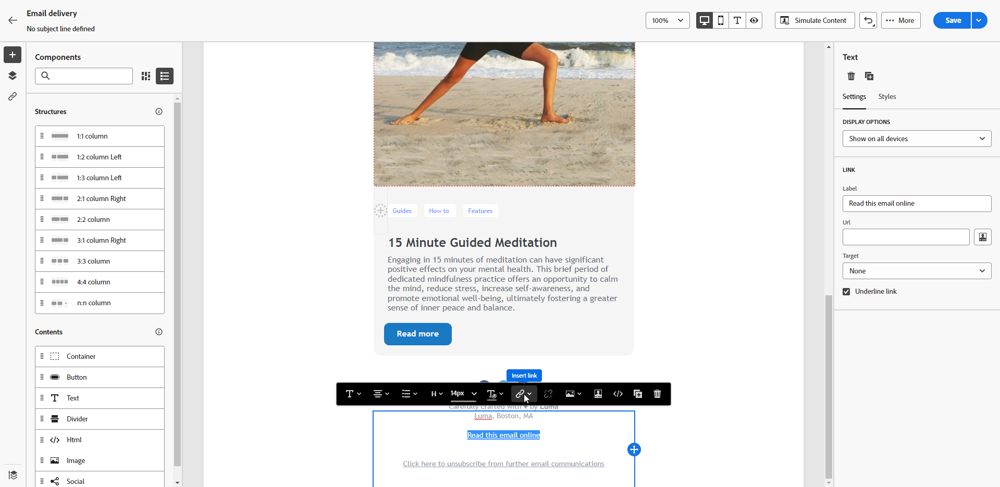
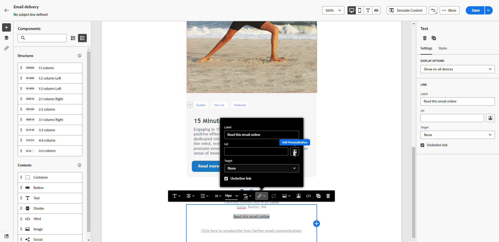
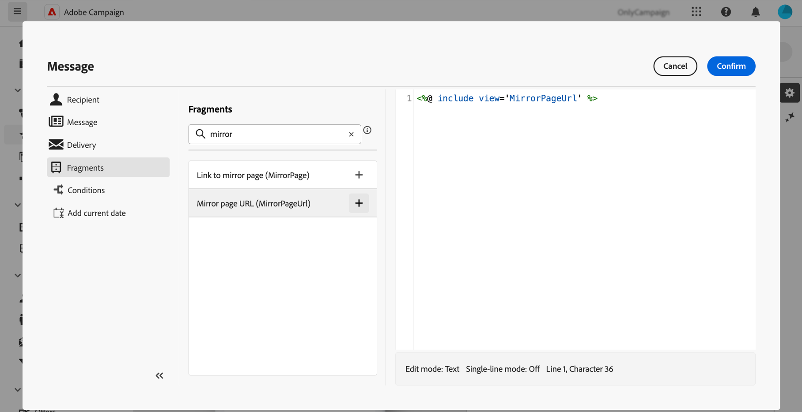

# 鏡像頁面 {#mirror-page}

映象頁面是電子郵件的線上版本。 將連結新增至映象頁面是電子郵件行銷的良好做法。 使用者可以瀏覽到電子郵件的鏡像頁面，例如他們在嘗試在收件匣中檢視郵件時遇到轉譯問題或影像毀損。我們建議基於存取性原因或鼓勵社交共享，提供線上版本。

Adobe Campaign 產生的鏡像頁面包含所有個人化資料。

{width="600" align="left"}

## 新增鏡像頁面連結{#link-to-mirror-page}

在 Adobe Campaign 中，您可以使用專屬 **個人化區塊**，將鏡像頁面連結插入電子郵件中。內建的&#x200B;**鏡像頁面連結**&#x200B;個人化區塊會將以下程式碼插入電子郵件內容中：`<%@ include view='MirrorPage' %>`。

若要在電子郵件中新增映象頁面的連結，請執行下列步驟：

1. 選取元素（文字或影像），然後按一下內容工具列中的[插入連結]。****

   {zoomable="yes"}

1. 選取「**[!UICONTROL 新增個人化]**」圖示，以存取個人化選單。

   {zoomable="yes"}

1. 從&#x200B;**[!UICONTROL 片段]**&#x200B;功能表，選取&#x200B;**[!UICONTROL 映象頁面URL]**&#x200B;並按一下&#x200B;**[!UICONTROL 新增]**。 [瞭解如何使用運算式片段](../content/use-expression-fragments.md)

   {zoomable="yes"}

鏡像頁面會自動建立。

電子郵件傳送後，當收件者按一下鏡像頁面連結時，電子郵件的內容將顯示在他們的預設網頁瀏覽器中。

依預設，映象頁面的保留期間為&#x200B;**60天**。 該段時間之後，鏡像頁面無法繼續使用。

>[!CAUTION]
>
>* 鏡像頁面連結是自動產生的，無法編輯。它們包含轉譯原始電子郵件所需的所有加密的個人化資料。因此，使用具有較大值的個人化屬性可能會產生冗長的鏡像頁面 URL，如果網頁瀏覽器具有最大 URL 長度，將導致連結無法在該網頁瀏覽器中作用。
>
>* 在傳送到測試設定檔的校樣中，指向映象頁面的連結未啟用。 它只會在最終訊息中處於活動狀態。

## 鏡像頁面產生 {#mirror-page-generation}

依預設，如果電子郵件內容不是空的且包含鏡像頁面連結 (也稱為鏡像連結)，Adobe Campaign 會自動產生鏡像頁面。

您可以控制電子郵件鏡像頁面的產生模式。傳遞屬性中有提供相關選項。[了解更多](../advanced-settings/delivery-settings.md#mirror)
