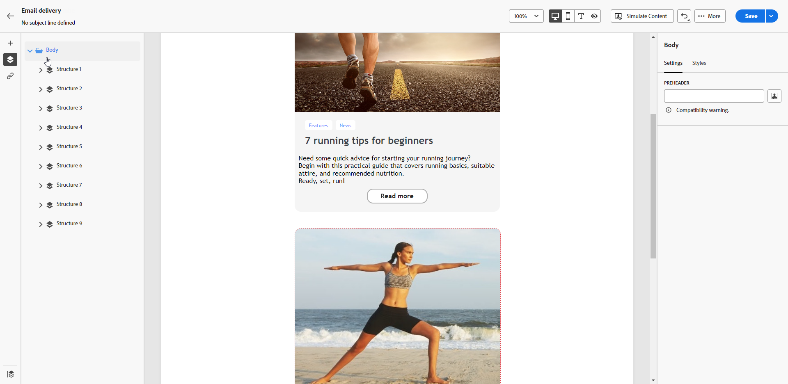

# 新增預覽文字到電子郵件 {#preheader}

>[!CONTEXTUALHELP]
>id="ac_edition_preheader"
>title="新增預覽文字"
>abstract="預覽文字指在檢視來自您的電子郵件用戶端的電子郵件時接在主旨行後面的簡短摘要文字。在許多情況下，這段文字會提供電子郵件的簡短摘要，並且長度通常只有一個句子。"

預覽文字是主旨行之後的簡短文字，在從任何主要電子郵件使用者端檢視電子郵件時便會顯示。

在許多情況下，它提供內容的簡短摘要，通常為一個句子長。

>[!NOTE]
>
>並非所有電子郵件用戶端都支援預覽文字。如果不支援，就不會顯示預覽文字。

若要定義電子郵件預覽文字，請遵循下列步驟。

1. 從 [電子郵件設計工具](create-email-content.md)，至少新增 **[!UICONTROL 結構]** 元件以開始設計電子郵件。

1. 按一下左窗格中的&#x200B;**[!UICONTROL 導覽樹狀目錄]**&#x200B;圖示，然後選取「**[!UICONTROL 內文]**」。

   {zoomable=&quot;yes&quot;}

1. 從 **[!UICONTROL 設定]** 定位字元，輸入一些文字作為預覽文字。

1. 若要進一步個人化，請按一下 **[!UICONTROL 新增個人化]** 圖示左側 **[!UICONTROL 預覽文字]** 欄位。

   {zoomable=&quot;yes&quot;}

1. 從 **[!UICONTROL 編輯個人化]** 視窗，您可以新增 [個人化欄位](../personalization/personalize.md)， [內容區塊](../personalization/content-blocks.md) 和 [條件式內容](../personalization/conditions.md) 使用左側的專用專案。

   {zoomable=&quot;yes&quot;}

1. 按一下「**[!UICONTROL 確認]**」。

電子郵件的預覽文字現在已設定好了。
