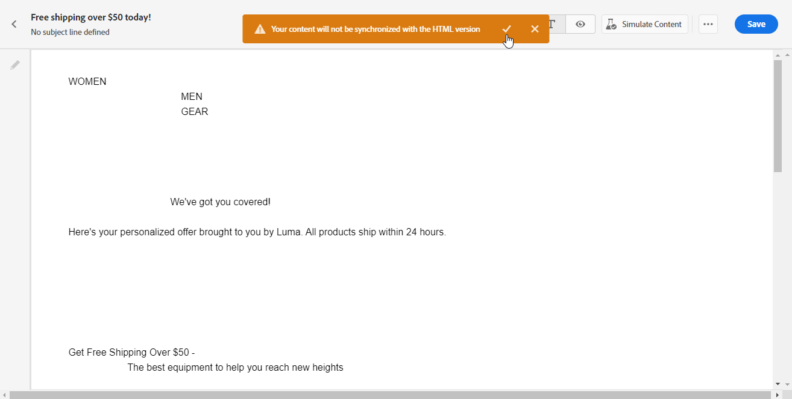

# 建立電子郵件的文字版本 {#text-version-email}

建議建立電子郵件內文的文字版本，當 HTML 內容無法顯示時可使用。

依預設，電子郵件設計工具會建立電子郵件的&#x200B;**[!UICONTROL 純文字]**&#x200B;版本，包括個人化欄位。此版本會自動產生，並與您內容的HTML版本同步。

如果您偏好將不同內容用於純文字版本，請遵循下列步驟：

1. 從您的電子郵件中，選取「**[!UICONTROL 純文字]**」索引標籤。

   ![熒幕擷圖顯示[電子郵件Designer]介面中的[純文字]索引標籤。](assets/text_version_3.png){zoomable="yes"}

1. 使用&#x200B;**[!UICONTROL 與 HTML 同步]**&#x200B;切換以停用同步。

   ![熒幕擷圖顯示[純文字]索引標籤中的[與HTML同步]切換按鈕。](assets/text_version_1.png){zoomable="yes"}

1. 按一下勾選記號以確認您的選擇。

   {zoomable="yes"}

1. 視需要編輯純文字版本。

>[!CAUTION]
>
>* 在&#x200B;**[!UICONTROL 純文字]**&#x200B;檢視中所做的變更不會反映在HTML檢視中。
>
>* 如果您在更新純文字內容後重新啟用「與HTML同步」****&#x200B;選項，您的變更將會遺失，並以HTML版本產生的文字內容取代。