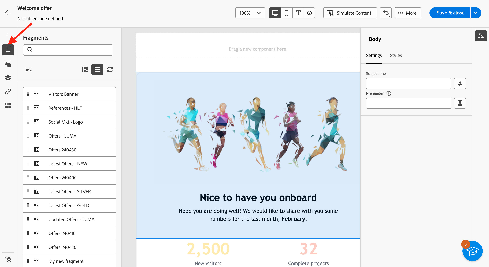
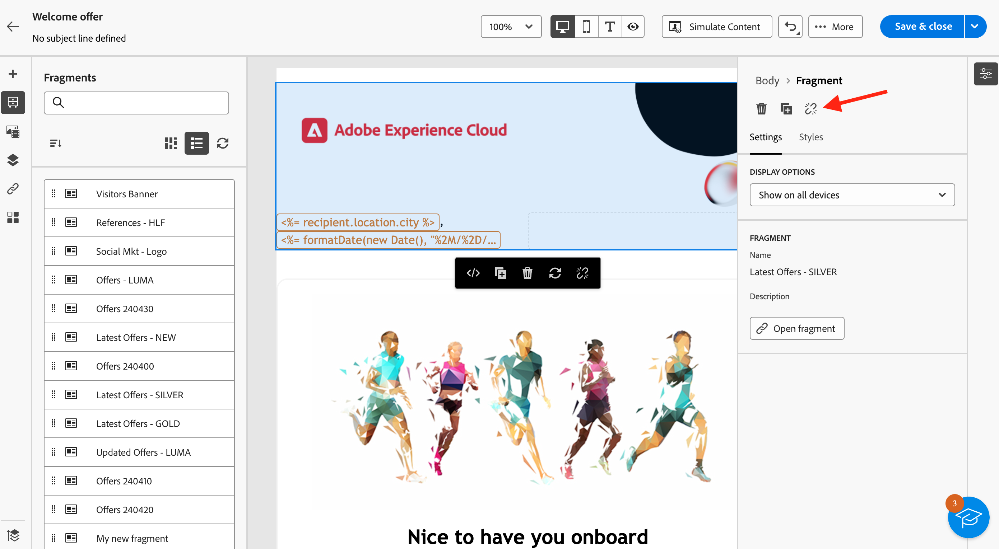

# 在你的電子郵件中新增視覺內容片段 {#use-visual-fragments}

您可以在以下專案中使用視覺效果片段： [電子郵件傳遞](get-started-email-designer.md)，或在 [內容範本](use-email-templates.md). 步驟詳述如下。

>[!NOTE]
>
>瞭解如何在中建立和管理片段 [本節](fragments.md).

## 使用片段 {#use-fragment}

若要在電子郵件內容中插入片段，請遵循下列步驟：

1. 使用開啟任何電子郵件或範本內容 [電子郵件設計工具](get-started-email-designer.md).

1. 選取 **[!UICONTROL 片段]** 圖示加以檢視。

   

1. 將會顯示在目前沙箱上建立的所有視覺化片段清單。 您可以：

   * 透過開始輸入其標籤來搜尋特定片段。
   * 以遞增或遞減順序排序片段。
   * 變更片段的顯示方式（卡片或清單檢視）。

   >[!NOTE]
   >
   >片段會依建立日期排序：最近新增的視覺化片段會先顯示在清單中。

   如果在編輯內容時修改或新增了某些片段，請按一下 **重新整理** 圖示以使用最新變更更新清單。

1. 從清單拖放任何片段到您要插入它的區域。 如同任何其他元件，您可以在內容中移動片段。

1. 選取片段以在右窗格中顯示其選項。

   

   從 **[!UICONTROL 設定]** 標籤，您可以：

   * 選擇您要顯示片段的裝置。
   * 視需要在新索引標籤中開啟片段以編輯。 [了解更多](../email/fragments.md#edit-fragments)

   您可以使用進一步自訂您的片段 **[!UICONTROL 樣式]** 標籤。

1. 如有需要，您可以中斷具有原始片段的繼承。 [瞭解更多](#break-inheritance)
您也可以從內容中刪除或復製片段。 這些動作可以直接從顯示在片段頂端的內容功能表執行。

1. 新增任意數量的片段，並且 **[!UICONTROL 儲存]** 您的變更。

## 中斷繼承 {#break-inheritance}

當您編輯視覺片段時，變更會同步。 它們會自動傳播到包含該片段的所有電子郵件傳遞和內容範本。

新增至電子郵件或內容範本時，預設會同步片段。

不過，您可以中斷原始片段的繼承。 在這種情況下，片段的內容會複製到目前的設計中，且變更不再同步。

若要中斷繼承，請遵循下列步驟：

1. 選取片段。

1. 按一下內容工具列中的解鎖圖示。

   

1. 該片段會成為不再連結至原始片段的獨立元素。 編輯它，就像內容中的任何其他內容元件一樣。 [了解更多](content-components.md)
