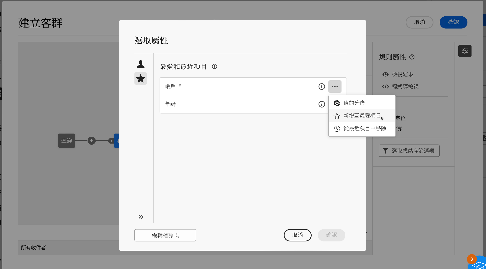

# 選取屬性並將其加入最愛 {#folders}

Campaign Web 使用者介面可讓使用者根據執行的動作，從不同地點的資料庫中選取屬性。例如，可以在定義直接郵件傳遞或要擷取檔案的輸出資料欄時選取屬性。同樣地，使用查詢建模工具建立規則、篩選器或建置客群時，也可以選取屬性。

若要快速地再利用經常使用的屬性，可以將這些屬性新增至最愛。這樣可確保在未來的任務中可以輕鬆存取這些屬性。除了最愛之外，使用者還可以檢視和使用最近選取的屬性。

此介面還提供數值分佈工具，讓您透過視覺化方式看到表格內屬性的數值分佈情形。此工具能幫助您確認數值的範圍和頻率，確保建立查詢或運算式時的資料一致性。

## 最愛和最近使用的屬性 {#favorites}

>[!CONTEXTUALHELP]
>id="acw_attribute_picker_favorites_recents"
>title="最愛和最近項目"
>abstract="在屬性選擇器中的「**[!UICONTROL 最愛和最近項目]**」選單以條理分明的視圖顯示您已新增為最愛的屬性，以及最近使用屬性的清單。首先顯示最愛屬性，接著顯示最近使用的屬性，讓您輕鬆找到所需的屬性。"

在屬性選擇器中的&#x200B;**[!UICONTROL 最愛和最近項目]**&#x200B;選單，以條理分明的視圖顯示您已新增為最愛的屬性，以及最近使用屬性的清單。首先顯示最愛屬性，接著顯示最近使用的屬性，讓您輕鬆找到所需的屬性。

若要將屬性新增至最愛項目，請按一下展開按鈕並選取「**[!UICONTROL 新增至最愛項目]**」。該屬性接著會自動加入最愛清單。若要從最愛中移除屬性，請再次選取星形圖示。

使用者最多可以在最愛中新增 20 個屬性。最愛和最近使用的屬性與組織內的每位使用者相關聯，確保在不同機器上也能方便存取，並提供跨裝置的順暢體驗。

## 確定表格中的數值分佈 {#distribution}

「**數值分佈**」按鈕可在按一下屬性旁邊的展開按鈕時取得，它可讓使用者分析表格內該屬性的數值分佈情形。此功能對於了解可用的數值、其計數和百分比相當有用。在建立查詢或建立運算式時，此功能還有助於避免出現大小寫或拼字不一致等問題。

對於具有較多數值的屬性，該工具只會顯示前二十個數值。在這種情況下，會出現&#x200B;**[!UICONTROL 部分載入]**&#x200B;通知來表示有這個限制。套用進階篩選器來調整顯示的結果，並將焦點放在特定數值或資料子集。有關使用篩選器的詳細指引請參閱[此處](../get-started/work-with-folders.md#filter-the-values)。

若要了解更多有關在不同情況下使用數值分佈工具，請參閱以下部分：

* [資料夾中的數值分佈](../get-started/work-with-folders.md##distribution-values-folder)
* [查詢中的數值分佈](../query/build-query.md#distribution-values-query)