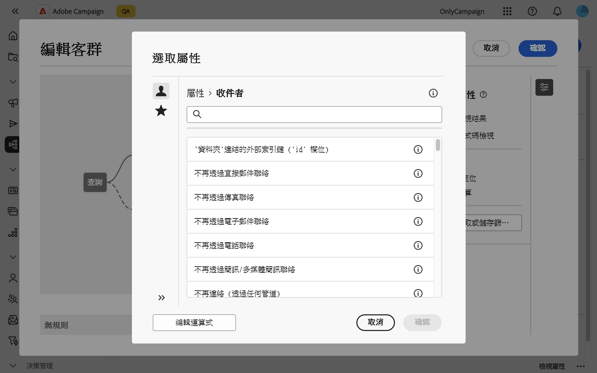
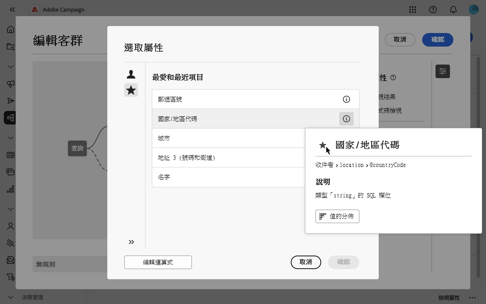
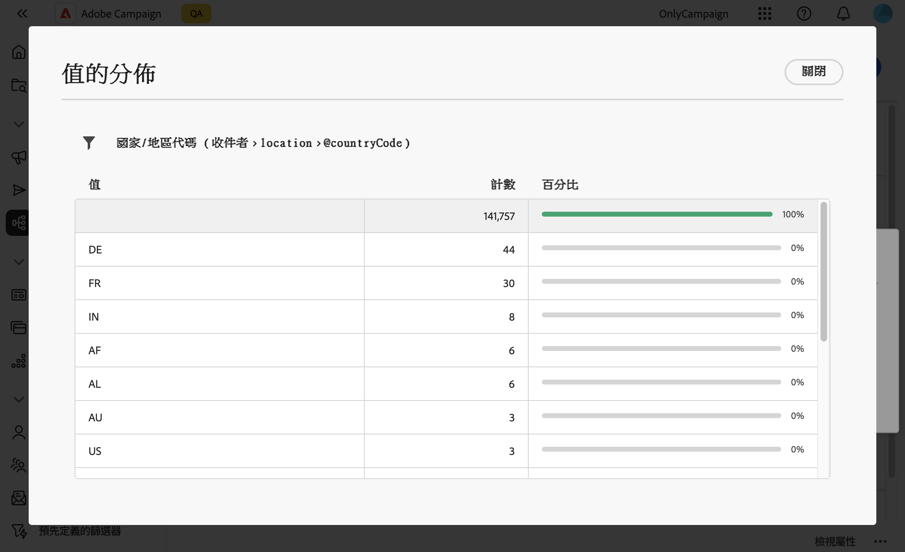

# 選取屬性並將其新增至我的最愛 {#folders}

Campaign Web使用者介面可讓您根據您要執行的動作，從不同位置的資料庫選取屬性。 例如，在定義直接郵件傳遞的輸出欄或要擷取的檔案時，您可以選取屬性。 同樣地，使用查詢建模器建立規則、篩選或建立對象時，也可以選取屬性。

若要快速重複使用常用的屬性，您可以將它們新增至我的最愛。 這可確保它們能夠輕鬆用於未來的任務中。除了我的最愛之外，您還可以檢視和使用最近選取的屬性。

此介面也提供值分佈工具，可讓您以視覺效果呈現表格中屬性值的分佈。 此工具可協助您識別值的範圍和頻率，以確保在建立查詢或運算式時資料的一致性。

## 我的最愛和最近屬性 {#favorites}

>[!CONTEXTUALHELP]
>id="acw_attribute_picker_favorites_recents"
>title="最愛和最近項目"
>abstract="屬性選擇器中的&#x200B;**[!UICONTROL 我的最愛和最近]**&#x200B;功能表提供您新增至我的最愛之屬性的組織檢視，以及最近使用屬性的清單。 最愛屬性會先出現，接著出現最近使用的屬性，讓您輕鬆找到所需的屬性。"

屬性選擇器中的&#x200B;**[!UICONTROL 我的最愛和最近]**&#x200B;功能表提供您新增至我的最愛之屬性的組織檢視，以及最近使用屬性的清單。 最愛屬性會先出現，接著出現最近使用的屬性，讓您輕鬆找到所需的屬性。

若要將屬性新增至我的最愛，請將游標移至其資訊按鈕上，並選取星形圖示。 然後，該屬性會自動新增至您的最愛清單。 如果您不再想要將屬性保留為我的最愛，可以再次選取星形圖示來移除它。

您最多可以新增20個屬性我的最愛。 最愛和最近的屬性與組織內的每個使用者相關聯。 這表示可從不同機器存取這些裝置，確保裝置間的順暢體驗。

## 識別表格中的值分佈 {#distribution}

屬性資訊窗格中可用的&#x200B;**值分佈**&#x200B;按鈕可讓您分析表格中該屬性的值分佈。 此功能尤其有助於瞭解可用值、其計數和百分比。 此外還有助於避免在建立查詢或建立運算式時出現大寫不一致或拼字的問題。

對於具有大量值的屬性，工具只會顯示前20個。 在這種情況下，會顯示一個&#x200B;**[!UICONTROL 部分載入]**&#x200B;通知來指示此限制。 您可以套用進階篩選器來調整顯示的結果，並聚焦於特定值或資料子集。 有關使用篩選器的詳細指引可在[這裡](../get-started/work-with-folders.md#filter-the-values)找到。

如需有關在不同前後關聯中使用值分佈工具的詳細資訊，請參閱下列章節：

- [資料夾中的值分佈](../get-started/work-with-folders.md##distribution-values-folder)
- [查詢中的值分佈](../query/build-query.md#distribution-values-query)
