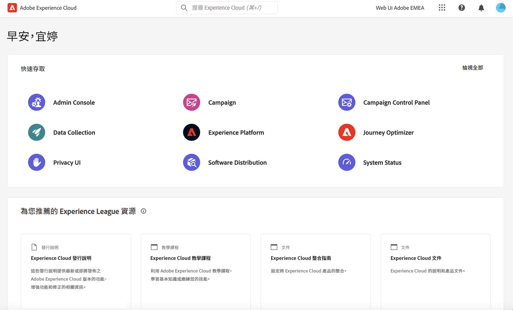
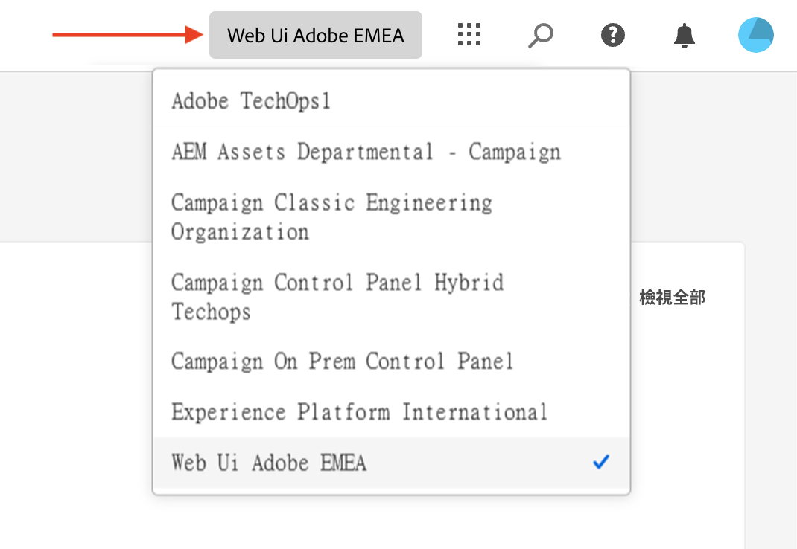
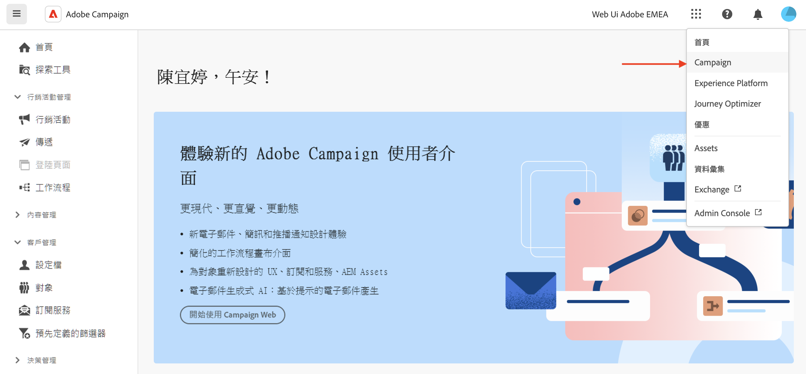
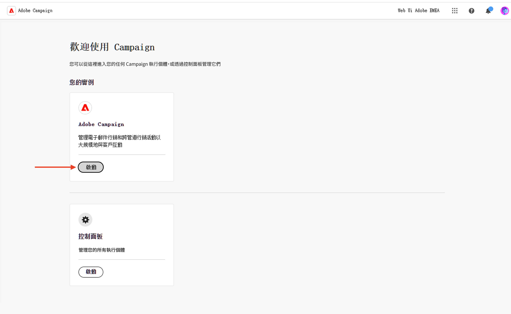

# 連線至 Adobe Campaign {#connect-to-campaign}

Experience Cloud 是 Adobe 的整合式數位行銷應用程式、產品和服務系列。您可以從其直覺式介面，快速存取雲端應用程式、產品功能和服務。在本頁瞭解如何連線至Adobe Experience Cloud及存取Adobe Campaign網路介面。

## 登入 Adobe Experience Cloud {#sign-in-to-exc}

您只能使用單一登入 (SSO) 來連線至 Campaign。通常 Experience Cloud 管理員會授予存取應用程式和服務的權限。 依照電子郵件邀請中的步驟進行，加入 Experience Cloud。

若要登入Adobe Experience Cloud，請遵循下列基本步驟：

1. 瀏覽至 [Adobe Experience Cloud](https://experience.adobe.com/){target="_blank"}。

1. 使用 Adobe ID 或 Enterprise ID 來登入。 在[本文](https://helpx.adobe.com/tw/enterprise/using/identity.html){target="_blank"}中進一步瞭解Adobe的身分型別。

   登入 Experience Cloud 後，您可以快速存取所有解決方案和應用程式。

   {zoomable="yes"}

1. 確認您隸屬於正確的組織。

   {zoomable="yes"}{width="50%" align="left"}

   在[本文](https://experienceleague.adobe.com/docs/core-services/interface/administration/organizations.html?lang=zh-hant){target="_blank"}中進一步瞭解Adobe Experience Cloud中的組織。

## 存取 Adobe Campaign {#access-to-campaign}

若要存取 Campaign 環境，請從 Adobe Experience Cloud 首頁的「**快速存取**」區段中，選取 **Campaign**。

如果您已連線至其他Adobe Experience Cloud解決方案，請從熒幕右上角的解決方案切換器瀏覽至您的Campaign環境。

{zoomable="yes"}

如果您擁有存取多個環境的權限，包括 Campaign 控制面板，請按一下正確執行個體的「**啟動**」按鈕。

顯示Adobe Campaign啟動按鈕的{zoomable="yes"}

您現在已連接到 Campaign。如需了解如何開始使用使用者介面，請參閱[此頁面](user-interface.md)。

### 存取控制 {#access-control}

>[!CONTEXTUALHELP]
>id="acw_explorer_permissions_create"
>title="需要權限"
>abstract="您的管理員必須先授予您權限，您才能建立此物件。"

>[!CONTEXTUALHELP]
>id="acw_audiences_read_only"
>title="此對象為唯讀"
>abstract="您沒有編輯此對象的權限。如果需要，請聯絡管理員為您授予存取權。"

>[!CONTEXTUALHELP]
>id="acw_subscription_services_read_only"
>title="此服務為唯讀資料"
>abstract="您沒有編輯此服務的權限。如果需要，請聯絡管理員為您授予存取權。"

>[!CONTEXTUALHELP]
>id="acw_recipients_readonlyprofile"
>title="收件者唯讀設定檔"
>abstract="您沒有編輯此設定檔的許可權。 如果需要，請聯絡管理員為您授予存取權。"

>[!CONTEXTUALHELP]
>id="acw_campaign_read_only"
>title="此行銷活動為唯讀資料"
>abstract="您沒有編輯此行銷活動的權限。如果需要，請聯絡管理員為您授予存取權。"

>[!CONTEXTUALHELP]
>id="acw_deliveries_read_only"
>title="此傳遞為唯讀資料"
>abstract="您沒有編輯此傳遞的權限。如果需要，請聯絡管理員為您授予存取權。"

>[!CONTEXTUALHELP]
>id="acw_wf_read_only"
>title="此工作流程為唯讀資料"
>abstract="您沒有編輯此工作流程的權限。如果需要，請聯絡管理員為您授予存取權。"

存取控制會限制存取主要清單中的物件和資料，例如傳遞、收件者或工作流程。 這些限制也適用於「探索工具」導覽樹狀結構。此外，您需要從使用者介面建立、刪除、複製和編輯物件的權限。

Campaign網頁中的所有許可權會與Campaign使用者端主控台許可權同步。 只有 Campaign 管理員可以定義和修改使用者權限。

瀏覽Campaign Web使用者介面時，您可以存取資料、物件和功能，具體取決於您的許可權。 例如，如果沒有資料夾的存取權限，就看不到。您的權限也會影響物件和資料管理。如果沒有特定資料夾的寫入權限，即使可以在使用者介面中看到，也無法在該資料夾中建立傳遞。

您可以[在這裡了解如何檢視和管理權限](permissions.md)。

## Adobe Experience Cloud 頂端導覽 {#top-bar}

瀏覽介面的頂端列以進行下列作業：

* 分享有關Campaign網頁使用者介面的意見回饋。
* 切換組織。
* 在您的Adobe Experience Cloud解決方案和應用程式之間切換。
* 搜尋[Adobe Experience League](https://experienceleague.adobe.com/docs/?lang=zh-hant){target="_blank"}的說明。
* 檢查您的產品通知。
* 編輯您的Adobe設定檔並管理設定，例如[更新您最喜愛的語言](#language-pref)或[切換到淺色/深色主題](#dark-theme)。

{zoomable="yes"}{width="50%" align="left"}

## 支援的瀏覽器 {#browsers}

Adobe Campaign Web 目的是要在最新版本的 Google Chrome、Safari 和 Microsoft Edge 中以最佳方式運作。在舊版或其他瀏覽器上使用某些功能時，您可能會遇到問題。

## 語言偏好設定 {#language-pref}

Adobe Campaign Web 目前提供以下語言版本：

* 英文 (US) - EN-US
* 法文 - FR
* 德文 - DE
* 義大利文 - IT
* 西班牙文 - ES
* 葡萄牙文 (巴西) - PTBR
* 日文 - JP
* 韓文 - KR
* 簡體中文 - CHS
* 繁體中文 - CHT

Campaign Web 的預設語言是由您的使用者個人檔案中指定的偏好語言所決定。那與您的 Campaign 伺服器和用戶端控制台的語言無關。

若要變更您的語言：

1. 按一下右上角您的個人檔案圖示，然後選取「**偏好設定**」。
1. 按一下您電子郵件地址下方顯示的語言連結。
1. 選取您偏好的語言，然後按一下「**儲存**」。您可以選取第二語言，以防您使用的元件沒有您第一語言的版本。

## 深色和淺色主題 {#dark-theme}

Adobe Campaign 提供淺色和深色主題。依據預設，使用者介面會在淺色主題中啟用。若要切換至深色佈景主題，請按一下您的設定檔圖示，然後使用&#x200B;**深色佈景主題**&#x200B;切換來啟用或停用它。

[此章節](https://experienceleague.adobe.com/docs/core-services/interface/experience-cloud.html?lang=zh-hant#preferences){target="_blank"}詳細說明有關使用者檔案設定和帳戶偏好設定的內容。

了解更多有關 Experience Cloud 中央介面元件的資訊，請參閱[此文件](https://experienceleague.adobe.com/docs/core-services/interface/experience-cloud.html?lang=zh-hant){target="_blank"}。