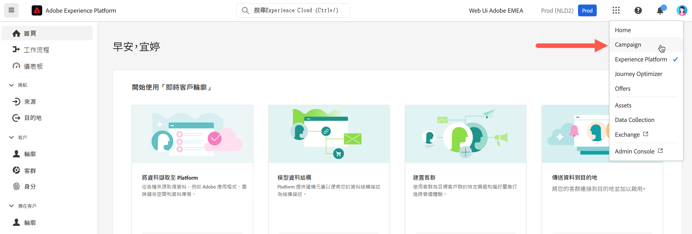

# 連線至Adobe Campaign {#connect-to-campaign}

Experience Cloud是Adobe的整合式數位行銷應用程式產品和服務系列。 透過其直覺式介面，您可以快速存取您的雲端應用程式、產品功能和服務。 在本頁中瞭解如何連線至Adobe Experience Cloud及存取Adobe Campaign v8網頁介面。

## 登入Adobe Experience Cloud {#sign-in-to-exc}

通常Experience Cloud管理員會授予應用程式和服務的存取權。 依照邀請您加入Experience Cloud的電子郵件中的步驟進行。

若要登入Adobe Experience Cloud，基本步驟為：

1. 瀏覽至 [Adobe Experience Cloud](https://experience.adobe.com/){target="_blank"}。

1. 使用您的Adobe ID或Enterprise ID登入。 在Adobe中進一步瞭解身分型別 [本文](https://helpx.adobe.com/enterprise/using/identity.html){target="_blank"}.

   登入Experience Cloud後，您可以快速存取所有解決方案和應用程式。

   

1. 確認您隸屬於正確的組織。

   {width="50%" align="left"}

   瞭解有關Adobe Experience Cloud中組織的詳細資訊，請參閱 [本文](https://experienceleague.adobe.com/docs/core-services/interface/administration/organizations.html?lang=zh-Hant){target="_blank"}.

## 存取Adobe Campaign {#access-to-campaign}

若要存取您的Campaign環境，請選取 **Campaign** 從Adobe Experience Cloud首頁。

您也可以使用解決方案切換器，在Adobe Experience Cloud解決方案和應用程式之間瀏覽。

如果您擁有多個環境的存取權，包括Campaign控制面板，請按一下 **Launch** 按鈕以取得正確的執行個體。

## Adobe Experience Cloud頂端導覽 {#top-bar}

使用介面的頂端列進行以下作業：

* 以測試版使用者的身分分享您的意見
* 在組織之間切換
* 在您的Adobe Experience Cloud解決方案和應用程式之間切換

{width="50%" align="left"}

## 支援的瀏覽器 {#browsers}

Campaign v8 Web的設計可在最新版Google Chrome、Safari和Microsoft Edge中以最佳方式運作。 您在舊版或其他瀏覽器上使用某些功能時可能會遇到問題。

## 語言偏好設定 {#language-pref}

Campaign v8 Web 目前提供以下語言版本：

* 英文 (US) - EN-US
* 法文 - FR
* 德文 - DE
* 義大利文 - IT
* 西班牙文 - ES
* 葡萄牙文 (巴西) - PTBR
* 日文 - JP
* 韓文 - KR
* 簡體中文 - CHS
* 繁體中文 - CHT

您對 Campaign Web 的預設語言是由使用者設定檔中指定的偏好語言所決定。那與您的 Campaign 伺服器和用戶端主控台的語言無關。

若要變更您的語言：

1. 按一下右上角您的設定檔圖示，然後選取「**偏好設定**」。
1. 然後，按一下您電子郵件地址下顯示的語言連結。
1. 選取您偏好的語言，然後按一下「**儲存**」。您可以選取第二種語言，以備您使用的元件未當地語系化為您的第一種語言。

## 深色主題 {#dark-theme}

您可以從個人資料圖示切換到深色主題。使用「**深色主題**」切換以啟用/停用。

有關使用者個人資料設定和帳戶偏好設定的詳情，請參閱 [本節](https://experienceleague.adobe.com/docs/core-services/interface/experience-cloud.html#preferences){target="_blank"}.

進一步瞭解Experience Cloud中央介面元件，請參閱 [本檔案](https://experienceleague.adobe.com/docs/core-services/interface/experience-cloud.html){target="_blank"}.

