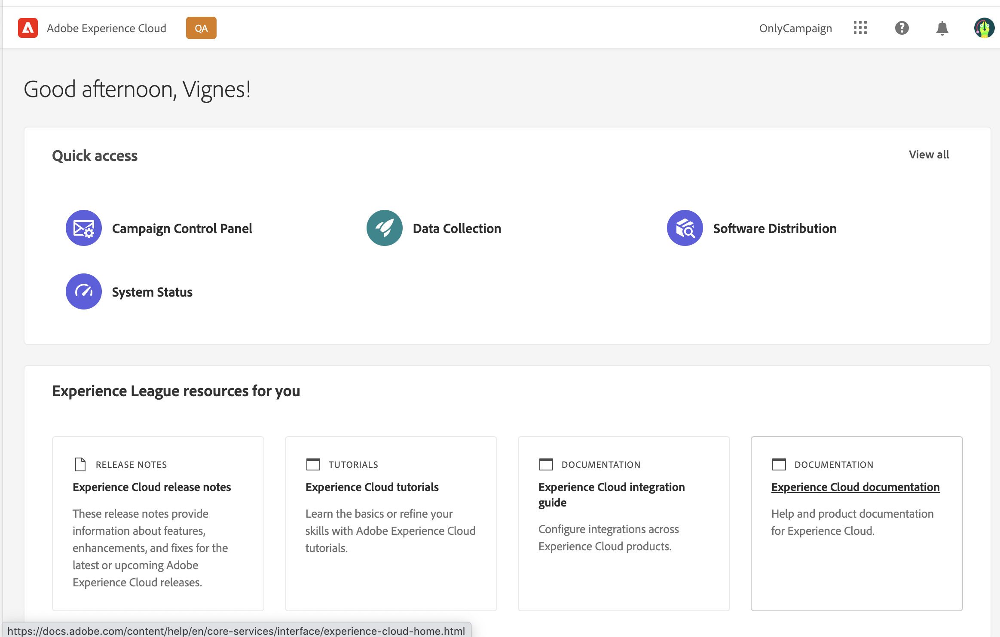

# Get started with Campaign v8 Web {#get-started}

<!--
V8 web overview
context, scope (targets cross-channel practitioners), limitations
only existing customers
-->
>[!CONTEXTUALHELP]
>id="acw_homepage_card1"
>title="Get started"
>abstract="Discover key capabilities, user interface and global guidelines."

>[!NOTE]
>
>Campaign v8 Web is currently in Alpha version. Access is restricted to a small set of Alpha customers. Please be aware that product interface, capabilities and usage flows can change without notice.

Adobe Campaign provides a platform for designing cross-channel customer experiences and an environment for visual campaign orchestration, real-time interaction management and cross channel execution.

Initially only available through a rich [client console](#ac-client), Campaign now provides a new web user interface with enhanced usability, accessibility, and a new design to significantly improve your user experience. This new modern UI simplifies marketing campaign design and delivery, and brings consistency, along with other Adobe solutions, including Adobe Experience Platform.

This new UI first serves the needs of the **business practitioner** – all typical administration tasks are not available in this first version, but will be addressed in subsequent versions. Note that not every single functionality or option available in the client console is available for now in the new UI. New use-cases, options and features will be available in future releases.

If you need to access Campaign v8 capabilities which are not available in the web UI, you can use the [client console](#ac-client). 

## About Campaign client console{#ac-client}

The Campaign client console is a browser-based application which is installed on your system. It uses the web services API to connect to your Campaign application server.

Learn how to download and install the client console in [this section](https://experienceleague.adobe.com/docs/campaign/campaign-v8/new/connect.html){target="_blank"}.

For more information on how to use Campaign v8, refer to the [documentation](https://experienceleague.adobe.com/docs/campaign/campaign-v8/campaign-home.html){target="_blank"}.

Campaign data is stored in the application server. Data is available both from the client console and from the web UI. For example, if you create a delivery template using the client console, it is also available in the web UI. And if you create an email delivery in the web UI, this delivery is also accessible from the client console.

## Connect to Campaign

1. Connect to [Adobe Experience Cloud](http://experience.adobe.com){target="_blank"}.
1. Log in with your Adobe credentials.
1. In the **Quick access** section, click **Campaign**.
    

1. In the next page, click the **Launch** button of your Campaign instance.
    You are now connected to Campaign. Learn how to start using the user interface in [this page](user-interface.md).

<!--
-> experience cloud home: "Campaign" -> home campaign v8
-> or Campaign v8 web if direct URL
-->

