# 護欄和限制 {#guardrails-limitations}

使用在Campaign使用者端主控台中建立或修改之元件的Campaign網頁UI時，以下所列護欄和限制適用。

## 工作流程 {#wf-guardrails-limitations}

### 活動

Web UI中尚未支援的工作流程活動為唯讀，且會顯示為不相容的活動。 您仍然可以執行工作流程、傳送訊息、檢查記錄檔等。 Web UI和使用者端主控台中可用的工作流程活動皆可編輯。

| 主控台 | Web UI |
| --- | --- |
| 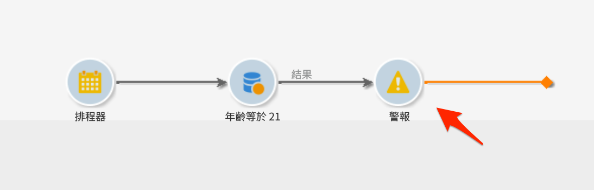{width="800px" align="left" zoomable="yes"} | 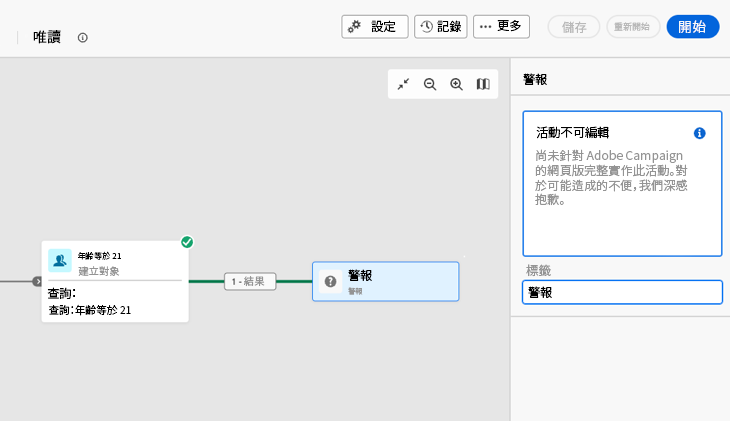{width="800px" align="left" zoomable="yes"} |

不會顯示Web UI中尚未支援的工作流程活動設定。 但是，執行工作流程時，這些設定會套用。

| 主控台 | Web UI |
| --- | --- |
| 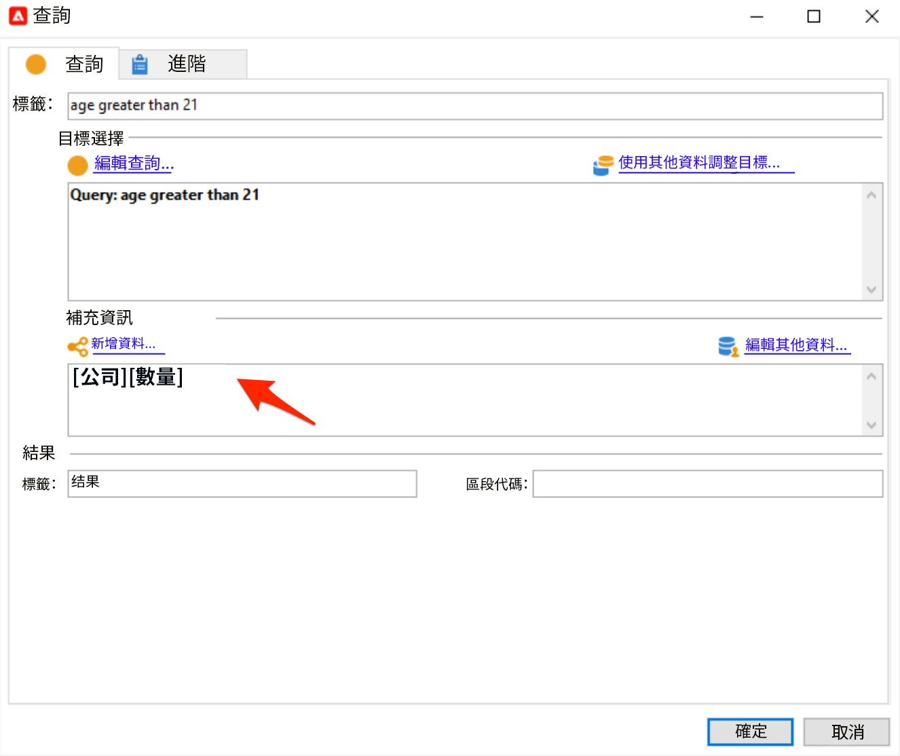{width="800px" align="left" zoomable="yes"} | 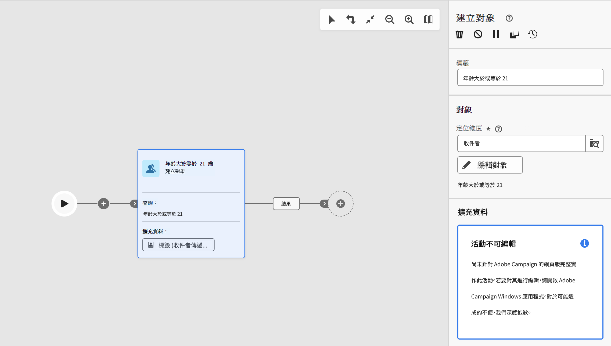{width="800px" align="left" zoomable="yes"} |

在主控台中， **擴充** 活動可同時執行調解和擴充。 在Web UI中，尚未提供調解功能。 如果您已在主控台中定義 **擴充** 活動，則會在Web UI中顯示為不相容的唯讀活動。

| 主控台 | Web UI |
| --- | --- |
| {width="800px" align="left" zoomable="yes"} | {width="800px" align="left" zoomable="yes"} |

### 畫布

在Web UI中建立新工作流程時，畫布僅支援一個進入點。 不過，如果您在主控台中建立了具有多個進入點的工作流程，則可以在網頁UI中開啟及編輯該工作流程。

| 主控台 | Web UI |
| --- | --- |
| 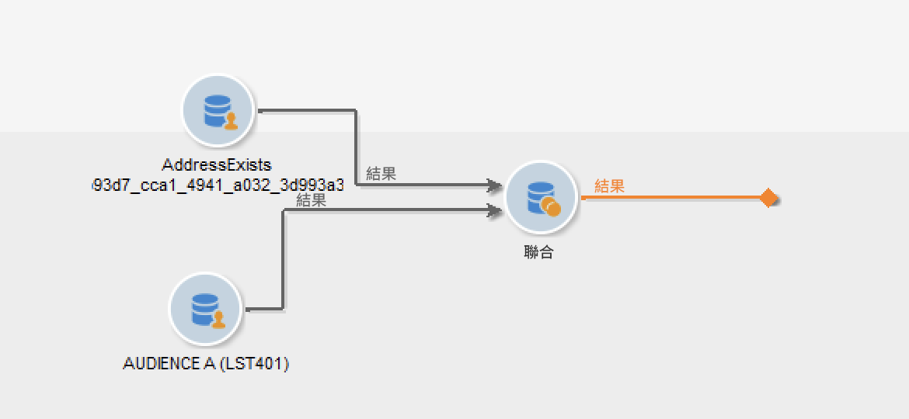{width="800px" align="left" zoomable="yes"} | 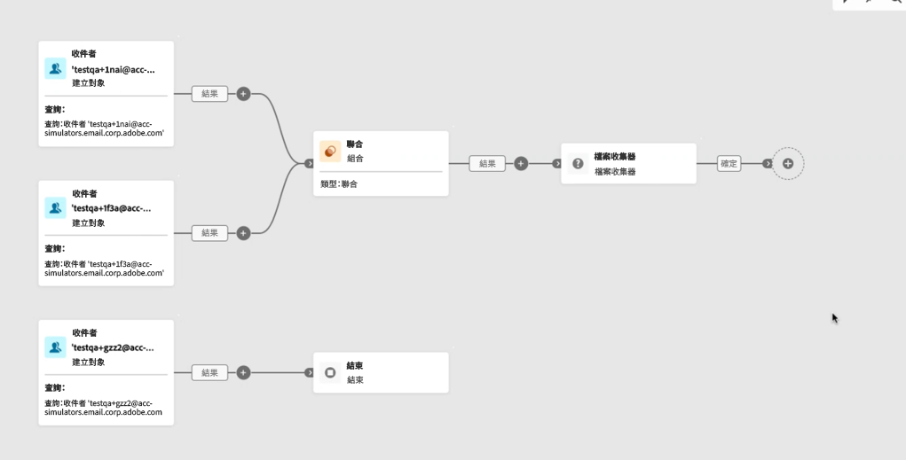{width="800px" align="left" zoomable="yes"} |

網頁UI中尚未提供回圈。 如果您使用主控台建立了包含回圈的工作流程，則無法從Web UI存取它。 畫面會顯示錯誤訊息。

| 主控台 | Web UI |
| --- | --- |
| 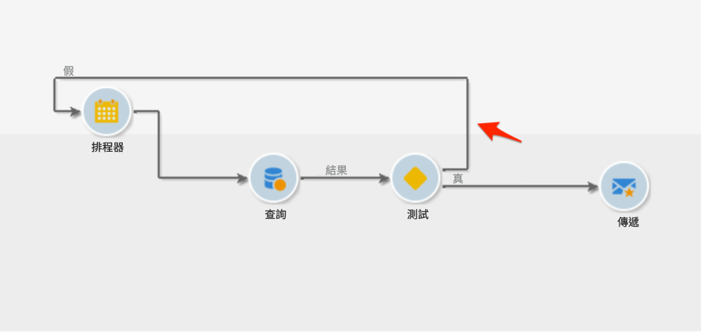{width="800px" align="left" zoomable="yes"} | 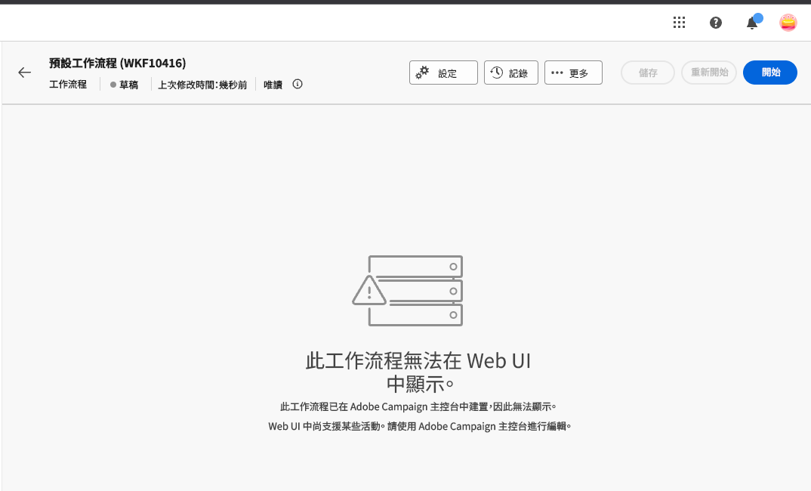{width="800px" align="left" zoomable="yes"} |

每次新增或移除活動時，都會重新整理節點位置。 如果您在主控台中建立工作流程，並使用Web UI修改它，然後在主控台中重新開啟，您可能會注意到一些細微的定位不完美。 這對工作流程的流程和任務沒有影響。

| 初始工作流程 | 位置變更 |
| --- | --- |
| 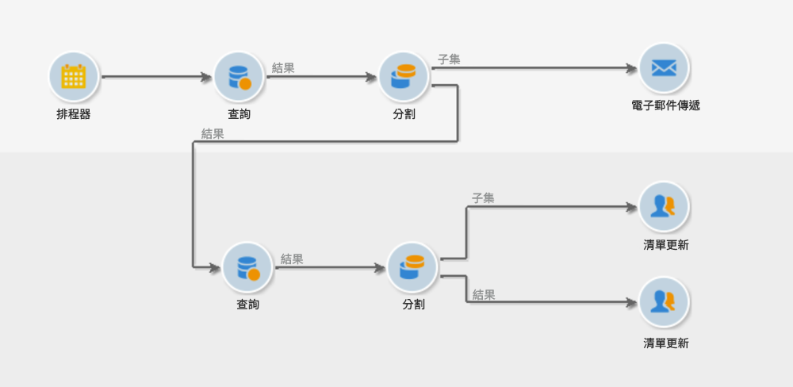{width="800px" align="left" zoomable="yes"} | 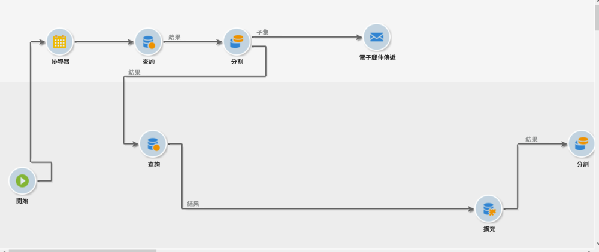{width="800px" align="left" zoomable="yes"} |

## 預先定義的篩選 {#filters-guardrails-limitations}

選取傳送的對象時，或是在工作流程中建立對象時，該版本產品的使用者介面中無法使用某些預先定義的篩選器。

此時會顯示特定錯誤訊息。

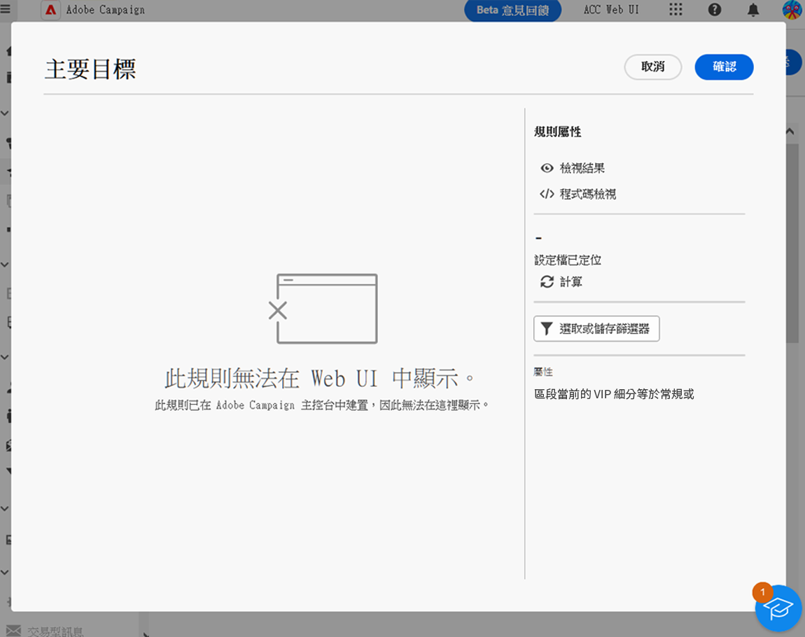{width="70%" align="left"}

即使您無法在規則產生器中檢視查詢的圖形表示，也無法編輯篩選器，您仍可以使用它，並檢視 **屬性** 區段。

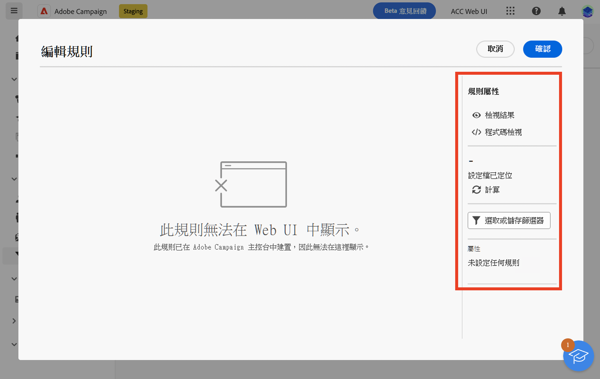{width="70%" align="left"}

您也可以存取SQL查詢以檢查確切的設定。 若要這麼做，請按一下 **程式碼檢視** 按鈕。

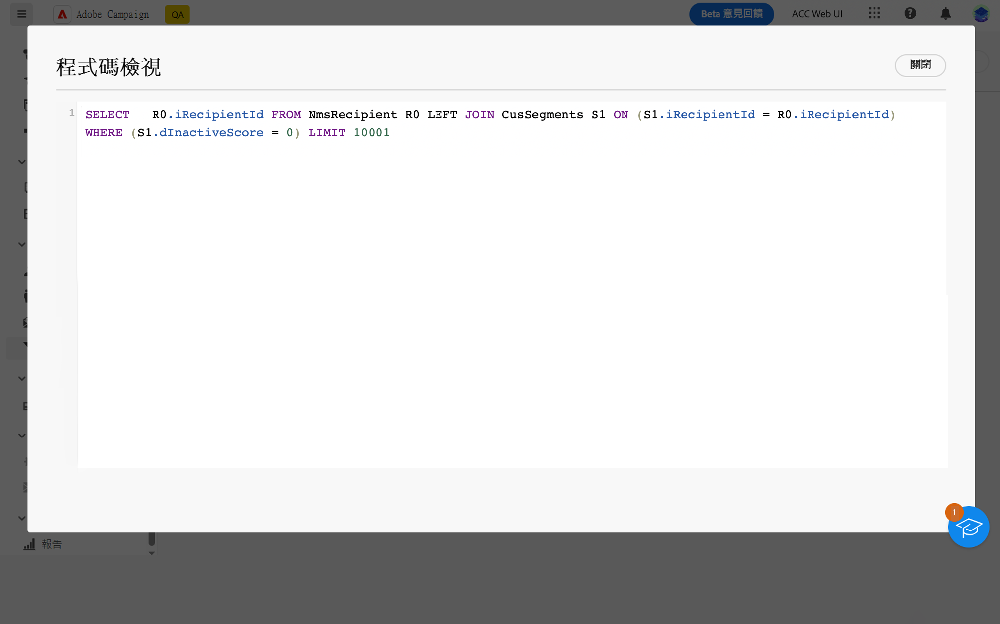{width="70%" align="left"}

按一下 **計算** 按鈕以檢查符合篩選條件的專案數。

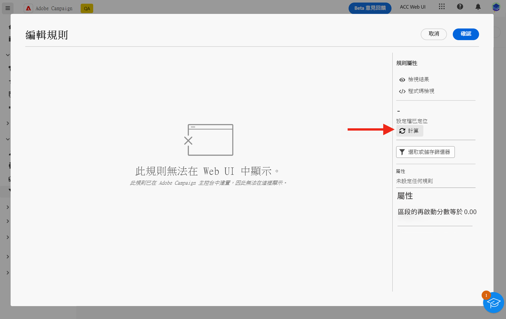{width="70%" align="left"}

使用 **檢視結果** 按鈕以顯示這些專案。

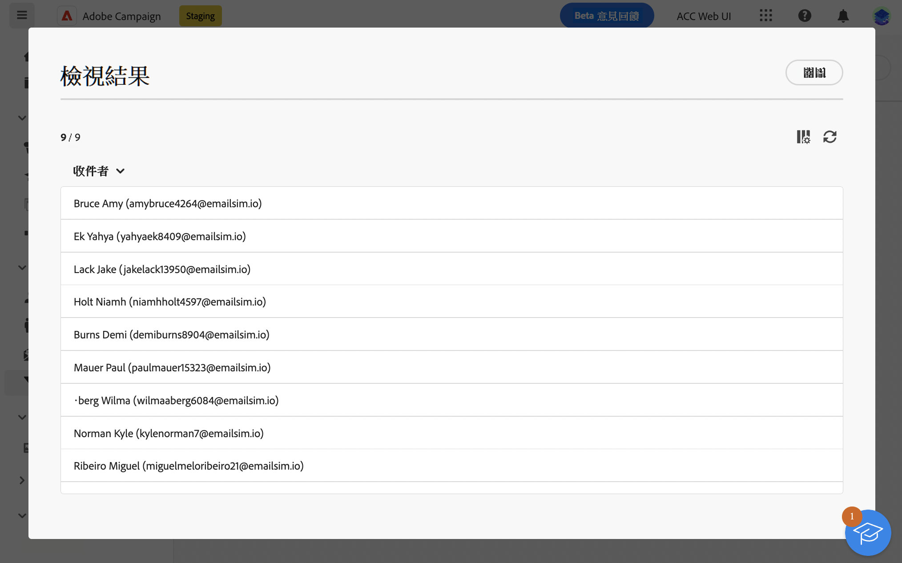{width="70%" align="left"}

請注意，如果您在Web介面中建立篩選器，並在主控台中使用不支援的屬性來修改篩選器，Web介面中將無法再使用圖形表示。 在任何情況下，您仍可使用篩選器。

以下列出不支援的屬性。

### 不支援的資料型別 {#unsupported-data-type}

在Web介面中顯示篩選器或規則時，不支援使用者端主控台中可用的下列資料型別：

* 日期時間
* 時間
* 時間跨度
* 兩次
* 浮點數

### 不支援的篩選功能 {#unsupported-filtering-capabilities}

若篩選是在使用者端主控台中以複雜的運算式和函式建立，則無法在Web介面中進行編輯。

此外，不支援下列運運算元：

* 數值型別
   * 包含在
   * no in

* 字串型別
   * 大於
   * 小於
   * 大於或等於
   * 小於或等於
   * 按讚
   * 不相似

* 日期型別
   * 在或晚於
   * 在或早於
   * 不等於
   * 是空的
   * 不是空的
   * 包含在
   * 不在
   * 最近

* 1-N連結
   * COUNT， SUM， AVG， MIN， MAX