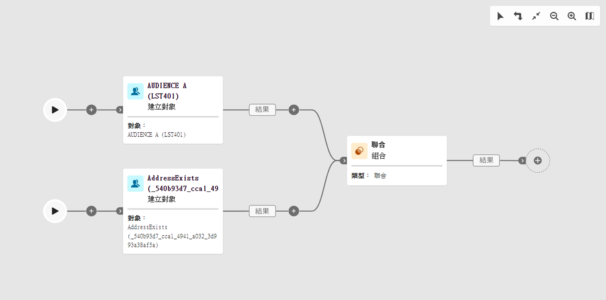

# 工作流程的護欄和限制 {#guardrails-limitations}

當在 Campaign Web 使用者介面使用在 Campaign 用戶端主控台建立或修改的工作流程時，便會套用下方所列的護欄和限制。

請注意，儘管本頁面會針對在主控台與網路使用者介面使用工作流程說明主要考量，但並未涵蓋兩個介面之間的所有潛在不相容性。

## 工作流程活動 {#wkf-activities}

Campaign Web 尚不支援的工作流程活動為唯讀，並會顯示為不相容的活動。您仍然可以執行工作流程、傳送訊息、檢查記錄等。Campaign Web 和用戶端主控台中可用的工作流程活動均可編輯。

Campaign Web 中尚不支援的工作流程活動為唯讀，並會顯示為不相容的活動。您仍然可以執行工作流程、傳送訊息、檢查記錄等。Campaign Web 使用者介面和 Campaign 用戶端主控台都可用的工作流程活動均可編輯。

| 主控台 | Web |
| --- | --- |
| {zoomable=&quot;yes&quot;}{width="800px" align="left" zoomable="yes"} | {zoomable=&quot;yes&quot;}{width="800px" align="left" zoomable="yes"} |

當在主控台利用其他資料設定&#x200B;**查詢**&#x200B;或&#x200B;**擴充**&#x200B;活動時，Campaign Web 會將擴充資料納入考量，並傳遞至出站轉變，但無法編輯。

| 主控台 | Web |
| --- | --- |
| {zoomable=&quot;yes&quot;}{width="800px" align="left" zoomable="yes"} | {zoomable=&quot;yes&quot;}{width="800px" align="left" zoomable="yes"} |

在主控台中，「**擴充**」活動可以執行調和和擴充。如果您已在主控台定義&#x200B;**擴充**&#x200B;活動的調和設定，其將在 Campaign Web 使用者介面顯示為&#x200B;**調和**&#x200B;活動。

| 主控台 | Web |
| --- | --- |
| {zoomable=&quot;yes&quot;}{width="800px" align="left" zoomable="yes"} | {zoomable=&quot;yes&quot;}{width="800px" align="left" zoomable="yes"} |

## 工作流程畫布 {#wkf-canvas}

在 Campaign Web 使用者介面建立新工作流程時，畫布僅支援單一進入點。但是，如果您在主控台中建立了具有多個進入點的工作流程，則可以在 Campaign Web 使用者介面開啟並加以編輯。

| 主控台 | Web |
| --- | --- |
| {zoomable=&quot;yes&quot;}{width="800px" align="left" zoomable="yes"} | {zoomable=&quot;yes&quot;}{width="800px" align="left" zoomable="yes"} |

節點的定位會在每次新增或移除活動時重新整理。如果您在主控台中建立工作流程，請使用 Campaign Web 使用者介面進行修改並在主控台重新開啟，您可能會發現一些細微的定位瑕疵。這對工作流程的流程和任務沒有影響。

| 初始工作流程 | 定位變更 |
| --- | --- |
| {zoomable=&quot;yes&quot;}{width="800px" align="left" zoomable="yes"} | {zoomable=&quot;yes&quot;}{width="800px" align="left" zoomable="yes"} |
