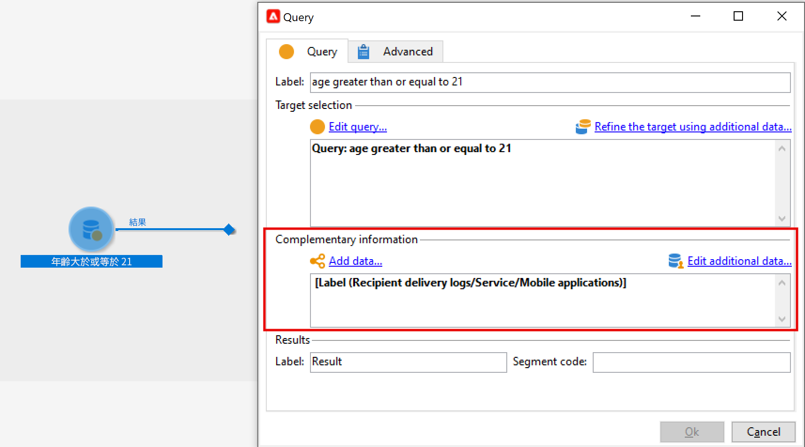

# 護欄和限制 {#guardrails-limitations}

在Campaign網頁使用者介面中使用在Campaign使用者端主控台中建立或修改的工作流程時，以下列出的護欄和限制適用。

請注意，雖然本頁會說明在主控台和Web使用者介面中使用工作流程時的主要考量，但並未涵蓋兩個介面之間的所有潛在不相容性。

## 工作流程活動 {#wkf-activities}

Campaign網站尚未支援的工作流程活動為唯讀，且會顯示為不相容的活動。 您仍然可以執行工作流程、傳送訊息、檢查記錄等。Campaign Web和使用者端主控台中可用的工作流程活動皆可編輯。

Campaign Web使用者介面中尚未支援的工作流程活動是唯讀的，且會顯示為不相容的活動。 您仍然可以執行工作流程、傳送訊息、檢查記錄等。Campaign Web使用者介面和Campaign使用者端主控台中可用的工作流程活動皆可編輯。

| 主控台 | Web |
| --- | --- |
| {zoomable=&quot;yes&quot;}{width="800px" align="left" zoomable="yes"} | {zoomable=&quot;yes&quot;}{width="800px" align="left" zoomable="yes"} |

當 **查詢** 或 **擴充** 活動在主控台中使用其他資料進行設定，擴充資料會在Campaign Web中納入考量，並傳遞至出站轉變，但無法編輯。

| 主控台 | Web |
| --- | --- |
| {zoomable=&quot;yes&quot;}{width="800px" align="left" zoomable="yes"} | {zoomable=&quot;yes&quot;}{width="800px" align="left" zoomable="yes"} |

在主控台中，「**擴充**」活動可以執行調和和擴充。如果您已在使用者端主控台中定義 **擴充** 活動，則會顯示為 **調解** Campaign網頁使用者介面中的活動。

| 主控台 | Web |
| --- | --- |
| {zoomable=&quot;yes&quot;}{width="800px" align="left" zoomable="yes"} | {zoomable=&quot;yes&quot;}{width="800px" align="left" zoomable="yes"} |

## 工作流程畫布 {#wkf-canvas}

在Campaign Web使用者介面中建立新工作流程時，畫布僅支援一個進入點。 不過，如果您在主控台中建立了具有多個進入點的工作流程，則可在Campaign Web使用者介面中開啟及編輯該工作流程。

| 主控台 | Web |
| --- | --- |
| {zoomable=&quot;yes&quot;}{width="800px" align="left" zoomable="yes"} | {zoomable=&quot;yes&quot;}{width="800px" align="left" zoomable="yes"} |

節點的定位會在每次新增或移除活動時重新整理。如果您在主控台中建立工作流程、使用Campaign Web使用者介面修改它，並在主控台中重新開啟它，您可能會注意到一些細微的定位瑕疵。 這對工作流程的流程和任務沒有影響。

| 初始工作流程 | 定位變更 |
| --- | --- |
| {zoomable=&quot;yes&quot;}{width="800px" align="left" zoomable="yes"} | {zoomable=&quot;yes&quot;}{width="800px" align="left" zoomable="yes"} |
