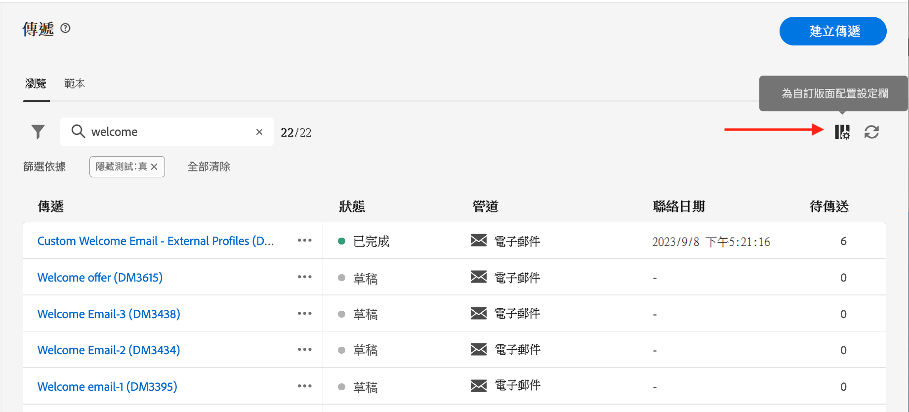
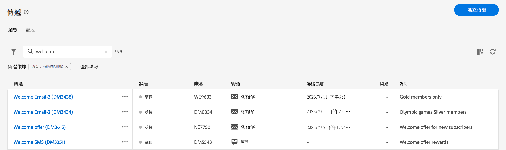
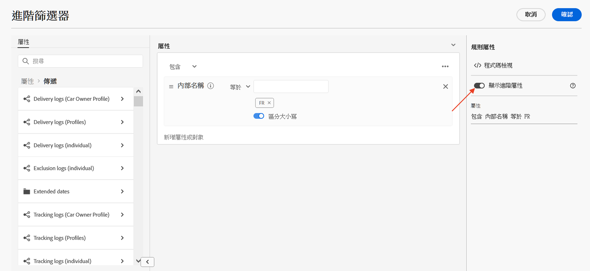

# 瀏覽和篩選清單 {#list-screens}

左側導覽功能表中的大部分連結會顯示物件清單，例如，**傳遞**&#x200B;或&#x200B;**行銷活動**&#x200B;的清單。這些清單畫面部分為唯讀。您可以自訂清單顯示，並篩選這些清單，如下所述。

## 自訂清單畫面 {#custom-lists}

清單顯示在欄中。您可以變更欄設定來顯示其他資訊。若要這麼做，請按一下清單右上角的「**設定自訂版面的欄**」圖示。

{width="70%" align="left" zoomable="yes"}

在「**設定欄**」畫面中，可新增或移除欄，並變更欄的顯示順序。

例如，對於這些設定：

{width="70%" align="left" zoomable="yes"}

清單會顯示以下欄：

{width="70%" align="left" zoomable="yes"}

## 排序資料 {#sort-lists}

按一下任何欄標頭，還能將清單中的項目排序。顯示箭頭 (向上或向下) 即表示清單已按該欄排序。

對於數字或日期欄，**向上**&#x200B;箭頭表示清單依據遞增順序排序，而&#x200B;**向下**&#x200B;箭頭則表示依據遞減順序。若為字串或英數字元欄，則會依據字母順序列出值。

## 篩選器 {#list-built-in-filters}

若要更快地找到項目，您可以使用搜尋列或內建及自訂篩選器，以便根據內容條件來調整清單。

{width="70%" align="left" zoomable="yes"}

如需有關如何使用篩選器和建立您自己的自訂篩選器的詳細資訊，請參閱[本章節](../query/filter.md)。

<!--
## Use advanced attributes {#adv-attributes}

>[!CONTEXTUALHELP]
>id="acw_attributepicker_advancedfields"
>title="Display advanced attributes"
>abstract="Only the most common attributes are displayed by default in the attribute list. Activate the **Display advanced attributes** toggle to see all available attributes for the current list in the left palette of the rule builder, such as nodes, groupings, 1-1 links, 1-N links."

>[!CONTEXTUALHELP]
>id="acw_rulebuilder_advancedfields"
>title="Rule builder advanced fields"
>abstract="Only the most common attributes are displayed by default in the attribute list. Activate the **Display advanced attributes** toggle to see all available attributes for the current list in the left palette of the rule builder, such as nodes, groupings, 1-1 links, 1-N links."

>[!CONTEXTUALHELP]
>id="acw_rulebuilder_properties_advanced"
>title="Rule builder advanced attributes"
>abstract="Only the most common attributes are displayed by default in the attribute list. Activate the **Display advanced attributes** toggle to see all available attributes for the current list in the left palette of the rule builder, such as nodes, groupings, 1-1 links, 1-N links."

Only most common attributes are displayed by default in the attribute list and filter configuration screens. Attributes which were set as `advanced` attributes in the data schema are hidden from the configuration screens. 

Activate the **Display advanced attributes** toggle to see all available attributes for the current list in the left palette of the rule builder, such as nodes, groupings, 1-1 links, 1-N links. The attribute list is updated instantly.

{width="70%" align="left" zoomable="yes"}
-->