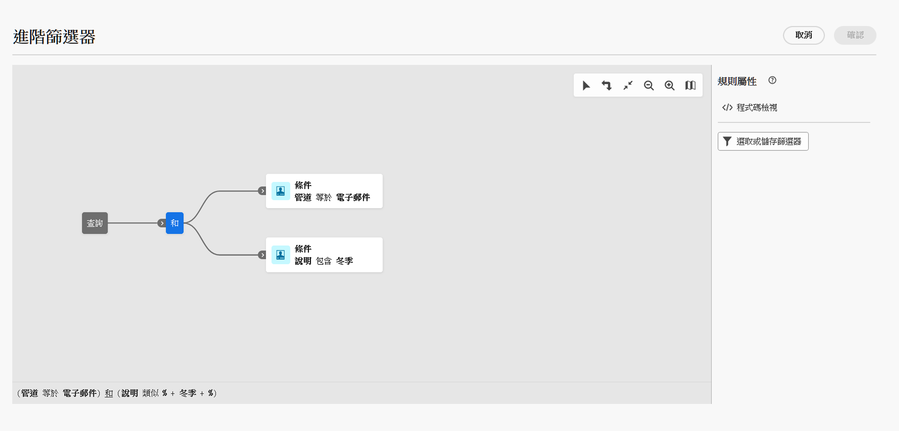

# 瀏覽、搜尋和篩選清單 {#list-screens}

左側導覽選單的大部分連結會顯示物件清單，例如 **傳遞** 或 **行銷活動**. 這些清單畫面中有些是唯讀的。 您可以自訂清單顯示，並篩選這些清單，如下所述。

若要移除篩選器，請按一下 **全部清除** 按鈕。

## 自訂清單畫面 {#custom-lists}

清單顯示在欄中。您可以變更欄設定來顯示其他資訊。若要這麼做，請按一下 **設定自訂配置的欄** 圖示填入清單。

{width="70%" align="left" zoomable="yes"}

在 **設定欄** 畫面、新增或移除欄，以及變更欄的顯示順序。

例如，對於這些設定：

{width="70%" align="left" zoomable="yes"}

清單會顯示下列各欄：

{width="70%" align="left" zoomable="yes"}

使用 **顯示進階屬性** 切換即可檢視目前清單的所有屬性。 [了解更多](#adv-attributes)

## 排序資料 {#sort-lists}

您也可以按一下任何欄標題來排序清單中的專案。 會顯示箭頭 (向上或向下) 表示清單已按該欄排序。

若為數值或日期欄，則 **上** 箭頭表示清單會依遞增順序排序，而 **向下** 箭頭表示遞減順序。 對於字串或英數字元欄，值按字母順序列出。

## 內建篩選器 {#list-built-in-filters}

若要更快速地尋找專案，您可以使用搜尋列，或根據內容條件篩選清單。

{width="70%" align="left" zoomable="yes"}

例如，您可以根據傳送的狀態、頻道、聯絡日期或資料夾來篩選傳送。 您也可以隱藏測試。

## 自訂篩選器{#list-custom-filters}

若要建立資料的自訂篩選器，請瀏覽至篩選器底部，然後按一下 **新增規則** 按鈕。

拖放屬性以在 **進階篩選** 畫面。

{width="70%" align="left" zoomable="yes"}

使用 **顯示進階屬性** 切換即可檢視目前清單的所有屬性。 [了解更多](#adv-attributes)

## 使用進階屬性 {#adv-attributes}

>[!CONTEXTUALHELP]
>id="acw_attributepicker_advancedfields"
>title="顯示進階屬性"
>abstract="依預設，只有最常見的屬性會顯示在屬性清單中。 使用此切換來建立具有進階屬性的篩選器。"

>[!CONTEXTUALHELP]
>id="acw_rulebuilder_advancedfields"
>title="規則產生器進階欄位"
>abstract="使用進階欄位設定欄。"

>[!CONTEXTUALHELP]
>id="acw_rulebuilder_properties_advanced"
>title="規則產生器進階屬性"
>abstract="使用進階屬性定義規則。"

依預設，只有最常見的屬性會顯示在屬性清單和篩選設定畫面中。 設定為的屬性 `advanced` 資料結構描述中的屬性會在設定畫面中隱藏。

啟動 **顯示進階屬性** 切換即可檢視目前清單的所有可用屬性：屬性清單會立即更新。

{width="70%" align="left" zoomable="yes"}
