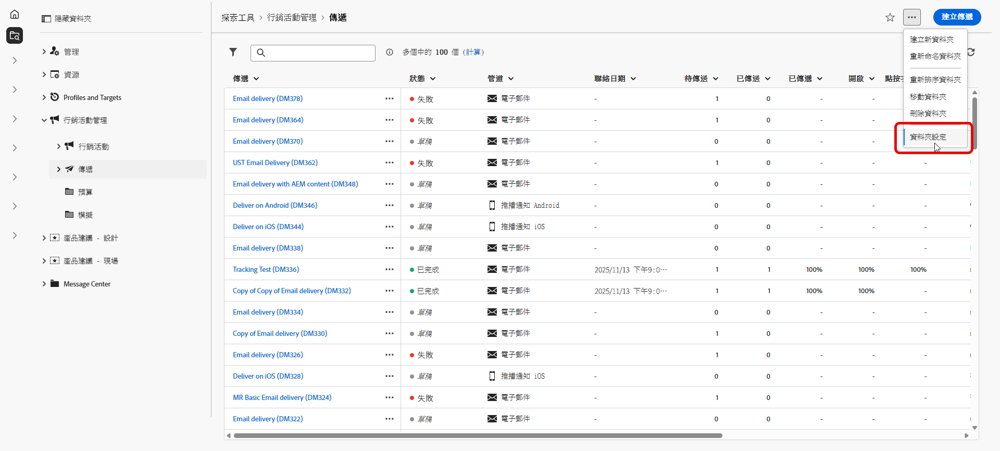
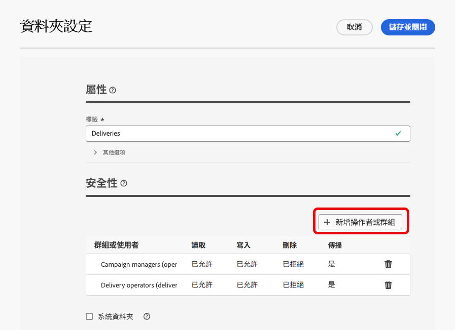
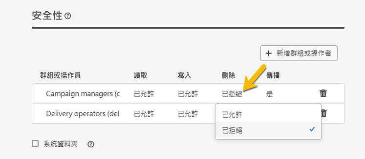

# 權限 {#permissions}

Adobe Campaign中的每個使用者在應用程式中都有特定的許可權和限制。 使用者可屬於操作者群組並繼承群組的許可權。

運運算元可以根據其許可權：

* 存取特定功能
* 存取特定資料
* 存取特定動作（建立、修改、刪除）

在Adobe Campaign中設定許可權的詳細程式可在[Adobe Campaign v8 （主控台）檔案](https://experienceleague.adobe.com/zh-hant/docs/campaign/campaign-v8/admin/permissions/gs-permissions){target="_blank"}中取得。

## 資料夾權限 {#folder-permissions}

根據您的許可權，您可以在&#x200B;**[!UICONTROL 資料夾設定]**&#x200B;中檢視和管理資料夾的許可權。

以下是傳遞資料夾的範例：

{zoomable="yes"}

在&#x200B;**[!UICONTROL 資料夾設定]**&#x200B;的&#x200B;**[!UICONTROL 安全性]**&#x200B;區段中，您可以檢視及管理（新增或刪除）可存取資料夾的操作者或群組。

{zoomable="yes"}

您可以直接按一下許可權，然後將其變更為&#x200B;**[!UICONTROL 允許]**&#x200B;或&#x200B;**[!UICONTROL 拒絕]**。

{zoomable="yes"}

如果&#x200B;**[!UICONTROL Propagate]**&#x200B;選項已啟用，則為資料夾定義的所有許可權都會套用至其所有子資料夾。 每個子檔案夾都可以覆寫這些許可權。

如果選取了&#x200B;**[!UICONTROL 系統資料夾]**&#x200B;選項，則允許所有操作者存取，無論其許可權為何。

您也可以[在 Adobe Campaign 控制台中管理資料夾權限](https://experienceleague.adobe.com/zh-hant/docs/campaign/campaign-v8/admin/permissions/folder-permissions){target="_blank"}。

Campaign Web使用者介面中的所有許可權會與Campaign使用者端主控台許可權同步。