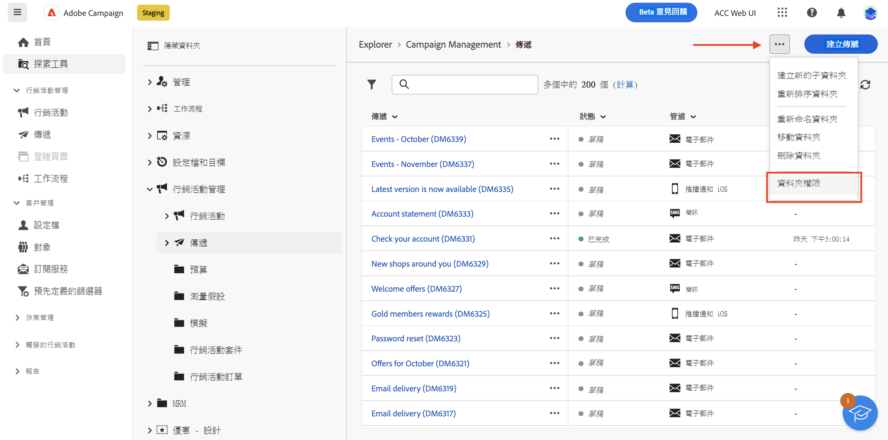
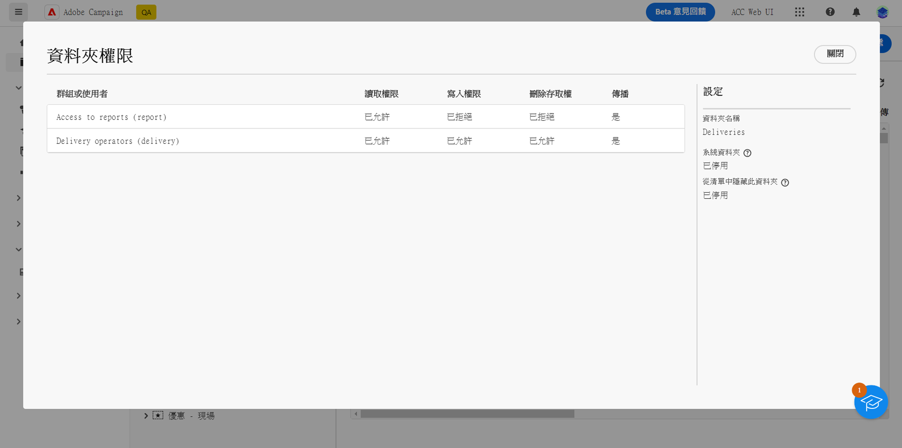
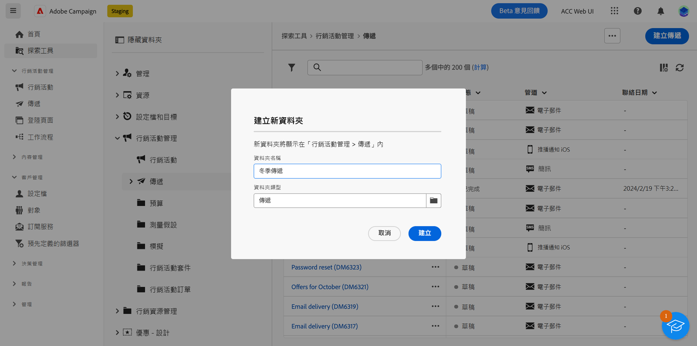
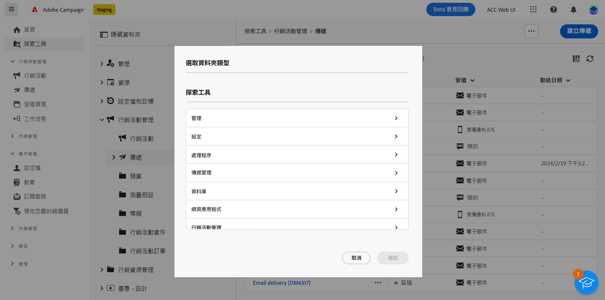
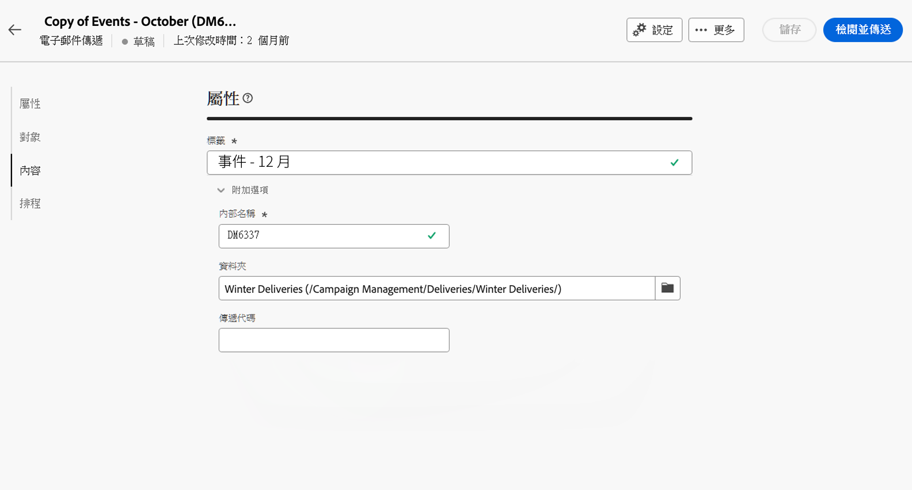

# 存取權與權限 {#access-and-permissions}

>[!CONTEXTUALHELP]
>id="acw_explorer_permissions_create"
>title="需要權限"
>abstract="您的管理員必須先授予您權限，您才能建立此物件。"

>[!CONTEXTUALHELP]
>id="acw_audiences_read_only"
>title="此對象為唯讀"
>abstract="您沒有編輯此對象的權限。如果需要，請聯絡管理員為您授予存取權。"

>[!CONTEXTUALHELP]
>id="acw_subscription_services_read_only"
>title="此服務為唯讀資料"
>abstract="您沒有編輯此服務的權限。如果需要，請聯絡管理員為您授予存取權。"

>[!CONTEXTUALHELP]
>id="acw_recipients_readonlyprofile"
>title="收件者唯讀設定檔"
>abstract="您沒有編輯此設定檔的權限。如果需要，請聯絡管理員為您授予存取權。"

>[!CONTEXTUALHELP]
>id="acw_campaign_read_only"
>title="此行銷活動為唯讀資料"
>abstract="您沒有編輯此行銷活動的權限。如果需要，請聯絡管理員為您授予存取權。"

>[!CONTEXTUALHELP]
>id="acw_deliveries_read_only"
>title="此傳遞為唯讀資料"
>abstract="您沒有編輯此傳遞的權限。如果需要，請聯絡管理員為您授予存取權。"

>[!CONTEXTUALHELP]
>id="acw_wf_read_only"
>title="此工作流程為唯讀資料"
>abstract="您沒有編輯此工作流程的權限。如果需要，請聯絡管理員為您授予存取權。"

存取控制可以限制存取主要清單中的物件和資料，例如傳遞、收件者或工作流程。這些限制也適用於 **Explorer** 導覽樹狀目錄。此外，您需要從使用者介面建立、刪除、複製和編輯物件的權限。

在 Campaign 用戶端主控台管理存取控制。Campaign Web 中的所有權限均與 Campaign 用戶端主控台權限同步。只有 Campaign 管理員可以定義和修改使用者權限。請參閱 [Campaign v8 (用戶端主控台) 文件](https://experienceleague.adobe.com/docs/campaign/campaign-v8/admin/permissions/gs-permissions.html?lang=zh-Hant){target="_blank"}，以了解有關使用者權限的更多資訊。

當您瀏覽 Campaign Web 使用者介面時，可以根據您的權限存取資料、物件和功能。例如，如果沒有資料夾的存取權限，就看不到。您的權限也會影響物件和資料管理。如果沒有特定資料夾的寫入權限，即使可以在使用者介面中看到，也無法在該資料夾中建立傳遞。

## 檢視權限 {#view-permissions}

您可以從 **Explorer** 瀏覽每個資料夾的權限。這些權限設定於用戶端主控台，用於組織和控制對 Campaign 資料的存取。

若要檢視資料夾的權限，請執行下列步驟：

1. 從 **Explorer** 左側導覽選單選取一個資料夾。
1. 按一下右上角的三個點，然後選取「**資料夾權限**」。

   {zoomable="yes"}{width="70%" align="left" zoomable="yes"}

1. 檢查畫面中的詳細資訊，如下所示：

   {zoomable="yes"}{width="70%" align="left" zoomable="yes"}

   群組或操作員可以對儲存在所選資料夾的資料具有讀取、寫入和/或刪除的權限。

   如果啟用「**傳播**」選項，針對資料夾定義的所有權限都會套用至其所有的子資料夾。每個子資料夾都可以過載這些權限。

   如果啟用「**系統資料夾**」選項，無論其權限為何，所有操作員都可以存取。

請參閱 [Campaign v8 (用戶端主控台) 文件](https://experienceleague.adobe.com/docs/campaign/campaign-v8/admin/permissions/folder-permissions.html?lang=zh-Hant){target="_blank"}，以了解有關資料夾權限的更多資訊。

## 使用資料夾 {#folders}

>[!CONTEXTUALHELP]
>id="acw_folder_properties"
>title="資料夾屬性"
>abstract="資料夾屬性"

>[!CONTEXTUALHELP]
>id="acw_folder_security"
>title="資料夾安全性"
>abstract="資料夾安全性"

>[!CONTEXTUALHELP]
>id="acw_folder_restrictions"
>title="資料夾限制"
>abstract="資料夾限制"

>[!CONTEXTUALHELP]
>id="acw_folder_schedule"
>title="資料夾排程"
>abstract="資料夾排程"

您可以建立、重新命名、重新排序和移動資料夾以組織元件和資料。您也可以從同一選單中刪除資料夾。

>[!CAUTION]
>
>刪除資料夾時，儲存於該資料夾的所有資料也會被刪除。

請依照下列步驟，建立新的資料夾：

1. 從 **Explorer** 左側導覽選單選取一個資料夾。
1. 點選右上角的三個點，然後選擇「**建立新的資料夾**」。
1. 輸入資料夾的名稱。

   {zoomable="yes"}{width="70%" align="left" zoomable="yes"}

1. 選取資料夾類型。預設情況下，在我們的範例中選取上層資料夾類型「傳遞」。若要變更資料夾類型，請按一下資料夾圖示，然後選取其他類型。

   {zoomable="yes"}{width="70%" align="left" zoomable="yes"}

1. 按一下「**建立**」。

   該資料夾將新增為現有資料夾的子資料夾。瀏覽至該新資料夾以直接在其中建立元件。您也可以從任何資料夾建立元件，然後為傳遞從屬性的「**其他選項**」區段，將其儲存在該新資料夾，如下圖所示：

   {zoomable="yes"}{width="70%" align="left" zoomable="yes"}
