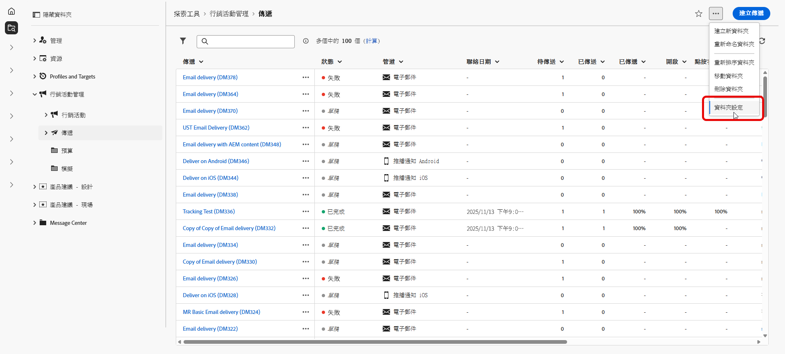
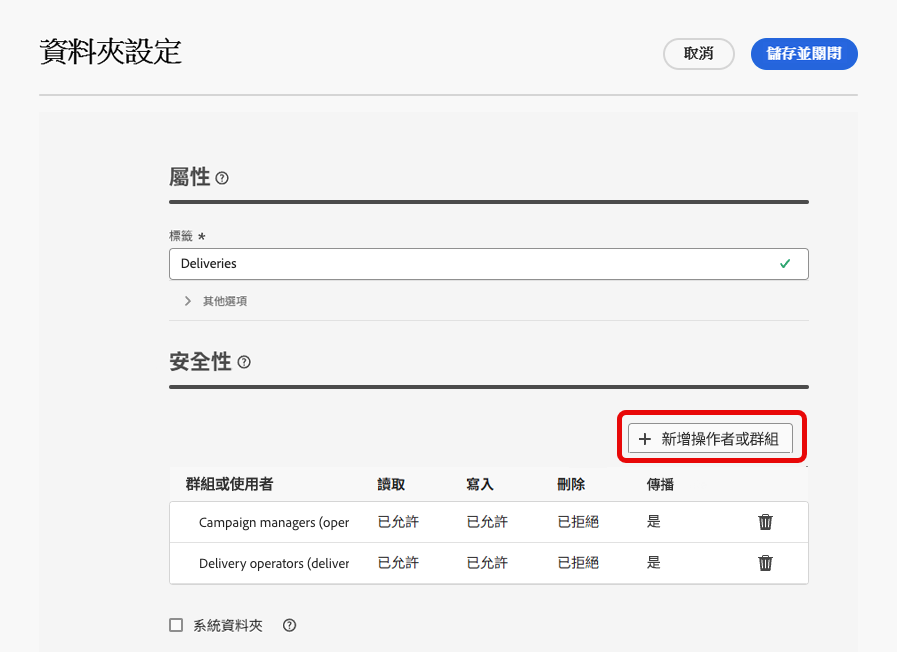
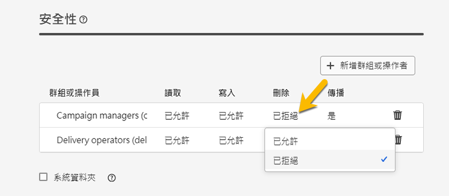

<?xml version="1.0" encoding="UTF-8"?>
<xliff xmlns="urn:oasis:names:tc:xliff:document:1.2" xmlns:okp="okapi-framework:xliff-extensions" xmlns:its="http://www.w3.org/2005/11/its" xmlns:itsxlf="http://www.w3.org/ns/its-xliff/" version="1.2" its:version="2.0">
<file original="help/v8/get-started/permissions.md.mdsc" source-language="en-US" target-language="en-XX" datatype="x-text/markdown">
<body>
<trans-unit id="tu10" xml:space="preserve">
<source xml:lang="en-US">https://experienceleague.adobe.com/en/docs/campaign/campaign-v8/admin/permissions/gs-permissions</source>
<target xml:lang="en-XX">https://experienceleague.adobe.com/zh-hant/docs/campaign/campaign-v8/admin/permissions/gs-permissions</target>
</trans-unit>
<trans-unit id="tu26" xml:space="preserve">
<source xml:lang="en-US">https://experienceleague.adobe.com/docs/campaign/campaign-v8/permissions/manage-permissions.html#use-named-rights</source>
<target xml:lang="en-XX">https://experienceleague.adobe.com/docs/campaign/campaign-v8/permissions/manage-permissions.html?lang=zh-Hant#use-named-rights</target>
</trans-unit>
<trans-unit id="tu1" restype="x-YAML_METADATA_HEADER_VALUE" xml:space="preserve">
<source xml:lang="en-US">Permission management in Campaign Web user interface</source>
<target xml:lang="en-XX">Campaign Web 使用者介面中的權限管理</target>
</trans-unit>
<trans-unit id="tu2" restype="x-YAML_METADATA_HEADER_VALUE" xml:space="preserve">
<source xml:lang="en-US">Learn more about permissions in Campaign Web user interface</source>
<target xml:lang="en-XX">深入了解 Campaign Web 使用者介面的權限</target>
</trans-unit>
<trans-unit id="tu3" xml:space="preserve">
<source xml:lang="en-US">Permissions</source>
<target xml:lang="en-XX">權限</target>
</trans-unit>
<trans-unit id="tu4" xml:space="preserve">
<source xml:lang="en-US">Each user in Adobe Campaign has specific permissions and restrictions in the application. The user can belong to an operators group and inherit the group's permissions.</source>
<target xml:lang="en-XX">Adobe Campaign 中的每位使用者在應用程式中都有特定權限和限制。 使用者可以屬於某個操作者群組並繼承該群組的權限。</target>
</trans-unit>
<trans-unit id="tu5" xml:space="preserve">
<source xml:lang="en-US">Based on their permissions, an operator can:</source>
<target xml:lang="en-XX">根據其權限，操作者可以：</target>
</trans-unit>
<trans-unit id="tu6" xml:space="preserve">
<source xml:lang="en-US">Access certain capabilities</source>
<target xml:lang="en-XX">存取特定功能</target>
</trans-unit>
<trans-unit id="tu7" xml:space="preserve">
<source xml:lang="en-US">Access certain data</source>
<target xml:lang="en-XX">存取特定資料</target>
</trans-unit>
<trans-unit id="tu8" xml:space="preserve">
<source xml:lang="en-US">Access certain actions (create, modify, delete)</source>
<target xml:lang="en-XX">存取特定動作 (建立、修改、刪除)</target>
</trans-unit>
<trans-unit id="tu9" xml:space="preserve">
<source xml:lang="en-US">A detailed procedure for setting up permissions in Adobe Campaign is available in <ph id="1" ctype="x-LINK">&lbrack;</ph>Adobe Campaign v8 (console) documentation<ph id="2" ctype="x-LINK">[#$tu10]{target="_blank"}</ph>.</source>
<target xml:lang="en-XX">若要了解在 Adobe Campaign 中設定權限的詳細程序，請參閱 <ph id="1" ctype="x-LINK">&lbrack;</ph>Adobe Campaign v8 (控制台) 文件<ph id="2" ctype="x-LINK">[#$tu10]{target="_blank"}</ph>。</target>
</trans-unit>
<trans-unit id="tu11" xml:space="preserve">
<source xml:lang="en-US">Permissions on folders</source>
<target xml:lang="en-XX">資料夾權限</target>
</trans-unit>
<trans-unit id="tu12" xml:space="preserve">
<source xml:lang="en-US">Based on your rights, you can view and manage permissions on folders in the <ph id="1" ctype="x-STRONG_EMPHASIS">**[!UICONTROL </ph>Folder settings<ph id="3" ctype="x-LINK_REF">]**</ph>.</source>
<target xml:lang="en-XX">根據您的權限，您可以檢視和管理<ph id="1" ctype="x-STRONG_EMPHASIS">**[!UICONTROL </ph>資料夾設定<ph id="3" ctype="x-LINK_REF">]**</ph>。</target>
</trans-unit>
<trans-unit id="tu13" xml:space="preserve">
<source xml:lang="en-US">Below is an example of a delivery folder:</source>
<target xml:lang="en-XX">以下是以傳遞資料夾作為範例：</target>
</trans-unit>
<trans-unit id="tu14" xml:space="preserve">
<source xml:lang="en-US"><ph id="1" ctype="x-IMAGE">{zoomable="yes"}</ph></source>
<target xml:lang="en-XX"><ph id="1" ctype="x-IMAGE">{zoomable="yes"}</ph></target>
</trans-unit>
<trans-unit id="tu15" xml:space="preserve">
<source xml:lang="en-US">In the <ph id="1" ctype="x-STRONG_EMPHASIS">**[!UICONTROL </ph>Security<ph id="3" ctype="x-LINK_REF">]**</ph> section of the <ph id="5" ctype="x-STRONG_EMPHASIS">**[!UICONTROL </ph>Folder settings<ph id="7" ctype="x-LINK_REF">]**</ph>, you can view and manage (add or delete) operators or groups who can access the folder.</source>
<target xml:lang="en-XX">在<ph id="1" ctype="x-STRONG_EMPHASIS">**[!UICONTROL </ph>資料夾設定<ph id="3" ctype="x-LINK_REF">]**</ph>的<ph id="5" ctype="x-STRONG_EMPHASIS">**[!UICONTROL </ph>安全性<ph id="7" ctype="x-LINK_REF">]**</ph>區段中，您可以檢視和管理 (新增或刪除) 可存取該資料夾的操作者或群組。</target>
</trans-unit>
<trans-unit id="tu16" xml:space="preserve">
<source xml:lang="en-US"><ph id="1" ctype="x-IMAGE">{zoomable="yes"}</ph></source>
<target xml:lang="en-XX"><ph id="1" ctype="x-IMAGE">{zoomable="yes"}</ph></target>
</trans-unit>
<trans-unit id="tu17" xml:space="preserve">
<source xml:lang="en-US">You can directly click on the permissions and change them to either <ph id="1" ctype="x-STRONG_EMPHASIS">**[!UICONTROL </ph>Allowed<ph id="3" ctype="x-LINK_REF">]**</ph> or <ph id="5" ctype="x-STRONG_EMPHASIS">**[!UICONTROL </ph>Denied<ph id="7" ctype="x-LINK_REF">]**</ph>.</source>
<target xml:lang="en-XX">您可以直接按一下該權限，並將其變更為「<ph id="1" ctype="x-STRONG_EMPHASIS">**[!UICONTROL </ph>已允許<ph id="3" ctype="x-LINK_REF">]**</ph>」或「<ph id="5" ctype="x-STRONG_EMPHASIS">**[!UICONTROL </ph>已拒絕<ph id="7" ctype="x-LINK_REF">]**</ph>」。</target>
</trans-unit>
<trans-unit id="tu18" xml:space="preserve">
<source xml:lang="en-US"><ph id="1" ctype="x-IMAGE">{zoomable="yes"}</ph></source>
<target xml:lang="en-XX"><ph id="1" ctype="x-IMAGE">{zoomable="yes"}</ph></target>
</trans-unit>
<trans-unit id="tu19" xml:space="preserve">
<source xml:lang="en-US"><ph id="1" ctype="x-regxph" equiv-text="&lbrack;!NOTE">[!NOTE]</ph></source>
<target xml:lang="en-XX"><ph id="1" ctype="x-regxph" equiv-text="&lbrack;!NOTE">[!NOTE]</ph></target>
</trans-unit>
<trans-unit id="tu20" xml:space="preserve">
<source xml:lang="en-US">You should not be able to create an object for which you do not have at least one folder with writing rights.</source>
<target xml:lang="en-XX">您必須至少擁有一個資料夾的寫入權限，才能夠建立物件。</target>
</trans-unit>
<trans-unit id="tu21" xml:space="preserve">
<source xml:lang="en-US">You do not need to be an admin to create fragments, but you must have writing rights on at least one "Content visual fragment" folder. Otherwise, you won't be able to create a visual fragment.</source>
<target xml:lang="en-XX">若要建立片段，您無需具備管理員身分，但是您必須擁有至少一個「內容視覺片段」資料夾的寫入權限。 否則，您將無法建立視覺片段。</target>
</trans-unit>
<trans-unit id="tu22" xml:space="preserve">
<source xml:lang="en-US">If the <ph id="1" ctype="x-STRONG_EMPHASIS">**[!UICONTROL </ph>Propagate<ph id="3" ctype="x-LINK_REF">]**</ph> option is enabled, all permissions defined for a folder apply to all its sub-folders. These permissions can be overridden for each sub-folder.</source>
<target xml:lang="en-XX">如果啟用<ph id="1" ctype="x-STRONG_EMPHASIS">**[!UICONTROL </ph>傳播<ph id="3" ctype="x-LINK_REF">]**</ph>選項，針對資料夾定義的所有權限都會套用至其所有的子資料夾。 每個子資料夾都可以覆寫這些權限。</target>
</trans-unit>
<trans-unit id="tu23" xml:space="preserve">
<source xml:lang="en-US">If the <ph id="1" ctype="x-STRONG_EMPHASIS">**[!UICONTROL </ph>System folder<ph id="3" ctype="x-LINK_REF">]**</ph> option is selected, access is allowed to all operators, regardless of their permissions.</source>
<target xml:lang="en-XX">如果選取<ph id="1" ctype="x-STRONG_EMPHASIS">**[!UICONTROL </ph>系統資料夾<ph id="3" ctype="x-LINK_REF">]**</ph>選項，則所有操作者無論權限為何都可以存取。</target>
</trans-unit>
<trans-unit id="tu24" xml:space="preserve">
<source xml:lang="en-US">See this <ph id="1" ctype="x-LINK">[</ph>section<ph id="2" ctype="x-LINK">](work-with-folders.md#folder-access-rights)</ph> to learn how these rights affect the actions available to you on a folder.</source>
<target xml:lang="en-XX">請參閱此<ph id="1" ctype="x-LINK">[</ph>區段<ph id="2" ctype="x-LINK">](work-with-folders.md#folder-access-rights)</ph>，了解這些權限如何影響您可對資料夾執行的動作。</target>
</trans-unit>
<trans-unit id="tu25" xml:space="preserve">
<source xml:lang="en-US">Named rights also determine which folder actions are available to an operator. Refer to the <ph id="1" ctype="x-LINK">&lbrack;</ph>Campaign v8 documentation<ph id="2" ctype="x-LINK">[#$tu26]{target="_blank"}</ph>.</source>
<target xml:lang="en-XX">已命名的權限也會決定操作員可使用哪些資料夾動作。請參閱 <ph id="1" ctype="x-LINK">&lbrack;</ph>Campaign v8 文件<ph id="2" ctype="x-LINK">[#$tu26]{target="_blank"}</ph>。</target>
</trans-unit>
<trans-unit id="tu27" xml:space="preserve">
<source xml:lang="en-US">All permissions in the Campaign Web user interface synchronize with Campaign Client Console permissions.</source>
<target xml:lang="en-XX">Campaign Web 使用者介面中的所有權限，都會與 Campaign 用戶端主控台權限進行同步。</target>
</trans-unit>
</body>
</file>
</xliff>