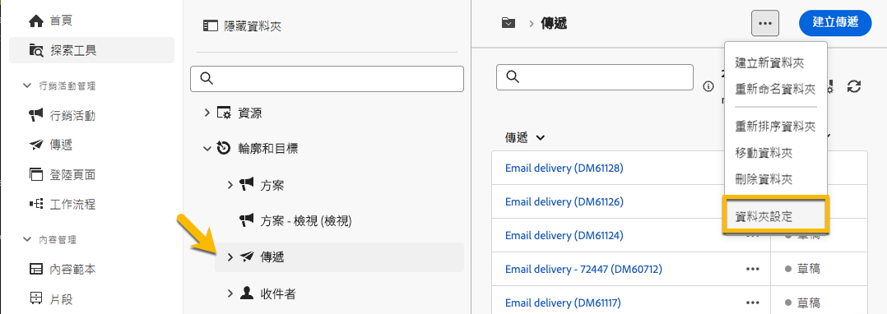

# 權限 {#permissions}

Adobe Campaign 中的每位使用者在應用程式中都有特定權限和限制。使用者可以屬於某個操作者群組並繼承該群組的權限。

根據其權限，操作者可以：

* 存取特定功能
* 存取特定資料
* 存取特定動作 (建立、修改、刪除)

若要了解在 Adobe Campaign 中設定權限的詳細程序，請參閱 [Adobe Campaign v8 (控制台) 文件](https://experienceleague.adobe.com/zh-hant/docs/campaign/campaign-v8/admin/permissions/gs-permissions){target="_blank"}。

## 資料夾權限 {#folder-permissions}

根據您的權限，您可以檢視和管理&#x200B;**[!UICONTROL 資料夾設定]**。

以下是以傳遞資料夾作為範例：

{zoomable="yes"}

在&#x200B;**[!UICONTROL 資料夾設定]**&#x200B;的&#x200B;**[!UICONTROL 安全性]**&#x200B;區段中，您可以檢視和管理 (新增或刪除) 可存取該資料夾的操作者或群組。

{zoomable="yes"}

您可以直接按一下該權限，並將其變更為「**[!UICONTROL 已允許]**」或「**[!UICONTROL 已拒絕]**」。

{zoomable="yes"}

如果啟用&#x200B;**[!UICONTROL 傳播]**&#x200B;選項，針對資料夾定義的所有權限都會套用至其所有的子資料夾。每個子資料夾都可以覆寫這些權限。

如果選取&#x200B;**[!UICONTROL 系統資料夾]**&#x200B;選項，則所有操作者無論權限為何都可以存取。

您也可以[在 Adobe Campaign 主控台中管理資料夾權限](https://experienceleague.adobe.com/zh-hant/docs/campaign/campaign-v8/admin/permissions/folder-permissions){target="_blank"}。

Campaign Web 使用者介面中的所有權限，都會與 Campaign 用戶端主控台權限進行同步。