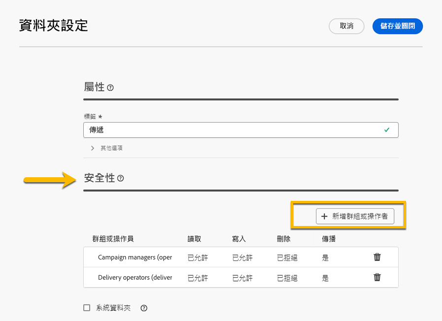

# 權限 {#permissions}

Adobe Campaign中的每個使用者在應用程式中都有自己的許可權和限制。

使用者可以屬於操作者群組，並將繼承群組的許可權。

根據其許可權，運運算元可以：

* 存取特定功能
* 存取特定資料
* 存取特定動作（建立、修改、刪除）

## 檔案夾的許可權 {#folder-permissions}

根據您的許可權，您可以在&#x200B;**[!UICONTROL 資料夾設定]**中檢視和管理資料夾的許可權。
以下是傳遞資料夾的範例。

{zoomable="yes"}

在&#x200B;**[!UICONTROL 資料夾設定]**&#x200B;的&#x200B;**[!UICONTROL 安全性]**&#x200B;區段中，您可以檢視及管理（新增或刪除）可以存取資料夾的操作者或群組。

{zoomable="yes"}

您可以直接按一下許可權，然後變更它們&#x200B;**[!UICONTROL 允許]**&#x200B;或&#x200B;**[!UICONTROL 拒絕]**。

{zoomable="yes"}

如果啟用「**[!UICONTROL 傳播]**」選項，針對資料夾定義的所有權限都會套用至其所有的子資料夾。每個子資料夾都可以過載這些權限。

如果核取&#x200B;**[!UICONTROL 系統資料夾]**&#x200B;選項，則允許所有操作員存取，無論其許可權為何。

您也可以[在Adobe Campaign主控台中管理資料夾的許可權](https://experienceleague.adobe.com/en/docs/campaign/campaign-v8/admin/permissions/folder-permissions)。
Campaign Web UI中的所有許可權都會與Campaign使用者端主控台許可權同步。
