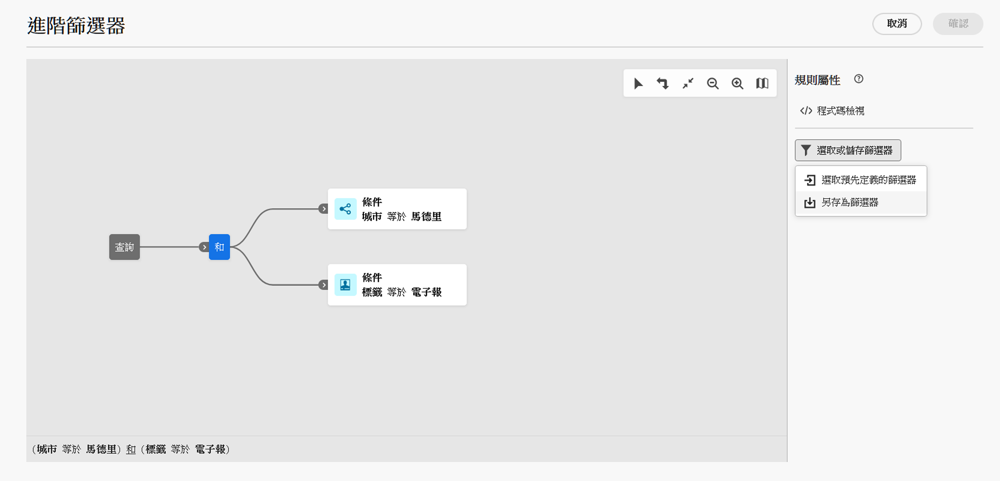

# 使用預先定義的篩選器 {#predefined-filters}

>[!CONTEXTUALHELP]
>id="acw_homepage_learning_card4"
>title="預先定義的篩選器管理"
>abstract="Campaign Web使用者介面提供使用者易記的介面，可輕鬆管理和自訂預先定義的篩選器，以滿足您的特定需求。 建立一次並儲存以供未來使用。"

>[!CONTEXTUALHELP]
>id="acw_predefined-filters-dashboard"
>title="預先定義的篩選器"
>abstract="Campaign Web使用者介面提供使用者易記的介面，可輕鬆管理和自訂預先定義的篩選器，以滿足您的特定需求。 建立一次並儲存以供未來使用。"

預先定義的篩選器是建立和儲存以供日後使用的自訂篩選器。 在使用查詢模型工具的篩選作業期間，它們可作為捷徑。 例如，在篩選資料清單或建立傳送對象時，可使用它們。

您可以使用現有的內建篩選器來存取特定資料子集，或建立您自己的預先定義篩選器並儲存。

{zoomable="yes"}

## 建立預先定義的篩選器 {#create-predefined-filter}

>[!CONTEXTUALHELP]
>id="acw_predefined-filters-creation"
>title="建立預先定義的篩選器"
>abstract="為預先定義的篩選器輸入標籤，然後選取其適用的表格。開啟其他選項以新增說明並將此篩選器設定為我的最愛。然後使用「建立規則」按鈕定義篩選條件。"

>[!CONTEXTUALHELP]
>id="acw_predefined-filters-rules"
>title="建立預先定義的篩選規則"
>abstract="要定義自訂篩選器的篩選條件，請按一下「建立規則」按鈕。"

### 從查詢建模工具建立篩選器 {#create-from-rule-builder}

儲存來自[查詢模型工具](../query/query-modeler-overview.md)的自訂篩選器，以供日後使用。 請依照下列步驟操作：

1. 開啟查詢建模工具並定義您的篩選條件。在以下範例中，居住於馬德里並訂閱電子報的收件者經過篩選。
1. 按一下「**選取或儲存篩選器**」按鈕，然後選取「**另存為篩選器**」。

   {zoomable="yes"}

1. 選取「**建立新篩選器**」，然後輸入該篩選器的名稱和說明。

   {zoomable="yes"}

   如果需要，您可以將篩選器儲存為最愛。若要了解詳細資訊，請參閱[本章節](#fav-filter)。

1. 按一下「**確認**」以儲存您的變更。

您的自訂篩選器現在可以在「**預先定義的篩選器**」清單中取得，並可供所有 Campaign 使用者存取。

### 從篩選器清單中建立篩選器 {#create-filter-from-list}

從左側功能表中的&#x200B;**預先定義的篩選器**&#x200B;專案建立篩選器。 請依照下列步驟操作：

1. 瀏覽至左側功能表中的&#x200B;**預先定義的篩選器**&#x200B;專案。
1. 按一下「**建立篩選器**」按鈕。
1. 輸入篩選器名稱，然後從「**文件類型**」欄位中選取其適用的結構描述。預設結構描述為 `Recipients(nms)`。

1. 定義篩選器的規則。例如，年齡超過 30 歲的輪廓。

   {zoomable="yes"}的設定檔篩選規則

1. 儲存您的變更。

   {zoomable="yes"}

此篩選器便會新增至預先定義的篩選器清單。如果需要，您可以將篩選器儲存為最愛。若要了解詳細資訊，請參閱[本章節](#fav-filter)。

## 將您的篩選器另存為最愛 {#fav-filter}

建立預先定義的篩選器時，請啟用&#x200B;**另存為我的最愛**&#x200B;選項，以便在我的最愛中檢視此預先定義的篩選器。

將篩選器另存為最愛後，所有使用者都可以在篩選器建立清單的「**最愛的篩選器**」區段中使用該篩選器，如下所示：

{zoomable="yes"}{width="30%" align="left"}

## 使用預先定義的篩選器 {#use-predefined-filter}

在定義規則屬性時，可以使用預先定義的篩選器。若要存取預先定義的篩選器，請在查詢模型工具的下拉式清單中選擇&#x200B;**選取自訂篩選器**&#x200B;選項。

存取目前內容可用的預先定義篩選器完整清單，並在下拉式清單的&#x200B;**我的最愛篩選器**&#x200B;區段中使用捷徑。 若要深入了解最愛項目，請參閱[本章節](#fav-filter)。

例如，若要透過預先定義的篩選建立客群，請依照下列步驟操作：

1. 瀏覽至左側選單的「**客群**」項目，然後按一下客群清單左上角的「**建立客群**」按鈕。
1. 輸入客群名稱，然後按一下「**建立客群**」按鈕。
1. 選取「**查詢**」活動，然後從右側窗格按一下「**建立客群**」按鈕。

   {zoomable="yes"}

1. 從「**選取或儲存篩選器**」按鈕中，選擇「**選取自訂篩選器**」選項。

   {zoomable="yes"}

1. 瀏覽到要用於建立客群的預先定義篩選，選取它並進行確認。

   {zoomable="yes"}

1. 檢查此篩選器的規則屬性並進行確認。

   此篩選器現在將用作「**查詢**」活動中的查詢。

   {zoomable="yes"}

1. 儲存您的變更，並按一下「**開始**」按鈕以建立客群，並使其可在客群清單中使用。

## 管理您的預先定義篩選器 {#manage-predefined-filter}

預先定義的篩選器會全部在左側導覽功能表的專用項目中分組。

{zoomable="yes"}

從此清單中，您可以建立如上所述的新篩選器，並執行下列動作：

* 編輯現有的篩選器，並變更其規則和屬性。
* 複製預先定義的篩選器。
* 刪除預先定義的篩選器。

您也可以將預先定義的篩選器新增為我的最愛，以便在建立受眾時快速存取。 若要了解詳細資訊，請參閱[本章節](#fav-filter)。

<!--
## Built-in predefined filters {#ootb-predefined-filter}

Campaign comes with a set of predefined filters, built from the client console. These filters can be used to define your audiences, and rules. They must not be modified.
-->