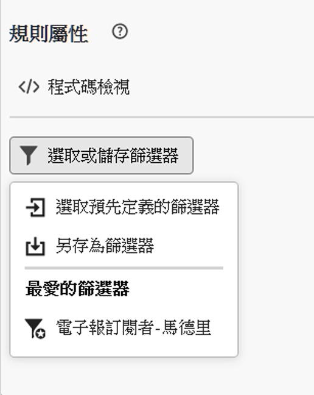

# 使用預先定義的篩選器 {#predefined-filters}

>[!CONTEXTUALHELP]
>id="acw_homepage_learning_card4"
>title="預先定義的篩選器管理"
>abstract="Campaign Web 用户界面提供了用户友好的界面，可轻松管理和自定义预定义过滤器，以满足您的特定需求。建立一次並儲存以供未來使用。"

<!--TO REMOVE BELOW-->
>[!CONTEXTUALHELP]
>id="acw_homepage_card4"
>title="預先定義的篩選器管理"
>abstract="Campaign Web 現在為您提供了人性化介面，可以輕鬆管理和自訂預先定義的篩選器，以滿足您的特定需求。建立一次並儲存以供未來使用。"

<!--TO REMOVE ABOVE-->

>[!CONTEXTUALHELP]
>id="acw_predefined-filters-dashboard"
>title="預先定義的篩選器"
>abstract="Campaign Web 使用者介面現在為您提供易於使用的介面，以便您輕鬆管理和自訂預先定義的篩選器，以滿足您的特定需求。建立一次並儲存以供未來使用。"

預先定義的篩選器就是建立並儲存以供未來使用的自訂篩選器。在使用查詢建模工具進行任何篩選作業時 (例如篩選資料清單或建立傳遞對象時)，可以將它們當作捷徑使用。

您可以使用現有的內建篩選器來存取資料的特定子集，或建立您自己的預先定義篩選器並加以儲存。

{zoomable=&quot;yes&quot;}{zoomable=&quot;yes&quot;}

## 建立預先定義的篩選器 {#create-predefined-filter}

>[!CONTEXTUALHELP]
>id="acw_predefined-filters-creation"
>title="建立預先定義的篩選器"
>abstract="為預先定義的篩選器輸入標籤，然後選取其適用的表格。開啟其他選項以新增說明並將此篩選器設定為我的最愛。然後使用「建立規則」按鈕定義篩選條件。"

>[!CONTEXTUALHELP]
>id="acw_predefined-filters-rules"
>title="建立預先定義的篩選規則"
>abstract="要定義自訂篩選器的篩選條件，請按一下「建立規則」按鈕。"

### 從查詢建模工具建立篩選器 {#create-from-rule-builder}

您可以從[查詢建模工具](../query/query-modeler-overview.md)中儲存某個自訂篩選器以供未來使用。請依照下列步驟操作：

1. 開啟查詢建模工具並定義您的篩選條件。在下方的範例中，您篩選了居住在馬德里並訂閱電子報的收件者。
1. 按一下「**選取或儲存篩選器**」按鈕，然後選取「**另存為篩選器**」。

   {zoomable=&quot;yes&quot;}

1. 選取「**建立新篩選器**」，然後輸入該篩選器的名稱和說明。

   {zoomable=&quot;yes&quot;}

   如果需要，您可以將篩選器儲存為最愛。若要了解詳細資訊，請參閱[本章節](#fav-filter)。

1. 按一下「**確認**」以儲存您的變更。

您的自訂篩選器現在可以在「**預先定義的篩選器**」清單中取得，並可供所有 Campaign 使用者存取。

### 從篩選器清單中建立篩選器 {#create-filter-from-list}

您可以從左側選單的「**預先定義的篩選器**」項目中建立篩選器。若要執行此作業，請依照下列步驟操作：

1. 瀏覽左側選單中的「**預先定義的篩選器**」項目。
1. 按一下「**建立篩選器**」按鈕。
1. 輸入篩選器名稱，然後從「**文件類型**」欄位中選取其適用的結構描述。預設結構描述為 `Recipients(nms)`。

1. 定義篩選器的規則。例如，年齡超過 30 歲的設定檔。

   {zoomable=&quot;yes&quot;}

1. 儲存您的變更。

   {zoomable=&quot;yes&quot;}

此篩選器便會新增至預先定義的篩選器清單。如果需要，您可以將篩選器儲存為最愛。若要了解詳細資訊，請參閱[本章節](#fav-filter)。

## 將您的篩選器另存為最愛 {#fav-filter}

建立預先定義的篩選器時，如果您想要在您的最愛中看到此預先定義的篩選器，您可以啟用「**另存為最愛**」選項。

將篩選器另存為最愛後，所有使用者都可以在篩選器建立清單的「**最愛的篩選器**」區段中使用該篩選器，如下所示：

{zoomable=&quot;yes&quot;}{width="30%" align="left"}

## 使用預先定義的篩選器 {#use-predefined-filter}

在定義規則屬性時，可以使用預先定義的篩選器。若要存取預先定義的篩選器，請在查詢建模工具下拉式功能表中，選擇「**選取自訂篩選器**」選項。

然後，您可以存取目前前後關聯可用的預先定義篩選器完整清單，並使用 **我的最愛篩選器** 區段。 若要深入了解最愛項目，請參閱[本章節](#fav-filter)。

例如，若要透過預先定義的篩選器建立對象，請依照下列步驟操作：

1. 瀏覽至 **受眾** 登入左側功能表，然後按一下 **建立對象** 按鈕。
1. 輸入對象名稱，然後按一下「**建立對象**」按鈕。
1. 選取 **查詢** 活動，然後從右窗格中，按一下 **建立對象** 按鈕。

   {zoomable=&quot;yes&quot;}

1. 從 **選取或儲存篩選器** 按鈕，選擇 **選取自訂篩選器** 選項。

   {zoomable=&quot;yes&quot;}

1. 瀏覽到要用於建立對象的預先定義篩選器，選取它並進行確認。

   {zoomable=&quot;yes&quot;}

1. 檢查此篩選器的規則屬性並進行確認。

   此篩選器現在將用作「**查詢**」活動中的查詢。

   {zoomable=&quot;yes&quot;}

1. 儲存您的變更，並按一下「**開始**」按鈕以建立對象，並使其可在對象清單中使用。

## 管理您的預先定義篩選器 {#manage-predefined-filter}

所有預先定義的篩選器都會分組到左側導覽功能表的專用專案中。

{zoomable=&quot;yes&quot;}

從此清單中，您可以建立如上所述的新篩選器，並執行下列動作：

* 編輯現有篩選器，變更其規則和屬性。
* 複製預先定義的篩選器。
* 刪除預先定義的篩選器。

您也可以在建立對象時，將預先定義的篩選器新增為我的最愛，以便快速存取。 若要了解詳細資訊，請參閱[本章節](#fav-filter)。

<!--
## Built-in predefined filters {#ootb-predefined-filter}

Campaign comes with a set of predefined filters, built from the client console. These filters can be used to define your audiences, and rules. They must not be modified.
-->
