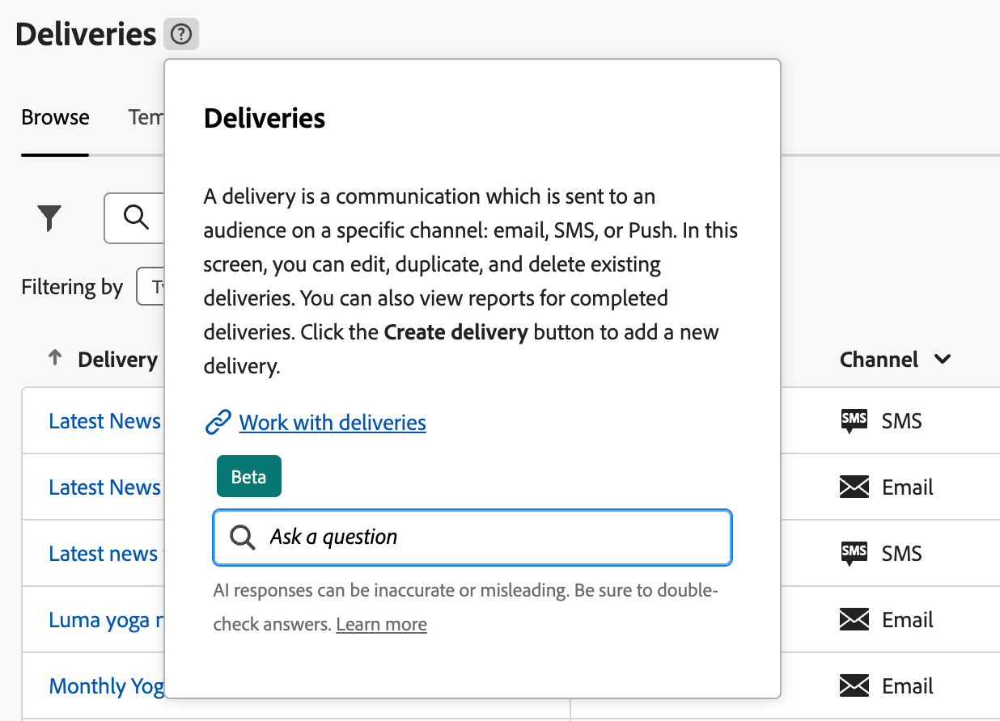

# 探索介面 {#user-interface}

新的 Adobe Campaign Web 介面提供了現代直覺的使用者體驗，可簡化行銷活動的設計和傳遞。這個新介面整合 Adobe Experience Cloud 應用程式和解決方案。

[在本文中](connect-to-campaign.md)了解如何連線至 Adobe Campaign，並探索 Experience Cloud 導覽基礎知識。

>[!NOTE]
>
>本文件會經常更新以反映產品使用者介面最近的變更。不過，有些螢幕擷取畫面可能會與您的使用者介面稍有不同。

## Campaign 首頁 {#user-interface-home}

>[!CONTEXTUALHELP]
>id="acw_homepage_recent"
>title="最近項目"
>abstract="「**最近項目**」清單為建立和修改的傳遞提供捷徑。此清單會顯示其管道、狀態、所有者、建立與修改日期。"

Campaign 首頁可讓您快速輕鬆地瀏覽關鍵資源、指標和元件。

首頁的上半區段提供有關產品中可用的最新更新和新功能的詳細資料，以及發行說明和詳細文件的連結。 使用向左箭頭捲動功能卡片。

{zoomable="yes"}

「**關鍵績效指標**」可讓您使用常見的 KPI 值來檢查平台的服務效率。在[本頁面](../reporting/kpis.md)中進一步瞭解這些 KPI。

「**最近項目**」清單為建立和修改的傳遞提供捷徑。此清單會顯示其管道、狀態、所有者、建立與修改日期。按一下「**顯示更多**」連結以載入更多傳遞。

此外，您可以從頁面的「**學習**」區段存取 Adobe Campaign Web 重要說明頁面。

### 關於連結 {#user-interface-about}

>[!CONTEXTUALHELP]
>id="acw_about"
>title="關於頁面"
>abstract="關於頁面提供關於 Adobe Campaign 執行個體的詳細資訊"

>[!CONTEXTUALHELP]
>id="acw_about_instance"
>title="關於執行個體"
>abstract="執行個體區段提供關於控制台用戶端的關鍵資訊，包括版本和相關聯的版本編號"

>[!CONTEXTUALHELP]
>id="acw_about_web"
>title="關於 Web"
>abstract="Web 區段顯示 Campaign Web 使用者介面版本及其最近更新日期 (如果有)。"

>[!CONTEXTUALHELP]
>id="acw_about_packages"
>title="關於已安裝的套件"
>abstract="已安裝的套件區段列出了執行個體上存在的所有模組、功能和整合。"

在頁面底部，「**[!UICONTROL 關於]**」連結提供關於 Adobe Campaign 執行個體的詳細資訊。這些資訊處於唯讀模式。

{zoomable="yes"}

**執行個體**&#x200B;區段提供關於控制台用戶端的關鍵資訊，包括&#x200B;**版本**&#x200B;和相關聯的&#x200B;**版本編號**。

* **版本**&#x200B;係指您正在使用的官方發行版本；
* **版本編號**&#x200B;係指該版本的特定疊代。

版本和版本編號對於疑難排解至關重要，因為它們有助於準確地確定您的環境中存在哪些功能和修正項目。

**Web** 區段顯示 Campaign Web 使用者介面版本及其最近更新日期 (如果有)。這有助於追蹤對 Campaign Web 使用者介面所做的變更或改良功能。

**已安裝的套件**&#x200B;區段列出了執行個體上存在的所有模組、功能和整合。這些套件擴充 Adobe Campaign 的功能，使其能夠執行專業任務，例如與其他 Adobe 解決方案整合或啟用特定工作流程。由於套件數量龐大，您可以在本區段中進行研究，以迅速檢查您的執行個體是否已安裝特定模組。

{zoomable="yes"}

## 左側導覽功能表 {#user-interface-left-nav}

瀏覽左側連結可存取 Adobe Campaign Web 功能。幾個連結會顯示可以排序和篩選的物件清單。您也可以設定欄以顯示所有您需要的資訊。請參閱本[章節](#list-screens)。有些清單畫面部分為唯讀。左側導覽功能表與清單中顯示的項目取決於您的使用者權限。若要了解權限的詳細資訊，請參閱[本章節](permissions.md)。

### 探索工具 {#user-interface-explorer}

>[!CONTEXTUALHELP]
>id="acw_explorer"
>title="探索工具"
>abstract="**探索工具**&#x200B;選單會顯示所有 Campaign 元件以及和用戶端控制台中的物件有相同資料夾階層的物件。瀏覽所有 Campaign v8 元件、資料夾和方案，檢查相關聯的權限，並從此選單建立資料夾和子資料夾。"

「**探索工具**」選單會顯示所有 Campaign 資源以及和用戶端控制台中的物件有相同資料夾階層的物件。瀏覽您所有的 Campaign v8 元件、資料夾和結構描述，並建立傳遞、工作流程和行銷活動。

「**探索工具**」中顯示的項目取決於您的使用者權限。如果有適當的權限，您也可以新增資料夾和子資料夾。若要了解權限的詳細資訊，請參閱[本章節](permissions.md)。

您可以設定欄來自訂顯示，以便檢視您需要的所有資訊。請參閱本[章節](#list-screens)。您也可以新增資料夾和子資料夾，請參閱[本章節](permissions.md#folders)以取得詳細資訊。

如需 Campaign 探索工具、資料夾階層和資源的詳細資訊，請參閱此 [Campaign v8 (控制台) 文件](https://experienceleague.adobe.com/docs/campaign/campaign-v8/new/campaign-ui.html?lang=zh-hant#ac-explorer-ui){target="_blank"}。

### 行銷活動管理 {#user-interface-campaign-management}

在「行銷活動管理」區段中，您可以存取行銷活動、傳遞以及工作流程。

* **行銷活動** - 這是您的行銷活動清單以及行銷活動範本。預設情況下，您可以針對每個行銷活動檢視開始/結束/建立/最後修改日期、目前狀態以及建立該活動之行銷活動操作人員的姓名。您可以依狀態、開始/結束日期、資料夾篩選清單，或建立進階篩選以定義您自己的篩選標準。若要了解行銷活動的詳細資訊，請參閱[本章節](../campaigns/gs-campaigns.md)。

* **傳遞** - 瀏覽您的傳遞清單。依預設，您可以檢視其狀態、最後修改日期，以及 KPI。您可以依狀態、聯絡日期或管道篩選清單。按一下電子郵件傳遞來開啟其儀表板以取得傳遞詳細資料概觀。其他管道上的傳遞是唯讀的。若要了解傳遞的詳細資訊，請參閱[本章節](../msg/gs-messages.md)。

  使用「**更多動作**」按鈕來刪除或複製傳遞。

  {zoomable="yes"}{width="70%" align="left"}

* **工作流程** - 在此畫面中，您可以存取工作流程和工作流程範本的完整清單。您可以檢查其狀態、上次/下次執行日期，並建立新的工作流程或新的工作流程範本。您可以使用和其他物件相同的標準篩選清單。此外，您可以篩選工作流程，無論其是否屬於行銷活動。若要了解工作流程的詳細資訊，請參閱[本章節](../workflows/gs-workflows.md)。

### 內容管理 {#user-interface-content-management}

在「內容管理」區段中，您可以檢視內容範本和片段。

* **內容範本** - 為了加快和改進設計流程，您可以建立獨立範本，以輕鬆地在 [!DNL Adobe Campaign] 重複使用自訂內容。此功能僅適用於電子郵件，讓內容導向的使用者能夠使用獨立範本，以便行銷使用者在自己的電子郵件行銷活動中重複使用和予以調整。 若要了解詳細資訊，請參閱[本章節](../email/create-email-templates.md)。

* **片段** - 片段是可重複使用的元件，可跨行銷活動在一個或多個傳遞中進行參考。修改片段時，使用該片段的所有內容都會隨之更新。[了解如何使用片段](../content/fragments.md)

此功能可讓您預先建立多個自訂內容區塊，以便行銷使用者在改進的設計流程中使用這些內容區塊來快速組裝電子郵件內容。

### 客戶管理 {#user-interface-customer-management}

在「客戶管理」區段中，您可以檢視輪廓、客群和訂閱。這些是唯讀清單。

* **輪廓** - 建立和管理輪廓，以及存取收件者資料庫。依預設，您可以檢視其電子郵件地址、名字和姓氏。若要深入了解輪廓的詳細資訊，請參閱[本章節](../audience/about-recipients.md)。
* **客群** - 這是您的客群清單。依預設，您可以檢視其類型、來源、建立/最後修改日期和標籤。您可以依據來源篩選清單。若要了解客群與清單的詳細資訊，請參閱[本章節](../audience/about-recipients.md)。
* **訂閱服務** - 瀏覽訂閱清單。預設情況下，您可以檢視其類型、模式和標籤。若要了解如何管理訂閱和取消訂閱，請參閱 [Adobe Campaign v8 (控制台) 文件](https://experienceleague.adobe.com/docs/campaign/campaign-v8/campaigns/send/subscriptions.html?lang=zh-hant){target="_blank"}。
* **預先定義的篩選器** - 預先定義的篩選器是已建立並儲存以供未來使用的自訂篩選器。在使用查詢建模工具進行任何篩選作業時 (例如篩選資料清單或建立傳遞客群時)，可以將它們當作捷徑使用。若要了解詳細資訊，請參閱[本章節](predefined-filters.md)。

### 決策管理 {#decision-management}

>[!CONTEXTUALHELP]
>id="acw_offers_list"
>title="優惠"
>abstract="瀏覽已使用「**互動**」模組在控制台中建立的優惠清單和優惠範本。這些是唯讀清單。"
>additional-url="https://experienceleague.adobe.com/docs/campaign-web/v8/msg/offers.html?lang=zh-hant" text="將優惠新增到傳遞"

在「決策管理」部分，您可以檢視優惠和優惠範本。這些是唯讀清單。

* **優惠** - 瀏覽透過使用「**互動**」模組在控制台建立的優惠清單和優惠範本。依預設，您可以檢視其狀態、開始/結束日期和環境。您可以依狀態和開始/結束日期來篩選清單。也提供優惠範本。

若要了解如何在電子郵件和簡訊中建立和傳送優惠，請參閱[本章節](../msg/offers.md)。

### 報告 {#left-nav-reporting}

* **報告** - 此&#x200B;**報告**&#x200B;項目提供 Campaign 環境中每個管道的流量和參與量度的綜合整體摘要。這些報告是由各種小工具所組成，每個小工具都提供有關您的行銷活動或傳遞績效的獨特觀點。若要了解詳細資訊，請參閱[本章節](../reporting/global-reports.md)。

### 管理 {#left-nav-admin}

* **稽核軌跡** - **稽核軌跡**&#x200B;項目提供使用者在執行個體中對重要實體所進行的所有修改之完整可見性，通常是對執行個體運作順暢產生顯著影響的修改。[了解更多](../reporting/audit-trail.md)

* **外部帳戶** - 使用 Web 使用者介面建立新的外部帳戶，以符合您的特定需求並確保順暢的資料傳輸。[了解更多](../administration/external-account.md)

* **結構描述** - 自訂欄位是透過 Adobe Campaign 控制台新增至現成可用之結構描述的附加屬性。[了解更多](../administration/custom-fields.md)

* **傳遞提醒** -「傳遞提醒」是一種警報管理系統，可讓使用者群組自動接收包含其傳送執行資訊的電子郵件通知。[了解更多](../msg/delivery-alerting.md)

<!--
## Contextual Help {#user-interface-help} 

A contextual help is available in the interface. When available, click on the `?` icon to display help information and related documentation links. 

{zoomable="yes"}{width="40%" align="left"}

Currently released as a Beta version within the new Campaign Web user interface, the **AI-powered Knowledge Assistant** embedded within contextual help revolutionizes documentation searching and answering how-to questions with effortlessly sifting through vast documentation repositories, instantly pinpointing the precise information you need.

Thanks to Campaign Gen AI's capabilities, this assistant transforms your experience, making information retrieval and problem-solving a breeze. Whether you're seeking guidance in a complex task or navigating extensive documents, our AI-powered Knowledge Assistant is your ultimate companion, providing unmatched efficiency and accuracy in every interaction.

Learn more in [this section](using-ai.md).

-->

## 了解更多 {#learn-more}

了解如何瀏覽、搜尋和篩選 Campaign 環境中的可用清單 ([在此頁面](list-filters.md))。

<!--
######## This part stores the contextualHelp definition for WebUI BETA ###########
######## These blocks should be dispatched in the appropriate pages when available ###########
######## PLEASE DO NOT DELETE ###########
REFER TO 
https://wiki.corp.adobe.com/pages/viewpage.action?spaceKey=neolane&title=v8+WebUI+Contextual+Help+%3CALPHA%3E-+Official+list
-->

>[!CONTEXTUALHELP]
>id="acw_push_permission_for_segment"
>title="需要權限"
>abstract="您的管理員必須先授予您權限，然後您才能建立區段。"

>[!CONTEXTUALHELP]
>id="acw_push_overview_edit"
>title="需要權限"
>abstract="您的管理員必須先授予您權限，然後您才能建立區段。"

<!-- delivery template settings-->

>[!CONTEXTUALHELP]
>id="acw_global_reporting_sending"
>title="全球報告傳送"
>abstract="此畫面中會顯示追蹤報告指標"

>[!CONTEXTUALHELP]
>id="acw_global_reporting_tracking"
>title="全球報告追蹤"
>abstract="此畫面中會顯示追蹤報告指標"

<!-- FOR BETA (alignment) -->
<!--https://wiki.corp.adobe.com/display/neolane/v8+WebUI+Contextual+Help+%3CBETA%3E-+Official+list-->

<!-- FOR GA -->
<!-- Aligned with https://wiki.corp.adobe.com/display/neolane/v8+WebUI+Contextual+Help+%3CGA%3E-+Official+list -->

>[!CONTEXTUALHELP]
>id="acw_recipients_creation_cardoverview"
>title="收件者卡片概觀"
>abstract="收件者卡片概觀"

>[!CONTEXTUALHELP]
>id="acw_recipients_creation_touchpoints"
>title="收件者接觸點"
>abstract="收件者接觸點"

>[!CONTEXTUALHELP]
>id="acw_recipients_subscription_selection"
>title="收件者訂閱選擇"
>abstract="收件者訂閱選擇"

>[!CONTEXTUALHELP]
>id="acw_recipients_offers_eligible_list"
>title="收件者優惠資格符合清單"
>abstract="收件者優惠資格符合清單"

>[!CONTEXTUALHELP]
>id="acw_recipients_offers_preview_proposition"
>title="收件者優惠預覽"
>abstract="收件者優惠預覽"

>[!CONTEXTUALHELP]
>id="acw_conditionalcontent_savefilter"
>title="條件式內容儲存篩選器"
>abstract="條件式內容儲存篩選器"

>[!CONTEXTUALHELP]
>id="acw_conditionalcontent_selectfilter"
>title="條件式內容選取篩選器"
>abstract="條件式內容選取篩選器"

>[!CONTEXTUALHELP]
>id="acw_conditionalcontent_subjectline"
>title="主旨行上的條件式內容"
>abstract="主旨行上的條件式內容"

>[!CONTEXTUALHELP]
>id="acw_conditionalcontent_subjectlinecondition"
>title="條件式內容主旨行條件"
>abstract="條件式內容主旨行條件"

>[!CONTEXTUALHELP]
>id="acw_deliveries_simulate_testprofiles"
>title="模擬測試輪廓"
>abstract="模擬測試輪廓"

<!--ML: not visible in UI-->

>[!CONTEXTUALHELP]
>id="acw_deliveries_simulate_profiles_selection"
>title="模擬測試輪廓選擇"
>abstract="模擬測試輪廓選擇"

<!-- ML: beta wiki page - not visible in UI-->

>[!CONTEXTUALHELP]
>id="acw_deliveries_simulate_send_testprofiles"
>title="模擬測試輪廓傳送"
>abstract="模擬測試輪廓傳送"

<!-- ML: beta wiki page - not visible in UI-->

>[!CONTEXTUALHELP]
>id="acw_deliveries_simulate_email_log"
>title="模擬電子郵件記錄"
>abstract="模擬電子郵件記錄"

<!-- ML: beta wiki page - not visible in UI-->

<!-- FOR POST-GA -->

<!--Update file-->

>[!CONTEXTUALHELP]
>id="acw_orchestration_updatedata"
>title="更新資料"
>abstract=" **更新資料**&#x200B;活動可執行資料庫欄位的大量更新。"

>[!CONTEXTUALHELP]
>id="acw_orchestration_updatedata_operationtype"
>title="選取如何更新資料"
>abstract="「**操作類型**」欄位可讓您選擇資料庫資料所要執行的程序。選取第一個選項來新增資料或更新 (如果已新增)。您也可以只新增資料、只更新資料或刪除資料。選取「**更新與合併集合**」，可選取要連結重複項目的主要記錄，並可安全刪除這些重複項目。"

>[!CONTEXTUALHELP]
>id="acw_orchestration_updatedata_recordid"
>title="記錄識別"
>abstract="指定如何識別資料庫中的記錄：如果資料與現有的目標定位維度相關，請選取「**使用目標定位維度**」選項，然後選取要更新的目標定位維度和欄位。否則，指定一或多個自訂連結來識別資料庫中的資料，或直接使用調和索引鍵。"

>[!CONTEXTUALHELP]
>id="acw_orchestration_updatedata_fieldsupdate"
>title="選取要更新的欄位"
>abstract="選取要更新的欄位以及調和設定。您可以使用「**自動對應**」選項，以自動識別要更新的欄位。"

>[!CONTEXTUALHELP]
>id="acw_orchestration_updatedata_advancedoptions"
>title="更新資料的進階選項"
>abstract="**進階選項**&#x200B;區段可讓您指定其他設定來管理資料和重複項目。"

>[!CONTEXTUALHELP]
>id="acw_orchestration_updatedata_outboundtransition"
>title="產生傳出轉變"
>abstract="切換「**產生傳出轉變**」選項，可新增在執行&#x200B;**更新資料**&#x200B;活動結束時將啟動的傳出轉變。更新通常是標示目標定位工作流程的結束，因此預設不會啟動該選項。"

>[!CONTEXTUALHELP]
>id="acw_orchestration_updatedata_outboundtransition_rejects"
>title="產生拒絕的傳出轉變。"
>abstract="切換「**產生拒絕的傳出轉變**」選項，可新增包含更新後未正確處理的記錄傳出轉變 (例如，如果有重複資料)。更新通常是標示在目標定位工作流程的結束，因此預設不會啟動該選項。"

<!-- Workflow settings -->

>[!CONTEXTUALHELP]
>id="acw_workflow_settings_initscript"
>title="初始化指令碼"
>abstract="初始化指令碼"

>[!CONTEXTUALHELP]
>id="acw_workflow_settings_execution_properties"
>title="執行屬性"
>abstract="執行屬性"

>[!CONTEXTUALHELP]
>id="acw_workflow_settings_execution_error"
>title="執行錯誤"
>abstract="執行錯誤"

>[!CONTEXTUALHELP]
>id="acw_workflow_settings_execution_initscript"
>title="執行初始化指令碼"
>abstract="執行初始化指令碼"

<!-- Schema edit custom fields -->

>[!CONTEXTUALHELP]
>id="acw_schema_editcustomfields"
>title="編輯自訂詳細資料"
>abstract="編輯自訂詳細資料"

>[!CONTEXTUALHELP]
>id="acw_schema_editcustomfields_separatorproperties"
>title="分隔符號屬性"
>abstract="分隔符號屬性"

>[!CONTEXTUALHELP]
>id="acw_schema_editcustomfields_settings"
>title="屬性設定"
>abstract="屬性設定"

>[!CONTEXTUALHELP]
>id="acw_schema_editcustomfields_settings_general"
>title="一般"
>abstract="一般"

>[!CONTEXTUALHELP]
>id="acw_schema_editcustomfields_settings_link"
>title="連結屬性"
>abstract="LaLink propertiesyout"

>[!CONTEXTUALHELP]
>id="acw_schema_editcustomfields_settings_layout"
>title="版面配置"
>abstract="版面配置"

<!--Schema-->

>[!CONTEXTUALHELP]
>id="acw_schema"
>title="結構描述"
>abstract="結構描述"

>[!CONTEXTUALHELP]
>id="acw_schema_type"
>title="結構描述類型"
>abstract="結構描述類型"

>[!CONTEXTUALHELP]
>id="acw_schema_properties"
>title="結構描述屬性"
>abstract="結構描述"

>[!CONTEXTUALHELP]
>id="acw_schema_existing"
>title="選取現有結構描述"
>abstract="結構描述"

>[!CONTEXTUALHELP]
>id="acw_schema_external"
>title="選取外部資料庫"
>abstract="結構描述"

>[!CONTEXTUALHELP]
>id="acw_schema_add_tables"
>title="新增表格"
>abstract="結構描述"

>[!CONTEXTUALHELP]
>id="acw_schema_logs_tasks"
>title="工作流程記錄和任務"
>abstract="結構描述"

>[!CONTEXTUALHELP]
>id="acw_schema_update"
>title="更新資料庫"
>abstract="結構描述"

>[!CONTEXTUALHELP]
>id="acw_schema_update_script"
>title="更新指令碼"
>abstract="結構描述"

>[!CONTEXTUALHELP]
>id="acw_schema_start_update"
>title="開始資料庫更新"
>abstract="結構描述"
