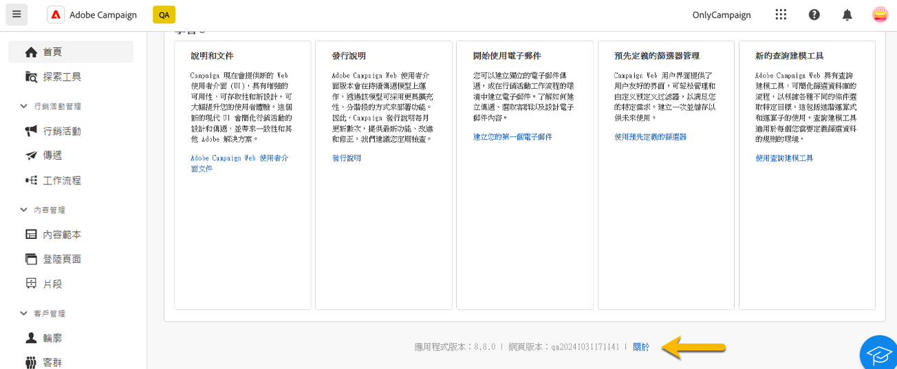
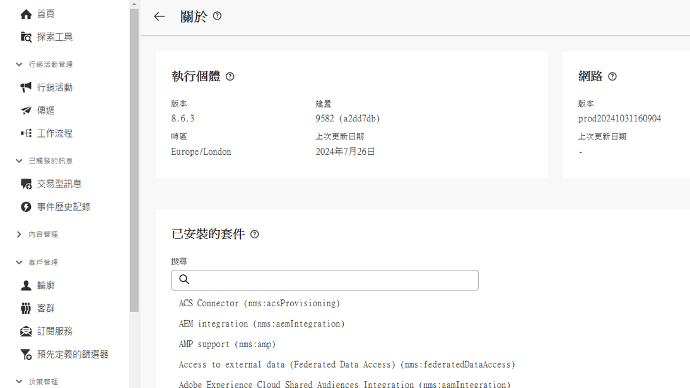

# 探索介面 {#user-interface}

新的 Adobe Campaign Web 介面提供直覺易用的現代使用者體驗，可簡化行銷活動的設計和傳遞。此介面整合 Adobe Experience Cloud 應用程式和解決方案。

[閱讀此文章](connect-to-campaign.md)了解如何連線至 Adobe Campaign，並探索 Experience Cloud 導覽基礎知識。

>[!NOTE]
>
>此文件會經常更新以反映產品使用者介面最新的變更。不過，有些螢幕擷取畫面可能會與您的使用者介面稍有不同。

## Campaign 首頁 {#user-interface-home}

>[!CONTEXTUALHELP]
>id="acw_homepage_recent"
>title="最近項目"
>abstract="「**最近項目**」清單為建立和修改的傳遞提供捷徑。此清單會顯示其管道、狀態、所有者、建立與修改日期。"

Campaign 首頁讓您能夠快速輕鬆地瀏覽關鍵資源、指標和元件。

首頁的上半區段顯示產品提供的最新更新和新功能的詳細資料，以及發行說明和詳細文件的連結。使用向左箭頭在功能卡片間捲動。

{zoomable="yes"}

**關鍵效能指標**&#x200B;區段讓您能夠使用常見的 KPI 值來確認平台的服務效率。在[此頁面](../reporting/kpis.md)中了解更多關於這些 KPI 的資訊。

**最近項目**&#x200B;清單是前往最近建立和修改的傳遞之捷徑。此清單會顯示其管道、狀態、所有者、建立與修改日期。按一下「**顯示更多**」連結，載入其他傳遞。

此外，您可以從頁面的&#x200B;**學習**&#x200B;區段存取 Adobe Campaign Web 的重要說明頁面。

### 關於連結 {#user-interface-about}

>[!CONTEXTUALHELP]
>id="acw_about"
>title="關於頁面"
>abstract="「關於」頁面提供關於您 Adobe Campaign 執行個體的詳細資訊。"

>[!CONTEXTUALHELP]
>id="acw_about_instance"
>title="關於執行個體"
>abstract="「執行個體」區段提供關於主控台用戶端的重要資訊，包括版本和相關聯的版本編號。"

>[!CONTEXTUALHELP]
>id="acw_about_web"
>title="關於 Web"
>abstract="Web 區段顯示 Campaign Web 使用者介面版本及其最近更新日期 (如果有)。"

>[!CONTEXTUALHELP]
>id="acw_about_packages"
>title="關於已安裝的套件"
>abstract="「已安裝的套件」區段會列出執行個體上存在的所有模組、功能和整合。"

在頁面底部，**[!UICONTROL 關於]**&#x200B;連結會提供關於 Adobe Campaign 執行個體的詳細資訊。這些詳細資訊為唯讀模式。

{zoomable="yes"}

**執行個體**&#x200B;區段提供關於主控台用戶端的重要資訊，包括&#x200B;**版本**&#x200B;和相關聯的&#x200B;**版本編號**。

* **版本**&#x200B;是指您正在使用的官方發行版本。
* **版本編號**&#x200B;是指該版本的特定疊代。

版本和版本編號兩者對於疑難排解皆相當重要，因為其有助於確認您的環境中存在哪些功能和修正項目。

**Web** 區段會顯示 Campaign Web 使用者介面版本及其最近更新日期 (若有)。這有助於追蹤對 Campaign Web 使用者介面所做的變更或改良功能。

**已安裝的套件**&#x200B;區段會列出執行個體上存在的所有模組、功能和整合。這些套件擴充 Adobe Campaign 的功能，讓其能夠執行專業任務，例如與其他 Adobe 解決方案整合或支援特定工作流程。由於套件數量龐大，您可以在此區段中進行搜尋，以迅速確認您的執行個體是否已安裝特定模組。

{zoomable="yes"}

## 左側導覽功能表 {#user-interface-left-nav}

瀏覽左側連結可存取 Adobe Campaign Web 功能。幾個連結會顯示可以排序和篩選的物件清單。您也可以設定欄以顯示所有您需要的資訊。請參閱本[章節](#list-screens)。有些清單畫面部分為唯讀。左側導覽功能表與清單中顯示的項目取決於您的使用者權限。若要了解權限的詳細資訊，請參閱[本章節](permissions.md)。

### 探索工具 {#user-interface-explorer}

>[!CONTEXTUALHELP]
>id="acw_explorer"
>title="探索工具"
>abstract="**探索工具**&#x200B;選單會顯示所有 Campaign 元件以及和用戶端控制台中的物件有相同資料夾階層的物件。瀏覽所有 Campaign v8 元件、資料夾和結構描述，檢查相關聯的權限，並從這個選單建立資料夾和子資料夾。"

**探索工具**&#x200B;選單會顯示所有 Campaign 資源，以及和用戶端主控台中的物件有相同資料夾階層的物件。瀏覽您所有的 Campaign v8 元件、資料夾和結構描述，並建立傳遞、工作流程和行銷活動。

**探索工具**&#x200B;中顯示的項目取決於您的使用者權限。如果有適當的權限，您也可以新增資料夾和子資料夾。若要了解更多關於權限的資訊，請參閱[此區段](permissions.md)。

您可以設定欄來自訂顯示，以便檢視您需要的所有資訊。請參閱本[章節](#list-screens)。您也可以新增資料夾和子資料夾，請參閱[本章節](permissions.md#folders)以取得詳細資訊。

如需 Campaign 探索工具、資料夾階層和資源的詳細資訊，請參閱此 [Campaign v8 (主控台) 文件](https://experienceleague.adobe.com/docs/campaign/campaign-v8/new/campaign-ui.html?lang=zh-hant#ac-explorer-ui){target="_blank"}。

### 行銷活動管理 {#user-interface-campaign-management}

在&#x200B;**行銷活動管理**&#x200B;區段中，您可以存取行銷活動、傳遞以及工作流程。

* **行銷活動**：這是您行銷活動以及行銷活動範本的清單。預設情況下，您可以針對每個行銷活動檢視開始、結束、建立以及最後修改的日期、目前狀態，以及建立該活動之行銷活動操作者的姓名。您可以依狀態、開始/結束日期、資料夾篩選清單，或建立進階篩選以定義您自己的篩選標準。若要了解行銷活動的詳細資訊，請參閱[本章節](../campaigns/gs-campaigns.md)。

* **傳遞**：瀏覽您的傳遞清單。預設情況下，您可以檢視其狀態、最後修改日期，以及主要的 KPI。您可以依狀態、聯絡日期或管道篩選清單。按一下電子郵件傳遞來開啟其儀表板以取得傳遞詳細資料概觀。其他管道上的傳遞是唯讀的。若要了解傳遞的詳細資訊，請參閱[本章節](../msg/gs-messages.md)。

  使用「**更多動作**」按鈕來刪除或複製傳遞。

  {zoomable="yes"}{width="70%" align="left"} [顯示「更多動作」按鈕，其中包含刪除或複製傳遞選項的螢幕擷圖。]

* **工作流程** - 在此畫面中，您可以存取工作流程和工作流程範本的完整清單。您可以檢查其狀態、上次/下次執行日期，並建立新的工作流程或新的工作流程範本。您可以使用和其他物件相同的標準篩選清單。此外，您可以篩選屬於或是不屬於某個行銷活動的工作流程。若要了解更多關於工作流程的資訊，請參閱[此區段](../workflows/gs-workflows.md)。

### 內容管理 {#user-interface-content-management}

在&#x200B;**內容管理**&#x200B;區段中，您可以檢視內容範本和片段。

* **內容範本** - 為了加快和改進設計流程，您可以建立獨立範本，以輕鬆地在 [!DNL Adobe Campaign] 重複使用自訂內容。此功能僅適用於電子郵件，讓內容導向的使用者能夠使用獨立範本，以便行銷使用者在自己的電子郵件行銷活動中重複使用和予以調整。 若要了解更多資訊，請參閱[此區段](../content/create-email-templates.md)。

* **片段** - 片段是可重複使用的元件，可跨行銷活動在一個或多個傳遞中進行參考。修改片段時，使用該片段的所有內容都會隨之更新。[了解如何使用片段](../content/fragments.md)。

透過改進過的設計流程，行銷使用者可以利用這項功能預先建置多個自訂的內容區塊，以便快速組裝電子郵件內容。

### 客戶管理 {#user-interface-customer-management}

在&#x200B;**客戶管理**&#x200B;區段中，您可以檢視輪廓、客群和訂閱。這些是唯讀清單。

* **輪廓** - 建立和管理輪廓，以及存取收件者資料庫。預設情況下，您可以檢視其電子郵件、名字和姓氏。若要深入了解輪廓的詳細資訊，請參閱[本章節](../audience/about-recipients.md)。
* **客群**：這是您的客群清單。預設情況下，您可以檢視其類型、來源、建立和最後修改日期以及標籤。您可以依據來源篩選清單。若要了解客群與清單的詳細資訊，請參閱[本章節](../audience/about-recipients.md)。
* **訂閱服務**：瀏覽訂閱清單。預設情況下，您可以檢視其類型、模式和標籤。若要了解如何管理訂閱和取消訂閱，請參閱 [Adobe Campaign v8 (主控台) 文件](https://experienceleague.adobe.com/docs/campaign/campaign-v8/campaigns/send/subscriptions.html?lang=zh-hant){target="_blank"}。
* **預先定義的篩選器**：預先定義的篩選器是建立並儲存以供未來使用的自訂篩選器。在使用查詢建模工具進行任何篩選作業時 (例如篩選資料清單或建立傳遞客群時)，可以將這些篩選器用作捷徑。若要了解更多資訊，請參閱[此區段](predefined-filters.md)。

### 決策管理 {#decision-management}

>[!CONTEXTUALHELP]
>id="acw_offers_list"
>title="產品建議"
>abstract="瀏覽已使用「**互動**」模組在控制台中建立的產品建議清單和產品建議範本。這些是唯讀清單。"
>additional-url="https://experienceleague.adobe.com/docs/campaign-web/v8/msg/offers.html?lang=zh-hant" text="將產品建議新增到傳遞"

在&#x200B;**決策管理**&#x200B;區段，您可以檢視產品建議和產品建議範本。這些是唯讀清單。

* **產品建議**：瀏覽在主控台使用&#x200B;**互動**&#x200B;模組建立的產品建議和產品建議範本清單。預設情況下，您可以檢視其狀態、開始/結束日期和環境。您可以依狀態和開始/結束日期來篩選清單。也提供產品建議範本。

若要了解如何在電子郵件和簡訊中建立和傳送產品建議，請參閱[本章節](../msg/offers.md)。

### 報告 {#left-nav-reporting}

* **報告** - 此&#x200B;**報告**&#x200B;項目提供 Campaign 環境中每個管道的流量和參與量度的綜合整體摘要。這些報告是由各種小工具所組成，每個小工具都提供有關您的行銷活動或傳遞效能的獨特觀點。若要了解更多資訊，請參閱[此區段](../reporting/global-reports.md)。

### 管理 {#left-nav-admin}

* **稽核軌跡**：**稽核軌跡**&#x200B;項目讓使用者可以完全掌握您對執行個體中重要實體所做之所有修改，而且通常是會對執行個體的順暢運作產生顯著影響的修改。[了解更多資訊](../reporting/audit-trail.md)。

* **外部帳戶**：透過 Web 使用者介面建立新的外部帳戶，以符合您的特定需求並確保順暢的資料傳輸。[了解更多資訊](../administration/external-account.md)。

* **結構描述**：自訂欄位是透過 Adobe Campaign 主控台新增至現成可用之結構描述的附加屬性。[了解更多資訊](../administration/custom-fields.md)。

<!--* **Delivery Alerting** - Delivery Alerting is an alert management system that enables groups of users to automatically receive email notifications with information on their delivery executions. [Learn more](../msg/delivery-alerting.md).-->

## 了解更多 {#learn-more}

了解如何瀏覽、搜尋和篩選 Campaign 環境中的可用清單 ([在此頁面](list-filters.md))。

<!--CONTEXTUAL HELP TO DISPATCH IN DOCS ONCE FEATURE LIVE-->

>[!CONTEXTUALHELP]
>id="acw_orchestration_notification"
>title="持續傳遞"
>abstract="持續傳遞"
