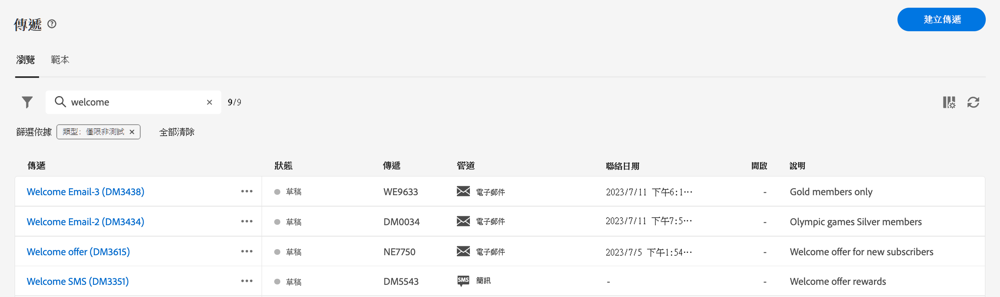

# 探索介面 {#user-interface}

>[!CONTEXTUALHELP]
>id="acw_homepage_learnmore"
>title="探索介面"
>abstract="全新的Campaign v8網頁介面提供整合、直覺式且一致的使用者體驗。"

新的 Campaign v8 Web 介面提供了現代直覺的使用者體驗，可簡化行銷活動的設計和傳遞。這個新介面與 Adobe Experience Platform 整合在一起。

>[!NOTE]
>
>本文件會經常更新以反映產品使用者介面最近的變更。不過，有些螢幕擷取畫面可能會與您的使用者介面稍有不同。

## 左側導覽選單 {#user-interface-left-nav}

瀏覽左側連結可存取 Campaign v8 Web 功能。幾個連結會顯示可以排序和篩選的物件清單。您也可以設定欄以顯示所有您需要的資訊。請參閱本[章節](#list-screens)。所有清單畫面都是唯讀的，電子郵件傳遞清單除外。按一下清單項目以編輯/檢視的這個功能在 Alpha 版本未提供。在未來的版本，所有清單將可編輯。左側導覽選單顯示的項目取決於您的使用者權限。

### 首頁 {#user-interface-home}

此畫面包含快速存取主要 Campaign v8 Web 功能的重要連結和資源。

「**最近項目**」清單提供最近建立和修改之傳遞的快速鍵。此清單顯示其頻道、狀態、擁有者、建立和修改日期。

從存取Campaign v8網頁金鑰說明頁面 **學習** 首頁的區段。

### 總管 {#user-interface-explorer}

>[!CONTEXTUALHELP]
>id="acw_explorer"
>title="總管"
>abstract="此 **總管** 功能表會顯示所有Campaign元件和物件，其資料夾階層與使用者端主控台中的元件和物件相同。 瀏覽您的所有Campaign v8元件、資料夾和結構描述，並建立傳送、工作流程和行銷活動。 所有其他清單都是唯讀的。"

此 **總管** 功能表會顯示所有Campaign資源和物件，其資料夾階層與客戶端主控台中的資料夾階層相同。 瀏覽您的所有Campaign v8元件、資料夾和結構描述，並建立傳送、工作流程和行銷活動。 所有其他清單都是唯讀的。

總管中顯示的項目取決於您的使用者權限。

如同任何清單畫面，您可以設定欄來個人化顯示以檢視所有您需要的資訊。請參閱本[章節](#list-screens)。

如需Campaign檔案總管、資料夾階層和資源的詳細資訊，請參閱此 [Campaign v8 （主控台）檔案](https://experienceleague.adobe.com/docs/campaign/campaign-v8/new/campaign-ui.html#ac-explorer-ui){target="_blank"}.

### 行銷活動管理 {#user-interface-campaign-management}

>[!CONTEXTUALHELP]
>id="acw_campaigns_list"
>title="行銷活動"
>abstract="這是您的行銷活動清單。您可以檢視有用的資訊，例如其開始/結束/最後修改日期，以及其狀態。您可以依狀態或開始/結束日期篩選清單。按一下「建立行銷活動」按鈕，即可新增行銷活動。選取行銷活動，檢視其內容、傳遞和詳細資料。瀏覽到「範本」索引標籤，檢視和建立範本。"

>[!CONTEXTUALHELP]
>id="acw_deliveries_list"
>title="傳遞"
>abstract="瀏覽您的傳遞清單。您可以檢視其狀態、聯絡和修改日期、關鍵 KPI。您可以依狀態、聯絡日期或管道篩選清單。按一下「建立傳遞」按鈕，即可新增傳遞。選取傳遞，檢視其內容、對象和詳細資料。"

在CAMPAIGN MANAGEMENT區段中，您可以存取行銷活動、傳遞和工作流程。

* **行銷活動** - 這是您的行銷活動清單以及行銷活動範本。預設情況下，您可以針對每個行銷活動檢視開始/結束/建立/最後修改日期、目前狀態以及建立該活動之行銷活動操作人員的姓名。您可以依狀態、開始/結束日期、資料夾篩選清單，或建立進階篩選以定義您自己的篩選標準。若要了解行銷活動的詳細資訊，請參閱[本章節](../campaigns/gs-campaigns.md)。

* **傳遞** - 瀏覽您的傳遞清單。依預設，您可以檢視其狀態、最後修改日期，以及 KPI。您可以依狀態、聯絡日期或管道篩選清單。按一下電子郵件傳遞來開啟其儀表板以取得傳遞詳細資料概觀。其他管道上的傳遞是唯讀的。若要了解傳遞的詳細資訊，請參閱[本章節](../msg/gs-messages.md)。

  使用「**更多動作**」按鈕來刪除或複製傳遞。

  {width="70%" align="left"}

* **工作流程**- 在此畫面中，您可以存取工作流程和工作流程範本的完整清單。您可以檢查其狀態、上次/下次執行日期，並建立新的工作流程或新的工作流程範本。您可以使用和其他物件相同的標準篩選清單。此外，您可以篩選工作流程，無論其是否屬於行銷活動。若要了解工作流程的詳細資訊，請參閱[本章節](../workflows/gs-workflows.md)。

### 客戶管理 {#user-interface-customer-management}

>[!CONTEXTUALHELP]
>id="acw_recipients_list"
>title="收件者"
>abstract="存取您的收件者資料庫。您可以檢視有用的資訊，例如其電子郵件地址、名字和姓氏。此為唯讀清單。"

>[!CONTEXTUALHELP]
>id="acw_audiences_list"
>title="對象"
>abstract="這是您的對象清單。您可以檢視其類型、來源、建立/最後修改日期和標籤。您可以依來源來篩選清單。此為唯讀清單。"

>[!CONTEXTUALHELP]
>id="acw_subscriptions_list"
>title="訂閱清單"
>abstract="瀏覽您的訂閱清單。您可以檢視其類型、模式和標籤。此為唯讀清單。"

在客戶管理區段中，您可以檢視收件者、對象和訂閱。 這些清單是唯讀清單。

* **收件者** - 存取您的收件者資料庫。依預設，您可以檢視其電子郵件地址、名字和姓氏。進一步瞭解中的收件者 [Adobe Campaign v8 （主控台）檔案](https://experienceleague.adobe.com/docs/campaign/campaign-v8/audience/gs-audiences.html){target="_blank"}.
* **對象** - 這是您的對象清單。依預設，您可以檢視其類型、來源、建立/最後修改日期和標籤。您可以依來源來篩選清單。進一步瞭解中的對象和清單 [Adobe Campaign v8 （主控台）檔案](https://experienceleague.adobe.com/docs/campaign/campaign-v8/audience/create-audiences/create-audiences.html){target="_blank"}.
* **訂閱**  — 瀏覽您的訂閱清單。 依預設，您可以檢視其類型、模式和標籤。瞭解如何在中管理訂閱和取消訂閱 [Adobe Campaign v8 （主控台）檔案](https://experienceleague.adobe.com/docs/campaign/campaign-v8/campaigns/send/subscriptions.html){target="_blank"}.

### 決策管理

>[!CONTEXTUALHELP]
>id="acw_offers_list"
>title="優惠"
>abstract="瀏覽您的互動優惠清單。依預設，您可以檢視其狀態、開始/結束日期和環境。您可以依狀態和開始/結束日期來篩選清單。也提供優惠範本。這些是唯讀清單。"

* **優惠** - 覽您的互動優惠清單。依預設，您可以檢視其狀態、開始/結束日期和環境。您可以依狀態和開始/結束日期來篩選清單。也提供優惠範本。這些是唯讀清單。

瞭解如何在中建立管理優惠方案 [Adobe Campaign v8 （主控台）檔案](https://experienceleague.adobe.com/docs/campaign/campaign-v8/offers/interaction.html){target="_blank"}.

## 頂端列

使用介面的頂端列可以：

* 以 Alpha 測試人員身份分享您的意見回饋
* 在組織和實例之間切換
* 在 Adobe Experience Cloud 應用程式之間切換
* 存取說明頁面、聯絡支援人員和分享意見回饋。您可以從搜尋欄位搜尋說明文章和影片。

{width="50%" align="left"}
<!--
Org / Sub-org switcher to switch between instances. Only one for Alpha. Later: intermerdiate screen with Control Panel (beta). if v8 + ACS with one card per ACS instance. Maybe quickly explain the menu for Alpha?
-->

## 瀏覽和篩選清單 {#list-screens}

左側導覽選單的大部分連結會顯示物件清單，例如 **傳遞** 或 **行銷活動**. 這些清單畫面中有些是唯讀的。 您可以自訂清單顯示，並篩選這些清單，如下所述。

若要移除篩選器，請按一下 **全部清除** 按鈕。

### 自訂清單畫面 {#custom-lists}

清單顯示在欄中。您可以變更欄設定來顯示其他資訊。若要這麼做，請按一下 **設定自訂配置的欄** 圖示填入清單。

{width="70%" align="left"}

在 **設定欄** 畫面、新增或移除欄，以及變更欄的顯示順序。

例如，對於這些設定：

{width="70%" align="left"}

清單會顯示下列各欄：

{width="70%" align="left"}

使用 **顯示進階屬性** 切換即可檢視目前清單的所有屬性。 [了解更多](#adv-attributes)

### 排序資料 {#sort-lists}

您也可以按一下任何欄標題來排序清單中的專案。 會顯示箭頭 (向上或向下) 表示清單已按該欄排序。

若為數值或日期欄，則 **上** 箭頭表示清單會依遞增順序排序，而 **向下** 箭頭表示遞減順序。 對於字串或英數字元欄，值按字母順序列出。

### 內建篩選器 {#list-built-in-filters}

若要更快速地尋找專案，您可以使用搜尋列，或根據內容條件篩選清單。

{width="70%" align="left"}

例如，您可以根據傳送的狀態、頻道、聯絡日期或資料夾來篩選傳送。 您也可以隱藏測試。

### 自訂篩選器{#list-custom-filters}

若要建立資料的自訂篩選器，請瀏覽至篩選器底部，然後按一下 **新增規則** 按鈕。

拖放屬性以在 **進階篩選** 畫面。

{width="70%" align="left"}

使用 **顯示進階屬性** 切換即可檢視目前清單的所有屬性。 [了解更多](#adv-attributes)

### 使用進階屬性 {#adv-attributes}

>[!CONTEXTUALHELP]
>id="acw_attributepicker_advancedfields"
>title="顯示進階屬性"
>abstract="依預設，只有最常見的屬性會顯示在屬性清單中。 使用此切換來建立具有進階屬性的篩選器。"

依預設，只有最常見的屬性會顯示在屬性清單和篩選設定畫面中。

使用 **顯示進階屬性** 切換即可檢視目前清單的所有可用屬性。

## 內容說明 {#contextual-help}

介面中提供內容關聯式說明。可用時，按一下 `?` 圖示來顯示說明資訊和相關檔案連結。

{width="40%" align="left"}

<!--An on-boarding guide is also available to help you get started with Campaign v8 Web. Click the icon in the bottom right corner, choose one of the available step-by-step scenarios, and simply follow the instructions.

{width="70%" align="left"}-->

## 支援的瀏覽器 {#browsers}

Campaign v8 Web 目的是要在最新版本的 Google Chrome、Safari 和 Microsoft Edge 中以最佳方式運作。您可能無法在舊版本或其他瀏覽器上使用某些功能。

## 語言偏好設定 {#language-pref}

Campaign v8 Web 目前提供以下語言版本：

<table>
<tr>
<td>

英文 (US) - EN-US

法文 - FR

德文 - DE

義大利文 - IT

</td>
<td>

西班牙文 - ES

葡萄牙文 (巴西) - PTBR

日文 - JP

</td>
<td>

韓文 - KR

簡體中文 - CHS

繁體中文 - CHT

</td>
</tr>
</table>

您的預設介面語言由使用者設定檔中指定的偏好語言決定。

若要變更您的語言：

1. 按一下右上角您的設定檔圖示，然後選取「**偏好設定**」。
1. 然後按一下您電子郵件地址下方顯示的語言連結。
1. 選取您偏好的語言，然後按一下「**儲存**」。您可以選取第二語言，以防您使用的元件沒有您第一語言的版本。

<!--
######## This part stores the contextualHelp definition for WebUI BETA ###########
######## These blocks should be dispatched in the appropriate pages when available ###########
######## PLEASE DO NOT DELETE ###########
REFER TO 
https://wiki.corp.adobe.com/pages/viewpage.action?spaceKey=neolane&title=v8+WebUI+Contextual+Help+%3CALPHA%3E-+Official+list
-->

>[!CONTEXTUALHELP]
>id="acw_rulebuilder_advancedfields"
>title="規則產生器進階欄位"
>abstract="使用進階欄位設定欄。"

>[!CONTEXTUALHELP]
>id="acw_rulebuilder_properties_advanced"
>title="規則產生器進階屬性"
>abstract="使用進階屬性定義規則。"

>[!CONTEXTUALHELP]
>id="acw_deliveries_email_metrics_sent"
>title="傳送的量度"
>abstract="已傳遞的電子郵件數量。"

>[!CONTEXTUALHELP]
>id="acw_deliveries_email_metrics_errors"
>title="錯誤量度"
>abstract="具有錯誤狀態的電子郵件數量。"

>[!CONTEXTUALHELP]
>id="acw_email_preview_option_test_target"
>title="測試母體"
>abstract="選取測試母體模式。"

>[!CONTEXTUALHELP]
>id="acw_email_preview_mode"
>title="預覽模式"
>abstract="將測試母體納入主要目標，以預覽和測試訊息。"

>[!CONTEXTUALHELP]
>id="acw_targetdata_personalization_enrichmentdata"
>title="擴充資料"
>abstract="待定"

>[!CONTEXTUALHELP]
>id="acw_campaign_reporting_sending"
>title="報告傳送"
>abstract="參閱行銷活動報告的傳送指標。"

>[!CONTEXTUALHELP]
>id="acw_campaign_reporting_tracking"
>title="報告追蹤"
>abstract="參閱行銷活動報告的追蹤指標。"

>[!CONTEXTUALHELP]
>id="acw_campaign_reporting_deliveries_overview"
>title="報告概觀"
>abstract="傳遞的關鍵量度。"

>[!CONTEXTUALHELP]
>id="acw_campaign_reporting_deliveries_target"
>title="報告目標統計資料"
>abstract="本章節會根據對象顯示特定的量度。"

>[!CONTEXTUALHELP]
>id="acw_campaign_reporting_deliveries_selection"
>title="傳遞的彙總報告"
>abstract="選取至少兩個傳遞，以顯示彙總的資料報告。"

>[!CONTEXTUALHELP]
>id="acw_orchestration_deduplication_fields"
>title="重複資料刪除 - 重複欄位"
>abstract="待定"

>[!CONTEXTUALHELP]
>id="acw_orchestration_deduplication_settings"
>title="重複資料刪除 - 重複設定"
>abstract="待定"

>[!CONTEXTUALHELP]
>id="acw_orchestration_deduplication_complement"
>title="重複資料刪除 - 重複補充"
>abstract="待定"

>[!CONTEXTUALHELP]
>id="acw_orchestration_dimension_complement"
>title="維度補充"
>abstract="待定"

>[!CONTEXTUALHELP]
>id="acw_push_permission_for_segment"
>title="需要權限"
>abstract="您的管理員必須先授予您權限，然後您才能建立區段。"

>[!CONTEXTUALHELP]
>id="acw_push_overview_edit"
>title="需要權限"
>abstract="您的管理員必須先授予您權限，然後您才能建立區段。"

>[!CONTEXTUALHELP]
>id="acw_deliveries_metrics_newquarantines"
>title="新的隔離量度"
>abstract="新的隔離量度。"

>[!CONTEXTUALHELP]
>id="acw_keyindicators_delivered"
>title="已傳遞"
>abstract="傳遞的KPI"

>[!CONTEXTUALHELP]
>id="acw_keyindicators_opens"
>title="開啟次數"
>abstract="開啟KPI"

>[!CONTEXTUALHELP]
>id="acw_keyindicators_clicks"
>title="點按次數"
>abstract="點按KPI"

>[!CONTEXTUALHELP]
>id="acw_keyindicators_unsubscriptions"
>title="取消訂閱"
>abstract="取消訂閱KPI"

>[!CONTEXTUALHELP]
>id="acw_keyindicators_spam"
>title="垃圾訊息"
>abstract="垃圾訊息KPI"

>[!CONTEXTUALHELP]
>id="acw_keyindicators_errors"
>title="錯誤"
>abstract="錯誤KPI"
